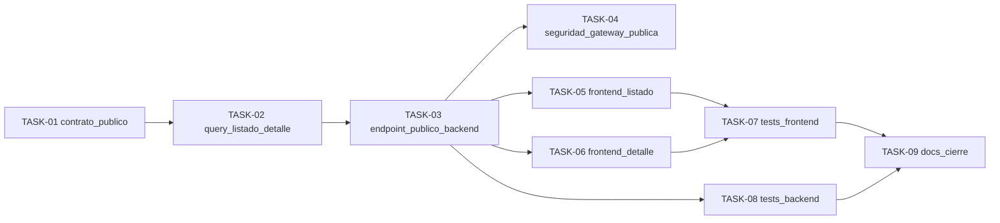

# HU-002 — Desglose en tickets de trabajo (MVP consulta pública)

| Campo | Valor |
|-------|--------|
| **Historia** | [HU-002 en backlog.md](backlog.md) (tabla §3) |
| **Refinamiento** | [HU-002-fichas-publicadas-lista-y-detalle.md](HU-002-fichas-publicadas-lista-y-detalle.md) |
| **Épica** | Consulta pública |
| **Título HU** | Fichas publicadas (lista y detalle) |
| **Estado HU** | **Cerrada** (10/10 tickets **Hecho**) |

**Convención de ID de ticket:** `TASK-HU-002-<nn>`.

**Estado del ticket:** columna **Estado** en cada fila; valores recomendados **Pendiente** (por defecto), **En curso**, **Hecho**.

**Contexto de equipo:** un ingeniero/a **full-stack**; HU-001 (autenticación/gateway base) y HU-013 (estructura de rutas y guardas) se asumen disponibles. Para esta HU no se requiere login.

**Objetivo de este desglose:** habilitar la consulta pública de árboles en vertical completo (backend + frontend): listado y detalle accesibles sin sesión, con manejo UX mínimo y contrato consistente. La localización en mapa del detalle se coordina con **HU-003** para implementarse en paralelo sin duplicar tickets de base.

**Reglas aplicables por capa (referencia rápida):**

- **Frontend:** [frontend-vue3.mdc](../../.cursor/rules/frontend-vue3.mdc), [frontend-ux.mdc](../../.cursor/rules/frontend-ux.mdc), [frontend-security.mdc](../../.cursor/rules/frontend-security.mdc)
- **Backend:** [spring-boot-4-backend.mdc](../../.cursor/rules/spring-boot-4-backend.mdc), [backend-generation-standard.mdc](../../.cursor/rules/backend-generation-standard.mdc)
- **API / contrato:** [api-design.mdc](../../.cursor/rules/api-design.mdc), [api-contract.mdc](../../.cursor/rules/api-contract.mdc), [openapi.yaml](../api/openapi.yaml)
- **Calidad / pruebas:** [quality-and-testing.mdc](../../.cursor/rules/quality-and-testing.mdc), [testing-java.md](../engineering/testing-java.md), [testing-frontend.md](../engineering/testing-frontend.md)

**Checks mínimos para cerrar tickets de esta HU:**

- Frontend: `npm run build` y `npm run test`
- Backend: `mvn -f services/pom.xml test` (y `verify` si se añaden `testIT`)
- Validar flujo público `listado -> detalle` sin sesión y ausencia de fichas no publicadas

---

## Orden sugerido (dependencias)

---

## Tickets

### Contrato y backend de lectura pública

| ID | Título | Descripción breve | Estado |
|----|--------|-------------------|--------|
| **TASK-HU-002-01** | Cerrar contrato OpenAPI de lectura pública | Definir/ajustar en [openapi.yaml](../api/openapi.yaml) los endpoints públicos de listado y detalle de árboles publicados (parámetros, esquema de respuesta, 404 y problemas detalle), más **`GET /api/catalog/public/provinces`** (nombres de provincia para filtros del listado). Mantener coherencia con HU-002 y coordinar con HU-003 para no duplicar campos de localización si se reutilizan en detalle. | Hecho |
| **TASK-HU-002-02** | Consulta de publicados en catálogo | Implementar en `catalog-service` consulta de árboles en estado publicable para listado y lectura por id para detalle, excluyendo registros no publicados. Incluir paginación/orden mínimos si el contrato lo exige. | Hecho |
| **TASK-HU-002-03** | Endpoints públicos en `catalog-service` | Exponer endpoints de lectura pública de listado y detalle bajo rutas de catálogo público, con DTOs explícitos (sin exponer entidades JPA) y errores RFC 9457 cuando aplique. | Hecho |
| **TASK-HU-002-04** | Paso por gateway en rutas públicas | Validar/ajustar en `api-gateway` que las rutas de consulta pública de HU-002 estén permitidas sin JWT y enruten correctamente al catálogo. | Hecho |

### Frontend (consulta pública sin sesión)

| ID | Título | Descripción breve | Estado |
|----|--------|-------------------|--------|
| **TASK-HU-002-05** | Vista de listado público | `TreesListView.vue` + `catalogService` / `fetchPublicProvinceNames`: listado, paginación, filtros (`species`, `publicationState`, …), roles **COLABORADOR**/**ADMIN** con **Más filtros** / **Menos filtros** y barra de acciones alineada al criterio del proyecto. Navegación a detalle por `RouterLink`. | Hecho |
| **TASK-HU-002-06** | Vista de detalle público (sin mapa) | Implementar/ajustar detalle público base con información principal de ficha publicada y manejo de 404. La integración de mapa queda en HU-003, pero la estructura de detalle debe quedar lista para ambos trabajos en paralelo. | Hecho |
| **TASK-HU-002-07** | Guardas y navegación pública | Verificar que `listado` y `detalle` sean accesibles sin autenticación y que no aparezcan bloqueos de sesión en este flujo público. | Hecho |

### Revisión y cierre explícito TASK-HU-002-05

*(Convención de ID del desglose: **TASK-HU-002-05**; si en planning interno aparece **SK-HU-002-05**, es el mismo entregable de listado público.)*

- **Código revisado:** `frontend/src/views/TreesListView.vue` — filtros enviados al API como `publicationState` / `publicMapVisibility` solo con rol privilegiado y panel expandido (`loadTrees`).
- **Coherencia de botones con el alta:** `CreateTreeView.vue` — pie con `tree-form-submit` y `.tree-form .actions` (mismo criterio horizontal que el listado).
- **Documentación normativa:** criterio de filas de acciones en [.cursor/rules/frontend-ux.mdc](../../.cursor/rules/frontend-ux.mdc) y [.cursor/rules/frontend-vue3.mdc](../../.cursor/rules/frontend-vue3.mdc) (sección Estilos en Vue 3).

### Calidad y pruebas

| ID | Título | Descripción breve | Estado |
|----|--------|-------------------|--------|
| **TASK-HU-002-08** | Tests backend de endpoints públicos | Añadir tests de capa web/integración para listado y detalle público: 200 en publicados, 404 en id inexistente/no publicado según contrato, y exclusión de datos no publicables. Incluye cobertura parcial actual (`WebMvcTest` de listado/detalle público y de provincias públicas); valorar ampliar con `testIT` si el equipo lo exige. | Hecho |
| **TASK-HU-002-09** | Tests frontend de navegación pública | Añadir tests de vistas/composables para flujo `listado -> detalle`, estados de carga/vacío/error y acceso sin sesión. | Hecho |

### Documentación y cierre

| ID | Título | Descripción breve | Estado |
|----|--------|-------------------|--------|
| **TASK-HU-002-10** | Documentación y evidencia de cierre | Actualizar documentación afectada (si cambia contrato o rutas) y dejar evidencia funcional mínima de HU-002: visitante sin sesión consulta listado y detalle de fichas publicadas. | Hecho |

### Evidencia de cierre HU-002 (MVP)

- **Flujo visitante sin sesión operativo (`/ejemplares` → `/ejemplares/:id`):**
  - Frontend: `TreesListView.vue` y `TreesDetailView.vue` en rutas públicas.
  - Router: guardas solo en rutas protegidas; `trees-list` y `trees-detail` accesibles sin autenticación.
- **Contrato y endpoints públicos alineados:**
  - `GET /api/catalog/public/trees`
  - `GET /api/catalog/public/trees/{treeId}`
  - `GET /api/catalog/public/provinces`
- **Regla de exposición pública validada:** solo fichas `PUBLICADO` + `PUBLICO` para visitante anónimo; detalle no publicable/inexistente devuelve `404` según contrato.
- **Tests y checks ejecutados para el cierre:**
  - Frontend: `npm run test` (incluye tests de vistas `TreesListView` y `TreesDetailView`) y `npm run build`.
  - Backend: tests de catálogo para endpoints/servicio público (`PublicEjemplarQueryServiceTest`, `CatalogEjemplaresControllerWebMvcTest`, `CatalogPublicMastersControllerWebMvcTest`).

---

## Qué puede quedar para después (sigue siendo MVP global, no este corte)

- Filtros avanzados de búsqueda (texto libre, facetas, geofiltros, ordenaciones complejas).
- Optimización de rendimiento/caché para listado de alto volumen.
- Enriquecimientos de datos en Mongo para consulta pública avanzada.

## Dependencias externas a esta HU

- **HU-005**: disponibilidad de fichas publicadas para validar casos reales.
- **HU-003**: integración del mapa en la misma pantalla de detalle (coordinación en paralelo).
- Infra local operativa (`api-gateway`, `catalog-service`, BD) según [infra/compose/README.md](../../infra/compose/README.md) y [services/README.md](../../services/README.md).

## Cierre sugerido (definición de “hecho” para el experimento)

Un visitante sin sesión abre `/ejemplares`, visualiza listado de fichas publicadas, entra a `/ejemplares/:id` y consulta el detalle sin autenticación; las fichas no publicadas no se exponen en flujo público, y los tests básicos de backend/frontend del flujo quedan en verde.

**Decisión aplicada en TASK-HU-002-01 (actualizada ADR-0007):** listado público con query `species`, `province`, `municipality`, `publicationState`, `publicMapVisibility`; `sort` por defecto `species,asc`; respuesta con `commonName`, `latitude`, `longitude`, `altitude`, `description`, `totalResults`. Provincias públicas: **`GET /api/catalog/public/provinces`** → `names`. Maestros autenticados: **`GET /api/catalog/provinces`** con `label`. Mapeo HTTP→persistencia en `PublicEjemplarQueryMapper` (no renombrar columnas SQL).
