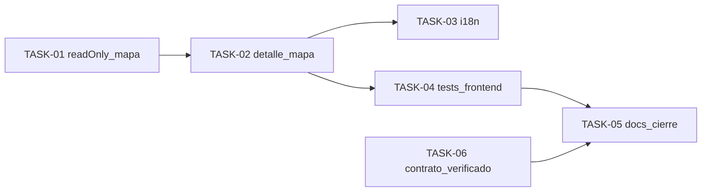

# HU-003 — Desglose en tickets de trabajo (MVP consulta pública: mapa en detalle)

| Campo | Valor |
|-------|--------|
| **Historia** | [HU-003 en backlog.md](backlog.md) (tabla §3) |
| **Refinamiento** | [HU-003-localizacion-en-mapa-dentro-del-detalle-de-arbol.md](HU-003-localizacion-en-mapa-dentro-del-detalle-de-arbol.md) |
| **Épica** | Consulta pública |
| **Título HU** | Localización en mapa dentro del detalle de árbol |
| **Estado HU** | **Cerrada** (6/6 tickets **Hecho**) |

**Convención de ID de ticket:** `TASK-HU-003-<nn>`.

**Estado del ticket:** columna **Estado** en cada fila; valores recomendados **Pendiente** (por defecto), **En curso**, **Hecho**. Actualízala al cerrar o arrancar trabajo.

**Contexto de equipo:** un ingeniero/a **full-stack**; **HU-002** (listado y detalle público base) **cerrada**. Esta HU añade **mapa en solo consulta** reutilizando `TreeLocationMapPreview` con prop **`readOnly`**, coordenadas **`latitude`/`longitude`** del DTO público (`PublicEjemplarDetail`); sin nuevo endpoint de detalle en MVP.

**Objetivo de este desglose:** completar la ficha de detalle con visualización geográfica (Leaflet + OSM), mensaje controlado si no hay coordenadas válidas, pruebas frontend y documentación alineada al refinamiento.

**Reglas aplicables por capa (referencia rápida):**

- **Frontend:** [frontend-vue3.mdc](../../.cursor/rules/frontend-vue3.mdc), [frontend-ux.mdc](../../.cursor/rules/frontend-ux.mdc), [frontend-security.mdc](../../.cursor/rules/frontend-security.mdc)
- **Backend:** [spring-boot-4-backend.mdc](../../.cursor/rules/spring-boot-4-backend.mdc), [backend-generation-standard.mdc](../../.cursor/rules/backend-generation-standard.mdc)
- **API / contrato:** [api-design.mdc](../../.cursor/rules/api-design.mdc), [api-contract.mdc](../../.cursor/rules/api-contract.mdc), [openapi.yaml](../api/openapi.yaml)
- **Calidad / pruebas:** [quality-and-testing.mdc](../../.cursor/rules/quality-and-testing.mdc), [testing-frontend.md](../engineering/testing-frontend.md), [testing-java.md](../engineering/testing-java.md)

**Checks mínimos para cerrar tickets de esta HU:**

- Frontend: `npm run build` y `npm run test`
- Backend: `mvn -f services/pom.xml test` en módulos tocados (si no hay cambios backend, no aplica más allá de la verificación del equipo)
- Verificar manualmente `/ejemplares/:id` con coordenadas válidas (mapa + marcador) y caso sin coordenadas (mensaje, sin error)

---

## Orden sugerido (dependencias)

---

## Tickets

### Frontend (Vue 3)

| ID | Título | Descripción breve | Estado |
|----|--------|-------------------|--------|
| **TASK-HU-003-01** | Modo `readOnly` en `TreeLocationMapPreview` | Prop opcional `readOnly`: no registrar doble clic para `pickCoordinates`; `aria-label` de consulta vía `treesDetail.map.ariaReadOnly`. Comportamiento por defecto sin cambios para el alta. | Hecho |
| **TASK-HU-003-02** | Mapa en `EjemplaresDetailView` | Integrar `TreeLocationMapPreview` con `latitude`/`longitude` del detalle, `showMarker` según mismas reglas de rango que el alta (`areLatLngInValidRange`), `read-only` en plantilla. Si no hay coordenadas válidas, mensaje `treesDetail.map.noLocation` sin romper la vista. | Hecho |
| **TASK-HU-003-03** | Textos i18n del mapa en detalle | Sustituir placeholder HU-002 por claves `treesDetail.map.noLocation` y `treesDetail.map.ariaReadOnly`. | Hecho |

### Calidad y documentación

| ID | Título | Descripción breve | Estado |
|----|--------|-------------------|--------|
| **TASK-HU-003-04** | Tests frontend | Ajustar/añadir pruebas en `TreesDetailView` (mapa con coordenadas: stub y props `readOnly`; sin coordenadas: mensaje esperado). | Hecho |
| **TASK-HU-003-05** | Documentación de cierre | Actualizar [HU-003-localizacion-en-mapa-dentro-del-detalle-de-arbol.md](HU-003-localizacion-en-mapa-dentro-del-detalle-de-arbol.md) con decisiones finales; mantener este desglose; índice en [README.md](README.md). | Hecho |
| **TASK-HU-003-06** | Verificación de contrato | Confirmar que `PublicEjemplarDetailResponse` en [openapi.yaml](../api/openapi.yaml) incluye `latitude`/`longitude`; **sin** cambio de contrato salvo evolución futura del detalle autenticado. | Hecho |

---

## Qué puede quedar para después (sigue siendo MVP global, no este corte)

- Mapa en detalle **autenticado** si en el futuro la ruta dejara de reutilizar el mismo DTO (`latitude`/`longitude`).
- Capas extra (clustering, geobúsqueda, mapa a pantalla completa).

## Dependencias externas a esta HU

- **HU-002** cerrada (detalle y listado públicos operativos).
- **HU-005** (datos reales con coordenadas en entornos de prueba) para validación manual rica.
- Infra local según [infra/compose/README.md](../../infra/compose/README.md) y [services/README.md](../../services/README.md).

## Cierre sugerido (definición de “hecho” para el experimento)

Usuario abre `/ejemplares/:id` con ficha que tiene `latitude`/`longitude` válidas → ve mapa con marcador, sin poder fijar coordenadas por mapa (`readOnly`). Si las coordenadas faltan o son inválidas → mensaje claro y sin error 500 en cliente. `npm run test` y `npm run build` en verde.
