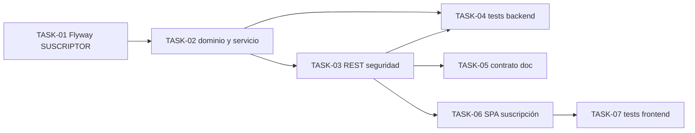

# HU-004 — Desglose en tickets de trabajo (UC-02, suscripción pública)

| Campo | Valor |
|-------|-------|
| **Historia** | [HU-004 en backlog.md](backlog.md) (tabla §3) |
| **Refinamiento** | [HU-004-suscripcion-por-correo-sin-cuenta-colaborador.md](HU-004-suscripcion-por-correo-sin-cuenta-colaborador.md) |
| **Épica** | Notificaciones |
| **Título HU** | Suscripción por correo sin cuenta colaborador |
| **Estado HU** | **Cerrada** (7/7 tickets **Hecho**) |

**Implementación backend:** toda la lógica de dominio, persistencia, Flyway y **Spring MVC** de esta HU se implementa en el microservicio **`notification-service`** (`services/notification-service`), no en otros servicios. El cliente (SPA) **no** llama al puerto del microservicio directamente.

**Convención de ID de ticket:** `TASK-HU-004-<nn>`.

**Estado del ticket:** columna **Estado** en cada fila; valores recomendados **Pendiente** (por defecto), **En curso**, **Hecho**. Actualízala al cerrar o arrancar trabajo.

**Contexto de equipo:** un ingeniero/a **full-stack**; stack en [readme.md](../../readme.md). **`notification-service`**: Flyway **`V1__baseline.sql`** fija esquema **`notification`** (incluye tabla **`suscriptor`**); alta pública **`POST /api/notifications/subscriptions`** (TASK-01–04) ya implementados. **Punto de entrada HTTP:** igual que el resto de microservicios expuestos a la UI, el tráfico debe pasar por **API Gateway** (`/api/notifications/**` → `notification-service`); aunque el **`POST`** de suscripción **no** exija JWT, la URL base de la SPA debe ser la del gateway (p. ej. `VITE_*` / `appConfig`), **no** `http://localhost:8083` directo en entornos integrados. **API Gateway** ya enruta `Path=/api/notifications/**` a `http://localhost:8083` ([application.yml](../../services/api-gateway/src/main/resources/application.yml)). La ruta SPA `/subscriptions/new` usa **`SubscribeByEmailView`** ([router](../../frontend/src/router/index.ts)).

**Objetivo de este desglose:** implementar **POST `/api/notifications/subscriptions`** (público vía gateway), persistencia **SUSCRIPTOR** en **ACTIVA** con las reglas de [data-model §2](../data-model/data-model.md), **`201`** con `{ email }`; **409** si ya existe **ACTIVA** con ese correo **o** si existe **CANCELADA** (mensaje explícito; **no** reactivación en HU-004 — solo **ADMIN** en **[HU-012](backlog.md)** cuando exista el flujo administrativo). Formulario público sin Bearer. Fuera de corte: **HU-007** (Kafka/correo), **HU-012** (**GET** admin, transición **CANCELADA**/**ACTIVA** administrativa).

**Reglas aplicables por capa (referencia rápida):**

- **Frontend:** [frontend-vue3.mdc](../../.cursor/rules/frontend-vue3.mdc), [frontend-ux.mdc](../../.cursor/rules/frontend-ux.mdc), [frontend-security.mdc](../../.cursor/rules/frontend-security.mdc)
- **Backend:** [spring-boot-4-backend.mdc](../../.cursor/rules/spring-boot-4-backend.mdc), [backend-generation-standard.mdc](../../.cursor/rules/backend-generation-standard.mdc)
- **API / contrato:** [api-design.mdc](../../.cursor/rules/api-design.mdc), [api-contract.mdc](../../.cursor/rules/api-contract.mdc), [openapi.yaml](../api/openapi.yaml)
- **Calidad / pruebas:** [quality-and-testing.mdc](../../.cursor/rules/quality-and-testing.mdc), [testing-java.md](../engineering/testing-java.md), [testing-frontend.md](../engineering/testing-frontend.md)

**Checks mínimos para cerrar tickets de esta HU:**

- Backend: `mvn -f services/pom.xml -pl notification-service test` y, si se añaden `testIT`, `mvn -f services/pom.xml -pl notification-service verify` según configuración del padre.
- Frontend: `npm --prefix frontend run build` y `npm --prefix frontend run test`.
- Smoke manual vía **gateway**: alta con correo válido → **201** + fila **ACTIVA**; mismo correo ya **ACTIVA** → **409** + `detail` legible; correo sólo **CANCELADA** (fixture) → **409** + `detail` explícito (sin cambio de estado; reactivación solo **HU-012**).

---

## Orden sugerido (dependencias)

- **HU-007** consume **SUSCRIPTOR** con **ACTIVA**: hasta cerrar **TASK-01–03** (como mínimo) no hay datos reales para destinatarios; puede seguir desarrollo paralelo con fixtures.

---

## Tickets

### Datos y persistencia (`notification-service`)

| ID | Título | Descripción breve | Estado |
|----|--------|-------------------|--------|
| **TASK-HU-004-01** | Tabla **SUSCRIPTOR** en Flyway | En **`services/notification-service`**: DDL en **`V1__baseline.sql`** (esquema **notification**): tabla **`suscriptor`** (`suscriptor_id`, `email`, `estado_suscripcion`, `alta_en`, `confirmado_en`, `baja_en`), **CHECK** de estados **ACTIVA** y **CANCELADA**, **índice único** `lower(trim(email))`, índice parcial por **ACTIVA** para listados futuros (HU-007). | Hecho |

### Dominio y API REST (`notification-service`)

| ID | Título | Descripción breve | Estado |
|----|--------|-------------------|--------|
| **TASK-HU-004-02** | Caso de uso **registrarSuscripcion** | En **`notification-service`**: normalizar **email** (trim + lower); si no existe fila → insert **ACTIVA**; si existe **ACTIVA** → **409** + mensaje explícito (correo ya suscrito); si existe **CANCELADA** → **409** + mensaje explícito (suscripción cancelada; reactivación solo administración / **HU-012**) — **sin** actualizar a **ACTIVA**. Sin lógica pesada en el controlador. | Hecho |
| **TASK-HU-004-03** | `POST /api/notifications/subscriptions` + seguridad | Controlador en **`notification-service`** bajo **`/api/notifications`** (mismo prefijo que expone el gateway), DTO entrada `{ email }`, salida **`201`** + cuerpo sólo `email`. **`400`** RFC 9457; **`409`** `Problem`. **Spring Security**: **`POST .../subscriptions`** **`permitAll`**; rutas posteriores (p. ej. **`GET`** para **HU-012**) **`authenticated`** con JWT. Documentar en README que pruebas E2E usan **URL del gateway**, no bypass al puerto **8083** salvo depuración local consciente. | Hecho |

### Calidad, contrato y operativa

| ID | Título | Descripción breve | Estado |
|----|--------|-------------------|--------|
| **TASK-HU-004-04** | Pruebas backend | **Unit** `SubscriptionRegistrationServiceTest` (alta, **409** **ACTIVA**/**CANCELADA**, integridad). **WebMvc** `NotificationSubscriptionsControllerWebMvcTest` (**201**, **400**, **409**). **IT** `NotificationServiceApplicationIT` (contexto). | Hecho |
| **TASK-HU-004-05** | Contrato y README | [openapi.yaml](../api/openapi.yaml): **201** + `{ email }`, **409** con descripción que cubra ACTIVA y CANCELADA. [services/README.md](../../services/README.md): puerto **8083** y nota HU-004 (gateway vs bypass). | Hecho |

### Frontend (Vue 3)

| ID | Título | Descripción breve | Estado |
|----|--------|-------------------|--------|
| **TASK-HU-004-06** | Vista **`/subscriptions/new`** y cliente HTTP | **`SubscribeByEmailView`**: campo email, **`publicApiFetch`** → **`POST`** gateway (`appConfig.api.gatewayBaseUrl` / `VITE_GATEWAY_BASE_URL`), **sin** Bearer. **`usePublicSubscriptionForm`**: loading / éxito / error; **409** con i18n según detalle del servidor (ya activo / cancelada / genérico + `detail`). | Hecho |
| **TASK-HU-004-07** | Pruebas Vitest composable / mapper | Mapeo **201** `{ email }`, **Problem** para **409**/**400**; sin llamadas reales al gateway. | Hecho |

---

## Qué puede quedar para después (no bloquea el cierre de HU-004)

- Rate limiting, captcha o hardening antiabuso (**riesgo aceptado** en MVP, [data-model §2](../data-model/data-model.md)).
- **`type`** URI estable en **`Problem`** por subcaso (**already-active** vs **cancelled**) para copy distinto en frontend.

## Dependencias externas a esta HU

- **Compose / Postgres**: esquema **`notification`** accesible; [infra/compose/README.md](../../infra/compose/README.md).
- **API Gateway** en marcha para pruebas E2E coherentes con arquitectura (mismo criterio que catálogo/medios).
- **HU-001** no es requisito del flujo **POST** público.

## Cierre sugerido (definición de hecho del corte)

Desde la SPA vía **gateway**: visitante envía correo válido en **`/subscriptions/new`** → **201** + **`{ email }`** + fila **ACTIVA** en **`notification-service`**. Mismo correo ya **ACTIVA** → **409** + mensaje explícito. Mismo correo en **CANCELADA** → **409** + mensaje explícito, sin cambio de estado (reactivación solo **HU-012**). Tests en verde; OpenAPI alineado.
