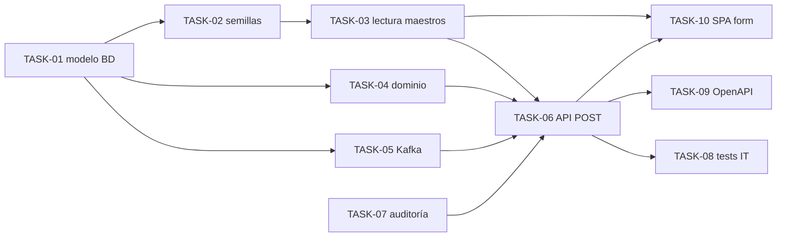

# HU-005 — Desglose en tickets de trabajo (MVP y aprendizaje validado)

| Campo | Valor |
|-------|--------|
| **Historia** | [HU-005 en backlog.md](backlog.md) (tabla §3) |
| **Refinamiento** | [HU-005-alta-de-ficha-de-arbol.md](HU-005-alta-de-ficha-de-arbol.md) |
| **Épica** | Catálogo colaborador |
| **Título HU** | Alta de ficha de árbol |
| **Estado HU** | **Cerrada** (11/11 tickets **Hecho**) |

**Convención de ID de ticket:** `TASK-HU-005-<nn>`.

**Estado del ticket:** columna **Estado** en cada fila; valores recomendados **Pendiente** (por defecto), **En curso**, **Hecho**. Actualízala al cerrar o arrancar trabajo.

**Contexto de equipo:** un ingeniero/a **full-stack** con HTML/CSS sólidos; el stack y diagramas están en [readme.md](../../readme.md). **HU-001** (sesión OIDC + Bearer hacia el gateway) se asume **en curso o cerrada**; sin eso no se puede cerrar el flujo de alta autenticada.

**Objetivo de este desglose:** construir **lo suficiente** para demostrar UC-03 en vertical: colaborador autenticado crea ficha en **catalog-service**, datos en Postgres y API **POST** acorde a OpenAPI; mensaje **`EJEMPLAR_CREADO`** en Kafka cuando **TASK-HU-005-05** esté cerrada; sin fotos (**HU-006** / **HU-014**) ni consumo/correo en **notification-service** (HU-007).

**Reglas aplicables por capa (referencia rápida):**

- **Frontend:** [frontend-vue3.mdc](../../.cursor/rules/frontend-vue3.mdc), [frontend-ux.mdc](../../.cursor/rules/frontend-ux.mdc), [frontend-security.mdc](../../.cursor/rules/frontend-security.mdc)
- **Backend:** [spring-boot-4-backend.mdc](../../.cursor/rules/spring-boot-4-backend.mdc), [backend-generation-standard.mdc](../../.cursor/rules/backend-generation-standard.mdc)
- **API / contrato:** [api-design.mdc](../../.cursor/rules/api-design.mdc), [api-contract.mdc](../../.cursor/rules/api-contract.mdc), [openapi.yaml](../api/openapi.yaml)
- **Calidad / pruebas:** [quality-and-testing.mdc](../../.cursor/rules/quality-and-testing.mdc), [testing-java.md](../engineering/testing-java.md)

**Checks mínimos para cerrar tickets de esta HU:**

- Frontend: `npm run build` y `npm run test` (si se añaden/ajustan tests)
- Backend: `mvn -f services/pom.xml test` (y `verify` si se tocan `testIT`)
- Verificar alta end-to-end de árbol (201 + persistencia + evento Kafka cuando aplique)

---

## Orden sugerido (dependencias)

**Nota:** En el código actual **TASK-06** y **TASK-07** están cerradas **sin** **TASK-05** (Kafka); el grafo refleja dependencias lógicas (p. ej. modelo listo para publicar), no un orden cronológico obligatorio.

---

## Tickets

### Datos y migraciones (catalog-service)

| ID | Título | Descripción breve | Estado |
|----|--------|-------------------|--------|
| **TASK-HU-005-01** | Modelo relacional mínimo para alta | Flyway `catalog`: tablas alineadas al readme (`USUARIO_APP` o mapeo de `subject` OIDC, `FAMILIA`/`GENERO`/`ESPECIE`, `PROVINCIA`, **`EJEMPLAR`** con FK y **coordenadas**; tipos y PK numéricas según [ADR-0002](../adr/0002-claves-primarias-numericas-frente-a-uuid.md). Decisión explícita MVP: **latitud/longitud** decimales en **`ejemplar`** (PostGIS opcional en iteración 2 si el hueco del backlog lo exige). DDL: [`V1__baseline.sql`](../../services/catalog-service/src/main/resources/db/migration/V1__baseline.sql). | Hecho |
| **TASK-HU-005-02** | Semillas de datos para desbloquear R1 | Migración [`V2__seed_maestros_inicial.sql`](../../services/catalog-service/src/main/resources/db/migration/V2__seed_maestros_inicial.sql): carga inicial de maestros (familia, género, especie, provincia). El DDL base (`unaccent`, `usuario_app`, CHECK/índice de `ejemplar`, `seq_ejemplar_evento_id`, tablas) está en [`V1__baseline.sql`](../../services/catalog-service/src/main/resources/db/migration/V1__baseline.sql). Cambios de esquema posteriores: **nueva** migración `V3__…` (no editar migraciones ya aplicadas en entornos compartidos). | Hecho |
| **TASK-HU-005-03** | API de lectura de maestros para el formulario | `GET /api/catalog/species` y `GET /api/catalog/provinces` (JWT, roles `COLABORADOR`/`ADMIN`): paginación o `unpaged`, filtro `q` (sin acentos/mayúsculas en backend). Contrato en [openapi.yaml](../api/openapi.yaml). | Hecho |

### Dominio, integración y contrato

| ID | Título | Descripción breve | Estado |
|----|--------|-------------------|--------|
| **TASK-HU-005-04** | Caso de uso “crear árbol” | Servicio de aplicación: validar **R1** (especie_id existente), **R2** (coordenadas presentes y en rango razonable), asociar **creador** desde identidad JWT/claim acordado con HU-001; mapeo a entidad **`ejemplar`**; transacción única. | Hecho |
| **TASK-HU-005-05** | Publicación Kafka tras commit | Tras persistencia exitosa de **`ejemplar`** (misma transacción o inmediatamente después, según diseño): **solo** publicar JSON en **`catalog.ejemplar.evento`** con `tipo_evento` = **`EJEMPLAR_CREADO`**, `ejemplar_id`, `evento_id` (único generado en catálogo, p. ej. secuencia dedicada **sin** tabla `EVENTO_CATALOGO`), `ocurrido_en` según [kafka-events.md](../events/kafka-events.md). **No** insertar en **EVENTO_CATALOGO** desde `catalog-service` (pertenece al bounded context de **notificaciones** / [HU-007](HU-007-ticket-breakdown.md)). Spring Kafka en `catalog-service`; topic alineado con Compose. | Hecho |
| **TASK-HU-005-06** | `POST /api/catalog/trees` operativo | Controlador REST + DTO de alta cerrado (sustituir `object` genérico del contrato); respuestas **201** con identificador del ejemplar; **400** con `application/problem+json`; **401** si no hay Bearer. OAuth2 resource server alineado con gateway/JWT. **No** implementar fotos en esta ruta. | Hecho |
| **TASK-HU-005-07** | Auditoría de catálogo en alta | Registrar operación relevante en **AUDITORIA_CATALOGO** (R3) con actor y resumen acorde al diseño del readme, sin volcar PII innecesario en logs. | Hecho |

### Calidad y documentación

| ID | Título | Descripción breve | Estado |
|----|--------|-------------------|--------|
| **TASK-HU-005-08** | Pruebas de integración | Testcontainers: Postgres (y Kafka si el entorno de test lo permite) para verificar creación + mensaje publicado al menos una vez con payload mínimo; convención [testing-java.md](../engineering/testing-java.md). | Hecho |
| **TASK-HU-005-09** | OpenAPI y README | [openapi.yaml](../api/openapi.yaml): schemas **`CreateTreeRequest`** / **`CreatedTreeResponse`** (clases Java `CreateEjemplarRequest` / `CreatedEjemplarResponse` mientras el JSON coincida — [ADR-0004](../adr/0004-catalog-rest-write-and-audit.md), [ADR-0006](../adr/0006-ejemplar-aggregate-http-kafka-naming.md)); descripción JWT/`email` en **POST**, códigos 201/400/401/403. [services/README.md](../../services/README.md): arranque, Flyway, **Keycloak** `scope=openid profile email` y enlace a **ADR-0004**. Variables `SPRING_KAFKA_*` del **catalog-service**: documentar al implementar **TASK-05**. | Hecho |

### Frontend (Vue 3 + HTML/CSS)

| ID | Título | Descripción breve | Estado |
|----|--------|-------------------|--------|
| **TASK-HU-005-10** | Formulario de alta y cliente API | Pantalla acotada (Vue 3 + CSS): campos para especie y provincia (cargados vía **TASK-03**), descripción, latitud, longitud, estado de publicación/visibilidad según DTO; envío `POST` al gateway con Bearer; manejo de **401**/**400** legible. Accesible solo autenticado (ruta protegida). Vista previa de mapa (Leaflet + OSM): centro inicial 40,4063 / -3,65588; lat/lng vacíos al cargar; doble clic en mapa rellena coordenadas y muestra marcador (también entrada manual). | Hecho |

### Mejora transversal (fuera del corte vertical UC-03)

| ID | Título | Descripción breve | Estado |
|----|--------|-------------------|--------|
| **TASK-HU-005-11** | `@EnableJpaAuditing` en catalog-service | Estandarizar `creado_en` / `modificado_en` / `creado_por` / `modificado_por` con `@EntityListeners(AuditingEntityListener.class)`, `AuditorAware` alineado a `usuario_app_id` (resolución OIDC → fila maestra) y revisión de entidades que escriban; valorar migración gradual desde el patrón manual usado en TASK-04 y maestros. | Hecho |

---

## Qué puede quedar para después (sigue siendo MVP global, no este corte)

- Proyección **Mongo** para búsqueda (fuera de UC-03 mínimo).
- **PostGIS** si se decide sustituir decimales por geometría.
- Consumidor `notification-service`, persistencia de **EVENTO_CATALOGO** (u outbox interna) y correo (**[HU-007](HU-007-ticket-breakdown.md)**): para el corte vertical de **HU-005** basta ver el mensaje en Kafka (CLI/console) si el foco es solo catálogo.

## Dependencias externas a esta HU

- **HU-001:** token y roles; gateway `/api/catalog` enrutado.
- **Infra Compose:** Postgres, Kafka, Keycloak levantados según [infra/compose/README.md](../../infra/compose/README.md).

## Cierre sugerido (definición de “hecho” para el experimento)

Colaborador de prueba crea un árbol desde la SPA → **201** → registro en BD → (con **TASK-05** cerrada) evento visible en topic con **`EJEMPLAR_CREADO`** → captura o test automático que lo prueba.
