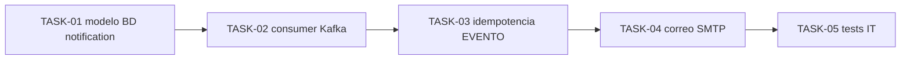

# HU-007 — Desglose en tickets (aviso por correo al crear una ficha)

| Campo | Valor |
|-------|-------|
| **Historia** | [HU-007 en backlog.md](backlog.md) (tabla §3) |
| **Épica** | Notificaciones |
| **Título HU** | Aviso por correo al crear una ficha |
| **Estado HU** | **Cerrada** (5/5 tickets **Hecho**) |

**Convención de ID de ticket:** `TASK-HU-007-<nn>`.

**Estado del ticket:** columna **Estado** en cada fila; valores recomendados **Pendiente**, **En curso**, **Hecho**.

**Contexto:** el **productor** del mensaje de alta es **catalog-service** ([TASK-HU-005-05](HU-005-ticket-breakdown.md)): publica en **`catalog.ejemplar.evento`** con `tipo_evento` = **`EJEMPLAR_CREADO`** y **no** inserta en **`EVENTO_CATALOGO`**. Esta historia cubre el **consumidor** y el envío a suscriptores.

**Referencias:** [kafka-events.md](../events/kafka-events.md), UC-09, R7; suscriptores en **HU-004**; modelo lógico `EVENTO_CATALOGO` / `NOTIFICACION` en [readme.md](../../readme.md).

---

## Orden sugerido (dependencias)

- **HU-004:** debe existir forma de registrar suscriptores (tabla/API mínima) antes de tener destinatarios reales.
- **TASK-HU-005-05:** debe existir publicación real del mensaje para pruebas de extremo a extremo (aunque sea manual con CLI Kafka al inicio).

---

## Tickets

| ID | Título | Descripción breve | Estado |
|----|--------|-------------------|--------|
| **TASK-HU-007-01** | Modelo persistencia en `notification-service` | Flyway (o equivalente) en esquema **notification**: tablas alineadas al modelo para **EVENTO_CATALOGO** (o nombre acordado), vínculo con **NOTIFICACION** y lectura de **SUSCRIPTOR** activos según fuentes del proyecto. | Hecho |
| **TASK-HU-007-02** | Consumer `catalog.ejemplar.evento` | `notification-service`: Spring Kafka / listener, deserialización JSON, filtrado **`EJEMPLAR_CREADO`** según [kafka-events.md](../events/kafka-events.md). Manejo de errores y logs sin PII masiva. | Hecho |
| **TASK-HU-007-03** | Idempotencia y registro de evento | Antes de enviar correo: deduplicar por **`evento_id`** (y/o clave acordada); persistir fila de evento consumido para reentregas Kafka. Si el mensaje ya fue procesado, **no-op** idempotente. | Hecho |
| **TASK-HU-007-04** | Envío de correo a suscriptores | Para eventos válidos: resolver destinatarios **ACTIVA**, crear registros **NOTIFICACION** / **ENVIO_NOTIFICACION**, SMTP vía `spring-boot-starter-mail` (Mailpit en dev, `SmtpArbolCreadoCorreoAvisoSender`), cuerpo de texto fijo MVP; sin suscriptores **ACTIVA**: `notificacion` con `SIN_DESTINATARIOS_ACTIVOS` y evento a **PROCESADO**. | Hecho |
| **TASK-HU-007-05** | Pruebas de integración | Testcontainers: Kafka + Postgres **notification**; publicar fixture `EJEMPLAR_CREADO` y verificar una sola fila de evento y/o un envío simulado (p. ej. `JavaMailSender` mock). Convención [testing-java.md](../engineering/testing-java.md). | Hecho |

---

## Definición de hecho sugerida (MVP)

Tras **TASK-HU-005-05** publicando un mensaje real, el **notification-service** consume al menos una vez, registra idempotencia y genera notificación/correo (o no-op documentado) verificable por test o traza controlada.

**TASK-HU-007-04 (cerrado):** verificación manual orientativa en [local-setup-guide.md](../onboarding/local-setup-guide.md) (flujo aviso por correo), Mailpit en [infra/compose/README.md](../../infra/compose/README.md) y nota HU-007 en [services/README.md](../../services/README.md) §1.

**TASK-HU-007-05 (cerrado):** `NotificationArbolCreadoKafkaIT` en `notification-service` (`src/testIT/java`, perfil `test-it-pg-kafka`, recursos bajo `src/test/resources` para classpath Failsafe); Kafka (`confluentinc/cp-kafka`) + Postgres con esquema **notification**; comprobación de persistencia e idempotencia ante reentrega.
