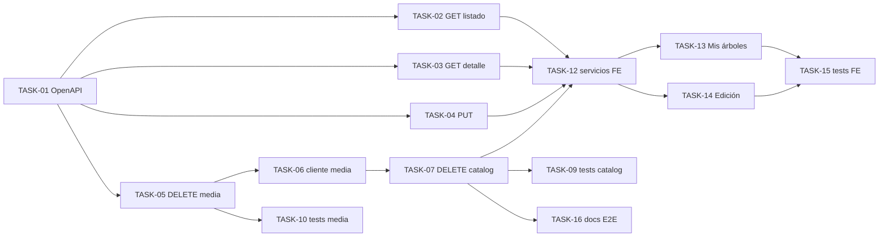

# HU-008 — Desglose en tickets de trabajo (edición y baja de mis árboles)

| Campo | Valor |
|-------|--------|
| **Historia** | [HU-008 en backlog.md](backlog.md) (tabla §3) |
| **Refinamiento** | [HU-008-edicion-de-mis-arboles.md](HU-008-edicion-de-mis-arboles.md) |
| **Épica** | Catálogo colaborador |
| **Título HU** | Edición y baja de mis árboles |
| **Estado HU** | **Cerrada** (15 tickets **Hecho**; **TASK-HU-008-11** **Rechazado**) |

**Convención de ID de ticket:** `TASK-HU-008-<nn>`.

**Estado del ticket:** columna **Estado** en cada fila; valores recomendados **Pendiente** (por defecto), **En curso**, **Hecho**, **Rechazado** (descartado con motivo registrado en la fila o en *Qué puede quedar*). Actualízala al cerrar o arrancar trabajo.

**Contexto de equipo:** un ingeniero/a **full-stack**; stack en [readme.md](../../readme.md). Se asume **HU-001** (OIDC/JWT), **HU-005** (Alta de ejemplar y formulario de referencia), **HU-013** (rutas `/mis-ejemplares`, `/ejemplares/:id/edit`) y **HU-006** **cerrada** (fotos individuales y galería en edición vía **TASK-HU-006-14**). **TASK-HU-015-01** (borrado Mongo real) se entregó en **HU-015**; en el corte **HU-008** el hook ya invocaba el puerto (stub si Mongo desactivado).

**Objetivo de este desglose:** cerrar el vertical **UC-04**: listado colaborador con filtros, lectura y **PUT** de ficha propia (o cualquier ficha si **ADMIN**), **DELETE** físico con cascada (media → SQL → hook Mongo), sin Kafka ni notificación (**R7**).

**Reglas aplicables por capa (referencia rápida):**

- **Frontend:** [frontend-vue3.mdc](../../.cursor/rules/frontend-vue3.mdc), [frontend-ux.mdc](../../.cursor/rules/frontend-ux.mdc), [frontend-security.mdc](../../.cursor/rules/frontend-security.mdc)
- **Backend:** [spring-boot-4-backend.mdc](../../.cursor/rules/spring-boot-4-backend.mdc), [backend-generation-standard.mdc](../../.cursor/rules/backend-generation-standard.mdc)
- **API / contrato:** [api-design.mdc](../../.cursor/rules/api-design.mdc), [api-contract.mdc](../../.cursor/rules/api-contract.mdc), [openapi.yaml](../api/openapi.yaml)
- **Calidad / pruebas:** [quality-and-testing.mdc](../../.cursor/rules/quality-and-testing.mdc), [testing-java.md](../engineering/testing-java.md), [testing-frontend.md](../engineering/testing-frontend.md)

**Checks mínimos para cerrar tickets de esta HU:**

- Frontend: `npm run build` y `npm run test` en `frontend/`
- Backend: `mvn -f services/pom.xml -pl catalog-service,media-service test` (y `verify` / `testIT` si se tocan integraciones)
- E2E orientativo: listado con filtros, edición **PUT**, baja con árbol con/sin fotos; error media aborta baja; ver [HU-008-edicion-de-mis-arboles.md](HU-008-edicion-de-mis-arboles.md) escenarios BDD

---

## Orden sugerido (dependencias)

---

## Tickets

### Contrato OpenAPI

| ID | Título | Descripción breve | Estado |
|----|--------|-------------------|--------|
| **TASK-HU-008-01** | Cierre OpenAPI catálogo y media (HU-008) | En [openapi.yaml](../api/openapi.yaml): `GET /api/catalog/trees` con filtros y paginación; `GET`/`PUT`/`DELETE` en `/api/catalog/trees/{treeId}` con schemas **`UpdateTreeRequest`**, **`CollaboratorTreeDetailResponse`**, **`CollaboratorTreePageResponse`** (nombres Java en catalog-service pueden seguir `*Ejemplar*` mientras el JSON coincida — [ADR-0004](../adr/0004-catalog-rest-write-and-audit.md), [ADR-0006](../adr/0006-ejemplar-aggregate-http-kafka-naming.md)); **`DELETE /api/media/trees/{treeId}/photos`** (todas las fotos); **`DELETE /api/media/photos/{photoId}`** (una foto, TASK-HU-006-14); **`GET /api/catalog/trees/{treeId}/media-submission-permission`**. Eliminado **`PATCH`** del contrato (MVP solo **PUT**). Códigos Problem 400/401/403/404/502 donde aplica. | Hecho |

### Catalog-service (backend)

| ID | Título | Descripción breve | Estado |
|----|--------|-------------------|--------|
| **TASK-HU-008-02** | Listado colaborador con filtros | `GET /api/catalog/trees`: scope por rol (**COLABORADOR** → `usuario_app_id` del actor; **ADMIN** → opcional `createdByUserId`); filtros `speciesId`, rango `creado_en` UTC; orden `modificado_en` desc; paginación. Validar `createdFrom` ≤ `createdTo`. | Hecho |
| **TASK-HU-008-03** | Detalle de ficha para edición | `GET /api/catalog/trees/{treeId}`: DTO de lectura con campos editables del alta; **403**/**404** según propiedad y existencia; materializar `usuario_app` si aplica (ADR-0004). | Hecho |
| **TASK-HU-008-04** | Actualización de ficha (`PUT`) | Caso de uso + `PUT /api/catalog/trees/{treeId}`: validaciones **R1**/**R2**; creador inmutable; sin publicación Kafka; **AUDITORIA_CATALOGO** operación de modificación (**R3**). | Hecho |
| **TASK-HU-008-06** | Cliente HTTP hacia media-service | En **catalog-service**: `RestMediaEjemplarPhotosClient` con relay JWT a `DELETE /api/media/trees/{treeId}/photos`; mapeo 403/404/502 a excepciones de dominio. El catálogo invoca siempre a media; **media-service** hace no-op si no hay filas de foto. | Hecho |
| **TASK-HU-008-07** | Borrado de árbol con cascada | `DELETE /api/catalog/trees/{treeId}` vía `EjemplarDeleteService`: (1) **DELETE** media; error media → **abort**; (2) borrado físico `ejemplar` en PostgreSQL; (3) puerto `EjemplarEnrichmentDeletionPort` (borrado Mongo real con **HU-015** si Mongo activo; no-op en caso contrario). Auditoría de baja (**R3**). **Rollback compensatorio** tras fotos borradas: **no** implementado en MVP (deuda documentada). | Hecho |

### Media-service (backend)

| ID | Título | Descripción breve | Estado |
|----|--------|-------------------|--------|
| **TASK-HU-008-05** | Borrado masivo de fotos por árbol | `DELETE /api/media/trees/{treeId}/photos` (`MediaEjemplarPhotosDeleteService`): metadatos + objetos en bucket; autorización vía permiso de catálogo (**HU-006**); no-op si no hay fotografías. | Hecho |

### Calidad backend

| ID | Título | Descripción breve | Estado |
|----|--------|-------------------|--------|
| **TASK-HU-008-09** | Pruebas catalog (listado, PUT, autorización) | Tests unitarios/WebMvc: `CollaboratorEjemplarQueryServiceTest`, `EjemplarModificationServiceTest`, `EjemplarUpdateServiceTest`, `EjemplarDeletionServiceTest`, `TreeDeleteServiceTest`, `CatalogEjemplaresControllerWebMvcTest`, `RestMediaEjemplarPhotosClientTest`, `JwtRealmRolesTest`, etc. | Hecho |
| **TASK-HU-008-10** | Pruebas media (DELETE masivo) | `MediaEjemplarPhotosDeleteServiceTest`, WebMvc en `MediaEjemplarPhotoGalleryController`; borrado individual en **TASK-HU-006-14**. | Hecho |
| **TASK-HU-008-11** | Integración cascada catalog ↔ media | IT Failsafe (`*IT`) catalog ↔ media con ambos servicios (o Testcontainers + WireMock). **Rechazado:** coste/desproporción para MVP; la cascada queda cubierta por tests unitarios/WebMvc (`EjemplarDeletionServiceTest`, `RestMediaEjemplarPhotosClientTest`, `MediaEjemplarPhotosDeleteServiceTest`) y verificación manual en **TASK-HU-008-16**. Escenario rollback (BDD 8) fuera de alcance hasta saga/compensación. | Rechazado |

### Frontend

| ID | Título | Descripción breve | Estado |
|----|--------|-------------------|--------|
| **TASK-HU-008-12** | Cliente API catálogo (listado, detalle, PUT, DELETE) | `frontend/src/services/catalog/collaboratorTreesService.ts`: `GET` listado con filtros, `GET` por id, `PUT`, `DELETE`; `AbortSignal`; mapeo Problem. Tests en `collaboratorTreesService.test.ts`. | Hecho |
| **TASK-HU-008-13** | Vista Mis árboles con filtros | `frontend/src/views/MyTreesListView.vue` en `/mis-ejemplares`: listado paginado, filtros especie y fechas (UTC); selector **usuario creador** solo **ADMIN**; `useAbortableRequest`; enlaces a edición. | Hecho |
| **TASK-HU-008-14** | Vista edición de árbol | `frontend/src/views/EditTreeView.vue` + `frontend/src/composables/useEditTreeForm.ts` en `/ejemplares/:id/edit`: formulario alineado a **HU-005** (mapa, validación, **PUT**); confirmación y **DELETE** con diálogo; galería añadir/borrar foto (**TASK-HU-006-14**). Tests: `useEditTreeForm.test.ts`. | Hecho |
| **TASK-HU-008-15** | Pruebas frontend HU-008 | Vitest: servicios de catálogo, vistas/composables críticos (filtros, PUT, DELETE con confirmación, galería en edición). | Hecho |

### Documentación

| ID | Título | Descripción breve | Estado |
|----|--------|-------------------|--------|
| **TASK-HU-008-16** | Documentación E2E y servicios | [services/README.md](../../services/README.md) § HU-008 (API, cascada, `mtl.media.base-url`, límites MVP) y [frontend/README.md](../../frontend/README.md) (rutas, verificación manual BDD). | Hecho |

---

## Qué puede quedar para después (sigue siendo MVP global, no este corte)

- **`PATCH`** parcial en `/api/catalog/trees/{treeId}`.
- ~~Galería añadir/borrar foto en edición~~ — entregado en **[TASK-HU-006-14](HU-006-ticket-breakdown.md)** (HU-006 cerrada).
- ~~Borrado real en Mongo (**[TASK-HU-015-01](HU-015-ticket-breakdown.md)**)~~ — entregado en **HU-015**.
- **Rollback compensatorio** si falla SQL (o Mongo real) tras borrar fotos en media (escenario BDD 8; sin saga en MVP).
- Bloqueo optimista / ETag en edición concurrente.
- Listado de usuarios creadores para filtro **ADMIN** (endpoint dedicado o maestro si no existe selector).
- ~~**IT** dedicado catalog ↔ media~~ — **TASK-HU-008-11** **Rechazado**; alternativa futura: `system-e2e-tests` o IT con WireMock en catalog.

## Dependencias externas a esta HU

- **HU-001:** JWT y roles **COLABORADOR** / **ADMIN**.
- **HU-005:** contrato OpenAPI **`CreateTreeRequest`** / **`CreatedTreeResponse`** (alta); maestros especie/provincia; formulario de referencia.
- **HU-013:** rutas protegidas `/mis-ejemplares`, `/ejemplares/:id/edit`.
- **HU-006:** **cerrada**; galería en edición (**TASK-HU-006-14**) entregada.
- **HU-015:** **TASK-HU-015-01** (borrado Mongo real) **cerrado**; el hook de baja lo invoca desde **HU-008**.
- **API Gateway:** `/api/catalog` y `/api/media` operativos.

## Cierre sugerido (definición de “hecho” para el corte)

Un **COLABORADOR** autenticado puede listar y filtrar sus fichas en **Mis árboles**, abrir una ficha en edición, guardar cambios con **PUT**, gestionar fotos en galería y eliminar una ficha con **DELETE** (cascada media → SQL → hook Mongo). Un **ADMIN** puede listar con filtro por creador y editar/eliminar cualquier ficha. Ante error en media durante la baja, el árbol no se elimina en PostgreSQL. Si falla tras media OK, se audita `EJEMPLAR_ELIMINACION_PARCIAL_FALLIDA`; clientes HTTP internos con timeouts explícitos. Contrato OpenAPI cerrado; tests unitarios/WebMvc en catalog, media y frontend en verde.

**Cierre de tickets:** todos **Hecho** salvo **TASK-HU-008-11** (**Rechazado**). HU **Cerrada** en [backlog.md](backlog.md) y [HU-008-edicion-de-mis-arboles.md](HU-008-edicion-de-mis-arboles.md). Verificación manual recomendada: [frontend/README.md](../../frontend/README.md) (apartado HU-008).
