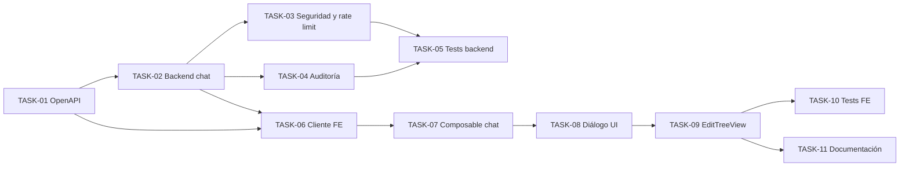

# HU-010 — Desglose en tickets de trabajo (chat asistido colaborador)

| Campo | Valor |
|-------|--------|
| **Historia** | [HU-010 en backlog.md](backlog.md) (tabla §3) |
| **Refinamiento** | [HU-010-chat-asistido.md](HU-010-chat-asistido.md) |
| **Épica** | Inteligencia artificial |
| **Título HU** | Chat asistido |
| **Estado HU** | **Cerrada** (11/11 tickets **Hecho**) |

**Convención de ID de ticket:** `TASK-HU-010-<nn>`.

**Estado del ticket:** columna **Estado** en cada fila; valores recomendados **Pendiente** (por defecto), **En curso**, **Hecho**, **Rechazado**. Actualízala al cerrar o arrancar trabajo.

**Contexto de equipo:** un ingeniero/a **full-stack**; stack en [readme.md](../../readme.md). Se asume **HU-001** (OIDC/JWT), **HU-008** (`EditTreeView`, edición de ejemplar con `treeId`), **HU-013** (rutas y guardas) y **HU-016** (**ai-assistant-service** operativo: gateway `/api/ai/**`, auditoría **AUDITORIA_USO_IA**, proveedor OpenAI / modo `stub`). Esta HU añade **chat conversacional** para **COLABORADOR** y **ADMIN** desde la edición de ficha; **no** incluye **HU-009** ni modifica el alcance de **HU-016**.

**Objetivo de este desglose:** cerrar el vertical **UC-06**: colaborador o administrador autenticado abre un panel de chat no intrusivo en `EditTreeView`, envía turnos a `POST /api/ai/chat/messages` con `treeId` y hilo en cliente; el servicio responde de forma orientativa, audita con `tipo_uso_ia` = **`chat-message`** y **no** inyecta metadatos del ejemplar en el prompt al LLM.

**Reglas aplicables por capa (referencia rápida):**

- **Frontend:** [frontend-vue3.mdc](../../.cursor/rules/frontend-vue3.mdc), [frontend-ux.mdc](../../.cursor/rules/frontend-ux.mdc), [frontend-security.mdc](../../.cursor/rules/frontend-security.mdc)
- **Backend:** [spring-boot-4-backend.mdc](../../.cursor/rules/spring-boot-4-backend.mdc), [backend-generation-standard.mdc](../../.cursor/rules/backend-generation-standard.mdc)
- **API / contrato:** [api-design.mdc](../../.cursor/rules/api-design.mdc), [api-contract.mdc](../../.cursor/rules/api-contract.mdc), [api-security.mdc](../../.cursor/rules/api-security.mdc), [openapi.yaml](../api/openapi.yaml)
- **Producto / IA orientativa:** [product-context.mdc](../../.cursor/rules/product-context.mdc)
- **Calidad / pruebas:** [quality-and-testing.mdc](../../.cursor/rules/quality-and-testing.mdc), [testing-java.md](../engineering/testing-java.md), [testing-frontend.md](../engineering/testing-frontend.md)

**Checks transversales (igual que CI / pre-PR):** [devsecops-ci.md](../engineering/devsecops-ci.md) — `lint`, `typecheck`, `npm test`, `mvn test`; opcional local: `verify`, `npm run build`.

**Checks específicos de esta HU:**

- Módulos / servicios tocados: `services/ai-assistant-service`, `services/api-gateway` (relay JWT ya existente; ampliar IT si aplica), `frontend/src/views/EditTreeView.vue`, `frontend/src/services/ai/`, componentes/composables de chat.
- Validación funcional del corte: **COLABORADOR** y **ADMIN** chatean desde edición de ficha con `treeId`; hilo se reinicia al cerrar diálogo, recargar o navegar; **401/403** sin sesión o rol no autorizado; **502** con reintento manual en UI; **429** sin reintento automático; auditoría con `ejemplar_id` y sin `treeId` en prompt LLM (modo `stub` en local).
- Si añades `*IT`: `mvn -f services/pom.xml -pl ai-assistant-service verify` — ver [testing-java.md](../engineering/testing-java.md) §1

Mapa de fuentes: [canonical-sources.md](../engineering/canonical-sources.md).

---

## Orden sugerido (dependencias)

---

## Tickets

### Contrato y API (ai-assistant-service)

| ID | Título | Descripción breve | Estado |
|----|--------|-------------------|--------|
| **TASK-HU-010-01** | Cierre OpenAPI del endpoint de chat | Añadir en [openapi.yaml](../api/openapi.yaml) `POST /api/ai/chat/messages` bajo tag **`ai`** (ampliar descripción del tag para incluir chat **HU-010**). Schemas **`AiChatMessageRequest`** (`conversationId` UUID v4, `treeId` ≥ 1, `messages[]` con `role` `user` \| `assistant` y `content`) y **`AiChatMessageResponse`** (`conversationId`, `message` con `role`, `content`, `createdAt`). Códigos **200**, **400**, **401**, **403**, **429**, **502** con Problem Details; **422** opcional/documentado como fuera de MVP. Límites de contrato según refinamiento §2.5 (máx. 20 mensajes, 2 000 caracteres por `content`, último turno `user` no vacío). | Hecho |

### ai-assistant-service (backend)

| ID | Título | Descripción breve | Estado |
|----|--------|-------------------|--------|
| **TASK-HU-010-02** | Endpoint de chat y proveedor IA | En `ai-assistant-service`: DTOs con Jakarta Validation, `AiChatController` (`POST /api/ai/chat/messages`), `ChatMessageService` stateless. Extender `AiPromptFactory.buildChatSystemPrompt()` con el texto canónico del refinamiento §2.6. Proveedor de chat reutilizando `OpenAiResponsesClient` (nuevo método de respuesta **texto**, no `json_object`) y **`stub`** local análogo a **HU-016**; timeouts/reintentos existentes en `application.properties`. El servicio construye petición al proveedor con **system prompt fijo + `messages[]`**; **`treeId` no** va al LLM. Sin llamadas a `catalog-service` ni persistencia de conversaciones. | Hecho |
| **TASK-HU-010-03** | Seguridad y rate limiting del chat | En `AiSecurityConfig`: `POST /api/ai/chat/messages` accesible con rol **COLABORADOR** o **ADMIN** (**403** para otros roles; **401** sin JWT). Mantener **HU-016** (`/api/ai/species/enrichment-suggestions`) **solo ADMIN**. Rate limit MVP en memoria solo para chat: máx. **40 turnos/hora** por `subject_oidc` y mínimo **2 s** entre peticiones del mismo usuario → **429** Problem Details (refinamiento §2.5). Documentar en código/README que en clúster multi-réplica el límite efectivo puede ser mayor. | Hecho |
| **TASK-HU-010-04** | Auditoría de uso IA (chat) | En invocaciones exitosas de chat: insertar en **AUDITORIA_USO_IA** con `tipo_uso_ia` = **`chat-message`** (constante en servicio, p. ej. `ChatMessageService.TIPO_USO_IA`), `ejemplar_id` = `treeId` del request, `subject_oidc` del JWT, recorte de `prompt` / `resultado_resumen` (8 000 / 4 000 caracteres, mismo criterio que **HU-016**). No auditar peticiones rechazadas por seguridad o validación. Incluir `conversationId` en resumen técnico o logs si aporta correlación. | Hecho |

### Calidad backend

| ID | Título | Descripción breve | Estado |
|----|--------|-------------------|--------|
| **TASK-HU-010-05** | Pruebas backend del chat | Tests unitarios/WebMvc en `ai-assistant-service`: validación de request (array, roles, tamaños, último `user`), acceso **COLABORADOR**/**ADMIN** y **403** colaborador ausente en endpoint de enriquecimiento (regresión), rate limit **429**, error proveedor **502**, auditoría con `chat-message` y `ejemplar_id`. Mockear proveedor LLM; opcional IT `*IT` con perfil `stub` siguiendo patrón **HU-016**. Ampliar `GatewayAiProxyJwtIT` en **api-gateway** si el contrato nuevo requiere verificación de relay. | Hecho |

### Frontend

| ID | Título | Descripción breve | Estado |
|----|--------|-------------------|--------|
| **TASK-HU-010-06** | Cliente frontend para chat IA | Añadir en `frontend/src/services/ai/` cliente autenticado hacia `POST /api/ai/chat/messages` con tipos en `frontend/src/types/ai.ts` alineados a **TASK-HU-010-01**. Manejo de Problem Details, `AbortSignal` y estados de carga. Tests en `*.test.ts` junto al servicio. | Hecho |
| **TASK-HU-010-07** | Composable de estado del hilo | `useTreeChat` (o nombre equivalente): generar `conversationId` (UUID v4) al abrir el diálogo; acumular `messages[]` en memoria y reenviarlos en cada turno; reiniciar hilo al cerrar diálogo, desmontar vista o nuevo `conversationId`; **sin** `sessionStorage`/`localStorage`. Límites UX: `maxlength` 2 000, deshabilitar envío en vuelo, ignorar doble envío. Tests Vitest del composable (reinicio, acumulación, límites). | Hecho |
| **TASK-HU-010-08** | Componente diálogo de chat | `TreeChatDialog` (o nombre equivalente) siguiendo patrón de `SpeciesEnrichmentPopup`: `<dialog>` / overlay responsive (casi fullscreen en móvil, panel lateral o centrado en desktop), foco atrapado, `Esc` cierra, `aria-labelledby`, aviso de IA **orientativa** en cabecera (i18n). Hilo con scroll interno; input fijo al fondo del diálogo. Estados loading/error/success; **502** → mensaje neutro + «Reintentar» (mismo turno); **429** → copy de límite sin reintento automático. Tests de componente en flujos críticos. | Hecho |
| **TASK-HU-010-09** | Integración en `EditTreeView` | Disparador compacto «Asistente IA» en **cabecera de página** (`page-header`), visible solo con ficha cargada (`isReady`); **no** en pie sticky ni FAB inferior. Integrar **TASK-08** + **TASK-07** con `treeId` de la ruta; cerrar chat no altera formulario ni **Guardar**/**Eliminar**. Copy i18n en `frontend/src/i18n/locales/`. Fuera de alcance: `CreateTreeView`, consulta pública. | Hecho |
| **TASK-HU-010-10** | Pruebas frontend HU-010 | Vitest: servicio HTTP, composable, diálogo e integración mínima en `EditTreeView` (disparador visible con ficha lista, envío mock, reinicio de hilo al cerrar). Cubrir **401**/**403**/**502**/**429** en el borde HTTP/composable. | Hecho |

### Documentación

| ID | Título | Descripción breve | Estado |
|----|--------|-------------------|--------|
| **TASK-HU-010-11** | Documentación funcional y técnica de HU-010 | Actualizar [readme.md](../../readme.md) (§1.3, §2.2, §3.2.4, tabla §6), [backlog.md](backlog.md) §1–§3 (UC-06 en versión actual), [use-case-summary.md](../use-cases/use-case-summary.md), [services/README.md](../../services/README.md) (endpoint chat, roles, rate limit, `stub`) y [frontend/README.md](../../frontend/README.md) (flujo manual BDD de [HU-010-chat-asistido.md](HU-010-chat-asistido.md) §3). Cambio coordinado según refinamiento §1. | Hecho |

---

## Qué puede quedar para después

- Persistencia de conversaciones en servidor (`POST /api/ai/chat/conversations`, recuperación multi-dispositivo).
- `sessionStorage` o restauración de hilo al volver a la misma ficha.
- Inyección de metadatos del ejemplar (especie, coordenadas) en el prompt LLM vía llamada a **catalog-service**.
- Streaming SSE/WebSocket, cancelación mid-flight y moderación semántica con **422**.
- Rate limiting distribuido (Redis), cuotas por rol o límite diario global.
- Chat en **CreateTreeView**, consulta pública o **HU-009** (identificación por imagen).
- Panel de administración de chats, exportación o batch.

## Dependencias externas a esta HU

- **HU-001:** autenticación OIDC/JWT y roles **COLABORADOR** / **ADMIN**.
- **HU-008:** `EditTreeView` y `treeId` en edición de ejemplar (**UC-04**).
- **HU-013:** rutas protegidas y guardas por rol.
- **HU-016:** **ai-assistant-service**, esquema PostgreSQL `ai`, gateway `/api/ai/**`, infraestructura OpenAI/`stub` y tabla **AUDITORIA_USO_IA**.
- **Infra:** Keycloak, API Gateway, PostgreSQL esquema `ai` según [infra/compose/README.md](../../infra/compose/README.md).

## Cierre sugerido (definición de hecho del corte)

Un **COLABORADOR** o **ADMIN** autenticado abre el asistente desde la cabecera de `EditTreeView` de un ejemplar existente, envía mensajes en un diálogo no intrusivo y recibe respuestas **orientativas** vía `POST /api/ai/chat/messages` (gateway → **ai-assistant-service**). Cada turno exitoso registra **AUDITORIA_USO_IA** con `tipo_uso_ia` = **`chat-message`** y `ejemplar_id` = `treeId`; el proveedor IA **no** recibe `treeId` ni metadatos del formulario. El hilo vive solo en memoria del cliente y se reinicia al cerrar el diálogo, recargar o navegar fuera. Visitantes o roles no autorizados reciben **401**/**403** sin auditoría. Ante fallo del proveedor (**502**), la UI informa y permite un reintento manual del mismo turno sin perder mensajes ya mostrados. OpenAPI cerrado; tests backend y frontend en verde; documentación de producto alineada con UC-06 en la versión actual.

**Orden de magnitud:** **M** (11 tickets; cerrar primero contrato + backend, luego vertical frontend en `EditTreeView`).
