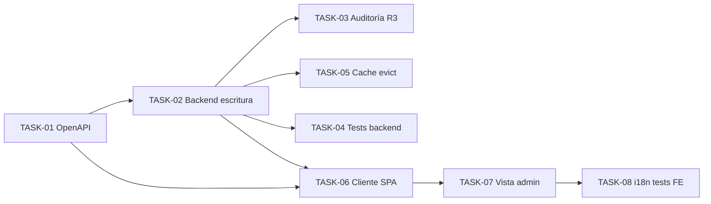

# HU-011 — Desglose en tickets de trabajo (MVP, UC-07)

| Campo | Valor |
|-------|--------|
| **Historia** | [HU-011 en backlog.md](backlog.md) (tabla §3) |
| **Refinamiento** | [HU-011-maestros-de-catalogo.md](HU-011-maestros-de-catalogo.md) |
| **Épica** | Administración |
| **Título HU** | Maestros de catálogo |
| **Estado HU** | **Cerrada** (8/8 tickets **Hecho**) |

**Convención de ID de ticket:** `TASK-HU-011-<nn>`.

**Estado del ticket:** columna **Estado** en cada fila; valores recomendados **Pendiente** (por defecto), **En curso**, **Hecho**. Actualízala al cerrar o arrancar trabajo.

**Contexto de equipo:** un ingeniero/a **full-stack**; stack en [readme.md](../../readme.md). **HU-001** (OIDC + Bearer) y **HU-005** (lectura de especies, entidades JPA) se asumen operativos. **Provincias** y **HU-015** (Mongo) quedan fuera del corte.

**Objetivo de este desglose:** cerrar **UC-07** en vertical: **ADMIN** mantiene taxonomía vía API en **catalog-service** y pantalla `/admin/masters` (sustituye placeholder), con contrato OpenAPI, auditoría **R3**, evicción de caché de especies y reglas CRUD acordadas en la HU.

**Reglas aplicables por capa (referencia rápida):**

- **Frontend:** [.cursor/rules/frontend-vue3.mdc](../../.cursor/rules/frontend-vue3.mdc), [.cursor/rules/frontend-security.mdc](../../.cursor/rules/frontend-security.mdc), [.cursor/rules/frontend-ux.mdc](../../.cursor/rules/frontend-ux.mdc), [testing-frontend.md](../engineering/testing-frontend.md)
- **Backend:** [.cursor/rules/spring-boot-4-backend.mdc](../../.cursor/rules/spring-boot-4-backend.mdc), [.cursor/rules/backend-generation-standard.mdc](../../.cursor/rules/backend-generation-standard.mdc), [ADR-0004](../adr/0004-catalog-rest-write-and-audit.md)
- **API / contrato:** [.cursor/rules/api-design.mdc](../../.cursor/rules/api-design.mdc), [.cursor/rules/api-contract.mdc](../../.cursor/rules/api-contract.mdc), [openapi.yaml](../api/openapi.yaml), [api-security.mdc](../../.cursor/rules/api-security.mdc)
- **Calidad / pruebas:** [.cursor/rules/quality-and-testing.mdc](../../.cursor/rules/quality-and-testing.mdc), [testing-java.md](../engineering/testing-java.md)

**Checks mínimos para cerrar tickets de esta HU:**

- Frontend: `npm run build` y `npm run test` en `frontend/` (si se tocan vistas/composables).
- Backend: `mvn -pl catalog-service test` desde `services/` (y `verify` / `testIT` si se añaden IT).
- Manual rápido: **ADMIN** alta/edición/baja de especie y alta familia/género vía API o UI; **COLABORADOR** recibe **403** en escritura; **DELETE** especie con árbol referenciado falla; tras alta, `GET /api/catalog/species?unpaged=true` refleja el cambio sin esperar TTL de caché.

---

## Orden sugerido (dependencias)

---

## Tickets

### Contrato y API (catalog-service)

| ID | Título | Descripción breve | Estado |
|----|--------|-------------------|--------|
| **TASK-HU-011-01** | OpenAPI: lecturas auxiliares y escritura taxonómica **ADMIN** | Cerrar [openapi.yaml](../api/openapi.yaml): **GET** listados para UI admin (p. ej. familias y géneros con filtro opcional `familiaId`; reutilizar o extender paginación/`q` si aplica). **POST** alta **familia** y **género** (solo campos obligatorios SQL: `nombre_cientifico`; `nombre_comun` opcional; género exige `familiaId`). **POST** alta **especie**, **PUT** edición por `speciesId`, **DELETE** por `speciesId` con **409** (o código acordado) si existe `ejemplar` con esa FK. Sin **PUT**/**DELETE** de familia/género. Seguridad `bearerAuth` + rol **ADMIN** en escrituras. Esquemas request/response y **Problem** 400/401/403/404/409. | Hecho |
| **TASK-HU-011-02** | Backend: servicios y controladores de escritura taxonómica | En **catalog-service**: servicios de aplicación transaccionales para **POST** familia/género y **POST**/**PUT**/**DELETE** especie; validación Jakarta alineada a columnas [`V1__baseline.sql`](../../services/catalog-service/src/main/resources/db/migration/V1__baseline.sql); comprobación FK `ejemplar.especie_id` antes de **DELETE**; resolución `usuario_app` desde JWT; `CatalogSecurityConfig` / `@PreAuthorize` **ADMIN** en rutas de escritura; DTOs sin exponer entidades JPA. Lecturas auxiliares de familias/géneros si no bastan las existentes. | Hecho |
| **TASK-HU-011-03** | Auditoría **AUDITORIA_CATALOGO** (R3) | Tras cada alta/edición/baja de especie y alta de familia/género: insert en **AUDITORIA_CATALOGO** con actor y resumen previo/nuevo, patrón [ADR-0004](../adr/0004-catalog-rest-write-and-audit.md). | Hecho |
| **TASK-HU-011-05** | Invalidación caché Redis de especies | Tras commit exitoso de escrituras que afecten al catálogo de especies: `@CacheEvict` (o equivalente) sobre `CatalogCacheConfig.CACHE_SPECIES_UNPAGED` y, si aplica, invalidación coherente con lecturas relacionadas documentadas en [`CatalogCacheConfig`](../../services/catalog-service/src/main/java/com/mtl/catalog/config/CatalogCacheConfig.java). | Hecho |
| **TASK-HU-011-04** | Pruebas backend (Surefire) | Tests unitarios de servicios (validación, rechazo DELETE con FK, campos obligatorios) y **WebMvcTest** de controladores admin (JSON, **403** no-ADMIN, **409** DELETE bloqueado). Convención `*Test` en `src/test/java`. | Hecho |

### Frontend (Vue 3)

| ID | Título | Descripción breve | Estado |
|----|--------|-------------------|--------|
| **TASK-HU-011-06** | Cliente API maestros admin | Módulo en `frontend/src/services/catalog/` (p. ej. `adminTaxonomy.ts`): llamadas autenticadas vía **`apiFetch`** a endpoints de **TASK-HU-011-01**; tipos alineados a OpenAPI; errores **`HttpError`** / Problem. Tests en `*.test.ts`. | Hecho |
| **TASK-HU-011-07** | Vista `/admin/masters` operativa | Sustituir [`PendingView`](../../frontend/src/router/index.ts) por vista dedicada: **listado de especies** + formulario **alta/edición** de especie; combo **género** con botón **+** → modal alta género (combo familia + **+** → modal alta familia); tras alta auxiliar, refrescar opciones y preseleccionar; acción **eliminar especie** con confirmación (respeta error si hay fichas); estados loading/error/i18n y fila de acciones según [frontend-ux.mdc](../../.cursor/rules/frontend-ux.mdc). **Sin** editar/borrar familia o género. | Hecho |
| **TASK-HU-011-08** | i18n y tests frontend | Claves en [es.ts](../../frontend/src/i18n/locales/es.ts) (`adminMasters.*`, modales, errores); tests de composable(s) con lógica de popups/selección y mocks HTTP. | Hecho |

---

## Qué puede quedar para después (MVP global, no este corte)

- **PUT** / **DELETE** de **familia** y **género**.
- Sincronización o invalidación Mongo al renombrar especie (**HU-015**).
- Mantenimiento admin de **provincias**.
- Importación masiva o workflows de aprobación taxonómica.

---

## Dependencias externas a esta HU

- **HU-001:** JWT y rol **ADMIN** en Keycloak/gateway.
- **HU-005:** tablas y `GET /api/catalog/species` operativos.
- **HU-013:** ruta `/admin/masters` y guardas (placeholder a reemplazar en **TASK-HU-011-07**).

---

## Cierre sugerido (definición de hecho del corte)

- [x] OpenAPI publicado y alineado con implementación (**TASK-HU-011-01**).
- [x] **ADMIN** puede alta familia/género (API) y alta/edición/baja especie; **DELETE** especie rechazado si hay `ejemplar` referenciado.
- [x] UI `/admin/masters` operativa con flujo **+** en combos y sin edición/baja de familia/género.
- [x] Auditoría **R3** en operaciones de escritura taxonómica (**TASK-HU-011-03**).
- [x] Caché unpaged de especies invalidada tras escrituras (**TASK-HU-011-05**).
- [x] Tests backend y frontend mínimos en verde; build SPA y `mvn -pl catalog-service test` OK.
