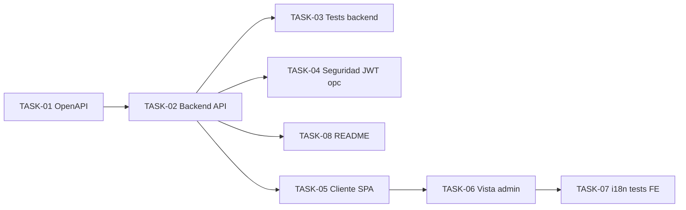

# HU-012 — Desglose en tickets de trabajo (MVP, UC-08)

| Campo | Valor |
|-------|--------|
| **Historia** | [HU-012 en backlog.md](backlog.md) (tabla §3) |
| **Refinamiento** | [HU-012-gestion-de-suscripciones-a-notificaciones.md](HU-012-gestion-de-suscripciones-a-notificaciones.md) |
| **Épica** | Administración |
| **Título HU** | Gestión de suscripciones a notificaciones |
| **Estado HU** | **Cerrada** (8/8 tickets **Hecho**) |

**Convención de ID de ticket:** `TASK-HU-012-<nn>`.

**Estado del ticket:** columna **Estado** en cada fila; valores recomendados **Pendiente** (por defecto), **En curso**, **Hecho**. Actualízala al cerrar o arrancar trabajo.

**Contexto de equipo:** un ingeniero/a **full-stack**; stack y rutas en [readme.md](../../readme.md). **HU-001** (OIDC + Bearer al gateway) y **HU-004** (modelo **SUSCRIPTOR**, alta pública) se asumen necesarios para datos y autenticación **ADMIN**. **HU-007** (envío de correos) queda fuera del alcance de esta HU.

**Objetivo de este desglose:** cerrar **UC-08** en vertical: **ADMIN** lista suscriptores y cambia **ACTIVA** / **CANCELADA** vía API detrás del gateway, con contrato en [openapi.yaml](../api/openapi.yaml) y pantalla en `/admin/subscriptions` (sustituyendo el placeholder actual). Sin eliminación física de filas ni implementación de cola/correo (**HU-007**).

**Reglas aplicables por capa (referencia rápida):**

- **Frontend:** [.cursor/rules/frontend-vue3.mdc](../../.cursor/rules/frontend-vue3.mdc), [.cursor/rules/frontend-security.mdc](../../.cursor/rules/frontend-security.mdc), [testing-frontend.md](../engineering/testing-frontend.md)
- **Backend:** [.cursor/rules/spring-boot-4-backend.mdc](../../.cursor/rules/spring-boot-4-backend.mdc), [.cursor/rules/backend-generation-standard.mdc](../../.cursor/rules/backend-generation-standard.mdc)
- **API / contrato:** [.cursor/rules/api-design.mdc](../../.cursor/rules/api-design.mdc), [.cursor/rules/api-contract.mdc](../../.cursor/rules/api-contract.mdc), [openapi.yaml](../api/openapi.yaml), [jwt-gateway-strategy.md](../security/jwt-gateway-strategy.md)
- **Calidad / pruebas:** [.cursor/rules/quality-and-testing.mdc](../../.cursor/rules/quality-and-testing.mdc), [testing-java.md](../engineering/testing-java.md)

**Checks mínimos para cerrar tickets de esta HU:**

- Frontend: `npm run build` y `npm run test` en `frontend/` (si se tocan tests o vistas).
- Backend: `mvn -pl notification-service test` desde `services/` (y `verify` / `testIT` solo si se añaden pruebas de integración).
- Manual rápido: **ADMIN** obtiene **200** en `GET /api/notifications/subscriptions` y **PATCH** con token vía gateway; **COLABORADOR** o anónimo no accede a gestión (403/401 según caso).

---

## Orden sugerido (dependencias)

**Nota:** En el repositorio actual **TASK-01** a **TASK-08** del desglose HU-012 constan como **Hecho** (cierre del corte vertical previsto en el breakdown).

---

## Tickets

### Contrato y API (notification-service)

| ID | Título | Descripción breve | Estado |
|----|--------|-------------------|--------|
| **TASK-HU-012-01** | OpenAPI: listado y cambio de estado **ADMIN** | `GET /api/notifications/subscriptions` con respuesta paginada (`NotificationSubscriptionAdminPage`), filtro opcional `estadoSuscripcion`, `PATCH /api/notifications/subscriptions/{subscriptionId}` con `NotificationSubscriptionStateUpdateRequest`, respuesta ítem, idempotencia **200**, errores **Problem** (400/401/403/404). Fuente: [openapi.yaml](../api/openapi.yaml), aclaraciones cerradas en la HU. | Hecho |
| **TASK-HU-012-02** | Backend: GET paginado y PATCH por `subscriptionId` | `NotificationAdminSubscriptionsController`, `SubscriptionAdminService`, `SuscriptorRepository` (paginación y filtro por estado), actualización de `estado_suscripcion` y `baja_en` alineada al modelo §2; **sin** borrado físico. [NotificationSecurityConfig](../../services/notification-service/src/main/java/com/mtl/notification/config/NotificationSecurityConfig.java): `hasRole("ADMIN")` en GET y PATCH; **POST** público sin cambios. | Hecho |
| **TASK-HU-012-03** | Pruebas backend (Surefire) | Tests unitarios del servicio de administración y **WebMvcTest** del controlador admin (JSON, validación); convención `*Test` en `src/test/java`. | Hecho |

### Calidad opcional (backend)

| ID | Título | Descripción breve | Estado |
|----|--------|-------------------|--------|
| **TASK-HU-012-04** | Cobertura **403** con JWT no **ADMIN** | **WebMvcTest** con cadena de seguridad real, `JwtDecoder` mock y claims `realm_access.roles`: **401** sin Bearer; **403** GET/PATCH con **COLABORADOR**; **200** GET/PATCH con **ADMIN**; **200** GET con ambos roles. Clase: `NotificationAdminSubscriptionsSecurityWebMvcTest`. | Hecho |

### Frontend (Vue 3)

| ID | Título | Descripción breve | Estado |
|----|--------|-------------------|--------|
| **TASK-HU-012-05** | Cliente API autenticado (gateway + Bearer) | Módulo [`adminSubscriptions.ts`](../../frontend/src/services/notifications/adminSubscriptions.ts): `fetchAdminSubscriptions` y `patchAdminSubscriptionEstado` vía **`apiFetch`** (Bearer, reintento 401); tipos alineados a OpenAPI; errores como **`HttpError`** con **Problem**. Tests: [`adminSubscriptions.test.ts`](../../frontend/src/services/notifications/adminSubscriptions.test.ts). | Hecho |
| **TASK-HU-012-06** | Vista `/admin/subscriptions` operativa | [`AdminSubscriptionsView.vue`](../../frontend/src/views/AdminSubscriptionsView.vue) + [`useAdminSubscriptionsList.ts`](../../frontend/src/composables/useAdminSubscriptionsList.ts); [router](../../frontend/src/router/index.ts) enlaza la ruta con `pageTitleKey` `adminSubscriptions.title`. Tabla, filtro, paginación, confirmaciones y feedback. | Hecho |
| **TASK-HU-012-07** | i18n y tests frontend | Bloque `adminSubscriptions` en [es.ts](../../frontend/src/i18n/locales/es.ts); [`useAdminSubscriptionsList.test.ts`](../../frontend/src/composables/useAdminSubscriptionsList.test.ts); mocks y caso **admin-subscriptions** en [`router/index.test.ts`](../../frontend/src/router/index.test.ts). | Hecho |

### Documentación operativa

| ID | Título | Descripción breve | Estado |
|----|--------|-------------------|--------|
| **TASK-HU-012-08** | README / notas de prueba | Párrafo en [services/README.md](../../services/README.md): **GET/PATCH** admin, rol **ADMIN**, gateway y enlace a OpenAPI. | Hecho |

---

## Qué puede quedar para después (sigue siendo MVP global, no este corte)

- Ordenación explícita vía query (solo documentado por defecto **altaEn** desc en servidor).
- Filtros adicionales (búsqueda por subcadena de correo) si política de privacidad lo permite en una iteración posterior.
- Exigir rol **ADMIN** también en **api-gateway** por ruta (hoy la autorización fina está en **notification-service** según [jwt-gateway-strategy.md](../security/jwt-gateway-strategy.md)).
- **HU-007:** envíos reales y uso de estados **ACTIVA** en el motor de notificaciones.

## Dependencias externas a esta HU

- **[HU-001](HU-001-ticket-breakdown.md):** JWT y sesión SPA hacia el gateway.
- **[HU-004](HU-004-ticket-breakdown.md):** tabla **SUSCRIPTOR** y alta pública para tener filas que listar.
- **Infra:** gateway enruta `/api/notifications/**`; Keycloak con usuario **ADMIN** para pruebas locales ([infra/compose/README.md](../../infra/compose/README.md)).

## Cierre sugerido (definición de hecho del corte)

Un usuario **ADMIN** autenticado abre `/admin/subscriptions`, ve el listado paginado alineado al contrato, puede filtrar por estado y ejecutar **PATCH** para **CANCELADA** y **ACTIVA** con respuestas correctas; un usuario sin rol **ADMIN** no accede a la gestión (403 en API y guarda en router). Contrato **OpenAPI** y respuestas JSON coinciden en campos y códigos acordados.
