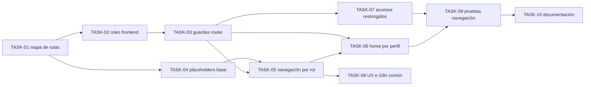

# HU-013 — Desglose en tickets de trabajo (MVP y navegación por rol)

| Campo | Valor |
|-------|--------|
| **Historia** | [HU-013 en backlog.md](backlog.md) (tabla §3) |
| **Refinamiento** | [HU-013-estructura-de-paginas-navegacion-y-guardas-por-rol-mvp.md](HU-013-estructura-de-paginas-navegacion-y-guardas-por-rol-mvp.md) |
| **Épica** | Acceso e identidad |
| **Título HU** | Estructura de páginas, navegación y guardas por rol (MVP) |
| **Estado HU** | **Cerrada** (11/11 tickets **Hecho**) |

**Convención de ID de ticket:** `TASK-HU-013-<nn>`.

**Estado del ticket:** columna **Estado** en cada fila; valores recomendados **Pendiente** (por defecto), **En curso**, **Hecho**.

**Contexto de equipo:** un ingeniero/a **full-stack** con HTML/CSS sólidos; stack, seguridad y arquitectura en [readme.md](../../readme.md). La autenticación base OIDC/JWT de **HU-001** se considera dependencia funcional para cerrar guardas por rol.

**Objetivo de este desglose:** dejar operativa la estructura de navegación del MVP por perfiles (Público, `COLABORADOR`, `ADMIN`) con rutas protegidas, menú mínimo y placeholders para páginas no implementadas, manteniendo fuera de esta HU la lógica funcional específica de cada pantalla.

**Reglas aplicables por capa (referencia rápida):**

- **Frontend:** [frontend-vue3.mdc](../../.cursor/rules/frontend-vue3.mdc), [frontend-ux.mdc](../../.cursor/rules/frontend-ux.mdc), [frontend-security.mdc](../../.cursor/rules/frontend-security.mdc)
- **API / contrato (si aplica):** [api-design.mdc](../../.cursor/rules/api-design.mdc), [api-contract.mdc](../../.cursor/rules/api-contract.mdc), [openapi.yaml](../api/openapi.yaml)
- **Calidad / pruebas:** [quality-and-testing.mdc](../../.cursor/rules/quality-and-testing.mdc), [testing-java.md](../engineering/testing-java.md) (backend si aplica)

**Checks mínimos para cerrar tickets de esta HU:**

- Frontend: `npm run build` y `npm run test` (si se añaden/ajustan tests)
- Validar navegación y guardas por perfil (`Público`, `COLABORADOR`, `ADMIN`) en ejecución local

---

## Orden sugerido (dependencias)

---

## Tickets

### Estructura de rutas y control de acceso (frontend)

| ID | Título | Descripción breve | Estado |
|----|--------|-------------------|--------|
| **TASK-HU-013-01** | Definir mapa de rutas MVP | Implementar/ajustar rutas base de navegación según `readme.md` §2.3: Home, consulta pública (`/ejemplares`, `/ejemplares/:id`), suscripción, alta/edición y administración, manteniendo enfoque de detalle con mapa integrado (sin ruta pública `/map` independiente). | Hecho |
| **TASK-HU-013-02** | Unificar roles en frontend | Centralizar constantes/tipos de rol para usar `COLABORADOR` y `ADMIN` de forma consistente (alineado con Keycloak y reglas de seguridad del proyecto). | Hecho |
| **TASK-HU-013-03** | Guardas de router por autenticación y rol | Aplicar guardas de acceso para rutas protegidas (colaborador/admin), manteniendo rutas públicas accesibles sin sesión e integrando el flujo de auth/error ya definido en frontend. | Hecho |
| **TASK-HU-013-04** | Placeholders de páginas no implementadas | Crear placeholders con título para vistas pendientes, con navegación operativa y **sin** lógica funcional ni llamadas reales a backend en esta HU. | Hecho |
| **TASK-HU-013-05** | Menú mínimo por perfil | Implementar navegación global mínima: base pública (`Inicio`, `Árboles`) y extensiones por sesión/rol (suscripción, alta, administración), ocultando entradas no permitidas. | Hecho |
| **TASK-HU-013-06** | Home adaptada por perfil | Ajustar Home para mostrar acciones primarias por perfil: público (consulta/suscripción), colaborador (alta/gestión propia), `ADMIN` (administración), manteniendo coherencia UX y estados de sesión. | Hecho |
| **TASK-HU-013-07** | Flujo de acceso restringido uniforme | Unificar comportamiento de rutas no autorizadas/no autenticadas (redirigir o vista de error controlada), evitando variantes por pantalla. | Hecho |

### UX, i18n y control de alcance

| ID | Título | Descripción breve | Estado |
|----|--------|-------------------|--------|
| **TASK-HU-013-08** | Mensajes UX e i18n comunes para placeholders/restricción | Centralizar copy en `i18n` para placeholders y accesos restringidos (sin hardcode), siguiendo reglas UX del proyecto y tono coherente. | Hecho |
| **TASK-HU-013-09** | Control de alcance HU-013 (sin backend en placeholders) | Verificar que páginas pendientes se mantienen como placeholder y no incluyen integración backend; cualquier lógica funcional se deriva a su HU específica con breakdown propio. | Hecho |

### Calidad, pruebas y documentación

| ID | Título | Descripción breve | Estado |
|----|--------|-------------------|--------|
| **TASK-HU-013-10** | Pruebas de navegación y guardas | Añadir pruebas (unitarias/componente/router según aplique) para validar: rutas públicas accesibles, rutas protegidas bloqueadas por rol, menú correcto por perfil y placeholders visibles donde corresponde. | Hecho |
| **TASK-HU-013-11** | Actualización documental de navegación MVP | Ajustar documentación afectada (`readme.md` §2.3 y backlog relacionado) para reflejar rutas finales, nomenclatura `ADMIN` y criterio placeholder de HU-013 sin añadir documentos nuevos. | Hecho |

---

## Qué puede quedar para después (sigue siendo MVP global, no este corte)

- Implementación funcional completa de páginas actualmente en placeholder (cada una en su HU correspondiente).
- Endpoints/backend específicos de cada área funcional (administración, suscripciones, etc.) cuando se active su HU.
- Optimización avanzada de UX de navegación (atajos, breadcrumbs, refinamientos de microinteracción).

## Dependencias externas a esta HU

- **HU-001:** autenticación OIDC/JWT operativa para validar guardas de rol.
- Definición de historias funcionales específicas (HU-002, HU-003, HU-004, HU-005, HU-008, HU-011, HU-012) para sustituir placeholders por funcionalidad real.

## Cierre sugerido (definición de “hecho” para el corte)

Con sesión pública/colaborador/`ADMIN`, el usuario puede recorrer la estructura de páginas del MVP con navegación coherente; las rutas protegidas aplican guardas correctas; las páginas aún no implementadas muestran placeholder con título sin llamar al backend; y la documentación refleja el comportamiento final de este corte.
