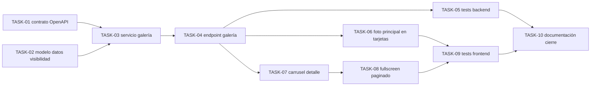

# HU-014 — Desglose en tickets de trabajo (consulta de fotografías del árbol)

| Campo | Valor |
|-------|--------|
| **Historia** | [HU-014 en backlog.md](backlog.md) (tabla §3) |
| **Refinamiento** | [HU-014-consulta-de-fotografias-del-arbol.md](HU-014-consulta-de-fotografias-del-arbol.md) |
| **Épica** | Fotografías y medios |
| **Título HU** | Consulta de fotografías del árbol |
| **Estado HU** | **Cerrada** (tickets **Hecho**) |

**Convención de ID de ticket:** `TASK-HU-014-<nn>`.

**Estado del ticket:** columna **Estado** en cada fila; valores recomendados **Pendiente** (por defecto), **En curso**, **Hecho**. Actualízala al cerrar o arrancar trabajo.

**Contexto de equipo:** un ingeniero/a **full-stack** con HTML/CSS sólidos; el stack y diagramas están en [readme.md](../../readme.md). El alcance se apoya en **HU-001** (autenticación OIDC), **HU-002** (lista y detalle públicos), **HU-003** (mapa en detalle) y **HU-006** (alta y metadatos de fotografías).

**Objetivo de este desglose:** cerrar el flujo de consulta de fotografías en vertical MVP: API de galería por árbol con visibilidad por rol (`PUBLIC`/`PRIVATE`), listado público con foto principal/placeholder y detalle con carrusel 50/50 respecto al mapa, incluyendo fullscreen con navegación y pruebas mínimas.

**Reglas aplicables por capa (referencia rápida):**

- **Frontend:** [frontend-vue3.mdc](../../.cursor/rules/frontend-vue3.mdc), [frontend-ux.mdc](../../.cursor/rules/frontend-ux.mdc), [frontend-security.mdc](../../.cursor/rules/frontend-security.mdc)
- **Backend:** [spring-boot-4-backend.mdc](../../.cursor/rules/spring-boot-4-backend.mdc), [backend-generation-standard.mdc](../../.cursor/rules/backend-generation-standard.mdc), [microservices-patterns.mdc](../../.cursor/rules/microservices-patterns.mdc)
- **API / contrato:** [api-design.mdc](../../.cursor/rules/api-design.mdc), [api-contract.mdc](../../.cursor/rules/api-contract.mdc), [openapi.yaml](../api/openapi.yaml)
- **Calidad / pruebas:** [quality-and-testing.mdc](../../.cursor/rules/quality-and-testing.mdc), [testing-java.md](../engineering/testing-java.md), [testing-frontend.md](../engineering/testing-frontend.md)

**Checks mínimos para cerrar tickets de esta HU:**

- Frontend: `npm run build` y `npm run test`
- Backend: `mvn -f services/pom.xml test` (y `verify` si se tocan `testIT`)
- Verificar flujo anónimo y autenticado en detalle: orden de carrusel, visibilidad por rol y fullscreen

---

## Orden sugerido (dependencias)

---

## Tickets

### Contrato y backend (media-service / gateway)

| ID | Título | Descripción breve | Estado |
|----|--------|-------------------|--------|
| **TASK-HU-014-01** | Cerrar contrato OpenAPI de galería por árbol | Definir en [openapi.yaml](../api/openapi.yaml) endpoint de lectura de galería por árbol y payload mínimo por elemento: `id`, `url`, `isPrimary`, `order`, `mimeType`, `width`, `height`, `category` con enum literal `PUBLIC`/`PRIVATE`. Acordar respuesta sin fotos: **200** con lista vacía. | Hecho |
| **TASK-HU-014-02** | Alinear modelo y repositorio para visibilidad por foto | Completar en `media-service` el soporte de categoría/visibilidad por fotografía para aplicar reglas R4-R5 por rol (anónimo solo `PUBLIC`; autenticado según permisos para `PRIVATE`). Si falta columna o restricción, crear migración Flyway nueva. | Hecho |
| **TASK-HU-014-03** | Servicio de aplicación para listado ordenado | Implementar caso de uso de consulta por `treeId` con orden: foto principal primero y resto en orden ascendente. Aplicar filtro por rol y contexto sin fuga de privadas. | Hecho |
| **TASK-HU-014-04** | Endpoint operativo de galería y seguridad | Exponer endpoint en gateway/media-service con JWT opcional según ruta: anónimo recibe públicas; autenticado recibe públicas+privadas permitidas. Mantener semántica de lista vacía sin fotos y manejo de errores consistente con `Problem`. | Hecho |
| **TASK-HU-014-05** | Pruebas backend de visibilidad y orden | Añadir tests unitarios/integración para: filtrado por rol, orden principal+ascendente, árbol sin fotos (`[]`), y denegación de privadas para usuarios sin permiso. | Hecho |

### Frontend (HU-002 detalle/lista pública compartida)

| ID | Título | Descripción breve | Estado |
|----|--------|-------------------|--------|
| **TASK-HU-014-06** | Tarjetas de listado con foto principal y fallback | En la lista de árboles, mostrar foto principal en hueco izquierdo con tamaño fijo homogéneo respetando proporción (`contain` o equivalente). Si no hay imagen, renderizar imagen por defecto. | Hecho |
| **TASK-HU-014-07** | Carrusel de detalle 50/50 con mapa | En vista de detalle (misma pantalla para anónimo/autenticado), incorporar carrusel con flechas anterior/siguiente, orden principal+ascendente y variante de imagen única sin controles. Layout escritorio: carrusel y mapa con misma dimensión, reparto 50/50. | Hecho |
| **TASK-HU-014-08** | Vista ampliada fullscreen con paginación | Al abrir una imagen del detalle, mostrar modal/fullscreen con navegación anterior/siguiente equivalente al carrusel embebido, sin requerimiento de swipe móvil. | Hecho |
| **TASK-HU-014-09** | Pruebas frontend de estados críticos | Añadir/actualizar tests (composable/componente/vista) para: placeholder en lista, carrusel con varias imágenes, modo imagen única, apertura fullscreen y respeto de orden de navegación. | Hecho |

### Documentación y cierre de corte

| ID | Título | Descripción breve | Estado |
|----|--------|-------------------|--------|
| **TASK-HU-014-10** | Documentación final y trazabilidad HU | Actualizar documentación afectada (OpenAPI y docs de backlog) con decisiones cerradas de HU-014, incluyendo visibilidad por rol y contrato de `category` literal. Verificar coherencia cruzada con HU-002/HU-003/HU-006. | Hecho |

---

## Qué puede quedar para después (sigue siendo MVP global, no este corte)

- Optimizaciones de entrega de imagen (thumbnails server-side, CDN, estrategias avanzadas de caché).
- Interacciones enriquecidas en móvil (swipe o gestos) y galerías avanzadas con miniaturas.
- Tratamiento de imagen adicional (compresión o variantes por dispositivo) fuera del comportamiento funcional mínimo.

## Dependencias externas a esta HU

- **HU-006:** disponibilidad de fotografías y metadatos asociados al árbol.
- **HU-001:** autenticación y propagación de identidad para rutas con contexto autenticado.
- **HU-002 / HU-003:** base de la pantalla de detalle público y bloque de mapa para layout conjunto.
- **Infra Compose:** servicios de `api-gateway`, `catalog-service`, `media-service` y almacén de objetos operativos.

## Cierre sugerido (definición de “hecho” para el experimento)

En listado público, cada tarjeta muestra foto principal o imagen por defecto; en detalle, carrusel 50/50 con mapa y fullscreen paginado. Un visitante solo ve fotos `PUBLIC`; un usuario autenticado ve `PUBLIC` + `PRIVATE` según permisos. El endpoint de galería devuelve **200** con `[]` si no hay fotos y respeta el esquema acordado en OpenAPI.
