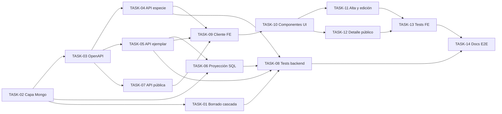

# HU-015 — Desglose en tickets de trabajo (proyección y enriquecimiento Mongo)

| Campo | Valor |
|-------|--------|
| **Historia** | [HU-015 en backlog.md](backlog.md) (tabla §3) |
| **Refinamiento** | [HU-015-proyeccion-y-enriquecimiento-mongo.md](HU-015-proyeccion-y-enriquecimiento-mongo.md) |
| **Épica** | Catálogo colaborador |
| **Título HU** | Proyección y enriquecimiento Mongo |
| **Estado HU** | **Hecho** |

**Convención de ID de ticket:** `TASK-HU-015-<nn>`.

**Estado del ticket:** columna **Estado** en cada fila; valores recomendados **Pendiente** (por defecto), **En curso**, **Hecho**, **Rechazado**. Actualízala al cerrar o arrancar trabajo.

**Contexto de equipo:** un ingeniero/a **full-stack**; stack en [readme.md](../../readme.md). Se asume **HU-005** (alta), **HU-008** (edición/baja; hook Mongo **stub**), **HU-013** (rutas), **HU-002** (detalle público) y Mongo en Compose operativo. **HU-016** consumirá los endpoints de **`especie_detalle`** desde el **frontend** (sin comunicación ai-service ↔ catalog-service).

**Objetivo de este desglose:** capa Mongo en **catalog-service**, API de enriquecimiento, proyección mínima tras SQL, borrado real en cascada (**TASK-01**), UI (popup especie + div colapsable ejemplar) en alta, edición y detalle público; sin IA ni sync SQL→Mongo en renombre/baja de especie.

**Reglas aplicables por capa (referencia rápida):**

- **Frontend:** [frontend-vue3.mdc](../../.cursor/rules/frontend-vue3.mdc), [frontend-ux.mdc](../../.cursor/rules/frontend-ux.mdc), [frontend-security.mdc](../../.cursor/rules/frontend-security.mdc)
- **Backend:** [spring-boot-4-backend.mdc](../../.cursor/rules/spring-boot-4-backend.mdc), [backend-generation-standard.mdc](../../.cursor/rules/backend-generation-standard.mdc), [mongo-hybrid.mdc](../../.cursor/rules/mongo-hybrid.mdc)
- **API / contrato:** [api-design.mdc](../../.cursor/rules/api-design.mdc), [api-contract.mdc](../../.cursor/rules/api-contract.mdc), [openapi.yaml](../api/openapi.yaml)
- **Modelo Mongo:** [mongo.md](../data-model/mongo.md)
- **Calidad / pruebas:** [quality-and-testing.mdc](../../.cursor/rules/quality-and-testing.mdc), [testing-java.md](../engineering/testing-java.md), [testing-frontend.md](../engineering/testing-frontend.md)

**Checks mínimos para cerrar tickets de esta HU:**

- Frontend: `npm run build` y `npm run test` en `frontend/`
- Backend: `mvn -f services/pom.xml -pl catalog-service test` (y `verify` / `*IT` si se añaden integraciones Mongo)
- Verificación manual orientativa: escenarios BDD en [HU-015-proyeccion-y-enriquecimiento-mongo.md](HU-015-proyeccion-y-enriquecimiento-mongo.md) §2

---

## Orden sugerido (dependencias)

**Nota:** **TASK-HU-015-01** conserva el ID histórico (referenciado en **HU-008** y en `EjemplarEnrichmentDeletionPort`); en ejecución va **después** de **TASK-02** (capa Mongo operativa).

### Decisiones de refinamiento (registro)

| Tema | Decisión |
|------|----------|
| **Aviso Mongo post-SQL** | Campo opcional **`enrichmentWarning`** (string legible) en el DTO de respuesta de **`POST`** / **`PUT`** `/api/catalog/trees`. Presente cuando PostgreSQL persiste correctamente y la proyección/upsert en Mongo falla; ausente en éxito completo. Documentar en **TASK-03**; implementar en **TASK-06**. |
| **Validación `ejemplar_detalle` (MVP)** | En **`measurements`**, cada valor numérico del objeto debe ser un **número válido** (JSON number finito; p. ej. altura, diámetros, perímetro según [mongo.md](../data-model/mongo.md) §5.2). **400** Problem si no cumple. Resto de campos del enriquecimiento de ejemplar sin validación estructural estricta en este corte. Esquema y reglas en **TASK-03**; aplicación en **TASK-05**. |
| **PUT enriquecimiento de especie** | **`PUT`** = **reemplazo** del documento de enriquecimiento enviado por el cliente (como `PUT /trees/{treeId}`). El servidor **siempre reinyecta** en el upsert la **proyección mínima** desde SQL (`speciesId`, `scientificName`, `commonName`); el cliente no puede omitir ni sobrescribir esos identificadores/nombres desnormalizados. |
| **Coherencia especie SQL → Mongo (ejemplar)** | Tras **`PUT`** `/api/catalog/trees` que cambie la especie del ejemplar en PostgreSQL, **TASK-06** debe actualizar en Mongo el `ejemplar_detalle` existente: `especie_pg_id` y nombres desnormalizados alineados con la especie **nueva** en SQL (mismo criterio que en el alta). |
| **Stub `NoOp` y Testcontainers Mongo** | Patrón de sustitución del stub (**TASK-01**) y dependencia Testcontainers Mongo (**TASK-08**): decidir al abordar cada ticket; no bloquean **TASK-02**. |

---

## Tickets

### Infraestructura y persistencia Mongo

| ID | Título | Descripción breve | Estado |
|----|--------|-------------------|--------|
| **TASK-HU-015-02** | Capa Mongo en catalog-service | Spring Data Mongo en `infrastructure.persistence.mongo.*`: documentos `especie_detalle` y `ejemplar_detalle` ([mongo.md](../data-model/mongo.md) §3; observaciones **embebidas**); `_id` numérico = `especie_pg_id` / `ejemplar_pg_id`; repositorios; creación de **índices** §4 al arranque o script equivalente; configuración en `application*.properties` y Compose. Sin lógica HTTP aún. | Hecho |

### Contrato OpenAPI

| ID | Título | Descripción breve | Estado |
|----|--------|-------------------|--------|
| **TASK-HU-015-03** | OpenAPI enriquecimientos Mongo | En [openapi.yaml](../api/openapi.yaml), alineado a [api-design.mdc](../../.cursor/rules/api-design.mdc) y [ADR-0007](../adr/0007-english-http-spanish-persistence.md): **Autenticado** — **`GET`/`PUT`** `/api/catalog/species/{speciesId}/enrichment` (sub-recurso de maestro; reutilizar `TaxonomySpeciesId`; **GET** **COLABORADOR**/**ADMIN**; **PUT** solo **ADMIN**); **`GET`/`PUT`** `/api/catalog/trees/{treeId}/enrichment` (sub-recurso paralelo a `.../media-submission-permission`; `TreeId`; autorización **HU-008**). **Público** — **`GET`** `/api/catalog/public/trees/{treeId}/enrichment` (`PublicTreeId`, tag `catalog-public`, `security: []`): respuesta **compuesta** con bloques opcionales `speciesEnrichment` + `treeEnrichment` (ficha publicada; un solo viaje para popup + div en **HU-002**). **Sin** `GET` público suelto por `speciesId` (evita filtrar enriquecimiento sin contexto de árbol publicado). Esquemas JSON en **inglés** (`camelCase`; p. ej. `scientificName`, `commonName`, `measurements`, `observations`); mapeo desde campos Mongo en español en DTO/assembler. **PUT** enriquecimiento = reemplazo del cuerpo enviado; en **`PUT`** de especie el servidor documenta que reinyecta proyección mínima desde SQL (véase tabla **Decisiones**). **`measurements`:** propiedades numéricas con tipo number finito (validación **400** en implementación). Códigos Problem 400/401/403/404; **200** con cuerpo vacío/parcial si no hay documento Mongo (no confundir con árbol inexistente). Extender respuestas **`POST`/`PUT`** `/api/catalog/trees` con **`enrichmentWarning`** opcional (string): mensaje cuando Mongo falla tras éxito SQL (**TASK-06** lo rellena). | Hecho |

### Catalog-service (backend)

| ID | Título | Descripción breve | Estado |
|----|--------|-------------------|--------|
| **TASK-HU-015-04** | API `especie_detalle` | Implementar lectura y guardado según **TASK-03**: **GET** para **COLABORADOR** (solo lectura) y **ADMIN**; **PUT** solo **ADMIN**; **PUT** reemplaza el cuerpo enviado y el servidor **reinyecta siempre** proyección mínima desde SQL (`speciesId`, `scientificName`, `commonName`) en el upsert; validación de contrato HTTP (no validación LLM §6.3 — **HU-016**). | Hecho |
| **TASK-HU-015-05** | API `ejemplar_detalle` | **GET**/`PUT` `/api/catalog/trees/{treeId}/enrichment`: mismas reglas de propiedad que edición de ficha (**COLABORADOR** propio / **ADMIN** cualquiera). Persistencia según [mongo.md](../data-model/mongo.md) §3.2–3.3; contrato HTTP en inglés (p. ej. `measurements`, `healthStatus`, `tags`, `observations`). Validaciones compartidas colaborador/ADMIN (**400** Problem): en **`measurements`**, cada valor numérico debe ser un número finito válido (MVP). | Hecho |
| **TASK-HU-015-06** | Proyección mínima y resiliencia post-SQL | Tras **POST**/**PUT** exitoso de `/api/catalog/trees` (**HU-005**/**HU-008**): upsert mínimo en Mongo (`especie_pg_id`, `ejemplar_pg_id`, nombres de especie desnormalizados) sin bloquear el commit SQL. Si el **PUT** cambia la especie en SQL, actualizar **`especie_pg_id`** y nombres desnormalizados en `ejemplar_detalle` existente. Si Mongo falla: respuesta de éxito SQL con **`enrichmentWarning`** poblado (**TASK-03**); sin rollback PostgreSQL. | Hecho |
| **TASK-HU-015-01** | Borrado en cascada Mongo al eliminar árbol | Sustituir **`NoOpEjemplarEnrichmentDeletionPort`** por implementación real: tras borrado físico SQL en **HU-008** (`EjemplarDeleteService`, orden media → SQL → hook), **eliminar físicamente** el documento **`ejemplar_detalle`** por `ejemplar_pg_id` (observaciones embebidas incluidas). **No** tombstone; **no** borrar **`especie_detalle`**. Requiere **TASK-02**. | Hecho |
| **TASK-HU-015-07** | Lectura pública de enriquecimiento | Implementar **GET** `/api/catalog/public/trees/{treeId}/enrichment` (**TASK-03**): **404** si el árbol no existe o no es publicable; **200** con `speciesEnrichment` y/o `treeEnrichment` opcionales si faltan documentos Mongo. Misma regla de visibilidad que `GET /api/catalog/public/trees/{treeId}`. Integración en **TreeDetailView** (**HU-002**). | Hecho |

### Calidad backend

| ID | Título | Descripción breve | Estado |
|----|--------|-------------------|--------|
| **TASK-HU-015-08** | Pruebas catalog (Mongo y API) | Tests unitarios/WebMvc: servicios de enriquecimiento, autorización por rol, proyección mínima, aviso si falla Mongo post-SQL. IT con **Testcontainers Mongo** (`*IT` en `testIT` si aplica): upsert, lectura, **TASK-01** borrado. Sin duplicar IT de contexto vacío ya cubierto en el módulo. | Hecho |

### Frontend

| ID | Título | Descripción breve | Estado |
|----|--------|-------------------|--------|
| **TASK-HU-015-09** | Cliente API enriquecimientos | Servicio TS (p. ej. `enrichmentService.ts`): `GET`/`PUT` especie y ejemplar autenticado; `GET` público por `treeId`; `AbortSignal`; mapeo Problem; tests Vitest. | Hecho |
| **TASK-HU-015-10** | Componentes UI reutilizables | **Icono + popup** `especie_detalle` (lectura colaborador/público; edición **ADMIN** en contexto autenticado). **Div colapsable** `ejemplar_detalle` (edición colaborador/ADMIN en alta-edición; solo lectura en público). Copy: contenido compartido por especie; aviso orientativo donde aplique. | Hecho |
| **TASK-HU-015-11** | Integración alta y edición de ejemplar | En **CreateTreeView** y **EditTreeView**: bloques de **TASK-10**; guardado de enriquecimiento vía API; manejo de advertencia Mongo post-SQL; sin acción de IA. Tests en composables/vistas críticas. | Hecho |
| **TASK-HU-015-12** | Integración detalle público | En **TreeDetailView** (**HU-002**): mismo patrón UI **solo lectura**; carga vía endpoint público; no mostrar en listado. | Hecho |
| **TASK-HU-015-13** | Pruebas frontend HU-015 | Vitest: servicio de enriquecimiento, componentes (roles lectura/edición), integración en vistas según impacto. | Hecho |

### Documentación

| ID | Título | Descripción breve | Estado |
|----|--------|-------------------|--------|
| **TASK-HU-015-14** | Documentación E2E y operativa | Actualizar [services/README.md](../../services/README.md) (Mongo, endpoints, borrado cascada, límites) y [frontend/README.md](../../frontend/README.md) (bloques UI, verificación manual BDD HU-015). Sustituir referencias al stub Mongo donde corresponda tras **TASK-01**. | Hecho |

---

## Qué puede quedar para después (sigue siendo MVP global, no este corte)

- **Sincronización** `especie_detalle` al renombrar o eliminar especie en **HU-011** (deuda explícita en la HU).
- **Disparar IA** o flujo `/admin/masters` (**HU-016**); esta HU solo expone API de guardado/carga.
- Sustituir consultas de listado público por lectura solo Mongo (**HU-002**/**HU-003**).
- Validación estructural JSON LLM (**mongo.md** §6.3) en **ai-assistant-service**.
- Edición de `especie_detalle` desde **`/admin/masters`** más allá del **Guardar** vía API compartida (**HU-016**).

## Dependencias externas a esta HU

- **HU-005** / **HU-008:** POST/PUT/DELETE de fichas; hook de borrado stub → **TASK-01**.
- **HU-002:** detalle público donde se integra **TASK-12**.
- **HU-013:** rutas y guardas.
- **HU-016:** reutiliza endpoints de **TASK-04** desde el frontend (sin acoplar microservicios).
- Infra **MongoDB** en Compose ([infra/compose/README.md](../../infra/compose/README.md)).

## Cierre sugerido (definición de hecho del corte)

Un **colaborador** puede guardar la ficha SQL y editar **`ejemplar_detalle`** (incl. observaciones) en un div colapsable; consultar **`especie_detalle`** en solo lectura desde el popup. Un **ADMIN** puede además editar **`especie_detalle`** en el popup (sin IA). Un **visitante** ve enriquecimientos en **detalle público** en solo lectura. Al **eliminar** un árbol, desaparece su `ejemplar_detalle` en Mongo y permanece `especie_detalle` si la especie sigue en catálogo. Si Mongo falla tras guardar SQL, la ficha queda guardada y la UI avisa. OpenAPI cerrado; tests backend y frontend en verde; documentación E2E actualizada.

**Orden de magnitud:** **L** (14 tickets; **TASK-01** al final del bloque backend una vez exista **TASK-02**).
