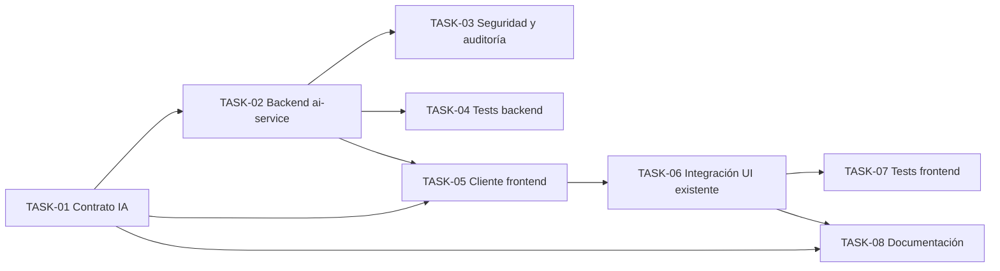

# HU-016 — Desglose en tickets de trabajo (consulta IA de características de especie)

| Campo | Valor |
|-------|--------|
| **Historia** | [HU-016 en backlog.md](backlog.md) (tabla §3) |
| **Refinamiento** | [HU-016-consulta-admin-caracteristicas-especie-ia.md](HU-016-consulta-admin-caracteristicas-especie-ia.md) |
| **Épica** | Inteligencia artificial |
| **Título HU** | Consulta de características de especie (ADMIN, MVP) |

**Convención de ID de ticket:** `TASK-HU-016-<nn>`.

**Estado del ticket:** columna **Estado** en cada fila; valores recomendados **Pendiente** (por defecto), **En curso**, **Hecho**, **Rechazado**. Actualízala al cerrar o arrancar trabajo.

**Contexto de equipo:** un ingeniero/a **full-stack**; stack en [readme.md](../../readme.md). Se asume **HU-001** (OIDC/JWT), **HU-011** (maestros y pantalla `/admin/masters`), **HU-013** (rutas y guardas) y **HU-015** (pantalla ya existente de edición de características de especie y persistencia Mongo, fuera del alcance de esta HU). El flujo de **HU-016** añade solo la **consulta a IA** y la **precarga de campos** en la pantalla existente; no persiste en Mongo.

**Objetivo de este desglose:** cerrar el flujo MVP en el que un **ADMIN** consulta a **ai-assistant-service** para obtener un JSON orientativo de características de especie, validado y compatible con la pantalla ya existente de edición; la acción solo está disponible si esa especie aún no tiene enriquecimiento persistido en Mongo.

**Reglas aplicables por capa (referencia rápida):**

- **Frontend:** [frontend-vue3.mdc](../../.cursor/rules/frontend-vue3.mdc), [frontend-ux.mdc](../../.cursor/rules/frontend-ux.mdc), [frontend-security.mdc](../../.cursor/rules/frontend-security.mdc)
- **Backend:** [spring-boot-4-backend.mdc](../../.cursor/rules/spring-boot-4-backend.mdc), [backend-generation-standard.mdc](../../.cursor/rules/backend-generation-standard.mdc)
- **API / contrato:** [api-design.mdc](../../.cursor/rules/api-design.mdc), [api-contract.mdc](../../.cursor/rules/api-contract.mdc), [api-security.mdc](../../.cursor/rules/api-security.mdc), [openapi.yaml](../api/openapi.yaml)
- **Modelo / JSON objetivo:** [mongo.md](../data-model/mongo.md) §6.3, [product-context.mdc](../../.cursor/rules/product-context.mdc)
- **Calidad / pruebas:** [quality-and-testing.mdc](../../.cursor/rules/quality-and-testing.mdc), [testing-java.md](../engineering/testing-java.md), [testing-frontend.md](../engineering/testing-frontend.md)

**Checks transversales (igual que CI / pre-PR):** [devsecops-ci.md](../engineering/devsecops-ci.md) — `lint`, `typecheck`, `npm test`, `mvn test`; opcional local: `verify`, `npm run build`.

**Checks específicos de esta HU:**

- Módulos / servicios tocados: `services/ai-assistant-service`, `services/api-gateway` (si hay relay/ruta), `frontend` en la pantalla ya existente de edición de características de especie.
- Validación funcional del corte: **ADMIN** ve la acción solo si no hay enriquecimiento previo; la consulta devuelve JSON compatible y precarga campos; **COLABORADOR** recibe **403**; si la respuesta IA no supera validación, la UI no precarga datos.
- Si añades `*IT`: `mvn -f services/pom.xml -pl ai-assistant-service verify` — ver [testing-java.md](../engineering/testing-java.md) §1

---

## Orden sugerido (dependencias)

---

## Tickets

### Contrato y API (ai-assistant-service)

| ID | Título | Descripción breve | Estado |
|----|--------|-------------------|--------|
| **TASK-HU-016-01** | Cierre OpenAPI del endpoint de consulta IA | Añadir en [openapi.yaml](../api/openapi.yaml) el endpoint autenticado bajo `/api/ai/**` para consulta de enriquecimiento de especie. Cerrar **request** con `scientificName` y `commonName`, y definir **response** JSON orientada a la pantalla existente de edición de características de especie. Este ticket debe fijar explícitamente el **contrato exacto de entrada/salida** y su alineación con el esquema esperado por la UI. Incluir **401/403/404/422** (o error acordado) con Problem Details. | Hecho |

### ai-assistant-service (backend)

| ID | Título | Descripción breve | Estado |
|----|--------|-------------------|--------|
| **TASK-HU-016-02** | Endpoint backend de consulta IA y adaptación de respuesta | En `ai-assistant-service`: controlador, caso de uso y cliente al proveedor IA para recibir **nombre científico** y **nombre común**, construir el prompt, invocar al LLM y devolver un JSON ya adaptado al contrato cerrado en **TASK-HU-016-01**. Sin persistencia, sin acceso a Mongo y sin llamadas a `catalog-service`. | Hecho |
| **TASK-HU-016-03** | Validación estructural y seguridad del endpoint IA | Validar la respuesta del LLM antes de devolverla al frontend, reutilizando como referencia [mongo.md](../data-model/mongo.md) §6.3 y el contrato exacto cerrado en **TASK-HU-016-01**. Añadir control de acceso **solo ADMIN** (**403** para colaborador), manejo de errores del proveedor IA y copy/semántica orientativa en mensajes técnicos donde aplique. | Hecho |
| **TASK-HU-016-04** | Auditoría de uso IA | Registrar la invocación en **AUDITORIA_USO_IA** (**R3**) con `subject_oidc`, `tipo_uso_ia`, resumen técnico de prompt/resultado y `consultado_en`, sin introducir persistencia del enriquecimiento en Mongo dentro de esta HU. | Hecho |

### Calidad backend

| ID | Título | Descripción breve | Estado |
|----|--------|-------------------|--------|
| **TASK-HU-016-05** | Pruebas backend del servicio IA | Tests unitarios/WebMvc en `ai-assistant-service`: acceso **solo ADMIN**, validación estructural, error del proveedor IA, respuesta compatible con el contrato y auditoría. Mockear el proveedor LLM; no integrar Mongo ni `catalog-service`. | Hecho |

### Frontend

| ID | Título | Descripción breve | Estado |
|----|--------|-------------------|--------|
| **TASK-HU-016-06** | Cliente frontend para consulta IA de especie | Añadir en `frontend/src/services/...` el cliente autenticado hacia `/api/ai/**` con request (`scientificName`, `commonName`) y response tipada según **TASK-HU-016-01**. Manejar Problem Details, estados de carga y cancelación si aplica. | Hecho |
| **TASK-HU-016-07** | Integración en la pantalla existente de edición de características | En la pantalla ya existente de edición de características de especie (entregada en **HU-015**), añadir la acción visible solo para **ADMIN** y solo si **no existe enriquecimiento previo** en Mongo. Al usarla, consultar IA y **precargar** los campos de la pantalla con la respuesta; sin guardar automáticamente ni cambiar el flujo de persistencia ya existente. | Hecho |
| **TASK-HU-016-08** | Pruebas frontend HU-016 | Vitest sobre cliente y UI: visibilidad solo para **ADMIN**, ocultación/deshabilitado si ya existe enriquecimiento, precarga correcta de campos, error cuando la IA falla o la respuesta no valida. | Hecho |

### Documentación

| ID | Título | Descripción breve | Estado |
|----|--------|-------------------|--------|
| **TASK-HU-016-09** | Documentación funcional y técnica de HU-016 | Actualizar [readme.md](../../readme.md) §3.2.4, [services/README.md](../../services/README.md) y [frontend/README.md](../../frontend/README.md) con el endpoint de consulta IA, la restricción **solo ADMIN**, la condición “solo si no hay enriquecimiento previo” y la verificación manual del flujo. | Hecho |

---

## Qué puede quedar para después

- Persistencia automática del resultado IA en Mongo al mismo tiempo que la consulta.
- Reutilizar la misma consulta IA desde otras pantallas distintas de la edición existente.
- Rate limiting, cuotas por ADMIN o telemetría avanzada de coste del proveedor IA.
- Reintentos automáticos, caché de respuestas IA o versionado de prompts.
- Identificación por imagen (**HU-009**) y chat (**HU-010**).

## Dependencias externas a esta HU

- **HU-001:** autenticación OIDC/JWT y roles.
- **HU-011:** existencia de especie con nombre científico y común; ruta/pantalla de administración.
- **HU-013:** guardas y navegación por rol.
- **HU-015:** pantalla existente de edición de características y persistencia Mongo ya operativa; esta HU la reutiliza, pero no la redefine.
- Proveedor externo de IA accesible desde `ai-assistant-service`.

## Cierre sugerido (definición de hecho del corte)

Un **ADMIN** autenticado puede, desde la pantalla ya existente de edición de características de especie, lanzar una **consulta IA** si esa especie aún no tiene enriquecimiento persistido. La aplicación envía **nombre científico** y **nombre común** a `ai-assistant-service`, recibe una respuesta validada y compatible con la UI, y **precarga** los campos de la pantalla sin persistir automáticamente en Mongo. Un **COLABORADOR** no puede usar la función (**403**). Si la respuesta del LLM es inválida o el proveedor falla, la pantalla no se precarga y se informa del error. OpenAPI cerrado; tests backend y frontend en verde; documentación actualizada.

**Orden de magnitud:** **M** (9 tickets; la clave es cerrar primero el contrato JSON y luego alinear backend + frontend sobre ese formato).
