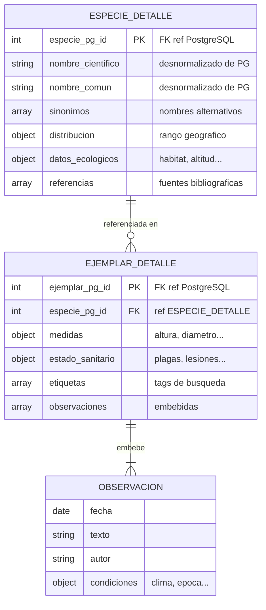

# Diseño de base de datos MongoDB — Colección de árboles singulares

## 1. Contexto y decisiones de arquitectura

La aplicación gestiona una colección personal de fotografías de árboles singulares. La arquitectura de datos es híbrida:

- **PostgreSQL** actúa como sistema de registro (*system of record*): inventario de ejemplares, taxonomía de especies, ubicaciones y fotografías. Garantiza integridad referencial y consultas tipadas.
- **MongoDB** actúa como sistema de enriquecimiento (*system of enrichment*): información ampliada de especies y ejemplares sin estructura fija, notas de campo y observaciones.

La referencia cruzada entre ambas bases de datos se establece mediante las claves primarias numéricas de PostgreSQL (`especie_pg_id`, `ejemplar_pg_id`), que actúan como identificadores canónicos en MongoDB.

**Desnormalización controlada:** los campos `nombre_cientifico` y `nombre_comun` se replican en `especie_detalle` (presentes también en PostgreSQL) para permitir búsquedas de texto completo en MongoDB sin necesidad de acceder a la base de datos relacional.

**Campos libres:** MongoDB permite añadir campos adicionales a cualquier documento sin modificar el esquema. Esta flexibilidad es intrínseca al modelo y no requiere un campo contenedor explícito.

---

## 2. Diagrama entidad-relación



---

## 3. Definición del modelo

### 3.1 Colección `especie_detalle`

Almacena la información ampliada de cada especie botánica. Sus datos se cargan mediante consulta a un LLM a partir del nombre científico registrado en PostgreSQL.

| Campo | Tipo | Descripción |
|---|---|---|
| `_id` | int | Igual a `especie_pg_id`. Clave primaria del documento. |
| `especie_pg_id` | int | FK lógica hacia `catalog.especie.especie_id` (especie del maestro en PostgreSQL). |
| `nombre_cientifico` | string | Desnormalizado desde PostgreSQL. Usado en búsquedas de texto. |
| `nombre_comun` | string | Desnormalizado desde PostgreSQL. Usado en búsquedas de texto. |
| `sinonimos` | array\<string\> | Nombres alternativos, sinónimos taxonómicos o nombres vernáculos adicionales. |
| `distribucion` | object | Rango geográfico: continentes, países y descripción narrativa. |
| `datos_ecologicos` | object | Hábitat, altitud, clima, tipo de suelo, longevidad, fauna asociada, periodo de floración, etc. |
| `referencias` | array\<object\> | Fuentes bibliográficas: título, autores, fuente, año y URL. |

### 3.2 Colección `ejemplar_detalle`

Almacena la información ampliada de cada ejemplar concreto. La gestiona el usuario directamente a través de la aplicación.

| Campo | Tipo | Descripción |
|---|---|---|
| `_id` | int | Igual a `ejemplar_pg_id`. Clave primaria del documento. |
| `ejemplar_pg_id` | int | FK hacia `catalog.ejemplar.ejemplar_id` (identificador canónico del ejemplar en PostgreSQL). |
| `especie_pg_id` | int | FK hacia `especie_detalle` en MongoDB. |
| `medidas` | object | Mediciones físicas: altura, diámetro de tronco, diámetro de copa, perímetro. |
| `estado_sanitario` | object | Valoración general, plagas detectadas, lesiones y fecha de última revisión. |
| `etiquetas` | array\<string\> | Tags de búsqueda y clasificación libre asignados por el usuario. |
| `observaciones` | array\<object\> | Observaciones de campo embebidas. Ver estructura en sección 3.3. |

### 3.3 Subdocumento `observacion` (embebido en `ejemplar_detalle`)

Las observaciones son intrínsecas al ciclo de vida del ejemplar y se consultan siempre en su contexto. Se modelan como array embebido.

| Campo | Tipo | Descripción |
|---|---|---|
| `fecha` | date | Fecha de la observación en formato ISO 8601. |
| `texto` | string | Descripción narrativa libre de la observación. |
| `autor` | string | Nombre del observador. |
| `condiciones` | object | Datos contextuales: temperatura, humedad, época del año, etc. |

---

## 4. Índices

### 4.1 Colección `especie_detalle`

```js
// Referencia cruzada con PostgreSQL — acceso principal
db.especie_detalle.createIndex(
  { especie_pg_id: 1 },
  { unique: true, name: "uidx_especie_pg_id" }
)

// Búsqueda por nombre científico y común — texto parcial e insensible a mayúsculas
db.especie_detalle.createIndex(
  { nombre_cientifico: "text", nombre_comun: "text" },
  { name: "idx_text_nombres_especie", default_language: "spanish" }
)
```

### 4.2 Colección `ejemplar_detalle`

```js
// Referencia cruzada con PostgreSQL — acceso principal
db.ejemplar_detalle.createIndex(
  { ejemplar_pg_id: 1 },
  { unique: true, name: "uidx_ejemplar_pg_id" }
)

// Todos los ejemplares de una especie — consulta más habitual
db.ejemplar_detalle.createIndex(
  { especie_pg_id: 1 },
  { name: "idx_especie_pg_id" }
)

// Filtrado por etiqueta individual o combinación de etiquetas
db.ejemplar_detalle.createIndex(
  { etiquetas: 1 },
  { name: "idx_etiquetas" }
)
```

### 4.3 Resumen de índices

| Colección | Índice | Tipo | Justificación |
|---|---|---|---|
| `especie_detalle` | `especie_pg_id` | Único | Referencia cruzada PG, acceso principal |
| `especie_detalle` | `nombre_cientifico` + `nombre_comun` | Texto | Búsqueda por nombre, parcial e insensible a mayúsculas |
| `ejemplar_detalle` | `ejemplar_pg_id` | Único | Referencia cruzada PG, acceso principal |
| `ejemplar_detalle` | `especie_pg_id` | Simple | Todos los ejemplares de una especie |
| `ejemplar_detalle` | `etiquetas` | Multikey | Filtrado por etiqueta individual o combinación |

---

## 5. Documentos JSON de ejemplo

### 5.1 `especie_detalle`

```json
{
  "_id": 12,
  "especie_pg_id": 12,
  "nombre_cientifico": "Quercus robur",
  "nombre_comun": "Roble pedunculado",
  "sinonimos": [
    "Quercus pedunculata",
    "Roble común",
    "Roble europeo"
  ],
  "distribucion": {
    "continentes": ["Europa", "Asia occidental"],
    "paises": ["España", "Francia", "Alemania", "Reino Unido", "Polonia"],
    "descripcion": "Especie predominante en la Europa atlántica y continental, desde la Península Ibérica hasta los Urales."
  },
  "datos_ecologicos": {
    "habitat": ["bosque caducifolio", "riberas", "laderas húmedas"],
    "altitud_min_m": 0,
    "altitud_max_m": 1500,
    "clima": ["atlántico", "continental húmedo"],
    "suelo": ["arcilloso", "limoso", "profundo"],
    "longevidad_max_años": 1000,
    "velocidad_crecimiento": "lento",
    "tipo_hoja": "caduca",
    "periodo_floracion": {
      "inicio_mes": 4,
      "fin_mes": 5
    },
    "fauna_asociada": ["Apodemus sylvaticus", "Sciurus vulgaris", "Sitta europaea"]
  },
  "referencias": [
    {
      "titulo": "Flora Ibérica. Plantas vasculares de la Península Ibérica e Islas Baleares",
      "autores": ["Castroviejo, S."],
      "fuente": "Real Jardín Botánico, CSIC",
      "año": 1993,
      "url": "https://www.floraiberica.es"
    },
    {
      "titulo": "Quercus robur — IUCN Red List",
      "autores": [],
      "fuente": "IUCN",
      "año": 2018,
      "url": "https://www.iucnredlist.org/species/63532/3125918"
    }
  ]
}
```

### 5.2 `ejemplar_detalle`

```json
{
  "_id": 847,
  "ejemplar_pg_id": 847,
  "especie_pg_id": 12,
  "medidas": {
    "altura_m": 24.5,
    "diametro_tronco_cm": 187,
    "diametro_copa_m": 18,
    "perimetro_tronco_cm": 587
  },
  "estado_sanitario": {
    "valoracion_general": "bueno",
    "plagas_detectadas": ["Tortrix viridana"],
    "lesiones": [
      {
        "tipo": "cavidad basal",
        "descripcion": "Oquedad en la base del tronco de aproximadamente 30 cm de diámetro",
        "lado": "norte"
      }
    ],
    "ultima_revision": "2024-09-15"
  },
  "etiquetas": [
    "monumental",
    "protegido",
    "ribera",
    "centenario"
  ],
  "observaciones": [
    {
      "fecha": "2024-04-10",
      "texto": "Brotación intensa y uniforme en toda la copa. Se observan numerosas agallas en hojas jóvenes, probablemente Cynips quercusfolii.",
      "autor": "Carlos Mendoza",
      "condiciones": {
        "temperatura_c": 14,
        "humedad_relativa_pct": 72,
        "epoca": "primavera"
      }
    },
    {
      "fecha": "2023-11-03",
      "texto": "Coloración otoñal completa. Pérdida foliar avanzada. Se constata la presencia de muérdago (Viscum album) en ramas medias.",
      "autor": "Carlos Mendoza",
      "condiciones": {
        "temperatura_c": 9,
        "humedad_relativa_pct": 85,
        "epoca": "otoño"
      }
    }
  ]
}
```

---

## 6. Carga de `especie_detalle` mediante LLM

### 6.1 Flujo de carga

El administrador del sistema puede consultar al LLM para generar el documento correspondiente en `especie_detalle`. El flujo es el siguiente:

1. El usuario solicita la información al LLM con `nombre_cientifico` y `nombre_comun`.
2. La aplicación construye el prompt a partir de estos datos y el esquema de referencia.
3. El LLM devuelve un documento JSON que la aplicación valida antes de persistir.

### 6.2 Prompt de referencia

```
Eres un botánico experto. A partir del nombre científico proporcionado,
genera un documento JSON con información enciclopédica de la especie.
Responde ÚNICAMENTE con el JSON, sin explicaciones ni bloques de código.

El documento debe seguir exactamente esta estructura:

{
  "sinonimos": ["<string>"],
  "distribucion": {
    "continentes": ["<string>"],
    "paises": ["<string>"],
    "descripcion": "<string>"
  },
  "datos_ecologicos": {
    "habitat": ["<string>"],
    "altitud_min_m": <int>,
    "altitud_max_m": <int>,
    "clima": ["<string>"],
    "suelo": ["<string>"],
    "longevidad_max_años": <int>,
    "velocidad_crecimiento": "<lento|moderado|rápido>",
    "tipo_hoja": "<caduca|perennifolia|marcescente>",
    "periodo_floracion": {
      "inicio_mes": <int 1-12>,
      "fin_mes": <int 1-12>
    },
    "fauna_asociada": ["<nombre científico de especie>"]
  },
  "referencias": [
    {
      "titulo": "<string>",
      "autores": ["<string>"],
      "fuente": "<string>",
      "año": <int>,
      "url": "<string>"
    }
  ]
}

Nombre científico: {{nombre_cientifico}}
Nombre común: {{nombre_comun}}
```

### 6.3 Campos a validar antes de persistir

| Campo | Validación recomendada |
|---|---|
| Estructura raíz | El JSON debe contener exactamente las claves del esquema, sin campos extra en el nivel raíz. |
| `altitud_min_m`, `altitud_max_m` | Deben ser enteros positivos y `min < max`. |
| `periodo_floracion.inicio_mes` / `fin_mes` | Enteros entre 1 y 12. |
| `velocidad_crecimiento` | Debe ser uno de los valores enumerados: `lento`, `moderado`, `rápido`. |
| `tipo_hoja` | Debe ser uno de: `caduca`, `perennifolia`, `marcescente`. |
| `referencias[].url` | Verificar formato URL válido. **No asumir que la URL es accesible o correcta.** |
| `referencias[].año` | Entero de 4 dígitos, no futuro. |

**Contrato HTTP (wire):** la validación en **ai-assistant-service** (**HU-016**) usa claves camelCase en el JSON de respuesta (`altitudMinM`, `clima`, `growthRate`, …); `growthRate`/`leafType` se normalizan a enums **ingleses** en la salida IA. **catalog-service** (`SpeciesEcologicalData`, **HU-015**) y documentos Mongo pueden usar enums en **español** (`lento`, `caduca`, …). Matiz completo: [ADR-0007](../adr/0007-english-http-spanish-persistence.md) regla 10.

### 6.4 Riesgos conocidos

**Alucinación de referencias bibliográficas.** Es el riesgo más relevante. Los LLM pueden generar títulos, autores y URLs con apariencia válida pero inexistentes. Las referencias deben tratarse siempre como datos no verificados hasta que el usuario las contraste con las fuentes originales.

**Variabilidad de esquema.** Aunque el prompt incluye el esquema completo, el modelo puede omitir campos opcionales o añadir campos no definidos en el nivel raíz. La validación debe rechazar documentos con claves desconocidas en el nivel raíz para evitar contaminación del modelo.

**Información desactualizada.** La información taxonómica y ecológica puede diferir entre fuentes o haber sido revisada. Se recomienda indicar en el documento la fecha de generación para facilitar revisiones futuras.
