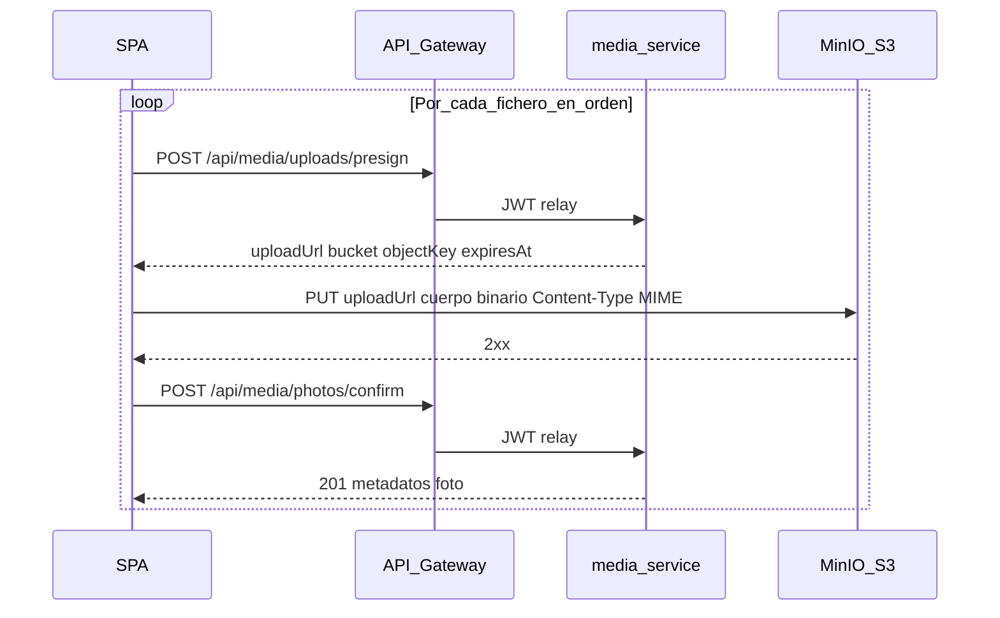

# Subida de fotografías al árbol (HU-006) — guía técnica

Documento operativo para desarrollo y soporte: **flujo presign → PUT → confirmación**, **propiedades configurables** de `media-service`, criterio de **foto principal** (UI vs servidor) y **EXIF en cliente**. El contrato HTTP canónico es [docs/api/openapi.yaml](../api/openapi.yaml). La historia de producto y criterios BDD: [HU-006-fotografias-asociadas-al-arbol.md](../backlog/HU-006-fotografias-asociadas-al-arbol.md).

## Alcance de este corte

- Incluye: subida tras Alta de ejemplar (JWT), validaciones de MIME/tamaño/cupo, persistencia de metadatos en esquema `media`, bucket privado con **URLs prefirmadas** (sin credenciales de bucket en el cliente).
- No sustituye: consulta/galería completa (**HU-014**), transformación de imágenes, cambio manual avanzado de principal tras el primer lote.

## Propiedades configurables (`media-service`)

Definidas en `services/media-service/src/main/resources/application.properties` (perfil base). En **dev**, JDBC, JWT y credenciales MinIO vienen de `application-dev.properties` (variables `MINIO_ROOT_USER` / `MINIO_ROOT_PASSWORD`, alineadas con [infra/compose/.env.example](../../infra/compose/.env.example)); el catálogo para permisos puede sobreescribirse con `MTL_CATALOG_BASE_URL`. No hay secretos en clases Java (`MediaStorageProperties`).

| Propiedad | Rol |
|-----------|-----|
| `mtl.media.upload.max-file-size` | Tamaño máximo por fichero (por defecto `20MB`). |
| `mtl.media.upload.max-photos-per-ejemplar` | Máximo de fotografías activas por ejemplar (por defecto `10`). |
| `mtl.media.upload.allowed-mime-types` | Lista separada por comas; por defecto `image/jpeg`, `image/png`, `image/webp`. |
| `mtl.media.storage.bucket` | Nombre del bucket (alineado con Compose: `mtl-photos`). |
| `mtl.media.storage.endpoint` | Endpoint S3 (MinIO local: `http://localhost:9000`). |
| `mtl.media.storage.access-key` / `secret-key` | Credenciales del servicio hacia MinIO; en local, perfil **dev** y `MINIO_ROOT_USER` / `MINIO_ROOT_PASSWORD` (Compose). |
| `mtl.media.presign.expires-in` | Validez de la URL de subida (ISO-8601 duration, p. ej. `PT15M`). |
| `mtl.catalog.base-url` | Base URL de **catalog-service** para comprobar permiso de subida sobre el `treeId` (JWT). |

Infra local (bucket, CORS para el origen de Vite): [infra/compose/README.md](../../infra/compose/README.md) (sección MinIO).

## Secuencia: presign → subida de objeto → confirmación

Orquestación en cliente: `frontend/src/services/media/treePhotoUploadSequence.ts` (`uploadPhotosForTreeAfterCreate`), invocado tras crear el ejemplar cuando hay ficheros seleccionados.

Puntos clave:

1. **Presign:** valida MIME, tamaño y que el cupo permita al menos una foto más; resuelve actor y permiso sobre el árbol vía catálogo; genera clave de objeto y URL prefirmada de **PUT**.
2. **PUT:** el navegador envía el binario **directamente** a MinIO; no pasa por el gateway de aplicación para el cuerpo del objeto.
3. **Confirm:** valida de nuevo MIME/tamaño/cupo, coherencia de `bucket` con el configurado, **`orden` igual al índice siguiente** (0, 1, … según fotos ya confirmadas) y persiste metadatos (dimensiones opcionales leídas en cliente).

Errores al cliente: **RFC 9457** (`application/problem+json`); no exponer detalles internos de MinIO/S3.

## Foto principal: UI y servidor

| Capa | Criterio |
|------|-----------|
| **Frontend** (`TreePhotoUploadPicker`) | La **primera imagen seleccionada** en el lote se muestra como “principal” en la previsualización; el usuario puede quitar la primera y la siguiente pasa a ser la primera en lista. |
| **Backend** (`MediaUploadService.confirmUpload`) | La **primera fotografía confirmada** para ese `treeId` recibe `es_principal = true` de forma **forzada** por el servidor (`currentPhotos == 0`). Las confirmaciones siguientes no pueden marcar `isPrimary` en petición de forma que contradiga esa regla. El campo `orden` en BD refleja el orden de confirmación estable enviado por la SPA (`order` en JSON; debe coincidir con el conteo actual). |

La SPA puede enviar `isPrimary: false` en todas las confirmaciones; el servidor asigna la principal solo en la primera confirmación efectiva.

## EXIF y coordenadas en la pantalla de alta

- Composable: `frontend/src/composables/imageExifGps.ts` (`readGpsFromImageFile`, librería `exifr`).
- Al cambiar la lista de fotos, el picker lee GPS de la **primera** imagen del listado actual; si hay coordenadas válidas (WGS84), emite `first-photo-gps` y la vista de alta (`CreateTreeView`) aplica `applyCoordinatesAndAutofillAddress` (lat/lon del formulario + geocodificación inversa opcional).
- Si no hay EXIF o es inválido, **no** se bloquea la subida.

## Autenticación y enrutado

- Rutas bajo `/api/media/...` (presign y confirm) exigen **JWT** vía gateway; relay y CORS: [docs/security/jwt-gateway-strategy.md](../security/jwt-gateway-strategy.md).
- Roles de negocio alineados con alta/edición de árbol: **COLABORADOR** y **ADMIN** con permiso sobre el árbol (comprobación en catálogo desde `media-service`).

## Pruebas automatizadas (referencia rápida)

- Backend: tests de validación, permisos y principal en `media-service` (Surefire / convención `*Test`). Ver [testing-java.md](testing-java.md).
- Frontend: `TreePhotoUploadPicker` + cableado en `CreateTreeView` (Vitest); ver [testing-frontend.md](testing-frontend.md).

## Enlaces relacionados

- [services/README.md](../../services/README.md) — arranque Maven, puertos, gateway.
- [readme.md](../../readme.md) — visión de arquitectura (Alta de ejemplar + subida) §3.2.3.
- [docs/data-model/data-model.md](../data-model/data-model.md) — visibilidad R4–R5 (herencia desde la ficha).
