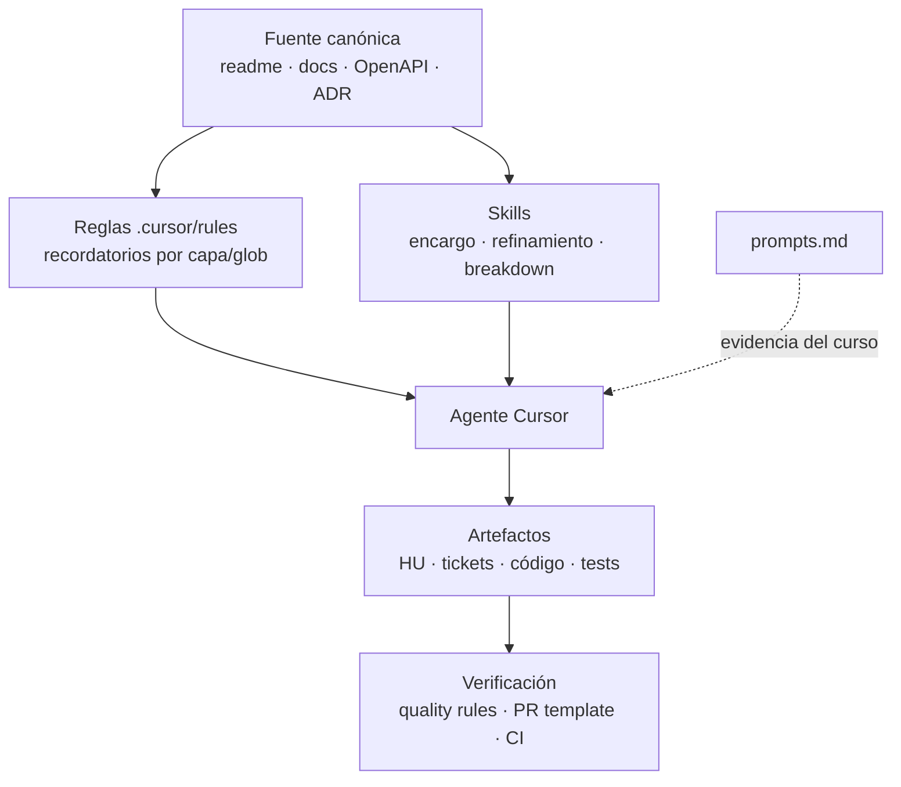

# Revisión — uso de IA en el SDLC

| Campo | Valor |
|-------|--------|
| **Fecha** | 2026-06-13 |
| **Alcance** | Desarrollo asistido con IA (Cursor, reglas, skills, prompts, trazabilidad de entrega) |
| **Fuera de alcance** | Módulo de IA del producto (`ai-assistant-service`, HU-009/010/016) y funcionalidades futuras pendientes de implementación |
| **Tipo** | Evaluación de buenas prácticas de IA en el ciclo de vida del desarrollo (solo análisis, sin cambios en código) |

---

## Prompt

> Actúa como experto desarrollador en IA y revisa cómo se está usando la IA en el proyecto y el uso que se hace o no de las buenas prácticas actuales. Da una nota general de 1 a 5 y califica de 1 a 5 el uso de las principales prácticas de IA.
>
> Aclaración posterior: la implementación del módulo de IA del producto es desarrollo pendiente; no considerarlo (distinto de una funcionalidad futura no implementada). Hacer el análisis **solo del uso de la IA en el SDLC**.

---

## Respuesta

### Alcance de esta revisión

Este informe valora **cómo se usa la IA para construir el software** (Cursor, prompts, reglas, skills, trazabilidad de entrega), **sin** evaluar el módulo de IA del producto ni funcionalidades de runtime pendientes de desarrollo.

**Escala:** 1 = ausente o contrario a buenas prácticas · 5 = referencia para un proyecto profesional con IA en el ciclo de vida.

---

### Modelo de trabajo adoptado

El repositorio no trata la IA como un copiloto suelto, sino como un **sistema de gobernanza** con capas claras:

Esto encaja con las buenas prácticas actuales de **context engineering**: acotar contexto, una fuente de verdad por tema, flujos repetibles y verificación automatizada del output generado.

---

### Fortalezas por fase del SDLC

#### 1. Planificación y análisis (backlog, HUs)

- **`hu-refinement-mtl`**: estructura canónica, INVEST, BDD, prohibición explícita de inventar requisitos.
- **`hu-breakdown-mtl`**: tickets `TASK-HU-xxx-nn`, dependencias Mermaid, reglas por capa, checks mínimos (`mvn test`, `npm run test`).
- Separación estricta: `backlog.md` (HUs) vs `HU-xxx-ticket-breakdown.md` (tickets) — evita mezclar niveles de abstracción, un error habitual en repos asistidos por IA.

#### 2. Encargo e implementación

- **`encargo-mtl`**: plantilla con objetivo, alcance, fuentes, definición de hecho y modo (implementar / diseño / revisión). Obliga a acotar antes de generar código.
- **`AGENTS.md`** + [canonical-sources.md](../engineering/canonical-sources.md): mapa tema → documento que manda; reduce deriva entre lo que el agente infiere y lo que el proyecto define.
- **15 reglas `.mdc`** con `globs` y `alwaysApply` disciplinado ([cursor-rules-primer.md](../onboarding/cursor-rules-primer.md)): contexto mínimo necesario por capa.

#### 3. Calidad y verificación

- **`quality-and-testing.mdc`**: tests obligatorios según capa, nomenclatura `*Test`/`*IT`.
- **Plantilla de PR** (`.github/pull_request_template.md`) con checklist front/back, seguridad, DevSecOps.
- **CI** (`.github/workflows/ci.yml`): Maven, lint/typecheck/Vitest, Gitleaks — contrapeso real al volumen de código generado.
- Prompts de **revisión AppSec** en [prompts.md](../../prompts.md) §2.5: uso correcto de IA como revisor especializado, no solo generador.

#### 4. Anti-deriva y mantenibilidad de la config IA

- **ADR-0003** ([0003-cursor-rules-refinement-and-canonical-map.md](../adr/0003-cursor-rules-refinement-and-canonical-map.md)): registro del refinamiento rules ↔ docs; reglas cortas que enlazan, no duplican.
- Skills de dominio (`db-postgresql-mtl`, `db-mongo-mtl`) para tareas de datos acotadas.
- Comandos Cursor (`git-new-branch`, `git-commit`) con normas de equipo explícitas.

#### 5. Evidencia para evaluación académica

- **`prompts.md`**: trazabilidad de prompts por fase (producto, arquitectura, modelo de datos, backlog, tickets, UX).
- **[ai-development-playbook.md](../onboarding/ai-development-playbook.md)**: flujo operativo HU → refinamiento → tickets → implementación → PR.
- Revisión previa del propio repo ([2026-05-31-integral-project-evaluation-partial-delivery.md](2026-05-31-integral-project-evaluation-partial-delivery.md)) ya situaba el gobierno del desarrollo asistido por encima de la media.

---

### Huecos y mejoras (solo SDLC)

| Área | Observación |
|------|-------------|
| **Trazabilidad PR** | El playbook pide HU → TASK → cambios, pero la plantilla de PR no exige IDs de HU/ticket ni enlace al breakdown. |
| **`prompts.md` incompleto** | Secciones vacías (§2.2–2.4, API §4, parte de tests): debilita la evidencia del curso. |
| **Sincronización backlog** | Estados «Pendiente» vs tickets «Hecho» sugieren falta de paso humano de cierre tras trabajo asistido por IA. |
| **Supervisión explícita** | Hay guardrails de generación, pero poca evidencia documentada de *rechazos* o correcciones humanas al output del agente. |
| **Skills vs reglas** | Bien diferenciados; conviene usar siempre `encargo-mtl` en implementación (no está enforced). |

Ninguno de estos huecos invalida el enfoque; son refinamientos de madurez operativa.

---

### Calificación por prácticas principales

| Práctica | Nota | Comentario |
|----------|:----:|------------|
| **Context engineering** (reglas, globs, fuentes canónicas, `AGENTS.md`) | **4,5** | Modelo maduro; ADR-0003 y mapa canónico son diferenciadores. |
| **Orquestación del flujo SDLC** (playbook, skills por fase) | **4,5** | Refinamiento → breakdown → encargo bien definidos y reutilizables. |
| **Disciplina de prompts y anti-alucinación de requisitos** | **4** | Skills muy acotados; `prompts.md` con lagunas. |
| **Verificación del código generado** (tests, CI, checklist PR) | **4** | Reglas + CI + plantilla PR; E2E Playwright en workflow separado (manual). |
| **Trazabilidad artefacto → código** (HU, tickets, prompts, PRs) | **3,5** | Buena en docs y skills; débil en plantilla PR y cierre de estados. |
| **Mantenibilidad de la configuración IA** (rules/skills sin duplicar docs) | **4,5** | Enfoque «regla corta + enlace» bien ejecutado. |
| **Supervisión humana en el loop de desarrollo** | **3,5** | DoD en encargo y prompts de revisión; falta evidencia sistemática de corrección humana. |

---

### Nota general (solo SDLC)

**4,2 / 5**

**Interpretación:** el proyecto demuestra un **uso de IA en el desarrollo por encima de la media** en formación profesional. No se limita a pedir código a un LLM genérico: hay **gobernanza**, **fuentes de verdad**, **flujos por fase**, **guardrails anti-invento** y **verificación automatizada**.

La nota no alcanza 5 porque faltan cerrar el ciclo de **trazabilidad en PRs**, **completar la evidencia en `prompts.md`** y una **pasada humana de sincronización** tras generación masiva de documentación — prácticas que separan un repo bien configurado para IA de uno demostrablemente supervisado de punta a punta.

---

### Cuadro resumen

| Dimensión | Nota |
|-----------|:----:|
| Context engineering | **4,5** |
| Orquestación del flujo SDLC | **4,5** |
| Disciplina de prompts | **4** |
| Verificación del código generado | **4** |
| Trazabilidad artefacto → código | **3,5** |
| Mantenibilidad de la config IA | **4,5** |
| Supervisión humana | **3,5** |
| **Nota global SDLC** | **4,2** |

---

### Acciones recomendadas (mayor impacto, solo SDLC)

1. Añadir a la plantilla de PR campos obligatorios: `HU-xxx`, `TASK-HU-xxx-nn`, enlace al breakdown.
2. Completar `prompts.md` en secciones vacías y añadir 2–3 entradas tipo «prompt inicial / corrección humana / resultado final».
3. Ritual de cierre post-HU: actualizar estado en `backlog.md` y §3.1 cuando los tickets pasen a «Hecho».

Con estas acciones, la nota del SDLC podría acercarse cómodamente a **4,5 / 5** sin depender del módulo de IA del producto.

---

### Mensaje para el evaluador del curso

MyTreeLibrary es un **buen ejemplo de gobernanza de IA en el desarrollo**: reglas por capa, skills operativos, mapa de fuentes canónicas y verificación automatizada (CI). La evaluación debe distinguir entre **infraestructura de desarrollo asistido** (madura) y **evidencia de supervisión humana de punta a punta** (mejorable vía PRs, `prompts.md` y sincronización del backlog).
