## Índice

1. [Ficha del proyecto](#1-ficha-del-proyecto)
2. [Descripción general del producto](#2-descripción-general-del-producto)
   - [2.1 Objetivo](#21-objetivo)
   - [2.2 Características y funcionalidades principales](#22-características-y-funcionalidades-principales)
   - [2.2.1 Diagrama de contexto (C1)](#221-diagrama-de-contexto-del-sistema-c1)
   - [2.2.2 Diagrama de casos de uso](#222-diagrama-de-casos-de-uso-del-sistema)
   - [2.3 Diseño y experiencia de usuario](#23-diseño-y-experiencia-de-usuario)
   - [2.4 Instrucciones de instalación](#24-instrucciones-de-instalación)
3. [Arquitectura del sistema](#3-arquitectura-del-sistema)
   - [3.1 Diagrama de arquitectura](#31-diagrama-de-arquitectura)
   - [3.2 Descripción de componentes principales](#32-descripción-de-componentes-principales)
   - [3.2.1 Autenticación en Front (Vue)](#321-autenticación-en-front-vue)
   - [3.2.2 Kafka](#322-kafka)
   - [3.2.3 Almacenamiento de fotografías](#323-almacenamiento-de-fotografías)
   - [3.2.4 Uso de IA](#324-uso-de-ia-características-de-especie-mvp-e-identificaciónchat-futuro)
   - [3.3 Estructura del proyecto y ficheros](#33-descripción-de-alto-nivel-del-proyecto-y-estructura-de-ficheros)
   - [3.4 Infraestructura y despliegue](#34-infraestructura-y-despliegue)
   - [3.5 Seguridad](#35-seguridad)
   - [3.6 Tests](#36-tests)
4. [Modelo de datos](#4-modelo-de-datos)
   - [4.1 Modelo lógico del sistema completo](#41-modelo-lógico-del-sistema-completo)
   - [4.2 Diagrama de persistencia (implementación)](#42-diagrama-de-persistencia-implementación)
   - [4.2.1 PostgreSQL — catalog_service](#421-postgresql-catalog_service)
   - [4.2.2 MongoDB — enriquecimiento](#422-mongodb-catalog-service-modelo-en-mongomd)
   - [4.2.3 PostgreSQL — media_service](#423-postgresql-media_service)
   - [4.2.4 PostgreSQL — notification_service](#424-postgresql-notification_service)
   - [4.2.5 PostgreSQL — ai_assistant_service](#425-postgresql-ai_assistant_service-esquema-ai)
   - [4.3 Descripción de entidades principales](#43-descripción-de-entidades-principales-orientación-física)
5. [Especificación de la API](#5-especificación-de-la-api)
   - [OpenAPI (contrato canónico)](docs/api/openapi.yaml)
   - [Convenciones de nomenclatura](docs/engineering/naming-conventions.md)
   - [Eventos Kafka](docs/events/kafka-events.md)
6. [Historias de usuario](#6-historias-de-usuario)
   - [Resumen de casos de uso](docs/use-cases/use-case-summary.md)
   - [Backlog HU-001…HU-016](docs/backlog/backlog.md)
   - [Convención de desgloses](docs/backlog/README.md)
7. [Tickets de trabajo](#7-tickets-de-trabajo)
   - [Skill hu-breakdown-mtl](.cursor/skills/hu-breakdown-mtl/SKILL.md)
   - [Convención de desgloses](docs/backlog/README.md)
8. [Pull requests](#8-pull-requests)
   - [Estrategia de ramas](docs/onboarding/github-branching.md)
   - [CI y DevSecOps](docs/engineering/devsecops-ci.md)
   - [Plantilla de PR](.github/pull_request_template.md)

---

## 1. Ficha del proyecto

### **1.1. Tu nombre completo:**

Luís María de Frutos Redondo.

### **1.2. Nombre del proyecto:**

MyTreeLibrary.

### **1.3. Descripción breve del proyecto:**

MyTreeLibrary es una solución digital para crear y gestionar tu colección personal de árboles singulares, almacenando fotografías, localización geográfica y datos relevantes de cada ejemplar. Diseñada para aficionados, permite compartir información públicamente y fomentar una comunidad colaborativa. En el MVP, la IA apoya la consulta de características de especie por administradores; la identificación por imagen y el chat se prevén en versiones posteriores.

### **1.4. URL del proyecto:**

[https://github.com/ldefrutos1/AI4Devs-finalproject](https://github.com/ldefrutos1/AI4Devs-finalproject)

### **1.5. URL o archivo comprimido del repositorio**

[https://github.com/ldefrutos1/AI4Devs-finalproject](https://github.com/ldefrutos1/AI4Devs-finalproject)

---

## 2. Descripción general del producto

### **2.1. Objetivo:**

#### Propósito

Desarrollar una plataforma web que permita registrar, organizar y consultar fotografías, ubicaciones y datos relevantes de árboles de tu ciudad, facilitando al usuario la creación de una biblioteca personal digital y la posibilidad de compartir esa información de forma pública.

**NOTA IMPORTANTE:** Se ha seleccionado una arquitectura de microservicios en Java con Spring y Vue con un **propósito didáctico**, con el fin de aprender estas tecnologías.


#### Valor aportado (qué soluciona)

La solución combina la catalogación personal con la posibilidad de compartir y crear comunidad en torno a una afición compartida.

Además, la plataforma incorpora inteligencia artificial como apoyo a la consulta de características de especies (ADMIN en el MVP); en versiones posteriores se prevé la identificación orientativa a partir de fotografías y el chat asistido.

#### Destinatarios de la solución

La solución está dirigida a aficionados a la naturaleza en general y puede resultar de especial utilidad para docentes y monitores de tiempo libre.

### **2.2. Características y funcionalidades principales:**

#### Registro y publicación de árboles

El sistema permite registrar árboles mediante fichas con información relevante, fotografías y ubicación, posibilitando su publicación para consulta pública. Los usuarios autenticados con perfil de colaborador pueden dar de alta nuevas fichas de ejemplares; así como la edición o eliminación de aquellos registros creados por ellos mismos. El sistema permite la edición de todos los ejemplares a los usuarios con perfil de administrador.

#### Consulta pública y visualización geográfica

El sistema implementa una consulta pública de los árboles publicados mediante listado y detalle; mostrando en la ficha de detalle las fotografías de cada árbol y su localización sobre mapa de forma clara e intuitiva.

#### Notificaciones

La solución ofrece un sistema de notificaciones para comunicar novedades a usuarios suscritos, sin necesidad de que estos dispongan de cuenta en la plataforma.

#### Integración con IA

El producto se integra con IA para obtener información de las características de cada especie; en próximas versiones se implementará la identificación orientativa de la especie a partir de fotografías y la funciónalidad de chat.

### **2.2.1 Diagrama de contexto del sistema (C1)**

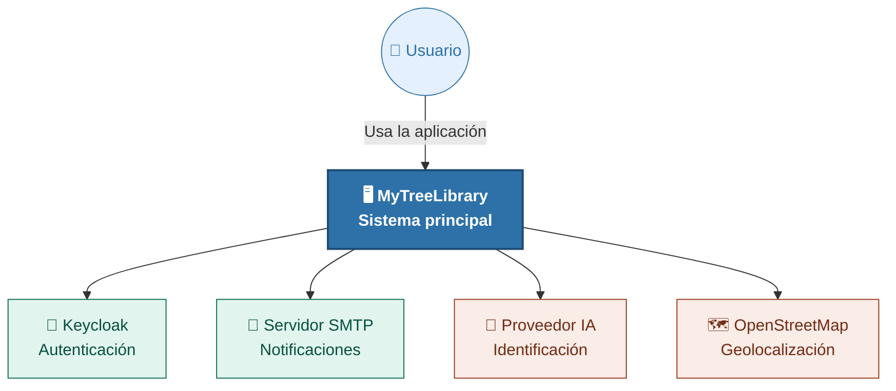


### **2.2.2 Diagrama de Casos de Uso del sistema**

A continuación se incluye el diagrama de casos de uso del sistema.


| ID | Nombre | Actor principal |
| --- | --- | --- |
| UC-01 | Consultar árboles publicados y su ubicación | Público |
| UC-02 | Registrarse para recibir notificaciones | Público |
| UC-03 | Registrar árbol | Colaborador |
| UC-04 | Modificar y eliminar árboles | Colaborador |
| UC-05 | Identificar árbol asistido por IA (imagen) | Colaborador |
| UC-06 | Consultar asistente IA (chat) | Colaborador |
| UC-07 | Gestionar tablas de catálogo (maestros taxonómicos) | ADMIN |
| UC-08 | Gestionar solicitudes de notificación | ADMIN |
| UC-09 | Notificar por correo a suscriptores | Sistema |

*El Modelo completo se puede consultar en:* [resumen de casos de uso](docs/use-cases/use-case-summary.md) · [modelo PlantUML](docs/use-cases/use-case-model.puml)

### **2.3. Diseño y experiencia de usuario:**

La aplicación implementa una navegación simple por roles con una **home de entrada** adaptada a cada perfil.

### Navegación de la aplicación

---

#### 🌐 Público &nbsp;·&nbsp; sin autenticación

```
🏠  Inicio                   /
🌳  Catálogo                 /ejemplares
    └─ Detalle               /ejemplares/:id
✉️  Suscripción              /subscriptions/new
```

---

#### 👤 Colaborador &nbsp;·&nbsp; usuario autenticado

↳ *Incluye todas las páginas públicas*

```
➕  Alta de ejemplar            /ejemplares/new
📋  Mis árboles              /mis-ejemplares
    └─ Edición de ficha      /ejemplares/:id/edit
```

---

#### 🛡️ Admin &nbsp;·&nbsp; privilegios completos

↳ *Incluye todas las páginas de colaborador*

```
🗄️  Maestros                 /admin/masters
👥  Suscripciones            /admin/subscriptions
```

---

### Resumen de permisos

| Página | Público | Colaborador | Admin |
|---|:---:|:---:|:---:|
| Inicio `/` | ✅ | ✅ | ✅ |
| Árboles `/ejemplares` | ✅ | ✅ | ✅ |
| Detalle `/ejemplares/:id` | ✅ | ✅ | ✅ |
| Suscripción `/subscriptions/new` | ✅ | ✅ | ✅ |
| Alta de ejemplar `/ejemplares/new` | — | ✅ | ✅ |
| Mis árboles `/mis-ejemplares` | — | ✅ | ✅ |
| Edición de ficha `/ejemplares/:id/edit` | — | ✅ | ✅ |
| Maestros `/admin/masters` | — | — | ✅ |
| Suscripciones `/admin/subscriptions` | — | — | ✅ |


### **2.4. Instrucciones de instalación:**

**Ruta feliz (entorno local):**

1. Copiar `infra/compose/.env.example` a `infra/compose/.env` y ejecutar `docker compose up -d` desde `infra/compose/` (Postgres, Keycloak, Kafka, Redis, MinIO, Mailpit, observabilidad).
2. Arrancar microservicios con perfil **`dev`** — como mínimo **api-gateway** (8080) y los servicios del flujo que vayas a probar (ver tabla inferior).
3. Copiar `frontend/.env.example` a `frontend/.env`; desde `frontend/`: `npm install` y `npm run dev` (UI en **http://localhost:5173**; Vite reenvía `/api/*` al gateway).

> **Redis y catalog-service:** con perfil `dev`, el catálogo usa caché Redis; el contenedor Redis del Compose debe estar en marcha antes de arrancar **catalog-service**.

#### Arranque mínimo por flujo

Tras `docker compose up -d`, levanta **api-gateway** (8080) y, según lo que pruebes, los servicios en **`dev`**:

| Flujo | Compose (además de Postgres/Keycloak) | Servicios en host |
|-------|----------------------------------------|-------------------|
| Consulta pública | — | catalog |
| Alta / edición de árbol | Redis, Kafka | catalog (+ **media** si hay fotos) |
| Fotos (subida) | MinIO | media |
| Aviso por correo (Alta de ejemplar) | Kafka, Mailpit | notification |
| Admin (maestros / suscripciones) | — | catalog; notification (suscripciones) |

**Detalle ampliado:** servicios Compose, puertos y variables — [infra/compose/README.md](infra/compose/README.md). Comandos Maven, perfil `dev`, Flyway y tests backend — [services/README.md](services/README.md). Usuarios Keycloak y flujo OIDC — [frontend/README.md](frontend/README.md). Observabilidad — [platform/observability/README.md](platform/observability/README.md).

**Datos iniciales:** **catalog-service** aplica semillas de maestros (familia, género, especie, provincia) con Flyway; el mantenimiento en aplicación por **ADMIN** (**HU-011**, UC-07) cubre solo la taxonomía; las **provincias** permanecen en semillas, sin pantalla admin en el MVP.

---

## 3. Arquitectura del sistema

En esta sección:

- [3.1 Diagrama de arquitectura](#31-diagrama-de-arquitectura)
- [3.2 Descripción de componentes principales](#32-descripción-de-componentes-principales)
- [3.3 Estructura del proyecto y ficheros](#33-descripción-de-alto-nivel-del-proyecto-y-estructura-de-ficheros)
- [3.4 Infraestructura y despliegue](#34-infraestructura-y-despliegue)
- [3.5 Seguridad](#35-seguridad)
- [3.6 Tests](#36-tests)

### **3.1. Diagrama de arquitectura:**

La aplicación se desarrolla en microservicios con Spring en la parte de backend y Vue como tecnología frontend.

#### Patrón y Stack tecnológico

- **Arquitectura:** Microservicios 
- **Seguridad:** OIDC y JWT

**Stack tecnológico principal:**

- **Backend:** Spring Boot 4 y Maven
- **Frontend:** Vue 3
- **Identidad:** Keycloak para OIDC y JWT
- **Eventos de dominio:** Kafka
- **Base de datos SQL:** PostgreSQL
- **Base de datos NoSQL:** MongoDB
- **Caché:** Redis
- **Almacenamiento de imágenes:** Compatible S3 (MinIO)
- **Observabilidad:** Prometheus + Grafana; métricas vía Actuator/Micrometer en cada microservicio


#### C2 — Diagrama de contenedores (nivel 2)

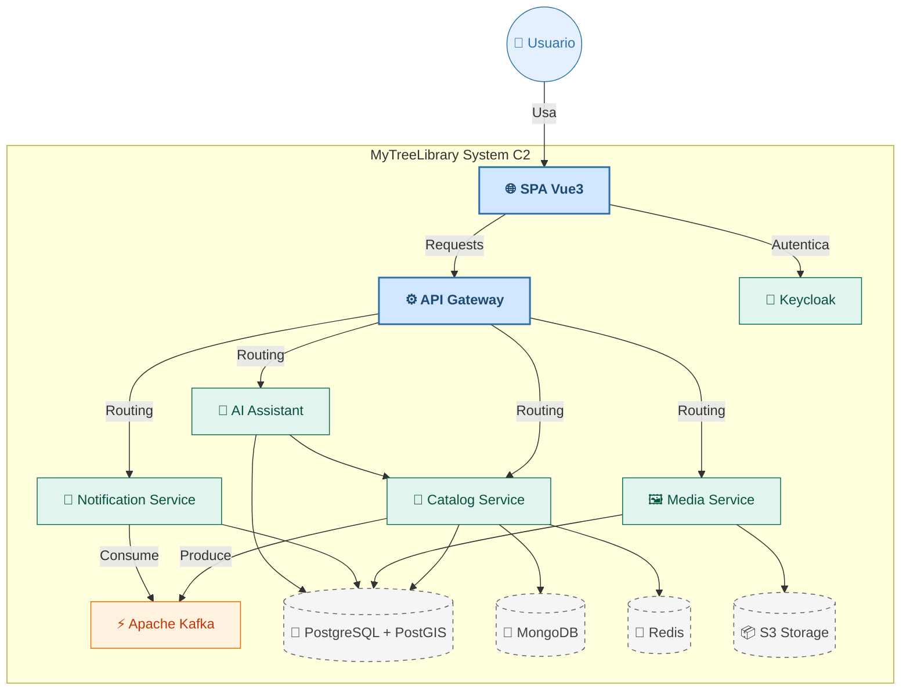

### **3.2. Descripción de componentes principales**

A continuación se detallan los componentes del diagrama C2 (§3.1), desplegados o consumidos por la plataforma. No se listan dependencias externas como el proveedor de mapas (**OpenStreetMap** / **Leaflet**) ni el proveedor de IA.

> En **3.2.1–3.2.4**, los diagramas y secuencias técnicas están en bloques **Desplegar** (clic en el título para expandir o contraer).

#### Capa de aplicación y entrada

| Componente | Tecnología | Responsabilidad |
| --- | --- | --- |
| **SPA** (`frontend/`) | Vue 3, Vite, TypeScript | Frontal de la aplicación. |
| **API Gateway** (`api-gateway`) | Spring Cloud Gateway (WebFlux), Spring Boot 4 | Puerta de entrada: enruta a los microservicios, aplica filtros de seguridad y correlación |

#### Microservicios de dominio

| Componente | Tecnología | Responsabilidad |
| --- | --- | --- |
| **catalog-service** | Spring Boot 4, JPA, Flyway, PostgreSQL, MongoDB, Redis; productor Kafka | Catálogo de ejemplares. |
| **media-service** | Spring Boot 4, JPA, Flyway, cliente MinIO (API S3) | Almacenamiento de imágenes. |
| **notification-service** | Spring Boot 4, JPA, Flyway, Spring Kafka, JavaMail | Notificación de novedades. |
| **ai-assistant-service** | Spring Boot 4 | Comunicación con LLM. |

#### Observabilidad y herramientas de desarrollo local

| Componente | Tecnología | Responsabilidad |
| --- | --- | --- |
| **Prometheus** | `prom/prometheus:v3.2.1` (Compose) | Métricas vía `/actuator/prometheus`. |
| **Grafana** | `grafana/grafana:11.5.2` (Compose) | Dashboard **MTL Microservices**; UI **http://localhost:3000** |


**C2 (detalle) — un servidor PostgreSQL con PostGIS, cuatro esquemas, un esquema por servicio:**


### **3.2.1 Autenticación en Front (Vue):**

La aplicación web inicia sesión con Keycloak (OIDC, Authorization Code + PKCE). Vue Router impide entrar en pantallas sin sesión o sin el rol adecuado. Las peticiones al backend llevan el token JWT; si el servidor responde 401, no autorizado, el cliente intenta renovar la sesión antes de pedir login de nuevo. Más detalle en [jwt-gateway-strategy.md](docs/security/jwt-gateway-strategy.md) y [vue-development-guide.md](docs/onboarding/vue-development-guide.md).

<details>
<summary><strong>Desplegar</strong> — Diagramas C3/C4 y detalle del flujo en cliente</summary>

Descripción del flujo de autenticación para SPA en **Vue 3** con **OIDC Authorization Code + PKCE** (IdP: Keycloak).  
Objetivo: mantener rutas protegidas con sesión válida, renovar token de forma transparente y centralizar el manejo de `401` en cliente HTTP.

#### C3 — Componentes (nivel 3): autenticación en el contenedor SPA Vue

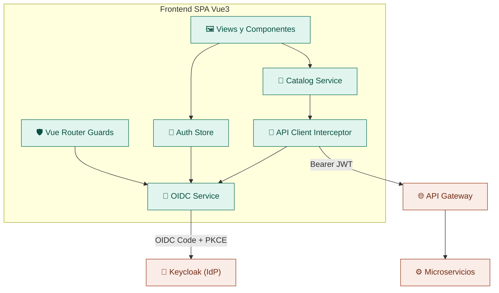


Responsabilidades clave:

- **Router Guards**: bloquean rutas con `requiresAuth` y comprueban `requiredRoles` (p. ej. `ADMIN` en `/admin/*`); consultan **directamente** el servicio OIDC (`getUser`, `signinSilent`, `login`), no el Auth Store.
- **Auth Store / useAuth**: estado reactivo de sesión (`currentUser`, `isAuthenticated`, roles) y listeners de eventos OIDC; lo consumen vistas y shell de navegación, no el guard.
- **OIDC Service** (`authService` en código): login, callback en `/auth/callback`, `signinSilent`, logout y renovación silenciosa automática (`automaticSilentRenew`).
- **Cliente HTTP** (`apiFetch` / `apiFetchBlob` en código): inyecta Bearer en rutas autenticadas; reintenta una vez tras `401` con `signinSilent`; si falla, redirige a login con `returnPath`.

Simplificaciones del diagrama C3 (no aparecen como cajas o flechas):

- **Catalog Service** representa la capa `services/*` (catálogo, media, notificaciones, etc.); el patrón es el mismo en todos.
- **API Client Interceptor** es la lógica de token y reintento en `apiFetch`, no un módulo aparte con ese nombre.
- Rutas **públicas** del contrato OpenAPI usan `publicApiFetch` hacia el gateway **sin** Bearer ni OIDC; el diagrama solo modela el camino autenticado (`Http` → `Oidc`).
- El intercambio de código tras el redirect de Keycloak lo ejecuta la vista `AuthCallbackView`, no el guard ni el store en el primer paso.

#### C4 — Comportamiento (dinámico): secuencia de autenticación y acceso protegido

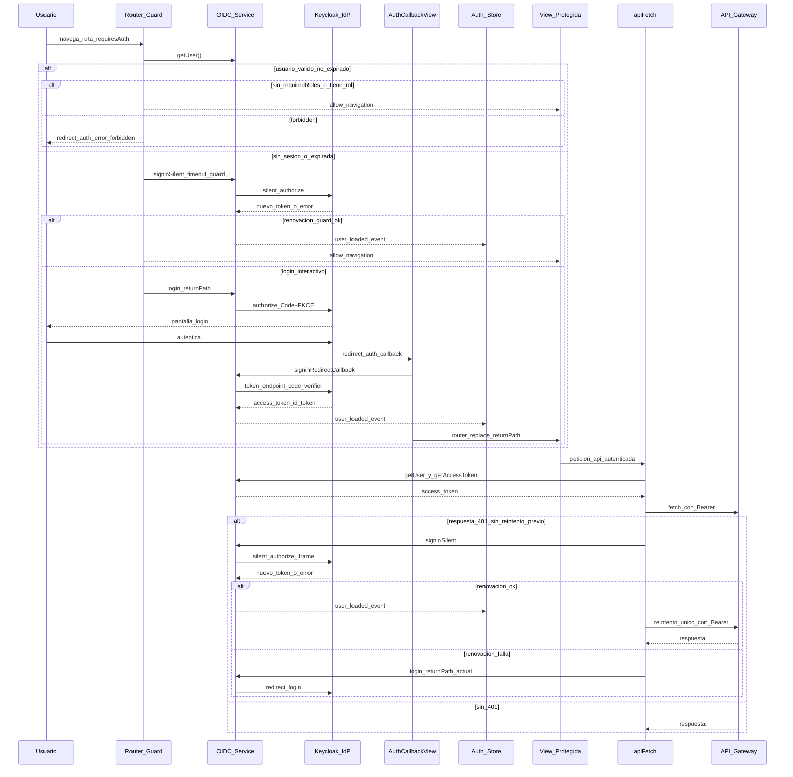

Notas del diagrama C4 (no dibujadas): error al leer sesión en el guard → `/auth/error?reason=session`; renovación proactiva del token (`automaticSilentRenew`) mediante eventos OIDC hacia el Auth Store, además de los `signinSilent` bajo demanda del guard y de `apiFetch`.

</details>

### **3.2.2 Kafka:**

Tras el alta de un ejemplar, el aviso por correo a suscriptores se realiza de forma asincrona (regla **R7**). Tras crear la ficha, **catalog-service** publica un evento en Kafka (`catalog.ejemplar.evento`) y **notification-service** lo recibe para enviar los correos. El formato del mensaje está en [kafka-events.md](docs/events/kafka-events.md).

<details>
<summary><strong>Desplegar</strong> — Diagramas C3/C4 productor/consumidor y secuencias Kafka</summary>

En el **MVP**, Kafka separa el **alta de un árbol** del **correo a suscriptores** (regla **R7**): solo al crear una ficha con éxito; edición y baja no publican. Un topic (`catalog.ejemplar.evento`): **catalog-service** publica y **notification-service** consume. Contrato del mensaje: [docs/events/kafka-events.md](docs/events/kafka-events.md). Nomenclatura técnica: [ADR-0006](docs/adr/0006-ejemplar-aggregate-http-kafka-naming.md). Configuración local: [services/README.md](services/README.md) (Kafka).

#### C3 — Productor: **catalog-service**

Componentes de **catalog-service** frente a PostgreSQL (esquema `catalog`) y **Kafka** (infra compartida, fuera del servicio). El alta depende de la interfaz `EjemplarCreadoEventPublisher`; la publicación real es `KafkaEjemplarCreadoEventPublisher` (capa de infraestructura). Con `mtl.catalog.kafka.enabled=false` (por defecto o tests), `NoOpEjemplarCreadoEventPublisher` no envía mensajes.

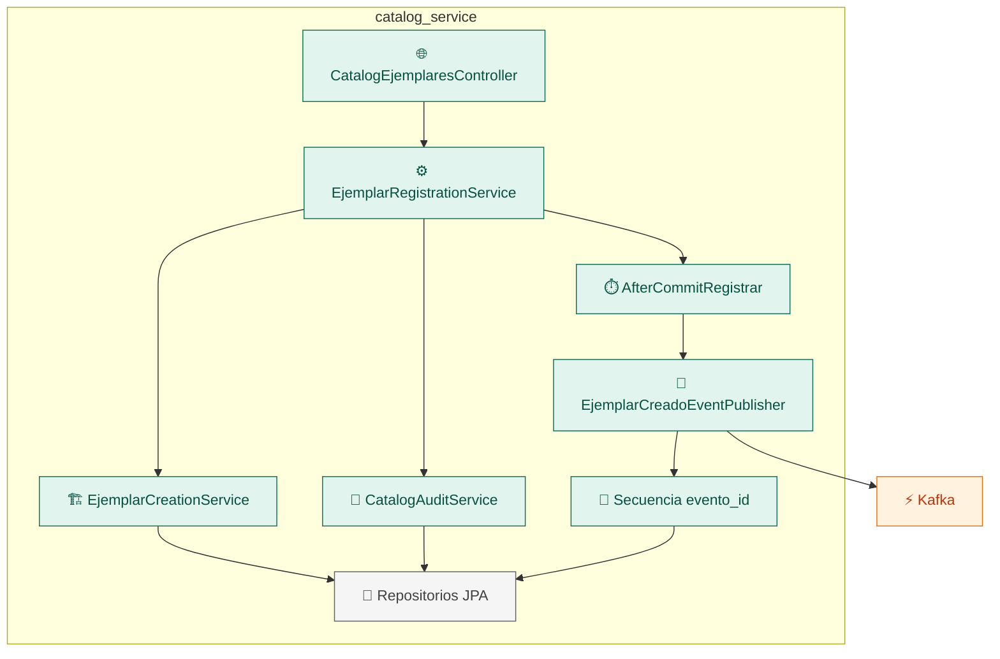

#### C3 — Consumidor: **notification-service**

Componentes de **notification-service** frente a **Kafka** (externo) y PostgreSQL (esquema `notification`). El listener recibe el JSON; la ingestión valida y solo admite `EJEMPLAR_CREADO`; el consumo guarda `evento_catalogo` por `evento_id` (una reentrega no repite el trabajo); el procesador crea notificaciones y envía correo SMTP a suscriptores **ACTIVA**. Con `mtl.notification.kafka.enabled=false` no se arranca el listener.

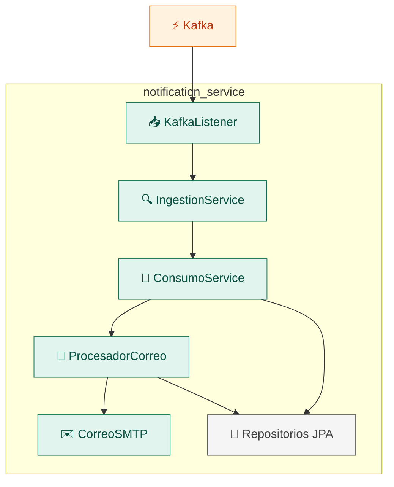

#### Flujo de punta a punta (Alta de ejemplar → correo)

Tras login en Keycloak, la SPA da de alta el árbol por el API Gateway; **catalog-service** persiste la ficha y publica en Kafka; **notification-service** consume y envía correo (SMTP; Mailpit en desarrollo).

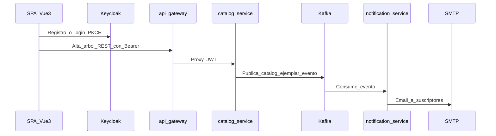

#### C4 — Secuencia de publicación (**EJEMPLAR_CREADO**)

En una transacción se validan y guardan el ejemplar y la auditoría (**R3**); **tras el commit** se asigna `evento_id` y se publica en `catalog.ejemplar.evento` (formato en [kafka-events.md](docs/events/kafka-events.md)). La API responde **201** antes de Kafka; si la publicación falla, solo queda en logs — el consumidor debe ignorar mensajes duplicados (mismo `evento_id`).

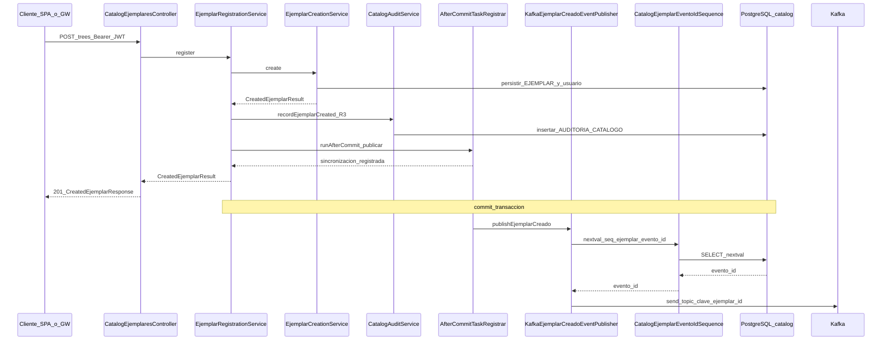

#### C4 — Secuencia de consumo (**EJEMPLAR_CREADO**)

El listener pasa el JSON a la ingestión; solo sigue si `tipo_evento` es `EJEMPLAR_CREADO` ([kafka-events.md](docs/events/kafka-events.md)). La primera vez se inserta `evento_catalogo` por `evento_id`; si ya existe, no se repite. El procesador guarda notificación y envíos en `notification`, manda correo a suscriptores **ACTIVA** y deja el evento en **PROCESADO**.

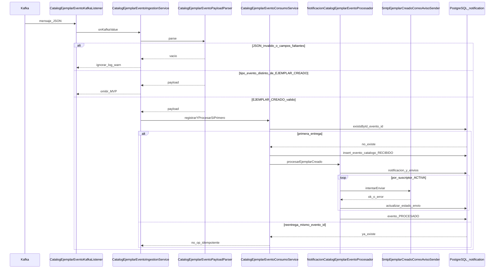

</details>

### **3.2.3 Almacenamiento de fotografías:**

Los archivos binarios (fotografías) se guardan en un almacén compatible con S3 (MinIO en local) y los **datos descriptivos** (árbol, orden, tamaño, etc.) quedan en PostgreSQL, en el esquema `media`. Para subir una imagen, la aplicación pide al backend una URL temporal de subida, envía el fichero directamente al almacén —sin exponer las credenciales del bucket en el navegador— y, al terminar, confirma en la API para registrar la foto en base de datos. Detalle en [media-upload-hu006.md](docs/engineering/media-upload-hu006.md) y [HU-006](docs/backlog/HU-006-fotografias-asociadas-al-arbol.md).

<details>
<summary><strong>Desplegar</strong> — Secuencia presign, subida y confirmación</summary>

Los **binarios** viven en un almacén **S3-compatible** (**MinIO** en desarrollo, **S3** en producción); los **metadatos** (árbol, clave de objeto, orden, foto principal, etc.) en PostgreSQL, esquema **`media`**, gestionados por **media-service** tras el **API Gateway**. La SPA **nunca** recibe credenciales de bucket: tras crear la ficha del árbol en **catalog-service**, por cada imagen pide una **URL prefirmada** (`POST /api/media/uploads/presign`), sube el fichero con **PUT directo** al almacén y **confirma** (`POST /api/media/photos/confirm`) para registrar la fila en `media`; la primera confirmación del árbol queda como **foto principal**. La visibilidad de cada foto **hereda** la de la ficha. Contrato HTTP: [openapi.yaml](docs/api/openapi.yaml); historia y criterios: [HU-006](docs/backlog/HU-006-fotografias-asociadas-al-arbol.md); validaciones, propiedades, principal y EXIF en cliente: [media-upload-hu006.md](docs/engineering/media-upload-hu006.md).

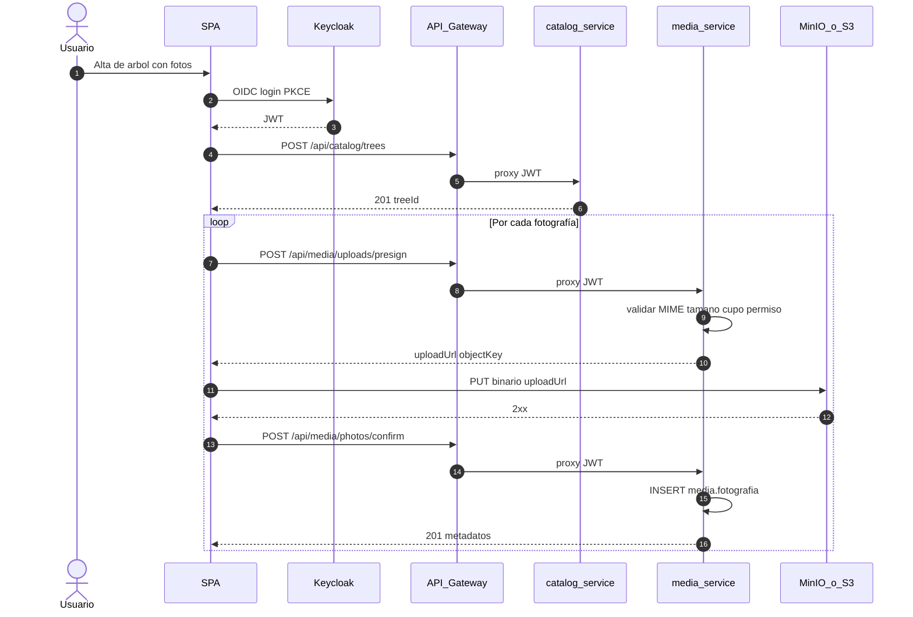

</details>

### **3.2.4 Uso de IA: características de especie (MVP) e identificación/chat (futuro)**

En el MVP solo aplica la consulta de características de especie por **ADMIN** ([HU-016](docs/backlog/HU-016-consulta-admin-caracteristicas-especie-ia.md)); identificación por imagen y chat quedan para próxima versión ([HU-009](docs/backlog/backlog.md), [HU-010](docs/backlog/backlog.md)).

<details>
<summary><strong>Desplegar</strong> — Secuencia de consulta IA (MVP)</summary>

En el MVP solo aplica la consulta de características de especie por **ADMIN** ([HU-016](docs/backlog/HU-016-consulta-admin-caracteristicas-especie-ia.md)); identificación por imagen y chat: [HU-009](docs/backlog/backlog.md) y [HU-010](docs/backlog/backlog.md) (próxima versión). Detalle de historias: [backlog](docs/backlog/backlog.md) §3.

**Flujo de consulta IA (MVP; orquestación en la SPA — sin llamadas ai-assistant-service → catalog-service):**

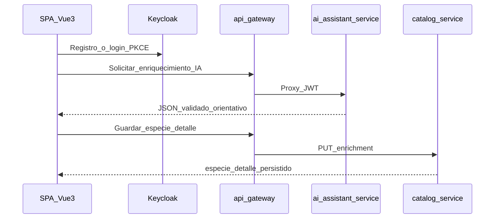


</details>

### **3.3. Descripción de alto nivel del proyecto y estructura de ficheros**

Estructura de repositorio (monorepo):

```
proyecto/
├── frontend/                 # SPA Vue 3 (Vite)
├── e2e/                      # E2E UI (Playwright); ver `docs/engineering/testing-e2e.md`
├── services/                 # Gateway + microservicios Spring Boot (un directorio por despliegue)
│   ├── api-gateway/
│   ├── catalog-service/
│   ├── media-service/
│   ├── notification-service/
│   ├── ai-assistant-service/
│   └── system-e2e-tests/     # IT E2E HTTP contra el API Gateway (JWT real; ver README del módulo)
├── platform/
│   └── observability/        # Configuración de telemetría/trazas/logs (OTel, Prometheus, Grafana…)
├── infra/                    # Orquestación local y nube
│   ├── compose/              # Docker Compose (infra de apoyo); ver README.md en esa carpeta
│   └── k8s/                  # Manifiestos / Helm (según despliegue)
├── docs/
│   ├── adr/                  # Architecture Decision Records
│   ├── api/                  # OpenAPI (contrato del gateway)
│   ├── backlog/              # Historias y desgloses de tickets (HU-*)
│   ├── data-model/           # Modelo de datos (reglas, Mongo, readme §4)
│   ├── engineering/          # Guías: tests Java/Maven (`testing-java.md`), Flyway local (`flyway-dev-reset.md`), mapa canónico (`canonical-sources.md`)
│   ├── events/               # Contrato de eventos Kafka
│   ├── onboarding/           # Inicio rápido, ramas Git, guías Vue y diseño frontend
│   ├── security/             # JWT, gateway, estrategia de validación
│   ├── software-revisions/   # Revisiones y auditorías del proyecto
│   └── use-cases/            # Casos de uso
├── scripts/                  # Atajos PowerShell locales (`dev/`); ver README.md
├── .cursor/
│   ├── commands/             # Commands Cursor
│   ├── rules/                # Reglas Cursor (API, Spring, seguridad…)
│   └── skills/               # Skills de encargo, refinamiento HU, BD…
├── .github/                  # Plantillas de pull request
└── readme.md
```

### **3.4. Infraestructura y despliegue**

**Desarrollo:** Docker Compose (o equivalente) con **un** PostgreSQL (cuatro esquemas de aplicación: `catalog`, `media`, `notification`, `ai`), MongoDB, Redis, MinIO, Kafka, Keycloak, **Mailpit** (SMTP de prueba para notificaciones en local), **Prometheus** (`prom/prometheus:v3.2.1`) y **Grafana** (`grafana/grafana:11.5.2`) para métricas y dashboards ([ADR-0005](docs/adr/0005-microservices-observability-spring-boot.md)); los microservicios Spring Boot suelen ejecutarse en el **host** (puertos 8080–8084) para que Prometheus haga scrape vía `host.docker.internal`, o como contenedores si se adaptan los targets.

Detalle de servicios, puertos y arranque en Compose: [infra/compose/README.md](infra/compose/README.md).

**Despliegue Producción:** orquestación (Kubernetes), secretos externos, Keycloak y Kafka en HA según entorno, bases de datos gestionadas y almacenamiento de objetos S3 en nube.

**Decisiones documentadas:** el descubrimiento de servicios y configuración de los microservicios se hace **sin Eureka ni Spring Cloud Config** (asumidas por Compose/Kubernetes) — [ADR-0001](docs/adr/0001-discovery-y-configuracion-por-orquestador.md).

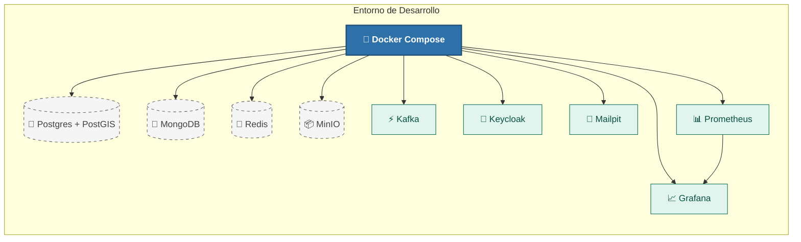


### **3.5. Seguridad**


| Práctica                  | Descripción                                                                                                                                                                             |
| ------------------------- | --------------------------------------------------------------------------------------------------------------------------------------------------------------------------------------- |
| Autenticación OIDC        | Keycloak como IdP; SPA con **Authorization Code + PKCE**; JWT firmados; `issuer-uri` alineado con el realm                                                                              |
| Autorización              | Roles de realm `COLABORADOR` y `ADMIN`; políticas en recursos sensibles                                                                                                                 |
| Gateway                   | Validación de JWT en el gateway (`spring-boot-starter-oauth2-resource-server`); rutas públicas según OpenAPI; **correlación** `X-Correlation-Id` (gateway → microservicios, Problem y MDC) |
| Almacenamiento de objetos | Buckets privados; **URLs prefirmadas** de corta duración; sin credenciales en el cliente                                                                                                |
| Transporte                | TLS en producción; CORS restringido al origen del SPA                                                                                                                                   |
| Observabilidad            | Actuator + Prometheus scrape + Grafana ([platform/observability/README.md](platform/observability/README.md)) |


**Implementación y normativa:** [docs/security/jwt-gateway-strategy.md](docs/security/jwt-gateway-strategy.md) · `.cursor/rules/api-security.mdc` · [docs/api/openapi.yaml](docs/api/openapi.yaml) · Keycloak: [infra/compose/README.md](infra/compose/README.md).

### **3.6. Tests**

**Test unitarios** — lógica aislada, sin dependencias externas.
- **Frontend (Vitest):** composables y componentes con lógica relevante.
- **Backend (JUnit):** servicios de dominio y reglas de negocio.

**Test de integración** — capas reales contra dependencias gestionadas.
- **Frontend:** componentes y vistas con stores/servicios mockeados o reales.
- **Backend:** repositorios y endpoints por capa (Testcontainers: PostGIS/Mongo/Kafka).

**Test E2E en tres niveles:**
- **Contenedores de prueba (manual):** stack efímero autocontenido en Docker, lanzado bajo demanda por el coste de levantar contenedores en cada PR.
- **Docker Compose (entorno levantado):**
  - **UI front + back (Playwright):** flujo de usuario completo por el navegador.
  - **REST del back (`system-e2e-tests`):** contrato HTTP/JWT por el gateway, sin navegador.

**Documentación:** [testing-frontend.md](docs/engineering/testing-frontend.md) · [testing-java.md](docs/engineering/testing-java.md) · [testing-e2e.md](docs/engineering/testing-e2e.md) · módulos [system-e2e-tests](services/system-e2e-tests/README.md) · [e2e/](e2e/README.md).

*Atajos locales (PowerShell):* `scripts/dev/test-backend.ps1`, `test-frontend.ps1` y `test-e2e.ps1` — [scripts/README.md](scripts/README.md). Infra local con **Docker Compose**: §3.4.

---

## 4. Modelo de datos

**NOTA:** El idioma en el que se ha realizado el modelo de datos es intencionadamente **el idioma del dominio de negocio** que en este caso es el español. La justificación es que en proyectos que no son internacionales, tiene sentido modelar en un idioma y la jerga del cliente. Esta decisión presenta un reto de coherencia y definición del idioma aplicable a cada capa del sistema.

**Documentación relacionada:** [Notas de negocio y reglas](docs/data-model/data-model.md) · [Modelo técnico MongoDB (colecciones, validación, índices)](docs/data-model/mongo.md) · [Eventos Kafka](docs/events/kafka-events.md)

En esta sección:

- [4.1 Modelo lógico del sistema completo](#41-modelo-lógico-del-sistema-completo)
- [4.2 Diagrama de persistencia (implementación)](#42-diagrama-de-persistencia-implementación)
- [4.3 Descripción de entidades principales](#43-descripción-de-entidades-principales-orientación-física)

### **4.1. Modelo lógico del sistema completo**

Vista unificada de las entidades principales del sistema y sus relaciones, independientemente del almacén o microservicio (§4.2). Las referencias entre dominios se expresan como **FK lógicas** sin una implementación de una restricción física real entre los distintos esquemas.

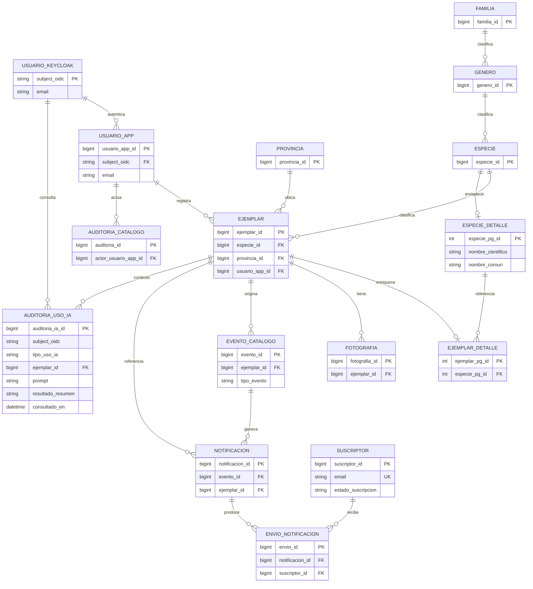

### **4.2. Diagrama de persistencia (implementación)**

**Leyenda:** 
- `PK` = clave primaria; `FK` = clave foránea de negocio; `UK` = unicidad. 
- `creado_por` / `modificado_por` = campos usados para auditoría (sin sufijo `FK`). 
- Tipos PostgreSQL (`bigint`, `varchar`, `text`, `timestamptz`, `numeric`, `integer`, …).

Desglose de §4.1 por almacén: un **PostgreSQL** con esquemas `catalog`, `media`, `notification` y `ai`, más **MongoDB** de enriquecimiento. Reglas de negocio: [data-model.md](docs/data-model/data-model.md).

En esta subsección:

- [4.2.1 PostgreSQL — catalog_service](#421-postgresql-catalog_service)
- [4.2.2 MongoDB — enriquecimiento](#422-mongodb-catalog-service-modelo-en-mongomd)
- [4.2.3 PostgreSQL — media_service](#423-postgresql-media_service)
- [4.2.4 PostgreSQL — notification_service](#424-postgresql-notification_service)
- [4.2.5 PostgreSQL — ai_assistant_service](#425-postgresql-ai_assistant_service-esquema-ai)

#### **4.2.1 PostgreSQL: catalog_service:**

Esquema con los datos generales de cada árbol y auditoria del usuario que los registró.

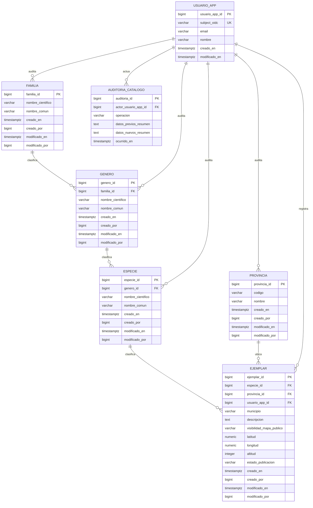

Para el alta de ejemplar, los valores admitidos son:

- `estado_publicacion`: `BORRADOR` o `PUBLICADO`.
- `visibilidad_mapa_publico`: `PRIVADO` o `PUBLICO`.

#### **4.2.2 MongoDB (catalog-service; modelo en mongo.md)**

Almacén de **enriquecimiento** (*system of enrichment*): no sustituye a PostgreSQL. Dos colecciones principales — `especie_detalle` (datos ampliados de especie, p. ej. vía LLM en **HU-016**) y `ejemplar_detalle` (medidas, etiquetas y observaciones del ejemplar; `ejemplar_pg_id` = `catalog.ejemplar.ejemplar_id`). Desnormalización controlada de nombres de especie para búsqueda sin join obligatorio con SQL. Diseño, índices y validación: [mongo.md](docs/data-model/mongo.md). Implementado en **catalog-service** y consumido desde el **frontend** (**HU-015**, **Cerrada**).

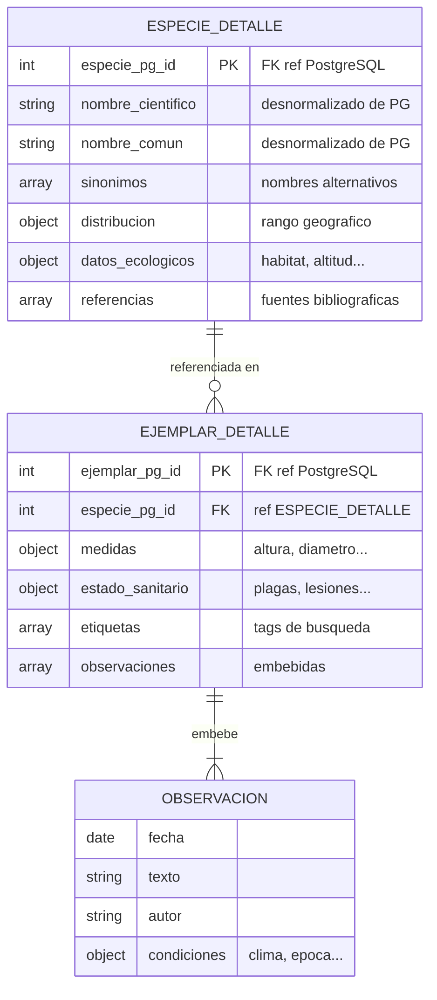

#### **4.2.3 PostgreSQL media_service:**

Metadatos de fotografías en esquema `media`. `ejemplar_id` referencia lógicamente a `catalog.ejemplar` (sin FK entre esquemas).

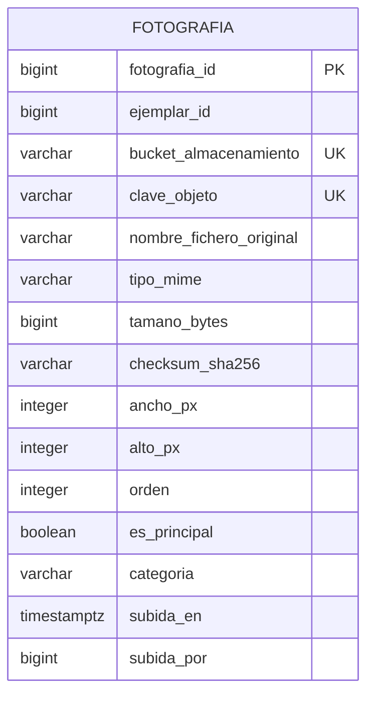

#### **4.2.4 PostgreSQL notification_service:**

Avisos de nuevas altas en el sistema a los suscriptores.

```mermaid
erDiagram
    %% UK email normalizado uq_suscriptor_email_normalizado lower(trim(email))
    SUSCRIPTOR {
        bigint suscriptor_id PK
        varchar email UK
        varchar estado_suscripcion
        timestamptz alta_en
        timestamptz confirmado_en
        timestamptz baja_en
    }
    EVENTO_CATALOGO {
        bigint evento_id PK
        varchar tipo_evento
        bigint ejemplar_id
        text carga_evento_json
        varchar estado_procesamiento
        timestamptz recibido_en
        timestamptz procesado_en
    }
    NOTIFICACION {
        bigint notificacion_id PK
        bigint evento_id FK
        bigint ejemplar_id
        varchar tipo_evento_catalogo
        varchar estado_generacion
        timestamptz generada_en
    }
    ENVIO_NOTIFICACION {
        bigint envio_id PK
        bigint notificacion_id FK
        bigint suscriptor_id FK
        varchar estado_envio
        varchar mensaje_error
        timestamptz generada_en
        timestamptz enviada_en
    }
    EVENTO_CATALOGO ||--o{ NOTIFICACION : genera
    NOTIFICACION ||--o{ ENVIO_NOTIFICACION : produce
    SUSCRIPTOR ||--o{ ENVIO_NOTIFICACION : recibe
```

#### **4.2.5 PostgreSQL ai_assistant_service (esquema `ai`):**

Modelo objetivo de **AUDITORIA_USO_IA** (esquema `ai` inicializado; tabla pendiente de migración Flyway). **`subject_oidc`** persiste el claim `sub` del JWT (Keycloak) en el momento de la consulta; **`ejemplar_id`** referencia lógicamente a `catalog.ejemplar`. Sin FK entre esquemas ni dependencia de `catalog.usuario_app`: la trazabilidad del actor se toma directamente del token. Coherente con §4.1 y R3.

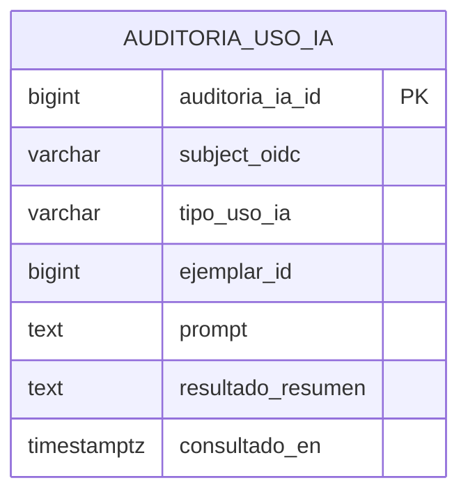

### **4.3. Descripción de entidades principales (orientación física)**

Un **PostgreSQL** con cuatro esquemas de aplicación y **MongoDB** de enriquecimiento (colecciones en [mongo.md](docs/data-model/mongo.md)); acceso desde **catalog-service** (**HU-015**). El flujo **HU-016** persiste `especie_detalle` vía SPA → **catalog-service** (orquestación en cliente; **ai-assistant-service** valida JSON LLM).

**Usuario de aplicación:** La auditoría de la aplicación se implementa en torno al usuario proporcionado por el token generado por Keycloak como proveedor OIDC. Para evitar duplicidades los diversos esquemas almacenan el identificador estable del proveedor (`sub`) que se guarda en el campo **`subject_oidc`**. En el caso de catalog-service este campo se guarda en una tabla USUARIO_APP con unicidad, no como clave primaria; esto permite trazabilidad sin duplicar la información; las FK de los campos de auditoría `creado_por` y `modificado_por` referencian a la clave primaria de esta tabla.

---

## 5. Especificación de la API

El contrato HTTP del proyecto está en [docs/api/openapi.yaml](docs/api/openapi.yaml) (OpenAPI 3). Desde el cliente se accede a los microservicios a través del API Gateway, con rutas agrupadas en `/api/catalog`, `/api/media`, `/api/notifications` y `/api/ai`. Donde hace falta autenticación, la API exige un JWT válido. Los listados son paginados (`page`, `size`) y las respuestas de error siguen el formato **RFC 9457** (`application/problem+json`).

Para que todas las APIs sigan el mismo criterio, el proyecto define reglas de desarrollo en Cursor. [api-contract.mdc](.cursor/rules/api-contract.mdc) fija el contrato HTTP y su alineación con OpenAPI. [api-design.mdc](.cursor/rules/api-design.mdc) recoge convenciones de rutas, DTOs y respuestas. [api-security.mdc](.cursor/rules/api-security.mdc) describe autenticación JWT y control de acceso.

En base de datos, API, código y documentación no se usan los mismos nombres en todas las capas: la guía completa está en [naming-conventions.md](docs/engineering/naming-conventions.md). La API HTTP se expone en inglés y la persistencia se modela en español; la justificación está en [ADR-0007](docs/adr/0007-english-http-spanish-persistence.md). Para la ficha de árbol, el término de dominio *ejemplar* y su traducción a rutas y eventos se fijan en [ADR-0006](docs/adr/0006-ejemplar-aggregate-http-kafka-naming.md).

Además de la API REST, algunos flujos usan mensajes en Kafka. Hoy el caso principal es el aviso por correo cuando un colaborador da de alta un ejemplar: **catalog-service** publica un evento y **notification-service** lo consume. El formato del topic, el payload y las reglas de publicación están en [kafka-events.md](docs/events/kafka-events.md).

---

## 6. Historias de usuario

A partir del modelo de análisis (actores, casos de uso, diagrama PlantUML) y de la definición del producto en este archivo, se ha generado el backlog de historias de usuario a implementar.

| Documento | Contenido |
|-----------|-----------|
| [backlog.md](docs/backlog/backlog.md)| Historias de usuario |
| [backlog/README.md](docs/backlog/README.md) | Convención de desgloses y sincronización |

La definición y refinamiento de cada una de las historias de usuario incluidas en el backlog, y sus correspondientes tickets de trabajo, se ha realizado mediante los siguientes prompts genéricos que se han guardado como skills de Cursor: `.cursor/skills/hu-refinement-mtl/SKILL.md` (generación/refinamiento de historias) y `.cursor/skills/hu-breakdown-mtl/SKILL.md` (desglose en tickets). Estos prompts generan el correspondiente archivo dentro de la carpeta backlog.

El proceso seguido es:
- 1.- Generación de la Historia de Usuario a partir del backlog con `hu-refinement-mtl/SKILL.md`
- 2.- Análisis del documento generado
- 3.- Aclaración, definición y/o corrección de los puntos detectados en los apartados de Riesgos y Aclaraciones pendientes (refinamiento)
- 4.- Generación de los tickets de trabajo con `hu-breakdown-mtl/SKILL.md`

Por operativa práctica, al comienzo de la historia se hacen unas comprobaciones iniciales que permiten detectar historias incompletas o mal formadas.

> El diálogo de refinamiento de HU-008 (evidencia del curso) está en el bloque **Desplegar** siguiente.

<details>
<summary><strong>Desplegar</strong> — Ejemplo histórico HU-008 (prompts de refinamiento)</summary>

> *Registro histórico:* los prompts siguientes reproducen el diálogo de refinamiento de HU-008 tal como ocurrió; pueden reflejar decisiones intermedias que no coinciden con el diseño final. Fuente de verdad: [HU-008-edicion-de-mis-arboles.md](docs/backlog/HU-008-edicion-de-mis-arboles.md) y [HU-008-ticket-breakdown.md](docs/backlog/HU-008-ticket-breakdown.md).

**Ejemplo del proceso: Historia de Usuario — HU-008 (Edición y baja de mis árboles)**

**Prompt 1:**

Vamos a desarrollar la historia HU-008@.cursor/skills/hu-refinement-mtl

**Prompt 2:**

Vamos a revisar los puntos que quedan fuera de la historia. 
- 1.- Añade en HU-006 el ticket para incluir la posibilidad de añadir y borrar fotografías desde la pantalla de edición de Mis árboles 
- 2.- Incluye en el Backlog una nueva historia para abordar Proyección o enriquecimiento Mongo 3.- Incluye en la historia que estamos abordando la posibilidad de borrar árboles

**Prompt 3:**

El borrado será físico; cuando se borre un árbol se deben eliminar sus fotografías y su ampliación en Mongo; dado que aún no tenemos implementado en Mongo se necesitará un ticket solo para implementar esta acción que por ahora quedará como pendiente. Revisa si con estas aclaraciones podemos cerrar este punto y abordar los dos siguientes que serán Riesgos y Aclaraciones pendientes

**Prompt 4:**

Respecto al riesgo de Listado sin filtros vamos a añadir en la historia el filtro por especie y por fecha de creación: desde - hasta. Para el borrado de todas las fotos de un árbol vamos a incluir un nuevo endpoint en media-service que será consumido por el microservicio de catálogo; déjalo anotado en esta historia como ticket que debe modificar los dos microservicios. Ante un fallo parcial del borrado en cascada se producirá un Rollback (no se usará un patrón sagas en el MVP). Dime si queda algo pendiente antes de abordar el desglose de la historia en ticket, no abordes este desglose hasta que yo te lo diga

**Prompt 5:**

- 1.- Path de borrado: `DELETE /api/media/trees/{treeId}/photos` 
- 2.- Si un ejemplar tiene fotografías primero se invoca al servicio de borrado de todas las fotografías; si el servicio da error se para el proceso; si se han borrado todas las fotografías se elimina el ejemplar en PostgreSQL 3.- Fechas en formato date a ser posible en UTC 4.- Para ADMIN se añade un filtro más para poder seleccionar los ejemplares dados de alta por un usuario determinado

</details>


---

## 7. Tickets de trabajo

Como se ha comentado en el punto anterior, para mantener formato homogéneo se usa un prompt genérico que se ha almacenado como skill `.cursor/skills/hu-breakdown-mtl/SKILL.md` (desglose en tickets). Este prompt genera el correspondiente archivo md dentro de la carpeta backlog.

En la generación de tickets de trabajo se incluye explícitamente una sección con las reglas de Cursor que debe aplicar el agente de IA al implementarlos.

> El desglose en tickets de HU-008 (evidencia del curso) está en el bloque **Desplegar** siguiente.

<details>
<summary><strong>Desplegar</strong> — Ejemplo histórico HU-008 (prompts de desglose en tickets)</summary>

> *Registro histórico:* los prompts siguientes documentan el desglose de HU-008 en su momento; el contenido puede no reflejar el breakdown final ([HU-008-ticket-breakdown.md](docs/backlog/HU-008-ticket-breakdown.md)).

**Ejemplo del proceso: Ticket 1 — HU-008**

**Prompt 1:**

Vamos a generar los tickets de la historia; a partir de aquí incluye mis prompts, utiliza la información que tienes en el contexto y a partir de la sección **Ejemplo del proceso: Ticket 1 — HU-008** (§7) solo incluye mi parte, no tu respuesta al prompt. Usa la información que hemos definido y /hu-breakdown-mtl HU-008

**Prompt 2:**

Vamos con TASK-HU-008-01, Cierre OpenAPI catálogo y media (HU-008). Además de las operaciones que propone el ticket vamos a incluir además del endpoint de borrado de todas las fotografías el endpoint del borrado de una fotografía (va también dentro de /api/media)

**Prompt 3** (TASK-HU-008-02 — Listado colaborador con filtros)

así está bien, implementa el endpoint del Listado de TASK-HU-008-02, si tienes alguna duda preguntame antes; recuerda las reglas que se deben seguir ya indicadas en @docs/backlog/HU-008-ticket-breakdown.md para la parte back

</details>


---

## 8. Pull requests

Para el trabajo con GitHub se ha definido una estrategia sencilla de ramas — detalle en [docs/onboarding/github-branching.md](docs/onboarding/github-branching.md).

Las pull requests usan la plantilla [`.github/pull_request_template.md`](.github/pull_request_template.md) (GitHub la inserta al crear el PR).
En cada PR, **GitHub Actions** ejecuta en paralelo tests Java (`mvn test`), calidad frontend (`lint`, `typecheck`, Vitest) y escaneo de secretos (Gitleaks) — workflow [`.github/workflows/ci.yml`](.github/workflows/ci.yml); E2E Playwright y auditoría de dependencias son **manuales** ([docs/engineering/devsecops-ci.md](docs/engineering/devsecops-ci.md)).  

> *Registro histórico:* los ejemplos de pull request siguientes muestran cómo se documentó el trabajo en su momento (resumen, plan de pruebas, notas técnicas). Pueden no coincidir con el diseño final ni con la plantilla o CI actuales; norma vigente en [github-branching.md](docs/onboarding/github-branching.md) y [devsecops-ci.md](docs/engineering/devsecops-ci.md). **Clic en Desplegar** para ver cada PR de ejemplo.

<details>
<summary><strong>Desplegar</strong> — Pull Request 1 (histórico — HU-004)</summary>

### Resumen

Implementa la **HU-004**: alta de suscripción por correo sin cuenta de colaborador, con API en **notification-service**, exposición vía **gateway**, contrato en **OpenAPI**, pantalla y flujo en **frontend** (formulario, validación, i18n, tests), y documentación de backlog / modelo de datos / onboarding Git.

### Cambios principales

- **Backend (`notification-service`)**: registro de suscriptores, tabla `suscriptor` en Flyway `V1__baseline.sql`, seguridad Keycloak, controlador REST de altas públicas, manejo de errores tipo Problem Details, tests (servicio + WebMvc).
- **Gateway**: filtro global ante errores de conexión a downstream y utilidades asociadas (con tests).
- **Frontend**: vista `SubscribeByEmailView`, composable `usePublicSubscriptionForm`, servicio `publicSubscription`, ampliación de `apiClient` (p. ej. cuerpo sin JSON / conflictos), iconos y tiles del home, hero visitante con ilustración `tree_map_illustration_clean.svg`, estilos e i18n (`es.ts`), rutas y tests (Vitest).
- **Contrato y configuración**: `docs/api/openapi.yaml`, `frontend/.env.example` y README donde aplique.
- **Documentación**: HU-004 en backlog (historia + desglose de tickets), actualización de `backlog.md`, `data-model.md`, guía de ramas GitHub, revisión de enlaces a reglas (`frontend-vue3.mdc`, etc.).

### Cómo probar (orientativo)

1. **Backend**: arrancar stack local según `services/README.md`; verificar migración y endpoint de alta de suscripción público según OpenAPI.
2. **Frontend**: `npm run build` / tests en `frontend/`; flujo manual en `/subscriptions/new` con correo válido y casos de error (409/conflicto si aplica).
3. **Gateway**: comprobar que las peticiones al notification-service y respuestas de error se propagan de forma coherente.

### Referencias

- Historia / desglose: `docs/backlog/HU-004-suscripcion-por-correo-sin-cuenta-colaborador.md`, `docs/backlog/HU-004-ticket-breakdown.md`

### Notas

- Renombrado de regla Cursor `fronted-vue3.mdc` → `frontend-vue3.mdc` y actualización de enlaces en docs y `AGENTS.md`.
- Commit: `a0ba685` — *Implementación HU-004 Alta suscripción*.

</details>

<details>
<summary><strong>Desplegar</strong> — Pull Request 2 (histórico — HU-008)</summary>

### Resumen

Cierra **HU-008** (UC-04): el colaborador puede **listar y filtrar** sus fichas, **editarlas** (`PUT`) y **eliminarlas** (`DELETE`) con cascada en media; **ADMIN** opera sobre cualquier ficha. Incluye galería en edición (**HU-006-14**) y cierre documental de la historia.

- Vertical completo: **catalog-service** + **media-service** + **frontend** (`/mis-ejemplares`, `/ejemplares/:id/edit`). Rutas y API actualizadas según [ADR-0006](docs/adr/0006-ejemplar-aggregate-http-kafka-naming.md).
- Sin notificación ni Kafka en edición/baja (**R7**).

### Alcance

- [x] Frontend
- [x] Backend
- [ ] Infraestructura
- [x] Documentación

### Cambios realizados

**Backend — catalog-service**
- `GET /api/catalog/trees` (filtros, paginación, scope COLABORADOR/ADMIN).
- `GET` / `PUT` / `DELETE` `/api/catalog/trees/{treeId}`.
- Orquestación de baja: media → SQL → hook Mongo (`MongoEjemplarEnrichmentDeletionPort` con **HU-015**; no-op si Mongo desactivado).
- Cliente `RestMediaEjemplarPhotosClient` (`mtl.media.base-url`).
- Auditoría R3, `JwtRealmRoles`, materialización `usuario_app`.

**Backend — media-service**
- `DELETE /api/media/trees/{treeId}/photos` (borrado masivo).
- `DELETE /api/media/photos/{photoId}` (galería en edición).

**Frontend**
- `MyTreesListView` (`/mis-ejemplares`) con filtros y peticiones cancelables.
- `EditTreeView` + `useEditTreeForm` (`/ejemplares/:id/edit`): PUT, DELETE con confirmación, galería añadir/borrar foto.
- Servicios `collaboratorTreesService`, validación de archivos, `SpeciesAutocompleteInput`.

**Contrato y docs**
- [docs/api/openapi.yaml](docs/api/openapi.yaml) actualizado.
- HU-008 **cerrada** en backlog, historia, tickets, UC-04, [readme.md](readme.md), [services/README.md](services/README.md), checklist E2E en [frontend/README.md](frontend/README.md).
- **TASK-HU-008-11** (IT catalog↔media): **rechazado**; cobertura con tests unitarios/WebMvc + manual.

### Evidencias (opcional)

- _(Añadir capturas de Mis árboles, edición y diálogo de baja si el revisor lo pide.)_

### Plan de pruebas

- [ ] `frontend`: `npm run build`
- [ ] `frontend`: `npm run test`
- [ ] `services`: `mvn -f services/pom.xml -pl catalog-service,media-service test`
- [ ] Prueba manual en local ([frontend/README.md](frontend/README.md) § HU-008): listado/filtros, PUT, galería, DELETE con/sin fotos, media caído → árbol no borrado

### Checklist único de calidad (front/back)

- [x] No se rompe lógica de negocio ni navegación existente
- [x] Se mantienen nombres claros y responsabilidad única
- [x] No se introduce duplicación innecesaria (roles JWT centralizados en `JwtRealmRoles`)
- [x] Manejo básico de errores revisado (ProblemDetail, 403/404/502)
- [x] Tests añadidos/actualizados según impacto del cambio
- [x] Contratos y compatibilidad revisados (OpenAPI alineado)
- [x] Seguridad revisada (JWT, propiedad de ficha, relay a media)
- [x] **Frontend:** textos en `i18n`, flujos con confirmación en baja/borrado de foto
- [x] **Backend:** validaciones R1/R2, auditoría, tests por capa

### Riesgos / impacto

- **Riesgo:** borrado distribuido sin **rollback compensatorio** si falla SQL tras borrar fotos en media.
- **Mitigación:** documentado en HU-008 y `services/README.md`; aborto si falla media **antes** del SQL; mejora futura sin saga.

- **Riesgo:** borrado Mongo omitido si `mtl.catalog.mongo.enabled=false` (perfil test o Mongo caído tras SQL).
- **Mitigación:** activar Mongo en `dev`/`prod`; ver **HU-015** y `services/README.md` § HU-015.

- **Riesgo:** requiere **catalog** (8081) y **media** (8082) en `dev` para DELETE con fotos.
- **Mitigación:** `mtl.media.base-url` en `application-dev.properties`; checklist E2E documentada.

### Notas para review

- Revisar orden de cascada en `TreeDeletionService` (media → `commitPhysicalDelete`).
- Confirmar que **PUT**/**DELETE** no publican en Kafka (solo alta).
- **TASK-HU-008-11** rechazado a propósito; no esperar IT Failsafe catalog↔media en este PR.
- Rama: `feature/actualizacion` → `main`.

</details>

