## Índice

1. 📋 [Ficha del proyecto](#1-ficha-del-proyecto)
2. 🌳 [Descripción general del producto](#2-descripción-general-del-producto)
3. 🏗️ [Arquitectura del sistema](#3-arquitectura-del-sistema)
4. 🛢️ [Modelo de datos](#4-modelo-de-datos)
5. 🔌 [Especificación de la API](#5-especificación-de-la-api)
6. 📖 [Historias de usuario](#6-historias-de-usuario)
7. 🎫 [Tickets de trabajo](#7-tickets-de-trabajo)
8. 🔀 [Pull requests](#8-pull-requests)

---

## 1. 📋 Ficha del proyecto

### **1.1. Alumno**

Luís María de Frutos Redondo.

### **1.2. Proyecto**

MyTreeLibrary.

### **1.3. Descripción breve**

MyTreeLibrary es una plataforma colaborativa que permite registrar árboles singulares mediante fotografías, ubicación y otros datos de interés, así como consultarlos públicamente. En el MVP, los usuarios con rol de administrador pueden recurrir a la inteligencia artificial para consultar las características de una especie, mientras que colaboradores y administradores disponen de un chat asistido durante la edición de las fichas.

### **1.4. Repositorio**

[github.com/ldefrutos1/AI4Devs-finalproject](https://github.com/ldefrutos1/AI4Devs-finalproject)

### **1.5. Video demostrativo**

[Video demostrativo](https://youtu.be/yf7u4BZm4Po)

---

## 2. 🌳 Descripción general del producto

En esta sección:

- [2.1 Objetivo](#21-objetivo)
- [2.2 Características y funcionalidades principales](#22-características-y-funcionalidades-principales)
- [2.3 Diseño y experiencia de usuario](#23-diseño-y-experiencia-de-usuario)
- [2.4 Instalación (entorno de desarrollo)](#24-instrucciones-de-instalación-entorno-de-desarrollo)
- [2.5 Demo del MVP](#25-demo-del-mvp)
- [2.6 Estructura de ficheros](#26-estructura-de-ficheros)

### **2.1. Objetivo**

#### Propósito

Desarrollar una plataforma en microservicios que permita registrar, organizar y consultar fotografías, ubicaciones y datos relevantes de árboles de tu ciudad, facilitando al usuario la creación de una biblioteca personal digital y la posibilidad de compartir esa información de forma pública.

Además del producto, el proyecto tiene un objetivo formativo en el stack tecnológico empleado.

#### Valor aportado (qué soluciona)

La solución combina la catalogación personal con la posibilidad de compartir y crear comunidad en torno a una afición compartida.

#### Destinatarios de la solución

La solución está dirigida a aficionados a la naturaleza en general y puede resultar de especial utilidad para docentes y monitores de tiempo libre.

### **2.2. Características y funcionalidades principales**

#### Registro y publicación de árboles

El sistema permite registrar árboles mediante fichas con información relevante, fotografías y ubicación, posibilitando su publicación para consulta pública. Los usuarios autenticados con perfil de colaborador pueden dar de alta nuevas fichas de ejemplares, así como editar o eliminar los registros creados por ellos mismos. El perfil de administrador puede dar de alta fichas y editar o eliminar cualquier ejemplar del catálogo.

#### Consulta pública y visualización geográfica

El sistema implementa una consulta pública de los árboles publicados mediante listado y detalle. La ficha de detalle muestra las fotografías de cada árbol y su localización en el mapa de forma clara e intuitiva.

#### Notificaciones

La solución ofrece un sistema de notificaciones para comunicar novedades a usuarios suscritos, sin necesidad de que estos dispongan de cuenta en la plataforma.

#### Integración con IA

En el **MVP**, usuarios con rol de administrador pueden consultar las características de una especie; colaboradores y administradores autenticados pueden mantener un chat con el asistente IA desde la edición de un ejemplar; en versiones futuras se incorporará la identificación orientativa por imagen.

### **2.2.1. Diagrama de contexto del sistema (C1)**

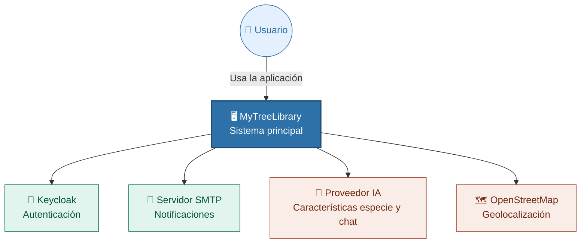
```mermaid
flowchart TB
    classDef user fill:#E5F0FF,stroke:#2D71A8,stroke-width:1px,color:#2D71A8;
    classDef system fill:#2D71A8,stroke:#1E4B73,stroke-width:2px,color:#FFF;
    classDef soporte fill:#E1F5EE,stroke:#0F6E56,stroke-width:1px,color:#085041;
    classDef externo fill:#FAECE7,stroke:#993C1D,stroke-width:1px,color:#712B13;

    U(("👤 Usuario")):::user
    S["🖥️ MyTreeLibrary<br>Sistema principal"]:::system

    KC["🔐 Keycloak<br>Autenticación"]:::soporte
    SMTP["📧 Servidor SMTP<br>Notificaciones"]:::soporte
    PIA["🧠 Proveedor IA<br>Características especie y chat"]:::externo
    MAP["🗺️ OpenStreetMap<br>Geolocalización"]:::externo

    U -->|Usa la aplicación| S
    S --> KC
    S --> SMTP
    S --> PIA
    S --> MAP
```


### **2.2.2. Diagrama de casos de uso del sistema**

A continuación se incluye el diagrama de casos de uso del sistema.


| ID | Nombre | Actor principal |
| --- | --- | --- |
| UC-01 | Consultar árboles publicados y mapa | Público |
| UC-02 | Registrarse para recibir notificaciones | Público |
| UC-03 | Registrar árbol | Colaborador |
| UC-04 | Modificar y eliminar árboles del colaborador | Colaborador |
| UC-05 | Identificar árbol asistido por IA (imagen) | Colaborador |
| UC-06 | Consultar asistente IA (chat) | Colaborador |
| UC-07 | Gestionar maestros taxonómicos | ADMIN |
| UC-08 | Gestionar solicitudes de notificación | ADMIN |
| UC-09 | Notificar por correo a suscriptores | Sistema |
| UC-10 | Consultar asistente IA características especie | ADMIN |

\* UC-05: queda fuera del MVP (**HU-009**).

\* UC-04: **COLABORADOR** solo sobre fichas propias; **ADMIN** sobre **cualquier** ficha.

*El modelo completo se puede consultar en:* [resumen de casos de uso](docs/use-cases/use-case-summary.md) · [modelo PlantUML](docs/use-cases/use-case-model.puml)

### **2.3. Diseño y experiencia de usuario**

El sistema está diseñado para facilitar el alta de ejemplares a partir de fotografías; el usuario selecciona las fotografías que desea subir y la aplicación extrae la ubicación del ejemplar (latitud y longitud) de los metadatos EXIF de la primera fotografía. En caso de que las imágenes no tengan metadatos de ubicación, el usuario puede seleccionar la posición del ejemplar directamente en el mapa (componente OpenStreetMap).


La aplicación implementa una navegación simple por roles con una **página de entrada (Inicio)** adaptada a cada perfil.


### **Navegación de la aplicación**

---

#### 🌐 Público &nbsp;·&nbsp; sin autenticación

```
🏠  Inicio                   /
🌳  Catálogo                 /ejemplares
    └─ Detalle               /ejemplares/:id
✉️  Suscripción             /subscriptions/new
```

---

#### 👤 Colaborador &nbsp;·&nbsp; usuario autenticado

↳ *Incluye todas las páginas públicas*

```
➕  Alta de ejemplar         /ejemplares/new
📋  Mis árboles              /mis-ejemplares
    └─ Edición de ficha      /ejemplares/:id/edit
```

---

#### 🛡️ Admin &nbsp;·&nbsp; privilegios completos

↳ *Incluye todas las páginas de colaborador*

```
🗄️  Maestros                 /admin/masters
👥  Suscripciones            /admin/subscriptions
```

---

### **Resumen de permisos**

| Página | Público | Colaborador | Admin |
|---|:---:|:---:|:---:|
| Inicio `/` | ✅ | ✅ | ✅ |
| Árboles `/ejemplares` | ✅ | ✅ | ✅ |
| Detalle `/ejemplares/:id` | ✅ | ✅ | ✅ |
| Suscripción `/subscriptions/new` | ✅ | ✅ | ✅ |
| Alta de ejemplar `/ejemplares/new` | — | ✅ | ✅ |
| Mis árboles `/mis-ejemplares` | — | ✅ | ✅ |
| Edición de ficha `/ejemplares/:id/edit` | — | ✅ | ✅ |
| Maestros `/admin/masters` | — | — | ✅ |
| Suscripciones `/admin/subscriptions` | — | — | ✅ |

**Inicio**


**Catálogo (/ejemplares)**


**Detalle (/ejemplares/:id)**


**Carrusel de fotografías**


**Administrador**
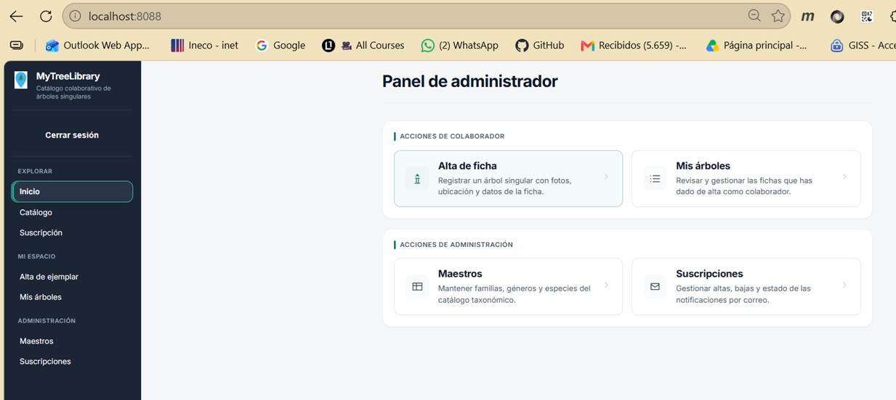

**Edición de datos semiestructurados (Mongo)**
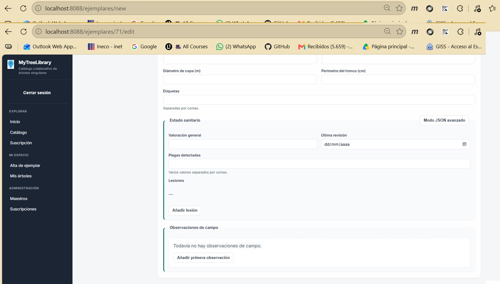

### **2.4. Instrucciones de instalación (entorno de desarrollo)**

1. **Infraestructura:** para poder ejecutar la aplicación en desarrollo se necesita arrancar los contenedores que tienen la infraestructura (PostgreSQL, Mongo, ...), definidos en [infra/compose/docker-compose.yml](infra/compose/docker-compose.yml), siguiendo estos pasos:
- Copiar el archivo de variables de entorno de ejemplo y adaptarlo si fuera necesario: `infra/compose/.env.example` → `infra/compose/.env`.
- Arrancar los contenedores: desde `infra/compose/`, ejecutar:
  ```bash
  docker compose up -d
  ```
2. **Backend:** los servicios de backend se arrancan desde la raíz del repo; hay que abrir **una terminal por microservicio**, con perfil **`dev`** (siempre se debe arrancar **api-gateway** además de los microservicios a probar; se puede consultar qué levantar según el flujo en [local-setup-guide.md](docs/onboarding/local-setup-guide.md#qué-levantar-según-el-flujo)). Ejemplo con api-gateway y catalog-service:
   ```bash
   mvn -f services/pom.xml -pl api-gateway spring-boot:run -Dspring-boot.run.profiles=dev
   mvn -f services/pom.xml -pl catalog-service spring-boot:run -Dspring-boot.run.profiles=dev
   ```
3. **Frontend:** para ejecutar el frontend se deben seguir los siguientes pasos:
- Copiar el archivo de variables de entorno de ejemplo y adaptarlo si fuera necesario: `frontend/.env.example` → `frontend/.env`.
- Arrancar la aplicación: desde `frontend/`, ejecutar:
   ```bash
   npm install
   npm run dev
   ```

Una vez levantados los contenedores de infraestructura y la aplicación (frontend y backend), quedarán disponibles las siguientes URLs:
   - → **UI** de la aplicación: **http://localhost:5173**
   - → **API Gateway**: **http://localhost:8080**
   - → **Microservicios**: **http://localhost:8081-8084**
   - → **Keycloak** consola: **http://localhost:8180/** (usuario: **admin**). En el compose está definido el realm **mtl** con los usuarios **admin_mtl** (roles **ADMIN** y **COLABORADOR**) y **colaborador** (**COLABORADOR**)
   - → **MinIO** consola: **http://localhost:9001/login** (usuario: minio)
   - → **Grafana**: **http://localhost:3000/** (usuario: admin)
   - → **Prometheus**: **http://localhost:9090/targets**
   - → **Mailpit** (correo de prueba): **http://localhost:8025**

El detalle de accesos, puertos y qué servicios levantar por flujo se encuentra en: [local-setup-guide.md](docs/onboarding/local-setup-guide.md#accesos).

Para despliegues en otros entornos ver [§3.3 Infraestructura y despliegue](#33-infraestructura-y-despliegue).

**Compose e infra:** [infra/compose/README.md](infra/compose/README.md).

---

### **2.5. Demo del MVP**

El video del proyecto muestra la siguiente funcionalidad:

| Paso | Qué se muestra |
|------|----------------|
| 1 | Un visitante recorre el catálogo **sin login**: listado, acceso a ficha de detalle y mapa, alta de suscripción |
| 2 | Un **colaborador** inicia sesión (Keycloak) y da de alta un ejemplar en estado publicado |
| 3 | Tras el alta, se muestra en la consola de **Mailpit** el aviso por correo generado con mensajería asíncrona (Kafka) |
| 4 | Se inicia sesión con usuario **ADMIN** accediendo a maestros taxonómicos y a la gestión de suscripciones |
| 5 | Con usuario **ADMIN**, se pide una sugerencia IA de enriquecimiento de especie y se consulta al chat |
| 6 | Con usuario **ADMIN**, se añaden datos semiestructurados que se almacenan en MongoDB |
| 7 | Acceso a las consolas de la infraestructura: Mongo, MinIO, Prometheus y Grafana (acceso al dashboard propio del proyecto) |
| 8 | Ejecución de los test e2e |

[Video demostrativo](https://youtu.be/yf7u4BZm4Po)

---

### **2.6. Estructura de ficheros**

El repositorio del proyecto es un monorepo con la siguiente estructura:

```
proyecto/
├── frontend/                 # Frontend: SPA Vue 3 (Vite)
├── e2e/                      # E2E UI (Playwright); ver `docs/engineering/testing-e2e.md`
├── services/                 # Backend: Gateway + microservicios Spring Boot (un directorio por despliegue)
│   ├── api-gateway/
│   ├── catalog-service/
│   ├── media-service/
│   ├── notification-service/
│   ├── ai-assistant-service/
│   └── system-e2e-tests/     # IT E2E HTTP contra el API Gateway (JWT real; ver README del módulo)
├── platform/
│   └── observability/        # Configuración de telemetría/trazas/logs (Prometheus, Grafana…)
├── infra/                    # Orquestación local y nube
│   ├── compose/              # Docker Compose (infra de apoyo); ver README.md en esa carpeta
│   └── k8s/                  # Manifiestos / Helm (según despliegue)
├── docs/
│   ├── adr/                  # Architecture Decision Records
│   ├── ai-process-evidence/  # Ejemplos del proceso seguido en el desarrollo
│   ├── api/                  # OpenAPI (contrato del gateway)
│   ├── backlog/              # Historias y desgloses de tickets (HU-*)
│   ├── data-model/           # Modelo de datos (reglas, Mongo, readme §4)
│   ├── engineering/          # Guías: tests Java/Maven (`testing-java.md`), Flyway local (`flyway-dev-reset.md`), mapa canónico (`canonical-sources.md`)
│   ├── events/               # Contrato de eventos Kafka
│   ├── onboarding/           # Inicio rápido, ramas Git, guías Vue y diseño frontend
│   ├── security/             # JWT, gateway, estrategia de validación
│   ├── software-revisions/   # Revisiones y auditorías del proyecto
│   └── use-cases/            # Casos de uso
├── scripts/                  # Atajos PowerShell locales (`dev/`); ver scripts/README.md
├── .cursor/
│   ├── commands/             # Commands Cursor
│   ├── rules/                # Reglas Cursor (API, Spring, seguridad…)
│   └── skills/               # Skills de encargo, refinamiento HU, BD…
├── .github/                  # Plantilla PR (pull_request_template.md)
├── AGENTS.md                 # Índice para agentes IA (skills, canónicos, flujo)
└── readme.md
```

---

## 3. 🏗️ Arquitectura del sistema

**NOTA:** La elección de una arquitectura de microservicios en Java con Spring y Vue tiene un **propósito didáctico**, con el fin de aprender estas tecnologías.

En esta sección:

- [3.1 Diagrama de arquitectura](#31-diagrama-de-arquitectura)
- [3.2 Descripción de componentes principales](#32-descripción-de-componentes-principales)
- [3.3 Infraestructura y despliegue](#33-infraestructura-y-despliegue)
- [3.4 Seguridad](#34-seguridad)
- [3.5 Tests](#35-tests)

### **3.1. Diagrama de arquitectura**

La aplicación se desarrolla en microservicios con Spring en la parte de backend y Vue como tecnología frontend.

#### Patrón y Stack tecnológico

- **Arquitectura:** Microservicios 
- **Seguridad:** OIDC y JWT

**Stack tecnológico principal:**

- **Backend:** Spring Boot 4 y Maven
- **Frontend:** Vue 3
- **Identidad:** Keycloak para OIDC y JWT
- **Eventos de dominio:** Kafka
- **Base de datos SQL:** PostgreSQL
- **Base de datos NoSQL:** MongoDB
- **Caché:** Redis
- **Almacenamiento de imágenes:** Compatible S3 (MinIO)
- **Observabilidad:** Prometheus + Grafana + logs JSON; métricas vía Actuator/Micrometer en cada microservicio

**Decisiones documentadas ADR:** el Registro de Decisiones de Arquitectura se encuentra en la carpeta [docs/adr](docs/adr/README.md); caben destacar la decisión de descubrimiento y configuración de microservicios **sin Eureka ni Spring Cloud Config** (las labores son asumidas por Compose/Kubernetes) — [ADR-0001](docs/adr/0001-discovery-y-configuracion-por-orquestador.md) y la implementación de **observabilidad** ([ADR-0005](docs/adr/0005-microservices-observability-spring-boot.md)).


#### C2 — Diagrama de contenedores (nivel 2)

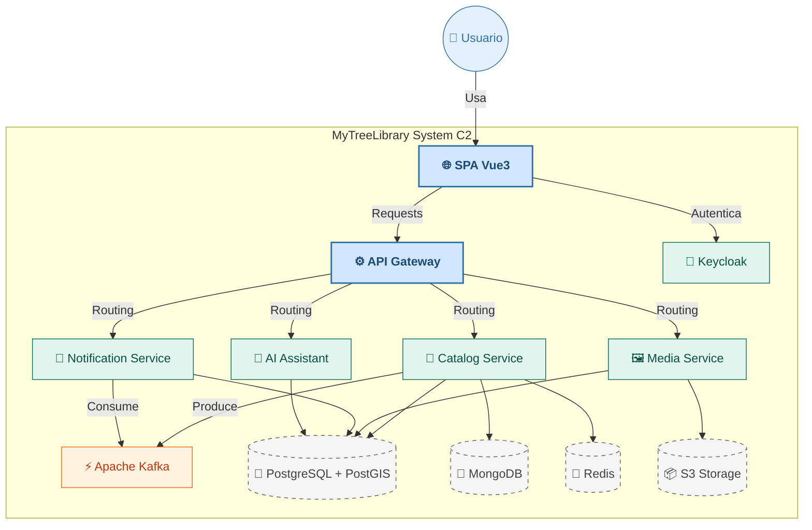
```mermaid
flowchart TB
    %% --- Estilos ---
    classDef user fill:#E5F0FF,stroke:#2D71A8,stroke-width:1px,color:#2D71A8;
    classDef web fill:#D1E7FF,stroke:#2D71A8,stroke-width:2px,color:#1E4B73,font-weight:bold;
    classDef service fill:#E1F5EE,stroke:#0F6E56,stroke-width:1px,color:#085041;
    classDef infra fill:#FFF3E0,stroke:#EF6C00,stroke-width:1px,color:#BF360C;
    classDef db fill:#F5F5F5,stroke:#616161,stroke-width:1px,color:#424242,stroke-dasharray: 5 5;

    %% --- Usuario ---
    U(("👤 Usuario")):::user

    %% --- Límite del Sistema ---
    subgraph mtl["MyTreeLibrary System C2"]
        direction TB
        
        %% Frontend y Entrada
        SPA["🌐 SPA Vue3"]:::web
        GW["⚙️ API Gateway"]:::web
        
        %% Servicios
        KC["🔐 Keycloak"]:::service
        CAT["📂 Catalog Service"]:::service
        MED["🖼️ Media Service"]:::service
        NOT["📧 Notification Service"]:::service
        AIS["🧠 AI Assistant"]:::service
        
        %% Infraestructura y Datos
        K["⚡ Apache Kafka"]:::infra
        PG[("🐘 PostgreSQL + PostGIS")]:::db
        MG[("🍃 MongoDB")]:::db
        RD[("🚀 Redis")]:::db
        OBJ[("📦 S3 Storage")]:::db
    end

    %% --- Relaciones ---
    U -->|Usa| SPA
    SPA -->|Autentica| KC
    SPA -->|Requests| GW
    
    GW -->|Routing| CAT
    GW -->|Routing| MED
    GW -->|Routing| AIS
    GW -->|Routing| NOT
    
    CAT --> PG
    CAT --> RD
    CAT -->|Produce| K
    CAT --> MG
    
    MED --> PG
    MED --> OBJ
    
    NOT --> PG
    NOT -->|Consume| K
    
    AIS --> PG
```

### **3.2. Descripción de componentes principales**

A continuación se detallan los componentes del diagrama C2 (§3.1), propios del sistema. No se listan las dependencias externas como el proveedor de mapas (**OpenStreetMap** / **Leaflet**) ni el proveedor de IA (**OpenAI API**).

> En los bloques **3.2.1–3.2.4**, los diagramas y secuencias técnicas están en bloques **Desplegar** (clic en el título para expandir o contraer).

#### Capa de aplicación y entrada

| Componente | Tecnología | Responsabilidad |
| --- | --- | --- |
| **SPA** | Vue 3, Vite, TypeScript | Frontal de la aplicación. |
| **API Gateway** | Spring Cloud Gateway (WebFlux), Spring Boot 4 | Puerta de entrada: enruta a los microservicios, aplica filtros de seguridad y correlación. |

#### Capa de Microservicios de dominio

| Componente | Tecnología | Responsabilidad |
| --- | --- | --- |
| **catalog-service** | Spring Boot 4, JPA, Flyway, PostgreSQL, MongoDB, Redis; productor Kafka | Catálogo de ejemplares. |
| **media-service** | Spring Boot 4, JPA, Flyway, cliente MinIO (API S3) | Almacenamiento de imágenes. |
| **notification-service** | Spring Boot 4, JPA, Flyway, Spring Kafka, JavaMail | Notificación de novedades. |
| **ai-assistant-service** | Spring Boot 4, JPA, Flyway, PostgreSQL | Comunicación con proveedor IA y auditoría de uso. |

#### Capa de Seguridad e Identificación

| Componente | Tecnología | Responsabilidad |
| --- | --- | --- |
| **Keycloak** | Keycloak 26 (Compose) | IdP OIDC/JWT: autenticación, emisión de tokens JWT. |

#### Capa de Observabilidad

| Componente | Tecnología | Responsabilidad |
| --- | --- | --- |
| **Prometheus** | Prometheus 3 (Compose) | Métricas vía `/actuator/prometheus`. |
| **Grafana** | Grafana 11 (Compose) | Dashboard **MTL Microservices** |

#### Capa de almacenamiento

| Componente | Tecnología | Responsabilidad |
| --- | --- | --- |
| **PostgreSQL** | PostgreSQL 16 + PostGIS | Base de datos relacional; almacenamiento de datos estructurados. |
| **MongoDB** | MongoDB 7 | Base de datos NoSQL; almacenamiento de datos semiestructurados. |
| **MinIO** | MinIO (S3-compatible) | Almacenamiento de ficheros. |

**C2 (detalle) — un servidor PostgreSQL con PostGIS, cuatro esquemas, un esquema por servicio:**


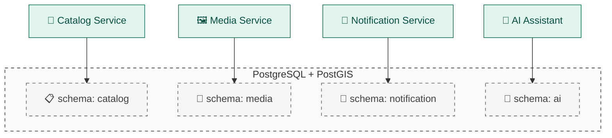
```mermaid
flowchart TB
    %% --- Estilos (Consistentes con los anteriores) ---
    classDef service fill:#E1F5EE,stroke:#0F6E56,stroke-width:1px,color:#085041;
    classDef db fill:#F5F5F5,stroke:#616161,stroke-width:1px,color:#424242,stroke-dasharray: 5 5;
    classDef cluster fill:#FAFAFA,stroke:#333,stroke-width:1px,stroke-dasharray: 5 5;

    %% --- Servicios (La capa de lógica) ---
    CAT["📂 Catalog Service"]:::service
    MED["🖼️ Media Service"]:::service
    NS["📧 Notification Service"]:::service
    AIS["🧠 AI Assistant"]:::service

    %% --- Subgraph PostgreSQL (La capa de almacenamiento) ---
    subgraph pg["PostgreSQL + PostGIS"]
        direction LR
        SCH_C["📋 schema: catalog"]:::db
        SCH_M["📸 schema: media"]:::db
        SCH_N["🔔 schema: notification"]:::db
        SCH_I["🤖 schema: ai"]:::db
    end

    %% --- Relaciones (Unívocas) ---
    CAT --> SCH_C
    MED --> SCH_M
    NS --> SCH_N
    AIS --> SCH_I
```

#### Capa de mensajería (Kafka)

| Componente | Tecnología | Responsabilidad |
| --- | --- | --- |
| **Kafka** | Kafka 3.7 (Compose) | Bus de eventos. |

#### Capa de caché (Redis)

| Componente | Tecnología | Responsabilidad |
| --- | --- | --- |
| **Redis** | Redis 7.4 (Compose) | Caché en memoria. |

#### Correo en desarrollo (Mailpit)

| Componente | Tecnología | Responsabilidad |
| --- | --- | --- |
| **Mailpit** | Mailpit 1.22 (Compose) | SMTP de prueba local: captura avisos por correo sin salida a Internet. |

### **3.2.1. Autenticación en Front (Vue)**

En las pantallas que exigen identificarse, la SPA controla que se inicie sesión con **Keycloak** (OIDC, flujo *Authorization Code + PKCE*); por su parte **Vue Router** impide acceder a rutas protegidas si no hay sesión válida o si el usuario no tiene el rol necesario. Cada petición al backend lleva el **JWT** en la cabecera `Authorization`. Si el servidor responde **401** "No autorizado", el cliente intenta **renovar el token en silencio**; solo si esa renovación falla redirige al login. Más detalle en [jwt-gateway-strategy.md](docs/security/jwt-gateway-strategy.md) y [vue-development-guide.md](docs/onboarding/vue-development-guide.md).

<details>
<summary><strong>Desplegar</strong> — Diagramas C3/C4 del flujo de autenticación</summary>

A continuación se muestra la implementación de seguridad del sistema que tiene como objetivo mantener rutas protegidas con sesión válida, renovar token de forma transparente y centralizar el manejo de `401` en cliente HTTP.

#### C3 — Componentes (nivel 3): autenticación en el contenedor SPA Vue

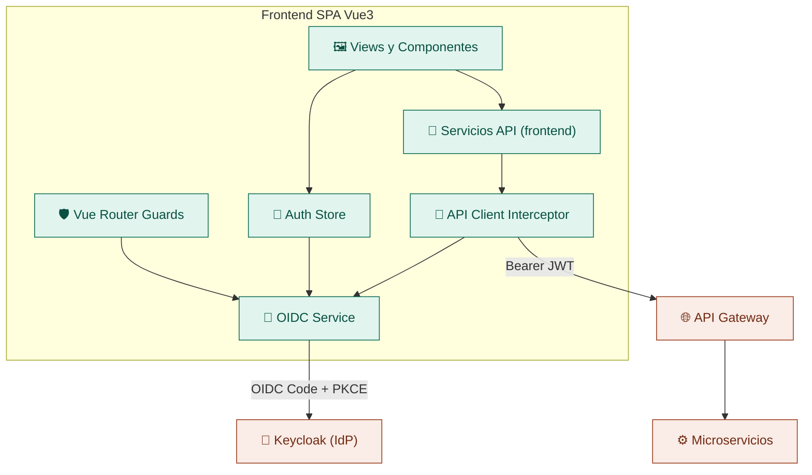
```mermaid
flowchart TB
    %% --- Estilos (Consistentes con la arquitectura anterior) ---
    classDef component fill:#E1F5EE,stroke:#0F6E56,stroke-width:1px,color:#085041;
    classDef external fill:#FAECE7,stroke:#993C1D,stroke-width:1px,color:#712B13;
    classDef subgraphStyle fill:#F9F9F9,stroke:#999,stroke-dasharray: 5 5;

    %% --- Subgraph Frontend ---
    subgraph SPA [Frontend SPA Vue3]
        direction TB
        Router["🛡️ Vue Router Guards"]:::component
        Views["🖼️ Views y Componentes"]:::component
        AuthStore["💾 Auth Store"]:::component
        Oidc["🔐 OIDC Service"]:::component
        Http["📡 API Client Interceptor"]:::component
        ApiSvc["🔌 Servicios API (frontend)"]:::component

        %% Relaciones internas
        Views --> AuthStore
        Views --> ApiSvc
        ApiSvc --> Http
        Http --> Oidc
        Router --> Oidc
        AuthStore --> Oidc
    end

    %% --- Componentes Externos ---
    IdP["🏢 Keycloak (IdP)"]:::external
    GW["🌐 API Gateway"]:::external
    Services["⚙️ Microservicios"]:::external

    %% --- Conexiones externas ---
    Oidc -->|OIDC Code + PKCE| IdP
    Http -->|Bearer JWT| GW
    GW --> Services
```

Responsabilidades clave:

- **Router Guards**: bloquean rutas con `requiresAuth` y comprueban `requiredRoles` (p. ej. `ADMIN` en `/admin/*`); consultan **directamente** el servicio OIDC (`getUser`, `signinSilent`, `login`), no el Auth Store.
- **Auth Store / useAuth**: estado reactivo de sesión (`currentUser`, `isAuthenticated`, roles) y listeners de eventos OIDC; lo consumen vistas y shell de navegación, no el guard.
- **OIDC Service** (`authService` en código): login, callback en `/auth/callback`, `signinSilent`, logout y renovación silenciosa automática (`automaticSilentRenew`).
- **Cliente HTTP** (`apiFetch` / `apiFetchBlob` en código): inyecta Bearer en rutas autenticadas; reintenta una vez tras `401` con `signinSilent`; si falla, redirige a login con `returnPath`.

Simplificaciones del diagrama C3 (no aparecen como cajas o flechas):

- **Servicios API (frontend)** agrupa módulos como `catalogService.ts`, `treeGalleryService.ts`, etc.; todos los autenticados pasan por `apiFetch`.
- **`publicApiFetch`** (mismo `apiClient.ts`): rutas públicas del gateway **sin** Bearer ni reintento OIDC (p. ej. suscripción por correo, enriquecimiento público).
- **API Client Interceptor** es la lógica de token y reintento en `apiFetch`, no un módulo aparte con ese nombre.
- El intercambio de código tras el redirect de Keycloak lo ejecuta la vista `AuthCallbackView`, no el guard ni el store en el primer paso.

#### C4 — Comportamiento (dinámico): secuencia de autenticación y acceso protegido

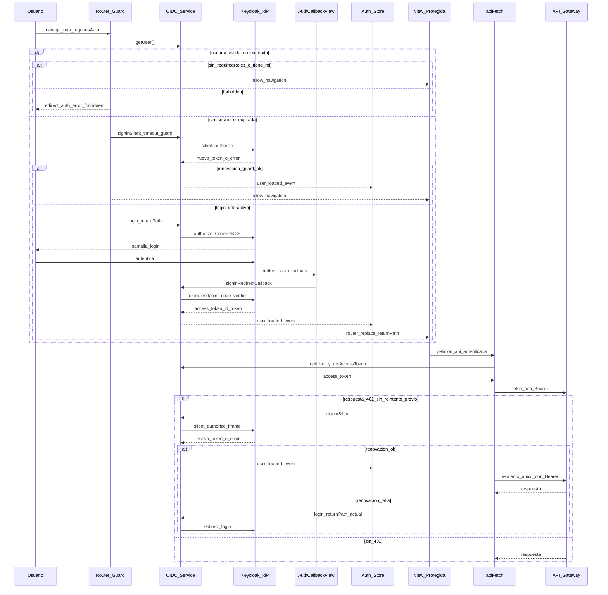
```mermaid
sequenceDiagram
  participant U as Usuario
  participant R as Router_Guard
  participant O as OIDC_Service
  participant K as Keycloak_IdP
  participant CB as AuthCallbackView
  participant A as Auth_Store
  participant V as View_Protegida
  participant H as apiFetch
  participant G as API_Gateway

  U->>R: navega_ruta_requiresAuth
  R->>O: getUser()

  alt usuario_valido_no_expirado
    alt sin_requiredRoles_o_tiene_rol
      R-->>V: allow_navigation
    else forbidden
      R-->>U: redirect_auth_error_forbidden
    end
  else sin_sesion_o_expirada
    R->>O: signinSilent_timeout_guard
    O->>K: silent_authorize
    K-->>O: nuevo_token_o_error
    alt renovacion_guard_ok
      O-->>A: user_loaded_event
      R-->>V: allow_navigation
    else login_interactivo
      R->>O: login_returnPath
      O->>K: authorize_Code+PKCE
      K-->>U: pantalla_login
      U->>K: autentica
      K-->>CB: redirect_auth_callback
      CB->>O: signinRedirectCallback
      O->>K: token_endpoint_code_verifier
      K-->>O: access_token_id_token
      O-->>A: user_loaded_event
      CB->>V: router_replace_returnPath
    end
  end

  V->>H: peticion_api_autenticada
  H->>O: getUser_y_getAccessToken
  O-->>H: access_token
  H->>G: fetch_con_Bearer

  alt respuesta_401_sin_reintento_previo
    H->>O: signinSilent
    O->>K: silent_authorize_iframe
    K-->>O: nuevo_token_o_error
    alt renovacion_ok
      O-->>A: user_loaded_event
      H->>G: reintento_unico_con_Bearer
      G-->>H: respuesta
    else renovacion_falla
      H->>O: login_returnPath_actual
      O->>K: redirect_login
    end
  else sin_401
    G-->>H: respuesta
  end
```

</details>

### **3.2.2. Kafka**

Para el envío de notificaciones a suscriptores el sistema implementa una arquitectura de eventos (Event-Driven Architecture) con Kafka.

Tras el alta de un ejemplar, el envío de correo a suscriptores se realiza de forma asíncrona. Después de crear la ficha del ejemplar, **catalog-service** publica un evento en Kafka (`catalog.ejemplar.evento`) y **notification-service** lo recibe para enviar los correos. El formato del mensaje está en [kafka-events.md](docs/events/kafka-events.md).

<details>
<summary><strong>Desplegar</strong> — Diagramas C3/C4 productor/consumidor y secuencias Kafka</summary>

Contrato del mensaje: [docs/events/kafka-events.md](docs/events/kafka-events.md). Nomenclatura técnica: [ADR-0006](docs/adr/0006-ejemplar-aggregate-http-kafka-naming.md). Configuración local: [services/README.md](services/README.md) (Kafka).

#### C3 — Productor: **catalog-service**

Tras un alta exitosa, el dominio notifica el evento mediante la interfaz `EjemplarCreadoEventPublisher` (puerto de aplicación). En entorno con Kafka activo, la implementación concreta es `KafkaEjemplarCreadoEventPublisher`, que publica en el topic. Si Kafka está desactivado (`mtl.catalog.kafka.enabled=false`, valor habitual en tests o arranque sin broker), entra `NoOpEjemplarCreadoEventPublisher`: el alta en PostgreSQL sigue funcionando, pero **no se envía ningún mensaje**.

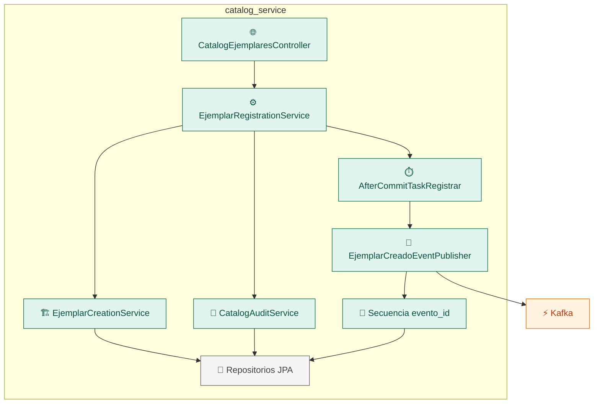
```mermaid
flowchart TB
    classDef service fill:#E1F5EE,stroke:#0F6E56,stroke-width:1px,color:#085041;
    classDef repo fill:#F5F5F5,stroke:#616161,stroke-width:1px,color:#424242;
    classDef infra fill:#FFF3E0,stroke:#EF6C00,stroke-width:1px,color:#BF360C;

    KafkaBroker["⚡ Kafka"]:::infra

    subgraph catalogSvc [catalog_service]
        direction TB
        EjemplaresCtrl["🌐 CatalogEjemplaresController"]:::service
        EjemplarReg["⚙️ EjemplarRegistrationService"]:::service
        EjemplarCre["🏗️ EjemplarCreationService"]:::service
        CatAud["📝 CatalogAuditService"]:::service
        AfterCommit["⏱️ AfterCommitTaskRegistrar"]:::service
        KafkaPub["📢 EjemplarCreadoEventPublisher"]:::service
        EventoSeq["🔢 Secuencia evento_id"]:::service
        JpaRepos["💾 Repositorios JPA"]:::repo

        EjemplaresCtrl --> EjemplarReg
        EjemplarReg --> EjemplarCre
        EjemplarReg --> CatAud
        EjemplarReg --> AfterCommit
        AfterCommit --> KafkaPub
        KafkaPub --> EventoSeq
        EjemplarCre --> JpaRepos
        CatAud --> JpaRepos
        EventoSeq --> JpaRepos
    end

    KafkaPub --> KafkaBroker
```

#### C3 — Consumidor: **notification-service**

El microservicio **notification-service** escucha el topic que publica **catalog-service**, persiste su propio registro en PostgreSQL (esquema `notification`) y envía los correos. A continuación se detalla el flujo seguido:

1. Un **listener** de Kafka recibe el mensaje JSON del alta de ejemplar.
2. La **ingestión** comprueba que el evento sea válido y de tipo `EJEMPLAR_CREADO`; cualquier otro tipo se descarta.
3. El **consumo** guarda el evento en `evento_catalogo`, identificado por `evento_id`. Si Kafka reenvía el mismo mensaje, ese id evita procesarlo dos veces.
4. El **procesador** genera las notificaciones y envía correo SMTP solo a suscriptores en estado **ACTIVA**.

Si Kafka está desactivado (`mtl.notification.kafka.enabled=false`), **no se arranca el listener** y el servicio no consume eventos (el resto del microservicio puede seguir operativo para otras APIs).

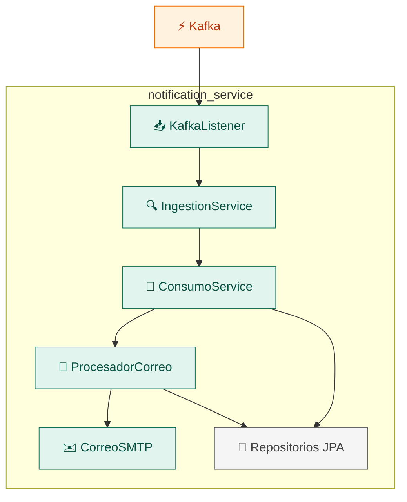
```mermaid
flowchart TB
    classDef service fill:#E1F5EE,stroke:#0F6E56,stroke-width:1px,color:#085041;
    classDef repo fill:#F5F5F5,stroke:#616161,stroke-width:1px,color:#424242;
    classDef infra fill:#FFF3E0,stroke:#EF6C00,stroke-width:1px,color:#BF360C;

    KafkaBroker["⚡ Kafka"]:::infra

    subgraph notifSvc [notification_service]
        direction TB
        Listener["📥 KafkaListener"]:::service
        Ingestion["🔍 IngestionService"]:::service
        Consumo["🔁 ConsumoService"]:::service
        Procesador["📧 ProcesadorCorreo"]:::service
        MailSender["✉️ CorreoSMTP"]:::service
        JpaRepos["💾 Repositorios JPA"]:::repo

        Listener --> Ingestion
        Ingestion --> Consumo
        Consumo --> Procesador
        Procesador --> MailSender
        Consumo --> JpaRepos
        Procesador --> JpaRepos
    end

    KafkaBroker --> Listener
```

#### Flujo completo (Alta de ejemplar → correo)

Tras login en Keycloak, la SPA desde la pantalla de alta de ejemplar invoca a través del API Gateway a **catalog-service**. Cuando se persiste la ficha este microservicio publica el evento en Kafka; **notification-service** consume el evento de Kafka y envía un correo al suscriptor (SMTP; Mailpit en desarrollo).

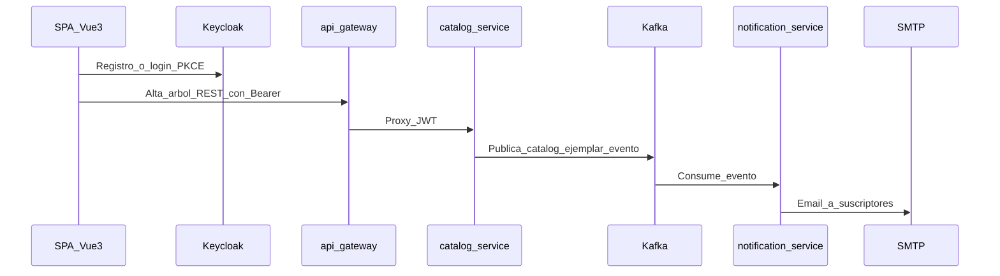
```mermaid
sequenceDiagram
  participant SPA as SPA_Vue3
  participant KC as Keycloak
  participant GW as api_gateway
  participant CAT as catalog_service
  participant K as Kafka
  participant N as notification_service
  participant Mail as SMTP
  SPA->>KC: Registro_o_login_PKCE
  SPA->>GW: Alta_arbol_REST_con_Bearer
  GW->>CAT: Proxy_JWT
  CAT->>K: Publica_catalog_ejemplar_evento
  K->>N: Consume_evento
  N->>Mail: Email_a_suscriptores
```

#### C4 — Secuencia de publicación (**EJEMPLAR_CREADO**)

Durante el alta de un ejemplar, **catalog-service** valida y guarda la ficha y la auditoría en la misma transacción PostgreSQL. En cuanto esa transacción hace **commit**, el cliente recibe **201 Created**: el ejemplar ya está persistido.

La publicación en Kafka ocurre **después**, de forma asíncrona (`AfterCommitTaskRegistrar`): se asigna un `evento_id` único y se envía el mensaje al topic `catalog.ejemplar.evento` (formato en [kafka-events.md](docs/events/kafka-events.md)).

Si Kafka falla en ese paso posterior, el alta **no se revierte**; el fallo queda solo en logs para revisión operativa.

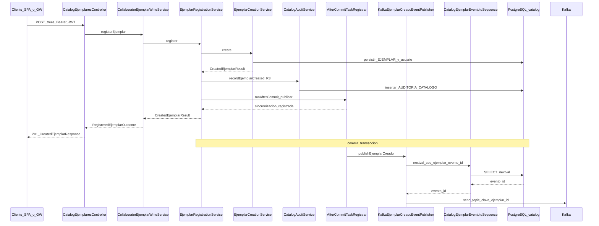
```mermaid
sequenceDiagram
  participant Client as Cliente_SPA_o_GW
  participant Ctrl as CatalogEjemplaresController
  participant Write as CollaboratorEjemplarWriteService
  participant Reg as EjemplarRegistrationService
  participant Cre as EjemplarCreationService
  participant Aud as CatalogAuditService
  participant Tx as AfterCommitTaskRegistrar
  participant Pub as KafkaEjemplarCreadoEventPublisher
  participant Seq as CatalogEjemplarEventoIdSequence
  participant PG as PostgreSQL_catalog
  participant KB as Kafka

  Client->>Ctrl: POST_trees_Bearer_JWT
  Ctrl->>Write: registerEjemplar
  Write->>Reg: register
  Reg->>Cre: create
  Cre->>PG: persistir_EJEMPLAR_y_usuario
  Cre-->>Reg: CreatedEjemplarResult
  Reg->>Aud: recordEjemplarCreated_R3
  Aud->>PG: insertar_AUDITORIA_CATALOGO
  Reg->>Tx: runAfterCommit_publicar
  Tx-->>Reg: sincronizacion_registrada
  Reg-->>Write: CreatedEjemplarResult
  Write-->>Ctrl: RegisteredEjemplarOutcome
  Ctrl-->>Client: 201_CreatedEjemplarResponse

  Note over Reg,PG: commit_transaccion
  Tx->>Pub: publishEjemplarCreado
  Pub->>Seq: nextval_seq_ejemplar_evento_id
  Seq->>PG: SELECT_nextval
  PG-->>Seq: evento_id
  Seq-->>Pub: evento_id
  Pub->>KB: send_topic_clave_ejemplar_id
```

#### C4 — Secuencia de consumo (**EJEMPLAR_CREADO**)

El listener pasa la información recibida en JSON a la ingestión ([kafka-events.md](docs/events/kafka-events.md)). La primera vez se inserta `evento_catalogo` por `evento_id`; en caso de que ya exista, no se repite; **notification-service** identifica el evento por `evento_id` y evita procesarlo dos veces. El procesador guarda notificación y envíos, manda correo a suscriptores con suscripción **ACTIVA** y deja el evento en estado **PROCESADO**.

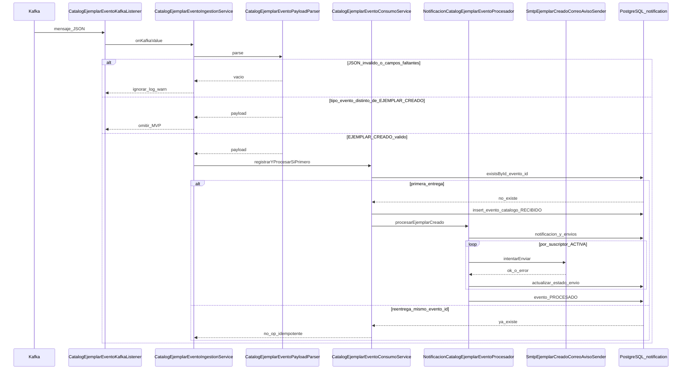
```mermaid
sequenceDiagram
  participant KB as Kafka
  participant Lst as CatalogEjemplarEventoKafkaListener
  participant Ing as CatalogEjemplarEventoIngestionService
  participant Parser as CatalogEjemplarEventoPayloadParser
  participant Con as CatalogEjemplarEventoConsumoService
  participant Proc as NotificacionCatalogEjemplarEventoProcesador
  participant Mail as SmtpEjemplarCreadoCorreoAvisoSender
  participant PG as PostgreSQL_notification

  KB->>Lst: mensaje_JSON
  Lst->>Ing: onKafkaValue
  Ing->>Parser: parse
  alt JSON_invalido_o_campos_faltantes
    Parser-->>Ing: vacio
    Ing-->>Lst: ignorar_log_warn
  else tipo_evento_distinto_de_EJEMPLAR_CREADO
    Parser-->>Ing: payload
    Ing-->>Lst: omitir_MVP
  else EJEMPLAR_CREADO_valido
    Parser-->>Ing: payload
    Ing->>Con: registrarYProcesarSiPrimero
    Con->>PG: existsById_evento_id
    alt primera_entrega
      PG-->>Con: no_existe
      Con->>PG: insert_evento_catalogo_RECIBIDO
      Con->>Proc: procesarEjemplarCreado
      Proc->>PG: notificacion_y_envios
      loop por_suscriptor_ACTIVA
        Proc->>Mail: intentarEnviar
        Mail-->>Proc: ok_o_error
        Proc->>PG: actualizar_estado_envio
      end
      Proc->>PG: evento_PROCESADO
    else reentrega_mismo_evento_id
      PG-->>Con: ya_existe
      Con-->>Ing: no_op_idempotente
    end
  end
```

</details>

### **3.2.3. Almacenamiento de fotografías**

Los archivos binarios (fotografías de ejemplares) se guardan en un almacén compatible con S3 (MinIO en local) y los **datos descriptivos** (árbol, orden, tamaño, etc.) se almacenan en PostgreSQL, dentro del esquema `media`. Para subir una imagen, la aplicación pide al backend una URL temporal de subida, envía el fichero directamente al almacén —sin exponer las credenciales del bucket en el navegador— y, al terminar, confirma en la API para registrar la foto en base de datos. Detalle en [HU-006](docs/backlog/HU-006-fotografias-asociadas-al-arbol.md) y [openapi.yaml](docs/api/openapi.yaml).

<details>
<summary><strong>Desplegar</strong> — Secuencia presign, subida y confirmación</summary>

La SPA **nunca** recibe credenciales de bucket: tras crear la ficha del árbol en **catalog-service**, por cada imagen pide una **URL prefirmada** (`POST /api/media/uploads/presign`), sube el fichero con **PUT directo** al almacén y **confirma** (`POST /api/media/photos/confirm`) para registrar la fila en `media`; la primera confirmación del árbol queda como **foto principal**. La visibilidad de cada foto **hereda** la de la ficha. Contrato HTTP: [openapi.yaml](docs/api/openapi.yaml); historia, criterios y decisiones de refinamiento: [HU-006](docs/backlog/HU-006-fotografias-asociadas-al-arbol.md).

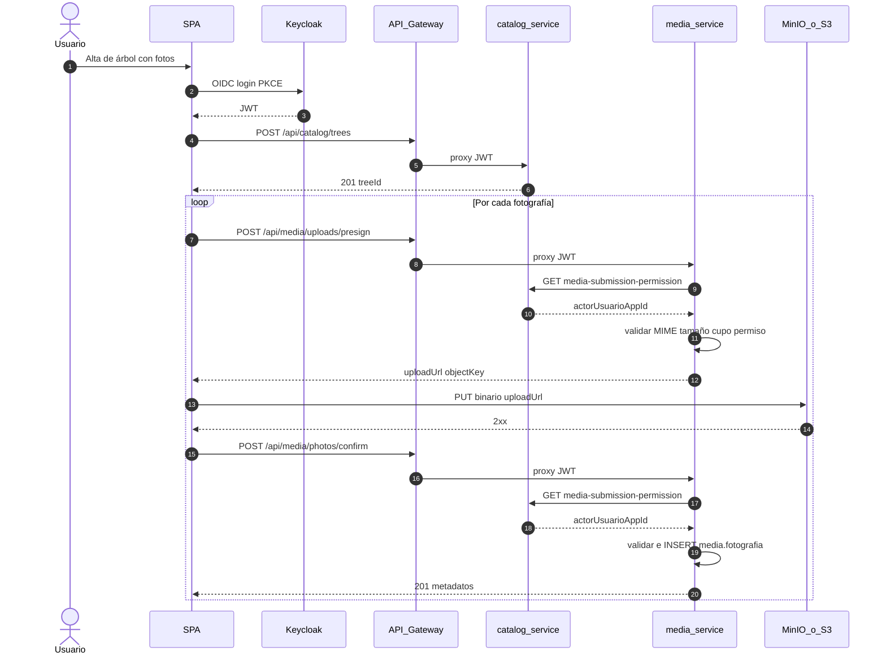
```mermaid
sequenceDiagram
  autonumber
  actor U as Usuario
  participant SPA as SPA
  participant KC as Keycloak
  participant GW as API_Gateway
  participant CAT as catalog_service
  participant MS as media_service
  participant OBJ as MinIO_o_S3

  U->>SPA: Alta de árbol con fotos
  SPA->>KC: OIDC login PKCE
  KC-->>SPA: JWT

  SPA->>GW: POST /api/catalog/trees
  GW->>CAT: proxy JWT
  CAT-->>SPA: 201 treeId

  loop Por cada fotografía
    SPA->>GW: POST /api/media/uploads/presign
    GW->>MS: proxy JWT
    MS->>CAT: GET media-submission-permission
    CAT-->>MS: actorUsuarioAppId
    MS->>MS: validar MIME tamaño cupo permiso
    MS-->>SPA: uploadUrl objectKey

    SPA->>OBJ: PUT binario uploadUrl
    OBJ-->>SPA: 2xx

    SPA->>GW: POST /api/media/photos/confirm
    GW->>MS: proxy JWT
    MS->>CAT: GET media-submission-permission
    CAT-->>MS: actorUsuarioAppId
    MS->>MS: validar e INSERT media.fotografia
    MS-->>SPA: 201 metadatos
  end
```

</details>

### **3.2.4. Uso de IA: características de especie y chat asistido (MVP); identificación por imagen (futuro)**

En el MVP la invocación a un LLM externo cubre dos flujos en **ai-assistant-service** (modo `stub` u OpenAI según configuración):


**Simulación LLM:** en local se puede usar `mtl.ai.provider.mode=stub` para simula el proveedor (sin clave OpenAI).

<details>
<summary><strong>Desplegar</strong> — Secuencia de consulta IA de especie (MVP)</summary>

Flujo de consulta IA: el frontend precarga el popup con los datos del LLM y **ai-assistant-service** registra la trazabilidad en PostgreSQL (`ai.auditoria_uso_ia`).

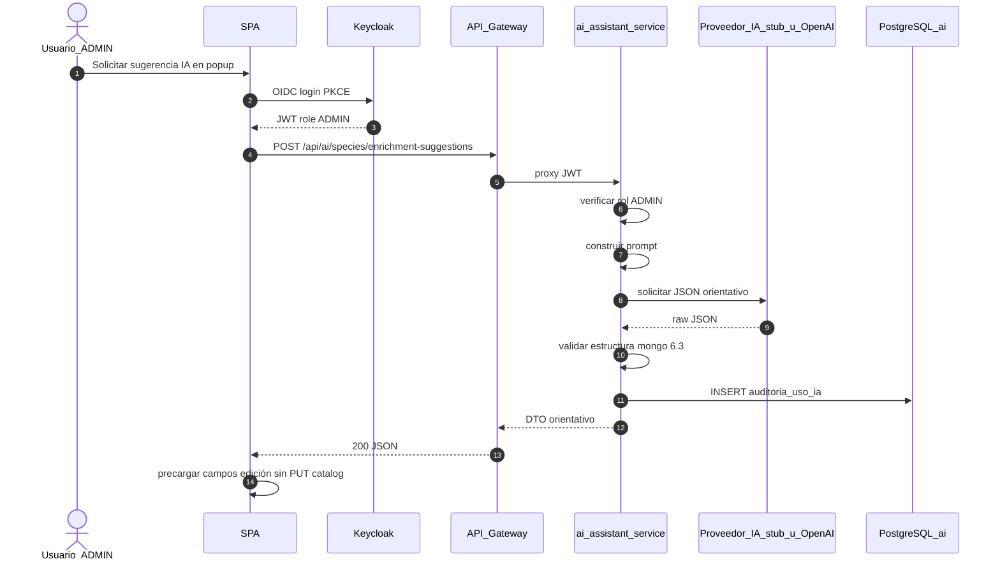
```mermaid
sequenceDiagram
  autonumber
  actor U as Usuario_ADMIN
  participant SPA as SPA
  participant KC as Keycloak
  participant GW as API_Gateway
  participant AIS as ai_assistant_service
  participant Prov as Proveedor_IA_stub_u_OpenAI
  participant PG as PostgreSQL_ai

  U->>SPA: Solicitar sugerencia IA en popup
  SPA->>KC: OIDC login PKCE
  KC-->>SPA: JWT role ADMIN

  SPA->>GW: POST /api/ai/species/enrichment-suggestions
  GW->>AIS: proxy JWT
  AIS->>AIS: verificar rol ADMIN
  AIS->>AIS: construir prompt
  AIS->>Prov: solicitar JSON orientativo
  Prov-->>AIS: raw JSON
  AIS->>AIS: validar estructura mongo 6.3
  AIS->>PG: INSERT auditoria_uso_ia
  AIS-->>GW: DTO orientativo
  GW-->>SPA: 200 JSON
  SPA->>SPA: precargar campos edición sin PUT catalog
```


</details>

### **3.3. Infraestructura y despliegue**

**Infraestructura:** el sistema necesita la siguiente infraestructura: 
- PostgreSQL/PostGIS (cuatro esquemas de aplicación: `catalog`, `media`, `notification`, `ai`) 
- MongoDB 
- Redis 
- MinIO/S3 
- Kafka 
- Keycloak 
- Servidor SMTP (Mailpit en local) 
- Prometheus  
- Grafana
- OpenAI API (necesaria para servicios IA)

En desarrollo, toda esta infraestructura se puede levantar con Docker Compose: [infra/compose](infra/compose/).

**Generación de imágenes:** la generación de las imágenes de la aplicación se hace con [scripts/dev/build-images.ps1](scripts/dev/build-images.ps1). Este script genera las siguientes imágenes:
- mtl/frontend
- mtl/api-gateway
- mtl/catalog-service
- mtl/media-service
- mtl/notification-service
- mtl/ai-assistant-service

**Docker Compose:** los archivos `docker-compose.yml` y `docker-compose.apps.yml` contienen la definición de arranque de la aplicación. Una vez generadas las imágenes, la aplicación se arranca en Docker Compose (SPA en el puerto `:8088`) con los siguientes comandos. Ver [infra/compose/README.md](infra/compose/README.md).

```bash
docker compose up -d
docker compose -f docker-compose.yml -f docker-compose.apps.yml up -d
```

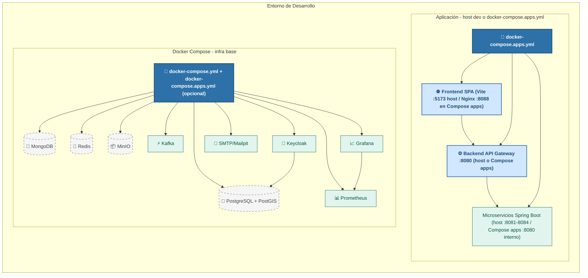
```mermaid
flowchart TB
    %% --- Estilos (Consistentes con toda la documentación) ---
    classDef orch fill:#2D71A8,stroke:#1E4B73,stroke-width:2px,color:#FFFFFF,font-weight:bold;
    classDef web fill:#D1E7FF,stroke:#2D71A8,stroke-width:2px,color:#1E4B73,font-weight:bold;
    classDef service fill:#E1F5EE,stroke:#0F6E56,stroke-width:1px,color:#085041;
    classDef db fill:#F5F5F5,stroke:#616161,stroke-width:1px,color:#424242,stroke-dasharray: 5 5;

    subgraph dev [Entorno de Desarrollo]
        direction TB

        subgraph host [Aplicación - host dev o docker-compose.apps.yml]
            direction TB
            DA["🐳 docker-compose.apps.yml"]:::orch
            SPAh["🌐 Frontend SPA (Vite :5173 host / Nginx :8088 en Compose apps)"]:::web
            GWh["⚙️ Backend API Gateway :8080 (host o Compose apps)"]:::web
            MSh["Microservicios Spring Boot (host :8081-8084 / Compose apps :8080 interno)"]:::service
            SPAh --> GWh
            GWh --> MSh
            DA --> GWh
            DA --> MSh
            DA --> SPAh
        end

        subgraph compose [Docker Compose - infra base]
            direction TB
            DC["🐳 docker-compose.yml + docker-compose.apps.yml (opcional)"]:::orch

            KCd["🔐 Keycloak"]:::service
            Kd["⚡ Kafka"]:::service
            MPd["📧 SMTP/Mailpit"]:::service
            PRd["📊 Prometheus"]:::service
            GRd["📈 Grafana"]:::service

            PGd[("🐘 PostgreSQL + PostGIS")]:::db
            MGd[("🍃 MongoDB")]:::db
            Rd[("🚀 Redis")]:::db
            S3d[("📦 MinIO")]:::db
        end

        DC --> PGd
        DC --> MGd
        DC --> Rd
        DC --> S3d
        DC --> Kd
        DC --> KCd
        DC --> MPd
        DC --> PRd
        DC --> GRd
        KCd --> PGd
        GRd --> PRd

    end
```

**Script arranque completo:** existe un script que lanza todos los pasos anteriores (build de imágenes + levantar infra + levantar aplicación): `.\scripts\dev\start-docker-stack.ps1`.

**Observabilidad:** con la aplicación y la infra levantada, Prometheus recoge métricas de cada microservicio vía Actuator y Grafana muestra el dashboard **MTL Microservices**.


**Despliegue en Kubernetes con Istio:** en entornos productivos el sistema se puede desplegar en Kubernetes con Istio con la estructura que se indica en el siguiente diagrama:

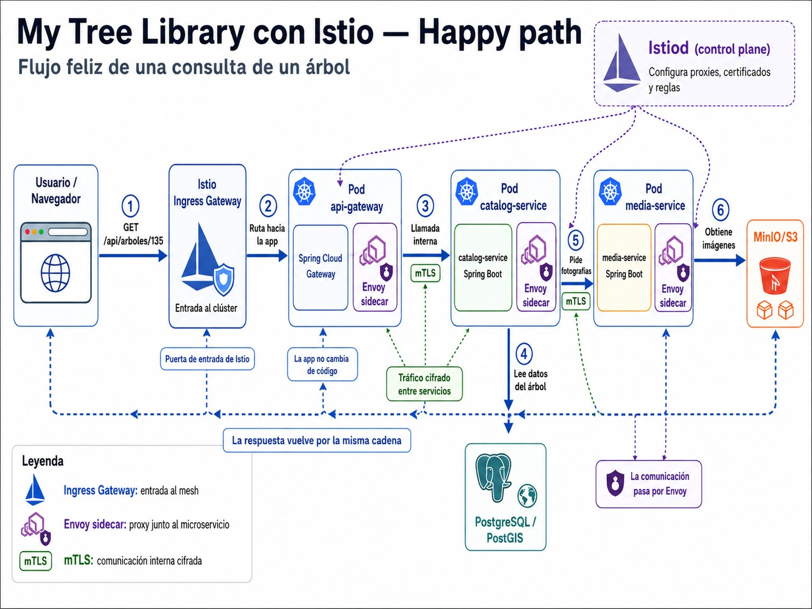

La definición de los archivos de configuración k8s queda fuera del alcance del proyecto.

### **3.4. Seguridad**

La autenticación se basa en **OIDC** con **Keycloak** como IdP (realm `mtl`): la SPA obtiene un token **JWT firmado** que envía en cada petición API como `Authorization: Bearer`; el **API Gateway** y los microservicios lo validan (firma, caducidad y emisor).

Tras autenticar, la **autorización** restringe el acceso a recursos sensibles según los roles de realm **`COLABORADOR`** y **`ADMIN`**; las rutas públicas siguen el contrato OpenAPI y el resto exige JWT válido.

Las fotografías residen en buckets **privados** (MinIO en local, S3 en producción): la SPA **nunca** recibe credenciales del almacén; **media-service** comprueba permisos y política de subida (MIME, tamaño, límite por ejemplar) antes de emitir **URLs prefirmadas** PUT/GET de **corta duración**; el cliente sube el binario directamente al bucket y confirma metadatos en la API. Flujo presign → PUT → confirm: [openapi.yaml](docs/api/openapi.yaml) y [HU-006](docs/backlog/HU-006-fotografias-asociadas-al-arbol.md).

En **producción**, el tráfico expuesto (SPA, API e IdP) debe ir cifrado con **TLS**; en desarrollo local la API puede servirse en HTTP. El **gateway** aplica **CORS** restrictivo a los orígenes del SPA en local: `http://localhost:5173`, `http://127.0.0.1:5173` (Vite en host) y `http://localhost:8088`, `http://127.0.0.1:8088` (SPA en Docker).

**Implementación y normativa:** [docs/security/jwt-gateway-strategy.md](docs/security/jwt-gateway-strategy.md) · `.cursor/rules/api-security.mdc` · [docs/api/openapi.yaml](docs/api/openapi.yaml) · Keycloak: [infra/compose/README.md](infra/compose/README.md).

### **3.5. Tests**

La estrategia de tests del sistema contempla los siguientes niveles:

**Tests unitarios** — lógica aislada, sin dependencias externas.
- **Frontend (Vitest):** composables y componentes con lógica relevante.
- **Backend (JUnit):** servicios de dominio y reglas de negocio.

**Tests de integración** — capas reales contra dependencias gestionadas.
- **Frontend:** componentes y vistas con stores/servicios mockeados o reales.
- **Backend:** repositorios y endpoints por capa (Testcontainers: PostgreSQL/Mongo/Kafka).

**Test E2E en dos niveles:**
- **E2E completo (Playwright)** — pruebas de flujo de usuario completo que ejercitan frontend y backend de forma conjunta.

- **E2E REST del backend** — pruebas HTTP/JWT de los servicios REST de backend aisladas del UI; cubren el recorrido backend completo (gateway, microservicios, Kafka) y resultan más robustas ante cambios de interfaz.

**Ejecución:**
1. **Ejecución automática en PR y push a `main`** — en cada pull request hacia `main` y en cada push a `main` se ejecuta automáticamente el workflow de GitHub [ci.yml](.github/workflows/ci.yml), que incluye tests unitarios de backend (Maven/Surefire), calidad y tests del frontend (ESLint, typecheck, Vitest) y detección de secretos con Gitleaks. Los tests de integración (`*IT`) y los E2E no forman parte de este pipeline.

2. **E2E completo (Playwright)** — flujo de usuario completo contra un **entorno ya levantado** (infra + microservicios + front en dev o Docker; [§3.3](#33-infraestructura-y-despliegue)).
   - **Local:** `.\scripts\dev\test-e2e.ps1 -Local` (por defecto `http://localhost:5173` en dev en host; con app en Docker, `-BaseUrl http://localhost:8088`).

3. **E2E REST del backend (`system-e2e-tests`)** — contrato HTTP/JWT por el gateway, sin navegador, contra el **entorno ya levantado** descrito en el punto 2.
   - **Local:** con el stack arriba, desde `services/`: `$env:MTL_E2E_AUTO_KEYCLOAK_TOKEN = "true"; mvn -pl system-e2e-tests verify` (detalle de variables y escenarios en [system-e2e-tests](services/system-e2e-tests/README.md)).

4. **E2E completo (Playwright) levantando contenedores en el proceso de prueba** — levanta un stack efímero autocontenido en Docker (PostgreSQL, Mongo, Kafka, Keycloak, microservicios y front en contenedor). Tiene un coste elevado de computación, motivo por el cual no se ejecuta automáticamente en cada PR; existe un workflow de GitHub que permite su ejecución manual. Ejecuta en secuencia `system-e2e-tests` (HTTP) y Playwright (UI). Se puede ejecutar de dos modos:
   - **CI:** workflow manual [E2E Playwright (alta de ejemplar)](.github/workflows/e2e-playwright.yml) en GitHub Actions → *Run workflow*.
   - **Local:** `.\scripts\dev\test-e2e.ps1` (compila jars, levanta `infra/compose/docker-compose.e2e.yml`, ejecuta ambas suites y baja el stack con `down -v`). Atajos: `-SkipBuild`, `-KeepStack` — [scripts/README.md](scripts/README.md).

**Documentación:** [testing-frontend.md](docs/engineering/testing-frontend.md) · [testing-java.md](docs/engineering/testing-java.md) · [testing-e2e.md](docs/engineering/testing-e2e.md) · módulos [system-e2e-tests](services/system-e2e-tests/README.md) · [e2e/](e2e/README.md).

---

## 4. 🛢️ Modelo de datos

El modelado se ha realizado intencionadamente en **el idioma del dominio de negocio** que en este caso es el español. La justificación es que en proyectos que no son internacionales, tiene más sentido modelar en el idioma y la jerga del cliente. Esta decisión presenta un reto de coherencia que ha llevado a la definición del idioma aplicable a cada capa del sistema.

**Documentación relacionada:** [Notas de negocio y reglas](docs/data-model/data-model.md) · [Modelo técnico MongoDB (colecciones, validación, índices)](docs/data-model/mongo.md) · [Eventos Kafka](docs/events/kafka-events.md)

En esta sección:

- [4.1 Modelo lógico del sistema completo](#41-modelo-lógico-del-sistema-completo)
- [4.2 Diagrama de entidad-relación (implementación física)](#42-diagrama-de-entidad-relación-implementación-física)

### **4.1. Modelo lógico del sistema completo**

El modelo lógico presenta una vista unificada de las entidades principales del sistema y sus relaciones, independientemente del almacén o microservicio (§4.2). Las referencias entre dominios se expresan como **FK lógicas** sin que esto conlleve la implementación de una restricción física real entre los distintos esquemas.

**Usuario de aplicación:** La auditoría de la aplicación se implementa en torno al usuario proporcionado por el token generado por Keycloak como proveedor OIDC. Para evitar duplicidades, los diversos esquemas almacenan el identificador estable del proveedor (`sub`) que se guarda en el campo **`subject_oidc`**. En el caso de catalog-service este campo se guarda en una tabla USUARIO_APP con unicidad, no como clave primaria; esto permite trazabilidad sin duplicar la información; las FK de los campos de auditoría `creado_por` y `modificado_por` referencian a la clave primaria de esta tabla. [ADR-0004](docs/adr/0004-catalog-rest-write-and-audit.md).

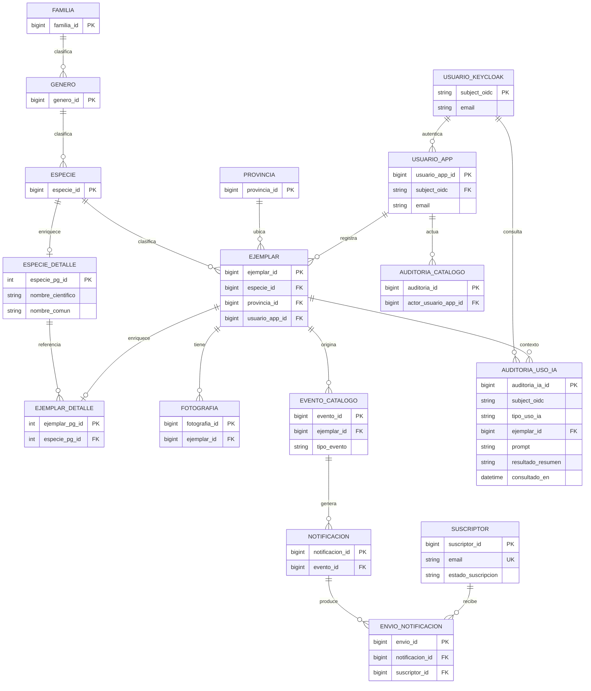
```mermaid
erDiagram
    USUARIO_KEYCLOAK {
        string subject_oidc PK
        string email
    }
    USUARIO_APP {
        bigint usuario_app_id PK
        string subject_oidc FK
        string email
    }
    FAMILIA {
        bigint familia_id PK
    }
    GENERO {
        bigint genero_id PK
    }
    ESPECIE {
        bigint especie_id PK
    }
    PROVINCIA {
        bigint provincia_id PK
    }
    EJEMPLAR {
        bigint ejemplar_id PK
        bigint especie_id FK
        bigint provincia_id FK
        bigint usuario_app_id FK
    }
    ESPECIE_DETALLE {
        int especie_pg_id PK
        string nombre_cientifico
        string nombre_comun
    }
    EJEMPLAR_DETALLE {
        int ejemplar_pg_id PK
        int especie_pg_id FK
    }
    FOTOGRAFIA {
        bigint fotografia_id PK
        bigint ejemplar_id FK
    }
    EVENTO_CATALOGO {
        bigint evento_id PK
        bigint ejemplar_id FK
        string tipo_evento
    }
    NOTIFICACION {
        bigint notificacion_id PK
        bigint evento_id FK
    }
    SUSCRIPTOR {
        bigint suscriptor_id PK
        string email UK
        string estado_suscripcion
    }
    ENVIO_NOTIFICACION {
        bigint envio_id PK
        bigint notificacion_id FK
        bigint suscriptor_id FK
    }
    AUDITORIA_CATALOGO {
        bigint auditoria_id PK
        bigint  actor_usuario_app_id FK
    }
    AUDITORIA_USO_IA {
        bigint auditoria_ia_id PK
        string subject_oidc
        string tipo_uso_ia
        bigint ejemplar_id FK
        string prompt
        string resultado_resumen
        datetime consultado_en
    }
    FAMILIA ||--o{ GENERO : clasifica
    GENERO ||--o{ ESPECIE : clasifica
    ESPECIE ||--o{ EJEMPLAR : clasifica
    PROVINCIA ||--o{ EJEMPLAR : ubica
    USUARIO_KEYCLOAK ||--o{ USUARIO_APP : autentica
    USUARIO_KEYCLOAK ||--o{ AUDITORIA_USO_IA : consulta
    USUARIO_APP ||--o{ EJEMPLAR : registra
    USUARIO_APP ||--o{ AUDITORIA_CATALOGO : actua
    ESPECIE ||--o| ESPECIE_DETALLE : enriquece
    ESPECIE_DETALLE ||--o{ EJEMPLAR_DETALLE : referencia
    EJEMPLAR ||--o| EJEMPLAR_DETALLE : enriquece
    EJEMPLAR ||--o{ FOTOGRAFIA : tiene
    EJEMPLAR ||--o{ EVENTO_CATALOGO : origina
    EVENTO_CATALOGO ||--o{ NOTIFICACION : genera
    NOTIFICACION ||--o{ ENVIO_NOTIFICACION : produce
    SUSCRIPTOR ||--o{ ENVIO_NOTIFICACION : recibe
    EJEMPLAR ||--o{ AUDITORIA_USO_IA : contexto
```

### **4.2. Diagrama de entidad-relación (implementación física)**

**Leyenda:** 
- `PK` = clave primaria; `FK` = clave foránea de negocio; `UK` = unicidad. 
- `creado_por` / `modificado_por` = campos usados para auditoría (sin sufijo `FK`). 
- Tipos PostgreSQL (`bigint`, `varchar`, `text`, `timestamptz`, `numeric`, `integer`, …).

En esta subsección:

- [4.2.1 PostgreSQL: catalog_service](#421-postgresql-catalog_service)
- [4.2.2 MongoDB (catalog-service; modelo en mongo.md)](#422-mongodb-catalog-service-modelo-en-mongomd)
- [4.2.3 PostgreSQL media_service](#423-postgresql-media_service)
- [4.2.4 PostgreSQL notification_service](#424-postgresql-notification_service)
- [4.2.5 PostgreSQL ai_assistant_service (esquema ai)](#425-postgresql-ai_assistant_service-esquema-ai)

#### **4.2.1. PostgreSQL: catalog_service**

Esquema con los datos generales de cada árbol y la auditoría del usuario que los registró.

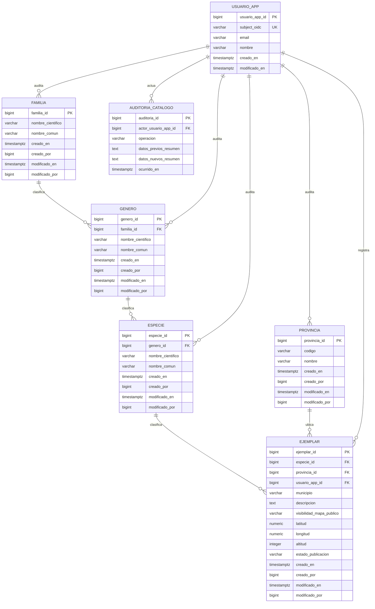
```mermaid
erDiagram
    USUARIO_APP {
        bigint usuario_app_id PK
        varchar subject_oidc UK
        varchar email
        varchar nombre
        timestamptz creado_en
        timestamptz modificado_en
    }
    FAMILIA {
        bigint familia_id PK
        varchar nombre_cientifico
        varchar nombre_comun
        timestamptz creado_en
        bigint creado_por
        timestamptz modificado_en
        bigint modificado_por
    }
    GENERO {
        bigint genero_id PK
        bigint familia_id FK
        varchar nombre_cientifico
        varchar nombre_comun
        timestamptz creado_en
        bigint creado_por
        timestamptz modificado_en
        bigint modificado_por
    }
    ESPECIE {
        bigint especie_id PK
        bigint genero_id FK
        varchar nombre_cientifico
        varchar nombre_comun
        timestamptz creado_en
        bigint creado_por
        timestamptz modificado_en
        bigint modificado_por
    }
    PROVINCIA {
        bigint provincia_id PK
        varchar codigo
        varchar nombre
        timestamptz creado_en
        bigint creado_por
        timestamptz modificado_en
        bigint modificado_por
    }
    EJEMPLAR {
        bigint ejemplar_id PK
        bigint especie_id FK
        bigint provincia_id FK
        bigint usuario_app_id FK
        varchar municipio
        text descripcion
        varchar visibilidad_mapa_publico
        numeric latitud
        numeric longitud
        integer altitud
        varchar estado_publicacion
        timestamptz creado_en
        bigint creado_por
        timestamptz modificado_en
        bigint modificado_por
    }
    AUDITORIA_CATALOGO {
        bigint auditoria_id PK
        bigint actor_usuario_app_id FK
        varchar operacion
        text datos_previos_resumen
        text datos_nuevos_resumen
        timestamptz ocurrido_en
    }
    FAMILIA ||--o{ GENERO : clasifica
    GENERO ||--o{ ESPECIE : clasifica
    ESPECIE ||--o{ EJEMPLAR : clasifica
    PROVINCIA ||--o{ EJEMPLAR : ubica
    USUARIO_APP ||--o{ EJEMPLAR : registra
    USUARIO_APP ||--o{ FAMILIA : audita
    USUARIO_APP ||--o{ GENERO : audita
    USUARIO_APP ||--o{ ESPECIE : audita
    USUARIO_APP ||--o{ PROVINCIA : audita
    USUARIO_APP ||--o{ AUDITORIA_CATALOGO : actua
```

En el alta de ejemplar, los valores admitidos son:

- `estado_publicacion`: `BORRADOR` o `PUBLICADO`.
- `visibilidad_mapa_publico`: `PRIVADO` o `PUBLICO`.

#### **4.2.2. MongoDB (catalog-service; modelo en mongo.md)**

Almacén de enriquecimiento con datos semiestructurados complementarios. Incluye desnormalización controlada de nombres de especie desde PostgreSQL para búsquedas en MongoDB. Diseño, índices y validación: [mongo.md](docs/data-model/mongo.md).

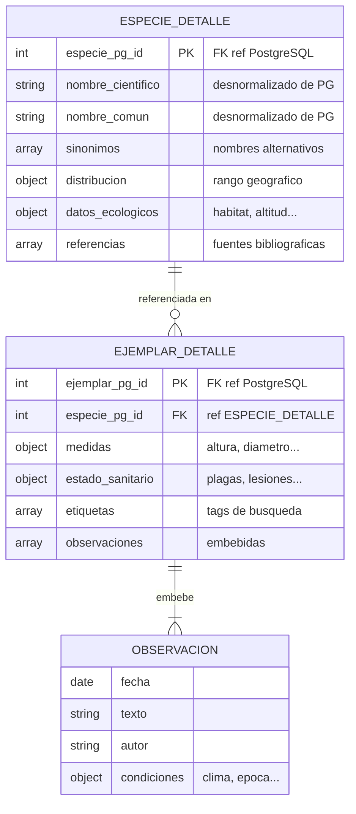
```mermaid
erDiagram

  ESPECIE_DETALLE ||--o{ EJEMPLAR_DETALLE : "referenciada en"

  ESPECIE_DETALLE {
    int    especie_pg_id       PK "FK ref PostgreSQL"
    string nombre_cientifico      "desnormalizado de PG"
    string nombre_comun           "desnormalizado de PG"
    array  sinonimos              "nombres alternativos"
    object distribucion           "rango geografico"
    object datos_ecologicos       "habitat, altitud..."
    array  referencias            "fuentes bibliograficas"
  }

  EJEMPLAR_DETALLE {
    int    ejemplar_pg_id      PK "FK ref PostgreSQL"
    int    especie_pg_id       FK "ref ESPECIE_DETALLE"
    object medidas                "altura, diametro..."
    object estado_sanitario       "plagas, lesiones..."
    array  etiquetas              "tags de busqueda"
    array  observaciones          "embebidas"
  }

  OBSERVACION {
    date   fecha
    string texto
    string autor
    object condiciones            "clima, epoca..."
  }

  EJEMPLAR_DETALLE ||--|{ OBSERVACION : "embebe"
```

#### **4.2.3. PostgreSQL media_service**

Metadatos de fotografías en esquema `media`. `ejemplar_id` referencia lógicamente a `catalog.ejemplar` (sin FK entre esquemas). **UK compuesta** `uq_fotografia_objeto` sobre `(bucket_almacenamiento, clave_objeto)`.

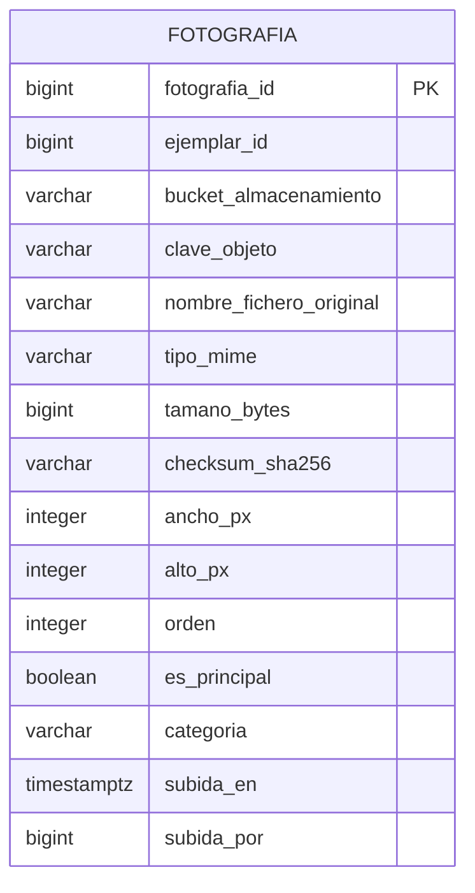
```mermaid
erDiagram
    %% UK compuesta uq_fotografia_objeto (bucket_almacenamiento, clave_objeto)
    FOTOGRAFIA {
        bigint fotografia_id PK
        bigint ejemplar_id
        varchar bucket_almacenamiento
        varchar clave_objeto
        varchar nombre_fichero_original
        varchar tipo_mime
        bigint tamano_bytes
        varchar checksum_sha256
        integer ancho_px
        integer alto_px
        integer orden
        boolean es_principal
        varchar categoria
        timestamptz subida_en
        bigint subida_por
    }
```

#### **4.2.4. PostgreSQL notification_service**

Avisos de nuevas altas en el sistema a los suscriptores.

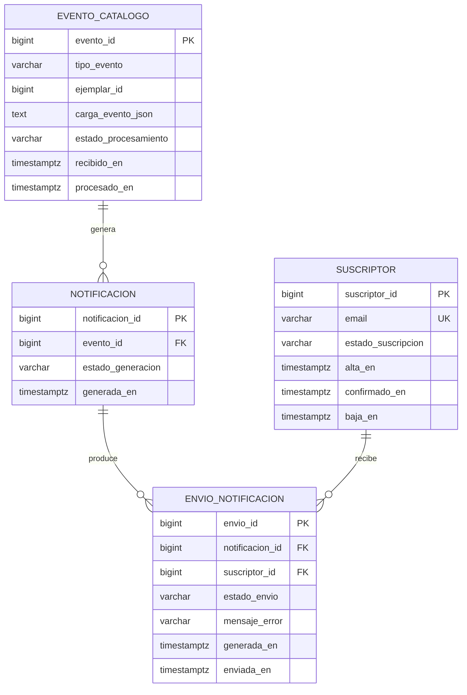
```mermaid
erDiagram
    %% UK email normalizado uq_suscriptor_email_normalizado lower(trim(email))
    SUSCRIPTOR {
        bigint suscriptor_id PK
        varchar email UK
        varchar estado_suscripcion
        timestamptz alta_en
        timestamptz confirmado_en
        timestamptz baja_en
    }
    EVENTO_CATALOGO {
        bigint evento_id PK
        varchar tipo_evento
        bigint ejemplar_id
        text carga_evento_json
        varchar estado_procesamiento
        timestamptz recibido_en
        timestamptz procesado_en
    }
    NOTIFICACION {
        bigint notificacion_id PK
        bigint evento_id FK
        varchar estado_generacion
        timestamptz generada_en
    }
    ENVIO_NOTIFICACION {
        bigint envio_id PK
        bigint notificacion_id FK
        bigint suscriptor_id FK
        varchar estado_envio
        varchar mensaje_error
        timestamptz generada_en
        timestamptz enviada_en
    }
    EVENTO_CATALOGO ||--o{ NOTIFICACION : genera
    NOTIFICACION ||--o{ ENVIO_NOTIFICACION : produce
    SUSCRIPTOR ||--o{ ENVIO_NOTIFICACION : recibe
```

#### **4.2.5. PostgreSQL ai_assistant_service (esquema `ai`)**

Auditoría de consultas a IA.

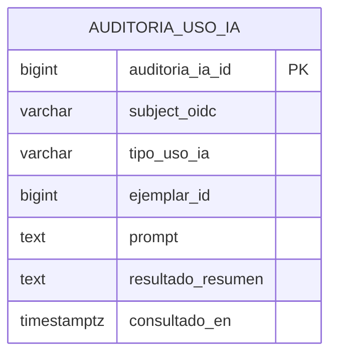
```mermaid
erDiagram
    AUDITORIA_USO_IA {
        bigint auditoria_ia_id PK
        varchar subject_oidc
        varchar tipo_uso_ia
        bigint ejemplar_id
        text prompt
        text resultado_resumen
        timestamptz consultado_en
    }
```

---

## 5. 🔌 Especificación de la API

El contrato HTTP del proyecto está en [docs/api/openapi.yaml](docs/api/openapi.yaml) (OpenAPI 3). Desde el cliente se accede a los microservicios a través del API Gateway, con rutas agrupadas en `/api/catalog`, `/api/media`, `/api/notifications` y `/api/ai`. Donde hace falta autenticación, la API exige un JWT válido. Los listados son paginados (`page`, `size`) y las respuestas de error siguen el formato **RFC 9457** (`application/problem+json`).

Para que todas las APIs sigan el mismo criterio, el proyecto define reglas de desarrollo en Cursor. [api-contract.mdc](.cursor/rules/api-contract.mdc) fija el contrato HTTP y su alineación con OpenAPI. [api-design.mdc](.cursor/rules/api-design.mdc) recoge convenciones de rutas, DTOs y respuestas. [api-security.mdc](.cursor/rules/api-security.mdc) describe autenticación JWT y control de acceso.

La convención de nombres por capas (Base de datos, API, código y documentación) está disponible en: [naming-conventions.md](docs/engineering/naming-conventions.md), [ADR-0007](docs/adr/0007-english-http-spanish-persistence.md), [ADR-0006](docs/adr/0006-ejemplar-aggregate-http-kafka-naming.md), [ADR-0004](docs/adr/0004-catalog-rest-write-and-audit.md) (alta REST y auditoría en catálogo).

La definición de los mensajes en Kafka, el payload y las reglas de publicación están en [kafka-events.md](docs/events/kafka-events.md).

---

## 6. 📖 Historias de usuario

### **Desarrollo asistido por IA (gobierno del proceso)**

El desarrollo ha buscado generar **artefactos reutilizables**. Se partió definiendo las reglas aplicables a cada faceta del desarrollo: [reglas del repositorio](.cursor/rules/), el backlog del proyecto en [backlog.md](docs/backlog/backlog.md) y un índice operativo para agentes IA en [AGENTS.md](AGENTS.md).

A partir de los casos de uso, la descripción del sistema y el modelo de datos se identificó el backlog inicial; después se refinó cada historia y se desglosó en tickets de trabajo con **Reglas aplicables por capa** por TASK. El flujo detallado está en [ai-development-playbook.md](docs/onboarding/ai-development-playbook.md).

El detalle del ciclo por historia se resume en:

- 1. Refinamiento de la HU con la skill [hu-refinement-mtl](.cursor/skills/hu-refinement-mtl/SKILL.md) (mensaje breve con `HU-XXX`)
- 2. Análisis del documento generado (`docs/backlog/HU-XXX-*.md`)
- 3. Cierre de riesgos y **Aclaraciones pendientes** (refinamiento humano)
- 4. Desglose en tickets con [hu-breakdown-mtl](.cursor/skills/hu-breakdown-mtl/SKILL.md) (`HU-*-ticket-breakdown.md`)
- 5. Implementación de cada TASK con [encargo-mtl](.cursor/skills/encargo-mtl/SKILL.md): mensaje mínimo (`TASK-HU-XXX-nn` + `@` al breakdown); el agente completa objetivo, alcance y definición de hecho desde el breakdown. Encargo completo solo en TASKs complejos (véase la skill y [hu-breakdown-and-encargo.md](docs/ai-process-evidence/hu-breakdown-and-encargo.md))
- 6. Abrir PR: [.github/pull_request_template.md](.github/pull_request_template.md) (GitHub la precarga desde la rama **base**, `main`) — [github-branching.md](docs/onboarding/github-branching.md)
- 7. Tras merge: ticket → **Hecho** en el breakdown; **Estado** de la HU en [backlog.md](docs/backlog/backlog.md) §3

Por cuestiones operativas, al comienzo de la historia se hacen comprobaciones iniciales que permiten detectar historias incompletas o mal formadas.

La **supervisión humana** se concentra en cerrar riesgos y aclaraciones en cada `docs/backlog/HU-*.md`, validar el alcance de cada TASK antes de implementar, pedir al agente una **revisión explícita** tras cada TASK, contra las reglas del breakdown, y confirmar tests y PR antes del merge. Además se han implementado skills específicas de revisión para la capa de persistencia y backend: [db-postgresql-mtl](.cursor/skills/db-postgresql-mtl/SKILL.md) ([db-mongo-mtl](.cursor/skills/db-mongo-mtl/SKILL.md)); revisión transversal del diff (tests, seguridad, arquitectura, etc.) en [.cursor/skills/review](.cursor/skills/review/README.md).

**Evidencia del proceso:** hay ejemplos del proceso en [docs/ai-process-evidence/](docs/ai-process-evidence/README.md). Muestra representativa por fase del ciclo de vida: [prompts.md](prompts.md).

A continuación se incluye el backlog del proyecto. Documentación completa (historias, criterios y tickets): [backlog.md](docs/backlog/backlog.md).

| ID | Título | Estado |
|----|--------|--------|
| HU-001 | Autenticación OIDC | Cerrada |
| HU-002 | Fichas publicadas (lista y detalle) | Cerrada |
| HU-003 | Localización en mapa (detalle) | Cerrada |
| HU-004 | Suscripción por correo sin cuenta | Cerrada |
| HU-005 | Alta de ficha de árbol | Cerrada |
| HU-006 | Fotografías asociadas al árbol | Cerrada |
| HU-007 | Aviso por correo al crear ficha | Cerrada |
| HU-008 | Edición y baja de mis árboles | Cerrada |
| HU-009 | Identificación orientativa por imagen | Próxima versión |
| HU-010 | Chat asistido | Cerrada |
| HU-011 | Maestros de catálogo | Cerrada |
| HU-012 | Gestión de suscripciones | Cerrada |
| HU-013 | Estructura de páginas, navegación y guardas por rol (MVP) | Cerrada |
| HU-014 | Consulta de fotografías del árbol | Cerrada |
| HU-015 | Proyección y enriquecimiento Mongo | Cerrada |
| HU-016 | Consulta de características de especie (ADMIN, MVP) | Cerrada |

---

## 7. 🎫 Tickets de trabajo

El desglose homogéneo usa la skill [hu-breakdown-mtl](.cursor/skills/hu-breakdown-mtl/SKILL.md): un mensaje breve con `HU-XXX` genera `docs/backlog/HU-*-ticket-breakdown.md` con orden, dependencias y **Reglas aplicables por capa**.

La implementación de cada TASK sigue [encargo-mtl](.cursor/skills/encargo-mtl/SKILL.md): la especificación vive en el breakdown; lo habitual es un **mensaje mínimo** (`Implementa TASK-HU-XXX-nn` + enlace al breakdown) y que el agente estructure el encargo. Resumen del flujo de skills: [AGENTS.md](AGENTS.md) § «Cómo encargar trabajo al agente».

En la generación de tickets de trabajo se incluye explícitamente una sección con las reglas de Cursor que debe aplicar el agente de IA al implementarlos.

**Evidencia (desglose e encargos):** HU-008 y HU-016 (incl. encargo TASK-HU-016-02) en [hu-breakdown-and-encargo.md](docs/ai-process-evidence/hu-breakdown-and-encargo.md).

---

## 8. 🔀 Pull requests

Para el trabajo con GitHub se ha definido una estrategia sencilla de ramas — detalle en [docs/onboarding/github-branching.md](docs/onboarding/github-branching.md).

Plantilla PR: [.github/pull_request_template.md](.github/pull_request_template.md) — trazabilidad con las HU; se precarga desde la rama base `main` (en **fix/chore**, trazabilidad HU → **N/A**).

En cada PR, **GitHub Actions** ejecuta en paralelo tests Java (`mvn test`), calidad frontend (`lint`, `typecheck`, Vitest) y escaneo de secretos (Gitleaks) — workflow [.github/workflows/ci.yml](.github/workflows/ci.yml).

Adicionalmente, en cada PR, se lanza una revisión adicional desde **Codex**.

Existen dos workflows de **GitHub Actions** adicionales que se ejecutan manualmente: E2E Playwright y auditoría de dependencias ([docs/engineering/devsecops-ci.md](docs/engineering/devsecops-ci.md)).

**Evidencia (PRs documentados):** ejemplos HU-004 y HU-008 en [pull-request-examples.md](docs/ai-process-evidence/pull-request-examples.md).

