## Índice

1. 📋 [Ficha del proyecto](#1-ficha-del-proyecto)
2. 🌳 [Descripción general del producto](#2-descripción-general-del-producto)
   - [2.1 Objetivo](#21-objetivo)
   - [2.2 Características y funcionalidades principales](#22-características-y-funcionalidades-principales)
   - [2.2.1 Diagrama de contexto (C1)](#221-diagrama-de-contexto-del-sistema-c1)
   - [2.2.2 Diagrama de casos de uso del sistema](#222-diagrama-de-casos-de-uso-del-sistema)
   - [2.3 Diseño y experiencia de usuario](#23-diseño-y-experiencia-de-usuario)
   - [2.4 Instrucciones de instalación](#24-instrucciones-de-instalación)
   - [2.5 Demo del MVP](#25-demo-del-mvp)
3. 🏗️ [Arquitectura del sistema](#3-arquitectura-del-sistema)
   - [3.1 Diagrama de arquitectura](#31-diagrama-de-arquitectura)
   - [3.2 Descripción de componentes principales](#32-descripción-de-componentes-principales)
   - [3.3 Descripción de alto nivel del proyecto y estructura de ficheros](#33-descripción-de-alto-nivel-del-proyecto-y-estructura-de-ficheros)
   - [3.4 Infraestructura y despliegue](#34-infraestructura-y-despliegue)
   - [3.5 Seguridad](#35-seguridad)
   - [3.6 Tests](#36-tests)
4. 🛢️ [Modelo de datos](#4-modelo-de-datos)
   - [4.1 Modelo lógico del sistema completo](#41-modelo-lógico-del-sistema-completo)
   - [4.2 Diagrama de entidad-relación (implementación física)](#42-diagrama-de-entidad-relación-implementación-física)
5. 🔌 [Especificación de la API](#5-especificación-de-la-api)
6. 📖 [Historias de usuario](#6-historias-de-usuario)
7. 🎫 [Tickets de trabajo](#7-tickets-de-trabajo)
8. 🔀 [Pull requests](#8-pull-requests)
  
---

## 1. 📋 Ficha del proyecto

### **1.1. Tu nombre completo:**

Luís María de Frutos Redondo.

### **1.2. Nombre del proyecto:**

MyTreeLibrary.

### **1.3. Descripción breve del proyecto:**

MyTreeLibrary es una solución digital para crear y gestionar tu colección personal de árboles singulares, almacenando fotografías, localización geográfica y datos relevantes de cada ejemplar. Diseñada para aficionados, permite compartir información públicamente y fomentar una comunidad colaborativa. En el MVP, la IA apoya la consulta de características de especie por administradores; la identificación por imagen y el chat se prevén en versiones posteriores.

### **1.4. URL del proyecto:**

[https://github.com/ldefrutos1/AI4Devs-finalproject](https://github.com/ldefrutos1/AI4Devs-finalproject)

### **1.5. URL o archivo comprimido del repositorio**

[https://github.com/ldefrutos1/AI4Devs-finalproject](https://github.com/ldefrutos1/AI4Devs-finalproject)

---

## 2. 🌳 Descripción general del producto

### **2.1. Objetivo:**

#### Propósito

Desarrollar una plataforma web que permita registrar, organizar y consultar fotografías, ubicaciones y datos relevantes de árboles de tu ciudad, facilitando al usuario la creación de una biblioteca personal digital y la posibilidad de compartir esa información de forma pública.

#### Valor aportado (qué soluciona)

La solución combina la catalogación personal con la posibilidad de compartir y crear comunidad en torno a una afición compartida.

#### Destinatarios de la solución

La solución está dirigida a aficionados a la naturaleza en general y puede resultar de especial utilidad para docentes y monitores de tiempo libre.

### **2.2. Características y funcionalidades principales:**

#### Registro y publicación de árboles

El sistema permite registrar árboles mediante fichas con información relevante, fotografías y ubicación, posibilitando su publicación para consulta pública. Los usuarios autenticados con perfil de colaborador pueden dar de alta nuevas fichas de ejemplares, así como editar o eliminar los registros creados por ellos mismos. El perfil de administrador puede dar de alta fichas y editar o eliminar cualquier ejemplar del catálogo.

#### Consulta pública y visualización geográfica

El sistema implementa una consulta pública de los árboles publicados mediante listado y detalle; mostrando en la ficha de detalle las fotografías de cada árbol y su localización sobre mapa de forma clara e intuitiva.

#### Notificaciones

La solución ofrece un sistema de notificaciones para comunicar novedades a usuarios suscritos, sin necesidad de que estos dispongan de cuenta en la plataforma.

#### Integración con IA

En el **MVP**, usuarios con rol de administrador pueden consultar las características de una especie, para futuras versiones se incorporará la identificación orientativa por imagen y un chat.

### **2.2.1 Diagrama de contexto del sistema (C1)**

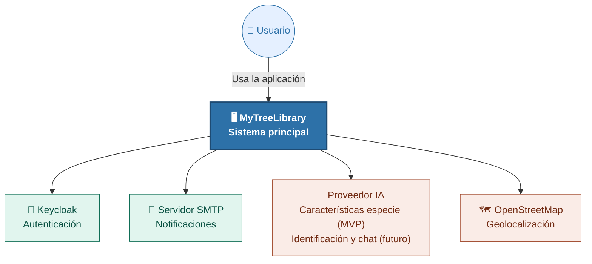
```mermaid
flowchart TB
    classDef user fill:#E5F0FF,stroke:#2D71A8,stroke-width:1px,color:#2D71A8
    classDef system fill:#2D71A8,stroke:#1E4B73,stroke-width:2px,color:#FFF,font-weight:bold
    classDef soporte fill:#E1F5EE,stroke:#0F6E56,stroke-width:1px,color:#085041
    classDef externo fill:#FAECE7,stroke:#993C1D,stroke-width:1px,color:#712B13

    U(("👤 Usuario")):::user
    S["🖥️ MyTreeLibrary<br>Sistema principal"]:::system

    KC["🔐 Keycloak<br>Autenticación"]:::soporte
    SMTP["📧 Servidor SMTP<br>Notificaciones"]:::soporte
    PIA["🧠 Proveedor IA<br>Características especie (MVP)<br>Identificación y chat (futuro)"]:::externo
    MAP["🗺️ OpenStreetMap<br>Geolocalización"]:::externo

    U -->|Usa la aplicación| S
    S --> KC
    S --> SMTP
    S --> PIA
    S --> MAP
```


### **2.2.2 Diagrama de Casos de Uso del sistema**

A continuación se incluye el diagrama de casos de uso del sistema.

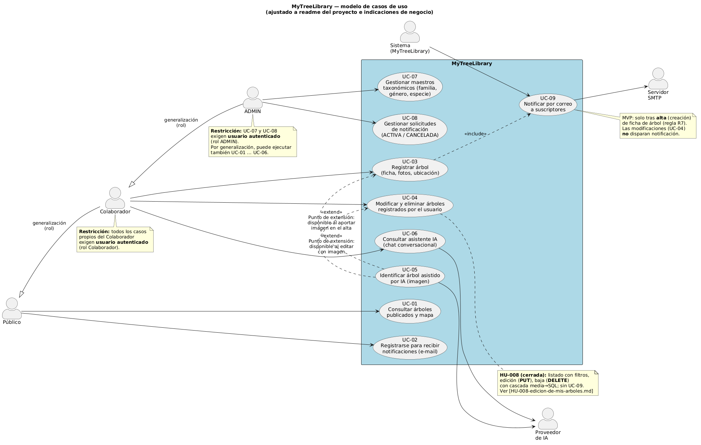

| ID | Nombre | Actor principal |
| --- | --- | --- |
| UC-01 | Consultar árboles publicados y mapa | Público |
| UC-02 | Registrarse para recibir notificaciones | Público |
| UC-03 | Registrar árbol | Colaborador |
| UC-04 | Modificar y eliminar árboles del colaborador | Colaborador |
| UC-05 | Identificar árbol asistido por IA (imagen) | Colaborador |
| UC-06 | Consultar asistente IA (chat) | Colaborador |
| UC-07 | Gestionar tablas de catálogo (maestros taxonómicos) | ADMIN |
| UC-08 | Gestionar solicitudes de notificación | ADMIN |
| UC-09 | Notificar por correo a suscriptores | Sistema |

\* UC-05 y UC-06: fuera del MVP (HU-009, HU-010 — próxima versión en [backlog.md](docs/backlog/backlog.md) §3).

\* UC-04: **COLABORADOR** solo sobre fichas propias; **ADMIN** (generalización de rol) sobre **cualquier** ficha ([HU-008](docs/backlog/HU-008-edicion-de-mis-arboles.md)).

*El Modelo completo se puede consultar en:* [resumen de casos de uso](docs/use-cases/use-case-summary.md) · [modelo PlantUML](docs/use-cases/use-case-model.puml)

### **2.3. Diseño y experiencia de usuario:**

El sistema está diseñada para facilitar el alta de ejemplares a partir de fotografías; el usuario selecciona que fotografias desea subir y la aplicación extrae la ubicación del ejemplar (latitud y longitud) de los metadatos EXIF de la primera fotografia la ubicación del ejemplar. En caso de que las imagenes no tengan metadatos de ubicación el usuario puede seleccionar la posición del ejemplar directamente en el mapa (componente OpenStreetMap).

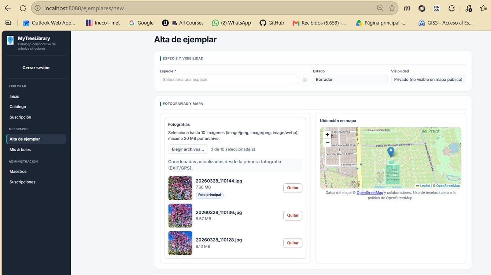

La aplicación implementa una navegación simple por roles con una **página de entrada (Inicio)** adaptada a cada perfil.


### Navegación de la aplicación

---

#### 🌐 Público &nbsp;·&nbsp; sin autenticación

```
🏠  Inicio                   /
🌳  Catálogo                 /ejemplares
    └─ Detalle               /ejemplares/:id
✉️  Suscripción             /subscriptions/new
```

---

#### 👤 Colaborador &nbsp;·&nbsp; usuario autenticado

↳ *Incluye todas las páginas públicas*

```
➕  Alta de ejemplar         /ejemplares/new
📋  Mis árboles              /mis-ejemplares
    └─ Edición de ficha      /ejemplares/:id/edit
```

---

#### 🛡️ Admin &nbsp;·&nbsp; privilegios completos

↳ *Incluye todas las páginas de colaborador*

```
🗄️  Maestros                 /admin/masters
👥  Suscripciones            /admin/subscriptions
```

---

### Resumen de permisos

| Página | Público | Colaborador | Admin |
|---|:---:|:---:|:---:|
| Inicio `/` | ✅ | ✅ | ✅ |
| Árboles `/ejemplares` | ✅ | ✅ | ✅ |
| Detalle `/ejemplares/:id` | ✅ | ✅ | ✅ |
| Suscripción `/subscriptions/new` | ✅ | ✅ | ✅ |
| Alta de ejemplar `/ejemplares/new` | — | ✅ | ✅ |
| Mis árboles `/mis-ejemplares` | — | ✅ | ✅ |
| Edición de ficha `/ejemplares/:id/edit` | — | ✅ | ✅ |
| Maestros `/admin/masters` | — | — | ✅ |
| Suscripciones `/admin/subscriptions` | — | — | ✅ |

Inicio
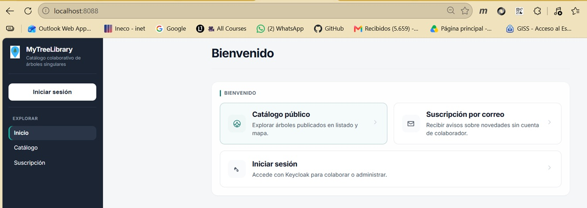

Catálogo (/ejemplares)
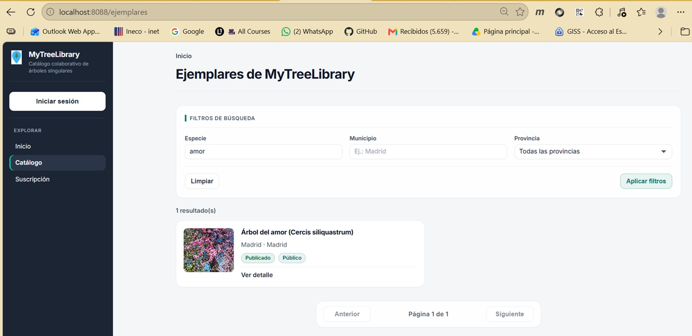

Detalle (/ejemplares/:id)
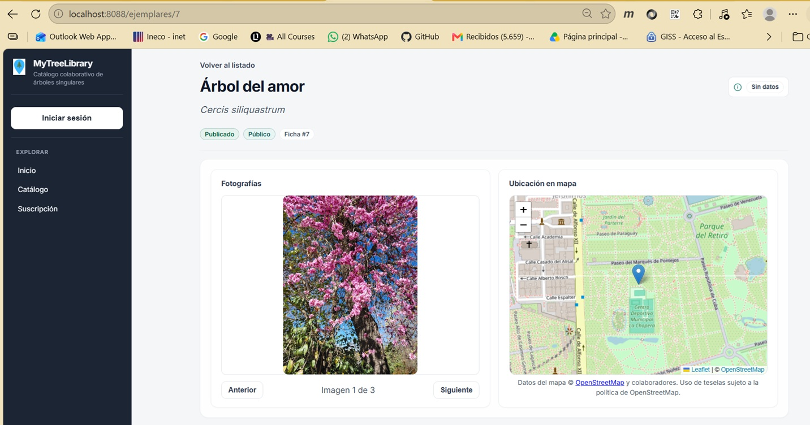

Carrusel
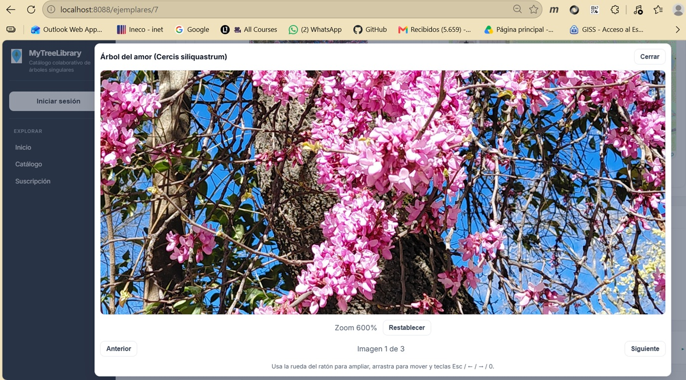

### **2.4. Instrucciones de instalación entorno de Desarrollo:**

1. **Infraestructura:** para poder ejecutar la aplicación en desarrollo se necesita arrancar los contenedores que tienen la infraestructura (PostgreSQL, Mongo, ...) definidos en [`infra/compose/docker-compose.yml`](infra/compose/docker-compose.yml) siguiendo estos pasos:
- Copiar el archivo de variables de entorno de ejemplo y adaptarlo si fuera necesario: `infra/compose/.env.example` → `infra/compose/.env`.
- Desde `infra/compose/`, ejecutar:
  ```bash
  docker compose up -d
  ```
2. **Backend:** los servicios de backend se arrancan desde la raíz del repo, hay que arrancar **una terminal por microservicio**, con perfil **`dev`** (siempre se debe arrancar **api-gateway** además de los microservicios a probar; ver tabla). Ejemplo con api-gateway y catalog-service:
   ```bash
   mvn -f services/pom.xml -pl api-gateway spring-boot:run -Dspring-boot.run.profiles=dev
   mvn -f services/pom.xml -pl catalog-service spring-boot:run -Dspring-boot.run.profiles=dev
   ```
3. **Frontend:** para ejecutar el frontend se deben seguir los siguientes pasos
- Copiar el archivo de variables de entorno de ejemplo y adaptarlo si fuera necesario  `frontend/.env.example` → `frontend/.env`. 
- Desde `frontend/`, ejecutar:
   ```bash
   `npm install` 
   `npm run dev`
   ``` 

Una vez levantados los contenedores y la parte front y back de la aplicación estarán disponibles estas url: 
   - → **UI** de la aplicación: **http://localhost:5173**
   - → **API Gateway**: **http://localhost:8080**
   - → **Microservicios**: **http://localhost:8081-8084**
   - → **Keycloak** consola: **http://localhost:8180/** (usuario: admin. NOTA: los usuarios de la aplicación definidos en el realm son admin_mtl, colaborador)
   - → **MinIO** consola: **http://localhost:9001/login** (usuario: minio)
   - → **Grafana**: **http://localhost:3000/** (usuario: admin)
   - → **Prometheus**: **http://localhost:9090/targets**

**Dependencias por flujo**
| Flujo | Compose (además de Postgres/Keycloak) | Servicios levantados |
|-------|----------------------------------------|------------------------------------------------------------------------|
| Cualquier flujo vía SPA | — | **api-gateway** (obligatorio) |
| Consulta pública | — | api-gateway, catalog-service |
| Alta / edición de árbol | Redis, Kafka | api-gateway, catalog-service (+ **media-service** si hay fotos) |
| Fotos (subida) | MinIO | api-gateway, media-service (+ **catalog-service** si aún no existe la ficha) |
| Aviso por correo (alta de ejemplar) | Kafka, Mailpit | api-gateway, catalog-service, notification-service |
| Admin (maestros / suscripciones) | — | api-gateway, catalog-service; notification-service (suscripciones) |
| Consulta IA especie (ADMIN, stub) | — | api-gateway, ai-assistant-service + **catalog-service** para pantallas de alta/edición con popup de especie |

**Detalle infraestructura local:** [infra/compose/README.md](infra/compose/README.md).

**Detalle operativo** (puertos, usuarios Keycloak, Flyway, incidencias): [local-setup-guide.md](docs/onboarding/local-setup-guide.md).


---

### **2.5. Demo del MVP:**

**Vídeo** (~10 min): *pendiente* — se añadirá el enlace en este apartado tras la grabación.

| Paso | Qué se muestra |
|------|----------------|
| 1 | Un visitante recorre el catálogo **sin login**: listado, ficha de detalle y mapa |
| 2 | Un **colaborador** inicia sesión y da de alta un ejemplar en estado publicado |
| 3 | Tras el alta, el aviso por correo queda visible en **Mailpit** ([localhost:8025](http://localhost:8025)) |
| 4 | Un usuario **ADMIN** entra en maestros taxonómicos o en la gestión de suscripciones |
| 5 | Como **ADMIN**, se pide una sugerencia IA de enriquecimiento de especie (modo `stub`): precarga el popup; la persistencia sigue siendo manual al guardar |

Usuarios de prueba: [infra/compose/README.md](infra/compose/README.md). Historias de usuario implicadas: [§6](#6-historias-de-usuario) · [backlog.md](docs/backlog/backlog.md).

---

## 3. 🏗️ Arquitectura del sistema

**NOTA:** La elección de una arquitectura de microservicios en Java con Spring y Vue tiene un **__propósito didáctico__**, con el fin de aprender estas tecnologías.

En esta sección:

- [3.1 Diagrama de arquitectura](#31-diagrama-de-arquitectura)
- [3.2 Descripción de componentes principales](#32-descripción-de-componentes-principales)
- [3.3 Descripción de alto nivel del proyecto y estructura de ficheros](#33-descripción-de-alto-nivel-del-proyecto-y-estructura-de-ficheros)
- [3.4 Infraestructura y despliegue](#34-infraestructura-y-despliegue)
- [3.5 Seguridad](#35-seguridad)
- [3.6 Tests](#36-tests)

### **3.1. Diagrama de arquitectura:**

La aplicación se desarrolla en microservicios con Spring en la parte de backend y Vue como tecnología frontend.

#### Patrón y Stack tecnológico

- **Arquitectura:** Microservicios 
- **Seguridad:** OIDC y JWT

**Stack tecnológico principal:**

- **Backend:** Spring Boot 4 y Maven
- **Frontend:** Vue 3
- **Identidad:** Keycloak para OIDC y JWT
- **Eventos de dominio:** Kafka
- **Base de datos SQL:** PostgreSQL
- **Base de datos NoSQL:** MongoDB
- **Caché:** Redis
- **Almacenamiento de imágenes:** Compatible S3 (MinIO)
- **Observabilidad:** Prometheus + Grafana; métricas vía Actuator/Micrometer en cada microservicio

**Decisiones documentadas ADR:** el Registro de Deciones de Arquitectura se encuentra en la carpeta [docs/adr](docs/adr/README.md); caben destacar la decisión de descubrimiento y configuración de microservicios **sin Eureka ni Spring Cloud Config** ( las labores son asumidas por Compose/Kubernetes) — [ADR-0001](docs/adr/0001-discovery-y-configuracion-por-orquestador.md) y la implementación de **observabilidad** ([ADR-0005](docs/adr/0005-microservices-observability-spring-boot.md)).


#### C2 — Diagrama de contenedores (nivel 2)

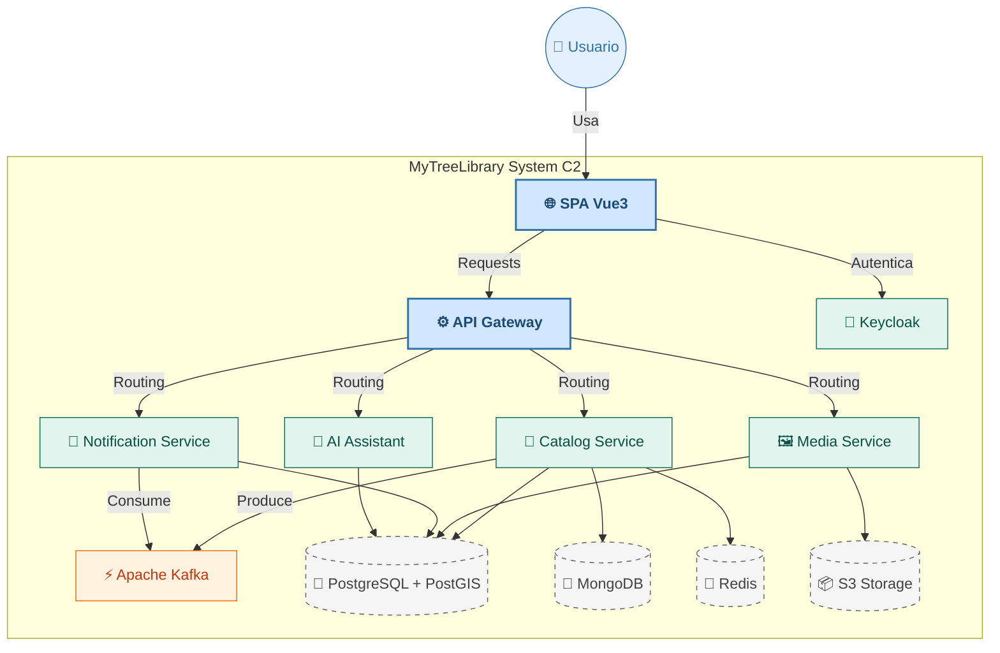
```mermaid
flowchart TB
    %% --- Estilos ---
    classDef user fill:#E5F0FF,stroke:#2D71A8,stroke-width:1px,color:#2D71A8;
    classDef web fill:#D1E7FF,stroke:#2D71A8,stroke-width:2px,color:#1E4B73,font-weight:bold;
    classDef service fill:#E1F5EE,stroke:#0F6E56,stroke-width:1px,color:#085041;
    classDef infra fill:#FFF3E0,stroke:#EF6C00,stroke-width:1px,color:#BF360C;
    classDef db fill:#F5F5F5,stroke:#616161,stroke-width:1px,color:#424242,stroke-dasharray: 5 5;

    %% --- Usuario ---
    U(("👤 Usuario")):::user

    %% --- Límite del Sistema ---
    subgraph mtl["MyTreeLibrary System C2"]
        direction TB
        
        %% Frontend y Entrada
        SPA["🌐 SPA Vue3"]:::web
        GW["⚙️ API Gateway"]:::web
        
        %% Servicios
        KC["🔐 Keycloak"]:::service
        CAT["📂 Catalog Service"]:::service
        MED["🖼️ Media Service"]:::service
        NOT["📧 Notification Service"]:::service
        AIS["🧠 AI Assistant"]:::service
        
        %% Infraestructura y Datos
        K["⚡ Apache Kafka"]:::infra
        PG[("🐘 PostgreSQL + PostGIS")]:::db
        MG[("🍃 MongoDB")]:::db
        RD[("🚀 Redis")]:::db
        OBJ[("📦 S3 Storage")]:::db
    end

    %% --- Relaciones ---
    U -->|Usa| SPA
    SPA -->|Autentica| KC
    SPA -->|Requests| GW
    
    GW -->|Routing| CAT
    GW -->|Routing| MED
    GW -->|Routing| AIS
    GW -->|Routing| NOT
    
    CAT --> PG
    CAT --> RD
    CAT -->|Produce| K
    CAT --> MG
    
    MED --> PG
    MED --> OBJ
    
    NOT --> PG
    NOT -->|Consume| K
    
    AIS --> PG
```

### **3.2. Descripción de componentes principales**

A continuación se detallan los componentes del diagrama C2 (§3.1), propios del sistema. No se listan los componentes de la capa e infraestructura (Keycloak, PostgreSQL, Mongo, Redis, S3 MinIO), ni dependencias externas como el proveedor de mapas (**OpenStreetMap** / **Leaflet**) ni el proveedor de IA.

> En los bloques **3.2.1–3.2.4**, los diagramas y secuencias técnicas están en bloques **Desplegar** (clic en el título para expandir o contraer).

#### Capa de aplicación y entrada

| Componente | Tecnología | Responsabilidad |
| --- | --- | --- |
| **SPA** | Vue 3, Vite, TypeScript | Frontal de la aplicación. |
| **API Gateway** | Spring Cloud Gateway (WebFlux), Spring Boot 4 | Puerta de entrada: enruta a los microservicios, aplica filtros de seguridad y correlación |

#### Capa de Microservicios de dominio

| Componente | Tecnología | Responsabilidad |
| --- | --- | --- |
| **catalog-service** | Spring Boot 4, JPA, Flyway, PostgreSQL, MongoDB, Redis; productor Kafka | Catálogo de ejemplares. |
| **media-service** | Spring Boot 4, JPA, Flyway, cliente MinIO (API S3) | Almacenamiento de imágenes. |
| **notification-service** | Spring Boot 4, JPA, Flyway, Spring Kafka, JavaMail | Notificación de novedades. |
| **ai-assistant-service** | Spring Boot 4 | Comunicación con proveedor IA. |

#### Capa de Observabilidad y herramientas de desarrollo local

| Componente | Tecnología | Responsabilidad |
| --- | --- | --- |
| **Prometheus** | Prometheus 3 (Compose) | Métricas vía `/actuator/prometheus`. |
| **Grafana** | Grafana 11 (Compose) | Dashboard **MTL Microservices**|

#### Esquemas en PostgreSQL

**C2 (detalle) — un servidor PostgreSQL con PostGIS, cuatro esquemas, un esquema por servicio:**


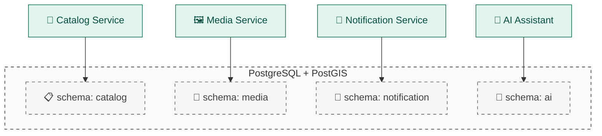
```mermaid
flowchart TB
    %% --- Estilos (Consistentes con los anteriores) ---
    classDef service fill:#E1F5EE,stroke:#0F6E56,stroke-width:1px,color:#085041;
    classDef db fill:#F5F5F5,stroke:#616161,stroke-width:1px,color:#424242,stroke-dasharray: 5 5;
    classDef cluster fill:#FAFAFA,stroke:#333,stroke-width:1px,stroke-dasharray: 5 5;

    %% --- Servicios (La capa de lógica) ---
    CAT["📂 Catalog Service"]:::service
    MED["🖼️ Media Service"]:::service
    NS["📧 Notification Service"]:::service
    AIS["🧠 AI Assistant"]:::service

    %% --- Subgraph PostgreSQL (La capa de almacenamiento) ---
    subgraph pg["PostgreSQL + PostGIS"]
        direction LR
        SCH_C["📋 schema: catalog"]:::db
        SCH_M["📸 schema: media"]:::db
        SCH_N["🔔 schema: notification"]:::db
        SCH_I["🤖 schema: ai"]:::db
    end

    %% --- Relaciones (Unívocas) ---
    CAT --> SCH_C
    MED --> SCH_M
    NS --> SCH_N
    AIS --> SCH_I
```

### **3.2.1 Autenticación en Front (Vue):**

En las pantallas que exigen identificarse, la SPA controla que se inicie sesión con **Keycloak** (OIDC, flujo *Authorization Code + PKCE*); por su parte **Vue Router** impide acceder a rutas protegidas si no hay sesión válida o si el usuario no tiene el rol necesario. Cada petición al backend lleva el **JWT** en la cabecera `Authorization`. Si el servidor responde **401** "No autorizado", el cliente intenta **renovar el token en silencio**; solo si esa renovación falla redirige al login. Más detalle en [jwt-gateway-strategy.md](docs/security/jwt-gateway-strategy.md) y [vue-development-guide.md](docs/onboarding/vue-development-guide.md).

<details>
<summary><strong>Desplegar</strong> — Diagramas C3/C4 del flujo de autenticación</summary>

A continuación se muestra la implementeción de seguridad del sistema que tiene como objetivo mantener rutas protegidas con sesión válida, renovar token de forma transparente y centralizar el manejo de `401` en cliente HTTP.

#### C3 — Componentes (nivel 3): autenticación en el contenedor SPA Vue

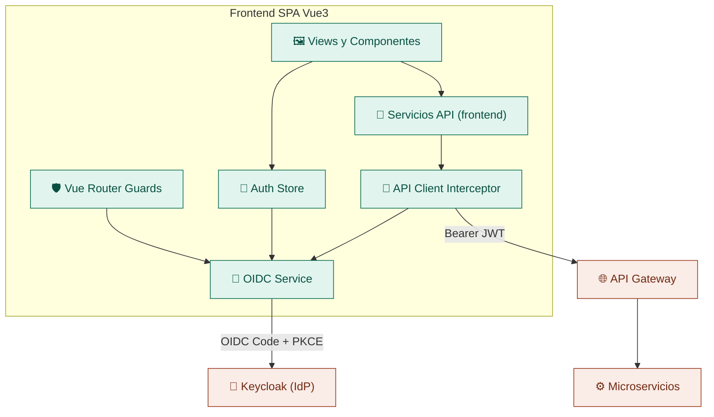
```mermaid
flowchart TB
    %% --- Estilos (Consistentes con la arquitectura anterior) ---
    classDef component fill:#E1F5EE,stroke:#0F6E56,stroke-width:1px,color:#085041;
    classDef external fill:#FAECE7,stroke:#993C1D,stroke-width:1px,color:#712B13;
    classDef subgraphStyle fill:#F9F9F9,stroke:#999,stroke-dasharray: 5 5;

    %% --- Subgraph Frontend ---
    subgraph SPA [Frontend SPA Vue3]
        direction TB
        Router["🛡️ Vue Router Guards"]:::component
        Views["🖼️ Views y Componentes"]:::component
        AuthStore["💾 Auth Store"]:::component
        Oidc["🔐 OIDC Service"]:::component
        Http["📡 API Client Interceptor"]:::component
        ApiSvc["🔌 Servicios API (frontend)"]:::component

        %% Relaciones internas
        Views --> AuthStore
        Views --> ApiSvc
        ApiSvc --> Http
        Http --> Oidc
        Router --> Oidc
        AuthStore --> Oidc
    end

    %% --- Componentes Externos ---
    IdP["🏢 Keycloak (IdP)"]:::external
    GW["🌐 API Gateway"]:::external
    Services["⚙️ Microservicios"]:::external

    %% --- Conexiones externas ---
    Oidc -->|OIDC Code + PKCE| IdP
    Http -->|Bearer JWT| GW
    GW --> Services
```

Responsabilidades clave:

- **Router Guards**: bloquean rutas con `requiresAuth` y comprueban `requiredRoles` (p. ej. `ADMIN` en `/admin/*`); consultan **directamente** el servicio OIDC (`getUser`, `signinSilent`, `login`), no el Auth Store.
- **Auth Store / useAuth**: estado reactivo de sesión (`currentUser`, `isAuthenticated`, roles) y listeners de eventos OIDC; lo consumen vistas y shell de navegación, no el guard.
- **OIDC Service** (`authService` en código): login, callback en `/auth/callback`, `signinSilent`, logout y renovación silenciosa automática (`automaticSilentRenew`).
- **Cliente HTTP** (`apiFetch` / `apiFetchBlob` en código): inyecta Bearer en rutas autenticadas; reintenta una vez tras `401` con `signinSilent`; si falla, redirige a login con `returnPath`.

Simplificaciones del diagrama C3 (no aparecen como cajas o flechas):

- **Servicios API (frontend)** agrupa módulos como `catalogService.ts`, `treeGalleryService.ts`, etc.; todos los autenticados pasan por `apiFetch`.
- **`publicApiFetch`** (mismo `apiClient.ts`): rutas públicas del gateway **sin** Bearer ni reintento OIDC (p. ej. suscripción por correo, enriquecimiento público).
- **API Client Interceptor** es la lógica de token y reintento en `apiFetch`, no un módulo aparte con ese nombre.
- El intercambio de código tras el redirect de Keycloak lo ejecuta la vista `AuthCallbackView`, no el guard ni el store en el primer paso.

#### C4 — Comportamiento (dinámico): secuencia de autenticación y acceso protegido

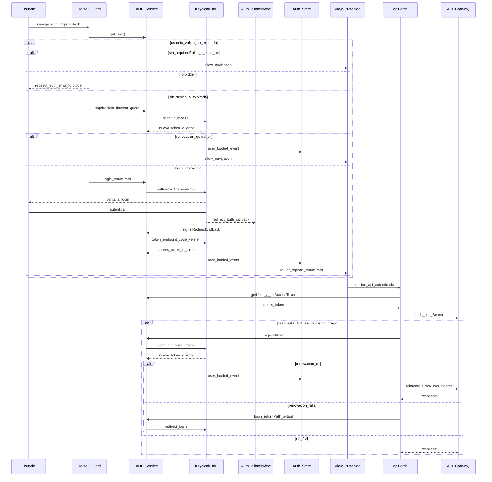
```mermaid
sequenceDiagram
  participant U as Usuario
  participant R as Router_Guard
  participant O as OIDC_Service
  participant K as Keycloak_IdP
  participant CB as AuthCallbackView
  participant A as Auth_Store
  participant V as View_Protegida
  participant H as apiFetch
  participant G as API_Gateway

  U->>R: navega_ruta_requiresAuth
  R->>O: getUser()

  alt usuario_valido_no_expirado
    alt sin_requiredRoles_o_tiene_rol
      R-->>V: allow_navigation
    else forbidden
      R-->>U: redirect_auth_error_forbidden
    end
  else sin_sesion_o_expirada
    R->>O: signinSilent_timeout_guard
    O->>K: silent_authorize
    K-->>O: nuevo_token_o_error
    alt renovacion_guard_ok
      O-->>A: user_loaded_event
      R-->>V: allow_navigation
    else login_interactivo
      R->>O: login_returnPath
      O->>K: authorize_Code+PKCE
      K-->>U: pantalla_login
      U->>K: autentica
      K-->>CB: redirect_auth_callback
      CB->>O: signinRedirectCallback
      O->>K: token_endpoint_code_verifier
      K-->>O: access_token_id_token
      O-->>A: user_loaded_event
      CB->>V: router_replace_returnPath
    end
  end

  V->>H: peticion_api_autenticada
  H->>O: getUser_y_getAccessToken
  O-->>H: access_token
  H->>G: fetch_con_Bearer

  alt respuesta_401_sin_reintento_previo
    H->>O: signinSilent
    O->>K: silent_authorize_iframe
    K-->>O: nuevo_token_o_error
    alt renovacion_ok
      O-->>A: user_loaded_event
      H->>G: reintento_unico_con_Bearer
      G-->>H: respuesta
    else renovacion_falla
      H->>O: login_returnPath_actual
      O->>K: redirect_login
    end
  else sin_401
    G-->>H: respuesta
  end
```

</details>

### **3.2.2 Kafka:**

Para el envío de notificaciones a suscriptores el sistema implementa una arquitectura de eventos (Event-Driven Architecture) con Kafka.

Tras el alta de un ejemplar, el envío de correo a suscriptores se realiza de forma asincrona (regla **R7**). Después de crear la ficha del ejemplar, **catalog-service** publica un evento en Kafka (`catalog.ejemplar.evento`) y **notification-service** lo recibe para enviar los correos. El formato del mensaje está en [kafka-events.md](docs/events/kafka-events.md).

<details>
<summary><strong>Desplegar</strong> — Diagramas C3/C4 productor/consumidor y secuencias Kafka</summary>

 Contrato del mensaje: [docs/events/kafka-events.md](docs/events/kafka-events.md). Nomenclatura técnica: [ADR-0006](docs/adr/0006-ejemplar-aggregate-http-kafka-naming.md). Configuración local: [services/README.md](services/README.md) (Kafka).

#### C3 — Productor: **catalog-service**

Tras un alta exitosa, el dominio notifica el evento mediante la interfaz `EjemplarCreadoEventPublisher` (puerto de aplicación). En entorno con Kafka activo, la implementación concreta es `KafkaEjemplarCreadoEventPublisher`, que publica en el topic. Si Kafka está desactivado (`mtl.catalog.kafka.enabled=false`, valor habitual en tests o arranque sin broker), entra `NoOpEjemplarCreadoEventPublisher`: el alta en PostgreSQL sigue funcionando, pero **no se envía ningún mensaje**.

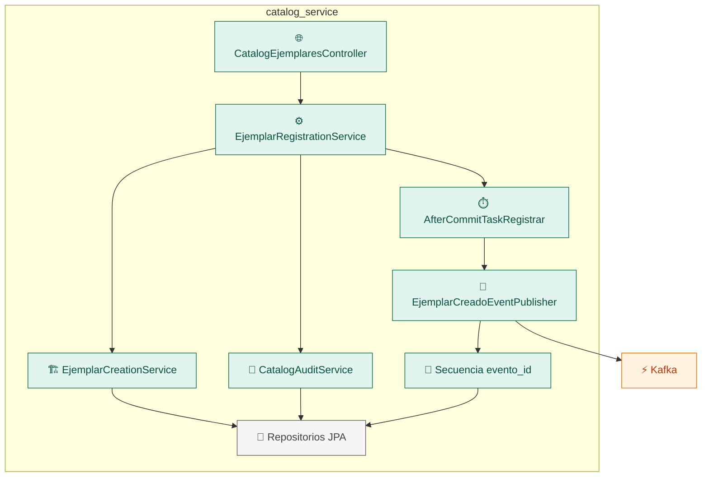
```mermaid
flowchart TB
    classDef service fill:#E1F5EE,stroke:#0F6E56,stroke-width:1px,color:#085041;
    classDef repo fill:#F5F5F5,stroke:#616161,stroke-width:1px,color:#424242;
    classDef infra fill:#FFF3E0,stroke:#EF6C00,stroke-width:1px,color:#BF360C;

    KafkaBroker["⚡ Kafka"]:::infra

    subgraph catalogSvc [catalog_service]
        direction TB
        EjemplaresCtrl["🌐 CatalogEjemplaresController"]:::service
        EjemplarReg["⚙️ EjemplarRegistrationService"]:::service
        EjemplarCre["🏗️ EjemplarCreationService"]:::service
        CatAud["📝 CatalogAuditService"]:::service
        AfterCommit["⏱️ AfterCommitTaskRegistrar"]:::service
        KafkaPub["📢 EjemplarCreadoEventPublisher"]:::service
        EventoSeq["🔢 Secuencia evento_id"]:::service
        JpaRepos["💾 Repositorios JPA"]:::repo

        EjemplaresCtrl --> EjemplarReg
        EjemplarReg --> EjemplarCre
        EjemplarReg --> CatAud
        EjemplarReg --> AfterCommit
        AfterCommit --> KafkaPub
        KafkaPub --> EventoSeq
        EjemplarCre --> JpaRepos
        CatAud --> JpaRepos
        EventoSeq --> JpaRepos
    end

    KafkaPub --> KafkaBroker
```

#### C3 — Consumidor: **notification-service**

El microservicio **notification-service** escucha el topic que publica **catalog-service**, persiste su propio registro en PostgreSQL (esquema `notification`) y envía los correos. A continuación se detalla el flujo seguido:

1. Un **listener** de Kafka recibe el mensaje JSON del alta de ejemplar.
2. La **ingestión** comprueba que el evento sea válido y de tipo `EJEMPLAR_CREADO`; cualquier otro tipo se descarta.
3. El **consumo** guarda el evento en `evento_catalogo`, identificado por `evento_id`. Si Kafka reenvía el mismo mensaje, ese id evita procesarlo dos veces.
4. El **procesador** genera las notificaciones y envía correo SMTP solo a suscriptores en estado **ACTIVA**.

Si Kafka está desactivado (`mtl.notification.kafka.enabled=false`, habitual en tests o sin broker), **no se arranca el listener** y el servicio no consume eventos (el resto del microservicio puede seguir operativo para otras APIs).

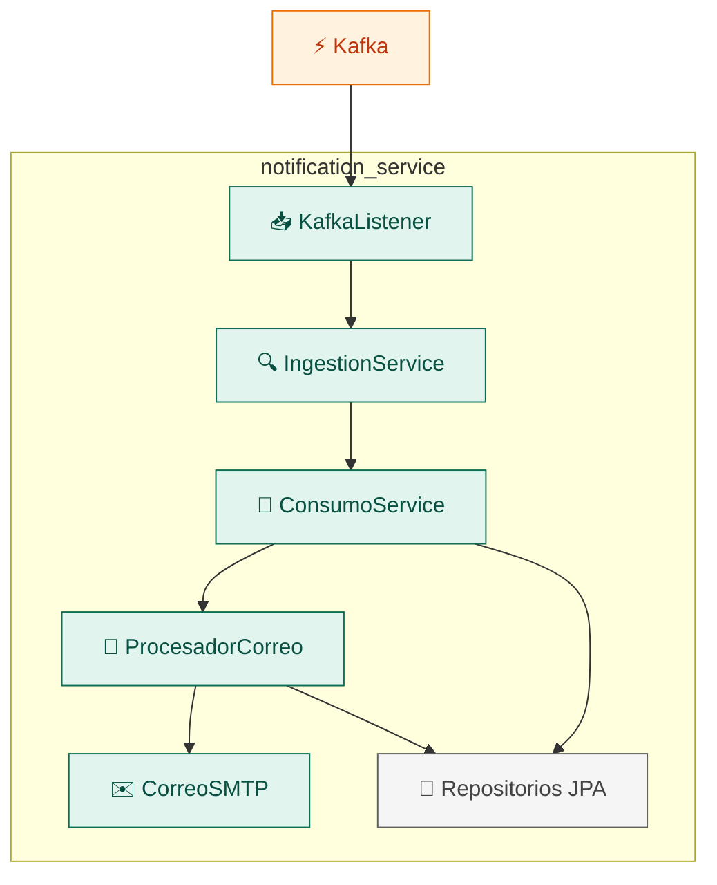
```mermaid
flowchart TB
    classDef service fill:#E1F5EE,stroke:#0F6E56,stroke-width:1px,color:#085041;
    classDef repo fill:#F5F5F5,stroke:#616161,stroke-width:1px,color:#424242;
    classDef infra fill:#FFF3E0,stroke:#EF6C00,stroke-width:1px,color:#BF360C;

    KafkaBroker["⚡ Kafka"]:::infra

    subgraph notifSvc [notification_service]
        direction TB
        Listener["📥 KafkaListener"]:::service
        Ingestion["🔍 IngestionService"]:::service
        Consumo["🔁 ConsumoService"]:::service
        Procesador["📧 ProcesadorCorreo"]:::service
        MailSender["✉️ CorreoSMTP"]:::service
        JpaRepos["💾 Repositorios JPA"]:::repo

        Listener --> Ingestion
        Ingestion --> Consumo
        Consumo --> Procesador
        Procesador --> MailSender
        Consumo --> JpaRepos
        Procesador --> JpaRepos
    end

    KafkaBroker --> Listener
```

#### Flujo completo (Alta de ejemplar → correo)

Tras login en Keycloak, la SPA desde la pantalla de alta de ejemplar invoca a través del API Gateway a **catalog-service**. Cuando se persiste la ficha este microservicio publica el evento en Kafka; **notification-service** consume el evento de Kafka y envía un correo al suscriptor (SMTP; Mailpit en desarrollo).

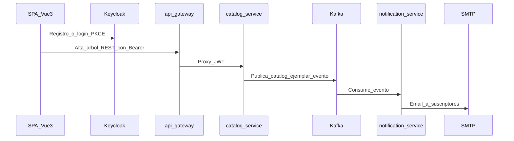
```mermaid
sequenceDiagram
  participant SPA as SPA_Vue3
  participant KC as Keycloak
  participant GW as api_gateway
  participant CAT as catalog_service
  participant K as Kafka
  participant N as notification_service
  participant Mail as SMTP
  SPA->>KC: Registro_o_login_PKCE
  SPA->>GW: Alta_arbol_REST_con_Bearer
  GW->>CAT: Proxy_JWT
  CAT->>K: Publica_catalog_ejemplar_evento
  K->>N: Consume_evento
  N->>Mail: Email_a_suscriptores
```

#### C4 — Secuencia de publicación (**EJEMPLAR_CREADO**)

Durante el alta de un ejemplar, **catalog-service** valida y guarda la ficha y la auditoría (**R3**) en la misma transacción PostgreSQL. En cuanto esa transacción hace **commit**, el cliente recibe **201 Created**: el ejemplar ya está persistido.

La publicación en Kafka ocurre **después**, de forma asíncrona (`AfterCommitTaskRegistrar`): se asigna un `evento_id` único y se envía el mensaje al topic `catalog.ejemplar.evento` (formato en [kafka-events.md](docs/events/kafka-events.md)).

Si Kafka falla en ese paso posterior, el alta **no se revierte**; el fallo queda solo en logs para revisión operativa.

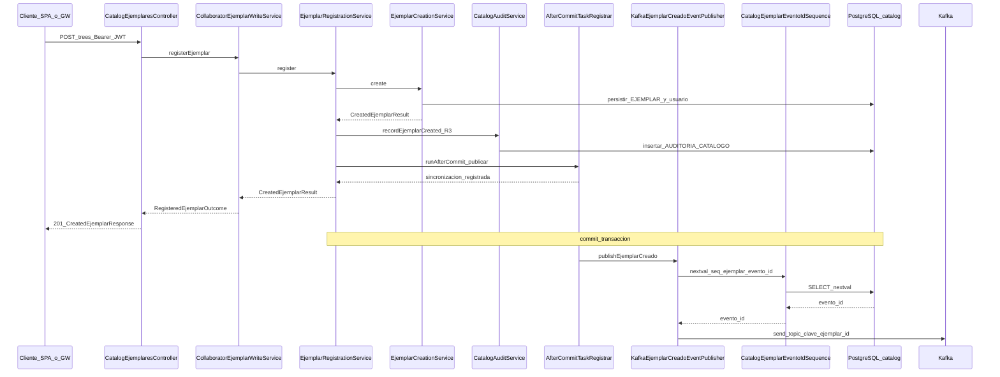
```mermaid
sequenceDiagram
  participant Client as Cliente_SPA_o_GW
  participant Ctrl as CatalogEjemplaresController
  participant Write as CollaboratorEjemplarWriteService
  participant Reg as EjemplarRegistrationService
  participant Cre as EjemplarCreationService
  participant Aud as CatalogAuditService
  participant Tx as AfterCommitTaskRegistrar
  participant Pub as KafkaEjemplarCreadoEventPublisher
  participant Seq as CatalogEjemplarEventoIdSequence
  participant PG as PostgreSQL_catalog
  participant KB as Kafka

  Client->>Ctrl: POST_trees_Bearer_JWT
  Ctrl->>Write: registerEjemplar
  Write->>Reg: register
  Reg->>Cre: create
  Cre->>PG: persistir_EJEMPLAR_y_usuario
  Cre-->>Reg: CreatedEjemplarResult
  Reg->>Aud: recordEjemplarCreated_R3
  Aud->>PG: insertar_AUDITORIA_CATALOGO
  Reg->>Tx: runAfterCommit_publicar
  Tx-->>Reg: sincronizacion_registrada
  Reg-->>Write: CreatedEjemplarResult
  Write-->>Ctrl: RegisteredEjemplarOutcome
  Ctrl-->>Client: 201_CreatedEjemplarResponse

  Note over Reg,PG: commit_transaccion
  Tx->>Pub: publishEjemplarCreado
  Pub->>Seq: nextval_seq_ejemplar_evento_id
  Seq->>PG: SELECT_nextval
  PG-->>Seq: evento_id
  Seq-->>Pub: evento_id
  Pub->>KB: send_topic_clave_ejemplar_id
```

#### C4 — Secuencia de consumo (**EJEMPLAR_CREADO**)

El listener pasa la información recibida en JSON a la ingestión ([kafka-events.md](docs/events/kafka-events.md)). La primera vez se inserta `evento_catalogo` por `evento_id`; en caso de que ya exista, no se repite; **notification-service** identifica el evento por `evento_id` y evita procesarlo dos veces. El procesador guarda notificación y envíos en `notification`, manda correo a suscriptores con suscripción **ACTIVA** y deja el evento en estado **PROCESADO**.

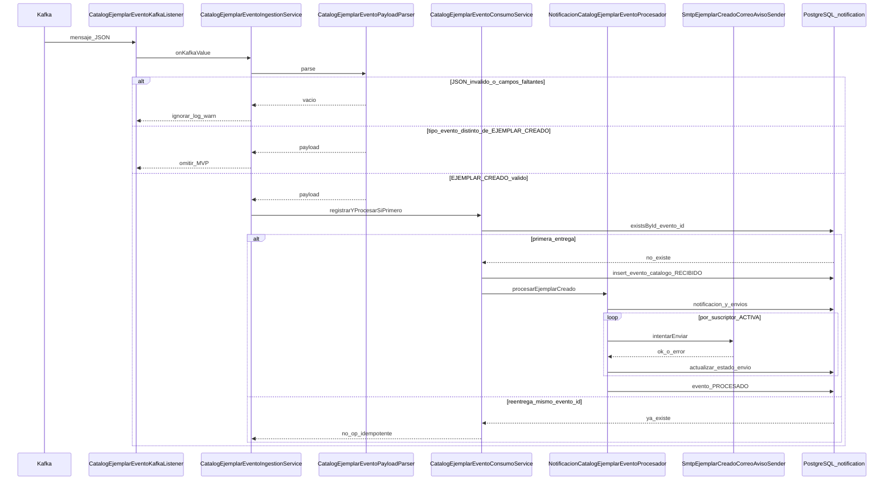
```mermaid
sequenceDiagram
  participant KB as Kafka
  participant Lst as CatalogEjemplarEventoKafkaListener
  participant Ing as CatalogEjemplarEventoIngestionService
  participant Parser as CatalogEjemplarEventoPayloadParser
  participant Con as CatalogEjemplarEventoConsumoService
  participant Proc as NotificacionCatalogEjemplarEventoProcesador
  participant Mail as SmtpEjemplarCreadoCorreoAvisoSender
  participant PG as PostgreSQL_notification

  KB->>Lst: mensaje_JSON
  Lst->>Ing: onKafkaValue
  Ing->>Parser: parse
  alt JSON_invalido_o_campos_faltantes
    Parser-->>Ing: vacio
    Ing-->>Lst: ignorar_log_warn
  else tipo_evento_distinto_de_EJEMPLAR_CREADO
    Parser-->>Ing: payload
    Ing-->>Lst: omitir_MVP
  else EJEMPLAR_CREADO_valido
    Parser-->>Ing: payload
    Ing->>Con: registrarYProcesarSiPrimero
    Con->>PG: existsById_evento_id
    alt primera_entrega
      PG-->>Con: no_existe
      Con->>PG: insert_evento_catalogo_RECIBIDO
      Con->>Proc: procesarEjemplarCreado
      Proc->>PG: notificacion_y_envios
      loop por_suscriptor_ACTIVA
        Proc->>Mail: intentarEnviar
        Mail-->>Proc: ok_o_error
        Proc->>PG: actualizar_estado_envio
      end
      Proc->>PG: evento_PROCESADO
    else reentrega_mismo_evento_id
      PG-->>Con: ya_existe
      Con-->>Ing: no_op_idempotente
    end
  end
```

</details>

### **3.2.3 Almacenamiento de fotografías:**

Los archivos binarios (fotografías de ejemplares) se guardan en un almacén compatible con S3 (MinIO en local) y los **datos descriptivos** (árbol, orden, tamaño, etc.) se almacenan en PostgreSQL, dentro del esquema `media`. Para subir una imagen, la aplicación pide al backend una URL temporal de subida, envía el fichero directamente al almacén —sin exponer las credenciales del bucket en el navegador— y, al terminar, confirma en la API para registrar la foto en base de datos. Detalle en [media-upload-hu006.md](docs/engineering/media-upload-hu006.md) y [HU-006](docs/backlog/HU-006-fotografias-asociadas-al-arbol.md).

<details>
<summary><strong>Desplegar</strong> — Secuencia presign, subida y confirmación</summary>

La SPA **nunca** recibe credenciales de bucket: tras crear la ficha del árbol en **catalog-service**, por cada imagen pide una **URL prefirmada** (`POST /api/media/uploads/presign`), sube el fichero con **PUT directo** al almacén y **confirma** (`POST /api/media/photos/confirm`) para registrar la fila en `media`; la primera confirmación del árbol queda como **foto principal**. La visibilidad de cada foto **hereda** la de la ficha. Contrato HTTP: [openapi.yaml](docs/api/openapi.yaml); historia y criterios: [HU-006](docs/backlog/HU-006-fotografias-asociadas-al-arbol.md); validaciones, propiedades, principal y EXIF en cliente: [media-upload-hu006.md](docs/engineering/media-upload-hu006.md).


```mermaid
sequenceDiagram
  autonumber
  actor U as Usuario
  participant SPA as SPA
  participant KC as Keycloak
  participant GW as API_Gateway
  participant CAT as catalog_service
  participant MS as media_service
  participant OBJ as MinIO_o_S3

  U->>SPA: Alta de arbol con fotos
  SPA->>KC: OIDC login PKCE
  KC-->>SPA: JWT

  SPA->>GW: POST /api/catalog/trees
  GW->>CAT: proxy JWT
  CAT-->>SPA: 201 treeId

  loop Por cada fotografía
    SPA->>GW: POST /api/media/uploads/presign
    GW->>MS: proxy JWT
    MS->>CAT: GET media-submission-permission
    CAT-->>MS: actorUsuarioAppId
    MS->>MS: validar MIME tamano cupo permiso
    MS-->>SPA: uploadUrl objectKey

    SPA->>OBJ: PUT binario uploadUrl
    OBJ-->>SPA: 2xx

    SPA->>GW: POST /api/media/photos/confirm
    GW->>MS: proxy JWT
    MS->>CAT: GET media-submission-permission
    CAT-->>MS: actorUsuarioAppId
    MS->>MS: validar e INSERT media.fotografia
    MS-->>SPA: 201 metadatos
  end
```

</details>

### **3.2.4 Uso de IA: características de especie (MVP) e identificación/chat (futuro)**

En el MVP la invocación a un LLM externo se ha restringido a la consulta de características de especie, función accesible para usuarios con rol **ADMIN**. El **frontend** invoca **ai-assistant-service** (`POST /api/ai/species/enrichment-suggestions`) pasando el nombre científico y el común; el servicio valida el JSON recibido del LLM (referencia [mongo.md](docs/data-model/mongo.md) §6.3) y devuelve un resultado **orientativo** para precargar el popup de enriquecimiento de especie. 

**Condiciones de producto (HU-016):** en local se usa `mtl.ai.provider.mode=stub` para simular el LLM (sin necesidad de una clave OpenAI). Desglose: [HU-016-ticket-breakdown.md](docs/backlog/HU-016-ticket-breakdown.md).

<details>
<summary><strong>Desplegar</strong> — Secuencia de consulta IA (MVP)</summary>

Flujo de consulta IA ( se precarga en popup con los datos recibidos del LLM y se guarda trazabilidad de la consulta en PostgreSQL `auditoria_uso_ia` — la responsabilidad de persistir enriquecimiento en catálogo/Mongo sigue en catalog-service).


```mermaid
sequenceDiagram
  autonumber
  actor U as Usuario_ADMIN
  participant SPA as SPA
  participant KC as Keycloak
  participant GW as API_Gateway
  participant AIS as ai_assistant_service
  participant Prov as Proveedor_IA_stub_u_OpenAI
  participant PG as PostgreSQL_ai

  U->>SPA: Solicitar sugerencia IA en popup
  SPA->>KC: OIDC login PKCE
  KC-->>SPA: JWT role ADMIN

  SPA->>GW: POST /api/ai/species/enrichment-suggestions
  GW->>AIS: proxy JWT
  AIS->>AIS: verificar rol ADMIN
  AIS->>AIS: construir prompt
  AIS->>Prov: solicitar JSON orientativo
  Prov-->>AIS: raw JSON
  AIS->>AIS: validar estructura mongo 6.3
  AIS->>PG: INSERT auditoria_uso_ia
  AIS-->>GW: DTO orientativo
  GW-->>SPA: 200 JSON
  SPA->>SPA: precargar campos edicion sin PUT catalog
```


</details>

### **3.3. Descripción de alto nivel del proyecto y estructura de ficheros**

Estructura de repositorio (monorepo):

```
proyecto/
├── frontend/                 # SPA Vue 3 (Vite)
├── e2e/                      # E2E UI (Playwright); ver `docs/engineering/testing-e2e.md`
├── services/                 # Gateway + microservicios Spring Boot (un directorio por despliegue)
│   ├── api-gateway/
│   ├── catalog-service/
│   ├── media-service/
│   ├── notification-service/
│   ├── ai-assistant-service/
│   └── system-e2e-tests/     # IT E2E HTTP contra el API Gateway (JWT real; ver README del módulo)
├── platform/
│   └── observability/        # Configuración de telemetría/trazas/logs (OTel, Prometheus, Grafana…)
├── infra/                    # Orquestación local y nube
│   ├── compose/              # Docker Compose (infra de apoyo); ver README.md en esa carpeta
│   └── k8s/                  # Manifiestos / Helm (según despliegue)
├── docs/
│   ├── adr/                  # Architecture Decision Records
│   ├── api/                  # OpenAPI (contrato del gateway)
│   ├── backlog/              # Historias y desgloses de tickets (HU-*)
│   ├── data-model/           # Modelo de datos (reglas, Mongo, readme §4)
│   ├── engineering/          # Guías: tests Java/Maven (`testing-java.md`), Flyway local (`flyway-dev-reset.md`), mapa canónico (`canonical-sources.md`)
│   ├── events/               # Contrato de eventos Kafka
│   ├── onboarding/           # Inicio rápido, ramas Git, guías Vue y diseño frontend
│   ├── security/             # JWT, gateway, estrategia de validación
│   ├── software-revisions/   # Revisiones y auditorías del proyecto
│   └── use-cases/            # Casos de uso
├── scripts/                  # Atajos PowerShell locales (`dev/`); ver README.md
├── .cursor/
│   ├── commands/             # Commands Cursor
│   ├── rules/                # Reglas Cursor (API, Spring, seguridad…)
│   └── skills/               # Skills de encargo, refinamiento HU, BD…
├── .github/                  # Plantillas de pull request
└── readme.md
```

### **3.4. Infraestructura y despliegue**

**Infraestructura:** el sistema necesita tener arrancada la infraestructura definida en `docker-compose.yml`, que levanta: **un** PostgreSQL/PostGIS (cuatro esquemas de aplicación: `catalog`, `media`, `notification`, `ai`), MongoDB, Redis, MinIO, Kafka, Keycloak, Mailpit (SMTP de prueba para notificaciones en local), Prometheus y Grafana para métricas y dashboards.

```bash
cd infra\compose
docker compose up -d
```

Grafana queda disponible en `http://localhost:3000` accediendo con usuario admin. El dahsboard del proyecto se en cuentra en la ruta: Dashboards - MyTreeLibrary - MTL Microservices.

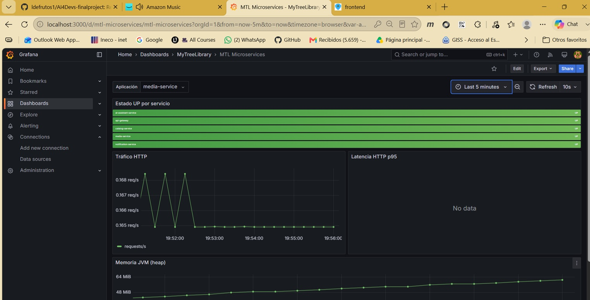

Detalle de servicios, puertos y arranque en Compose: [infra/compose/README.md](infra/compose/README.md).

**Aplicación:** para levantar los contenedores propios de la aplicación hay que usar `docker-compose.apps.yml` para levantar la SPA, el API Gateway y los microservicios como contenedores. Antes de arrancar se deben construir las imágenes de la SPA y los microservicios con [scripts/dev/build-images.ps1](scripts/dev/build-images.ps1). La SPA queda disponible en `http://localhost:8088/`; Prometheus usa los targets internos definidos en `prometheus-docker.yml`.

```bash
docker compose -f docker-compose.yml -f docker-compose.apps.yml up -d
```

**Despliegue Producción:** en entornos productivos el sistema se puede desplegar en un orquestador de contenedores (Kubernetes), se deben definir secretos externos, Keycloak y Kafka en HA según entorno, bases de datos gestionadas y almacenamiento de objetos S3 en nube.


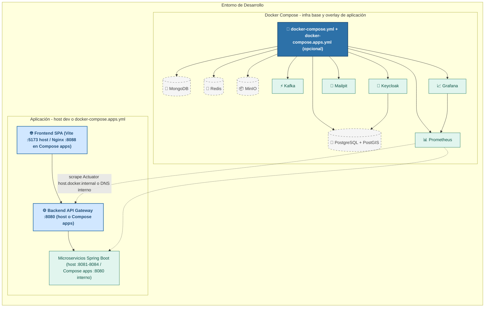
```mermaid
flowchart TB
    %% --- Estilos (Consistentes con toda la documentación) ---
    classDef orch fill:#2D71A8,stroke:#1E4B73,stroke-width:2px,color:#FFFFFF,font-weight:bold;
    classDef web fill:#D1E7FF,stroke:#2D71A8,stroke-width:2px,color:#1E4B73,font-weight:bold;
    classDef service fill:#E1F5EE,stroke:#0F6E56,stroke-width:1px,color:#085041;
    classDef db fill:#F5F5F5,stroke:#616161,stroke-width:1px,color:#424242,stroke-dasharray: 5 5;

    subgraph dev [Entorno de Desarrollo]
        direction TB

        subgraph host [Aplicación - host dev o docker-compose.apps.yml]
            direction TB
            SPAh["🌐 Frontend SPA (Vite :5173 host / Nginx :8088 en Compose apps)"]:::web
            GWh["⚙️ Backend API Gateway :8080 (host o Compose apps)"]:::web
            MSh["Microservicios Spring Boot (host :8081-8084 / Compose apps :8080 interno)"]:::service
            SPAh --> GWh
            GWh --> MSh
        end

        subgraph compose [Docker Compose - infra base y overlay de aplicación]
            direction TB
            DC["🐳 docker-compose.yml + docker-compose.apps.yml (opcional)"]:::orch

            KCd["🔐 Keycloak"]:::service
            Kd["⚡ Kafka"]:::service
            MPd["📧 Mailpit"]:::service
            PRd["📊 Prometheus"]:::service
            GRd["📈 Grafana"]:::service

            PGd[("🐘 PostgreSQL + PostGIS")]:::db
            MGd[("🍃 MongoDB")]:::db
            Rd[("🚀 Redis")]:::db
            S3d[("📦 MinIO")]:::db
        end

        DC --> PGd
        DC --> MGd
        DC --> Rd
        DC --> S3d
        DC --> Kd
        DC --> KCd
        DC --> MPd
        DC --> PRd
        DC --> GRd
        KCd --> PGd
        GRd --> PRd
        PRd -.->|scrape Actuator host.docker.internal o DNS interno| GWh
        PRd -.-> MSh
    end
```

### **3.5. Seguridad**


| Práctica                  | Descripción                                                                                                                                                                             |
| ------------------------- | --------------------------------------------------------------------------------------------------------------------------------------------------------------------------------------- |
| Autenticación OIDC        | Keycloak como IdP; SPA con **Authorization Code + PKCE**; JWT firmados; `issuer-uri` alineado con el realm                                                                              |
| Autorización              | Roles de realm `COLABORADOR` y `ADMIN`; políticas en recursos sensibles                                                                                                                 |
| Gateway                   | Validación de JWT en el gateway (`spring-boot-starter-oauth2-resource-server`); rutas públicas según OpenAPI; **correlación** `X-Correlation-Id` (gateway → microservicios, Problem y MDC) |
| Almacenamiento de objetos | Buckets privados; **URLs prefirmadas** de corta duración; sin credenciales en el cliente                                                                                                |
| Transporte                | TLS en producción; CORS restringido al origen del SPA                                                                                                                                   |
| Observabilidad            | Actuator + Prometheus scrape + Grafana ([platform/observability/README.md](platform/observability/README.md)) |


**Implementación y normativa:** [docs/security/jwt-gateway-strategy.md](docs/security/jwt-gateway-strategy.md) · `.cursor/rules/api-security.mdc` · [docs/api/openapi.yaml](docs/api/openapi.yaml) · Keycloak: [infra/compose/README.md](infra/compose/README.md).

### **3.6. Tests**

**Test unitarios** — lógica aislada, sin dependencias externas.
- **Frontend (Vitest):** composables y componentes con lógica relevante.
- **Backend (JUnit):** servicios de dominio y reglas de negocio.

**Test de integración** — capas reales contra dependencias gestionadas.
- **Frontend:** componentes y vistas con stores/servicios mockeados o reales.
- **Backend:** repositorios y endpoints por capa (Testcontainers: PostgreSQL/Mongo/Kafka).

**Test E2E en tres niveles:**

1. **Levantando contenedores en el proceso de prueba** — levanta stack efímero autocontenido en Docker (PostgreSQL, Mongo, Kafka, Keycloak, microservicios y front en contenedor). No se ejecuta automáticamente en cada PR por el coste de levantar contenedores. Ejecuta en secuencia `system-e2e-tests` (HTTP) y Playwright (UI). Se puede ejecutar de dos modos:
   - **CI:** workflow manual [E2E Playwright (alta de ejemplar)](.github/workflows/e2e-playwright.yml) en GitHub Actions → *Run workflow*.
   - **Local:** `.\scripts\dev\test-e2e.ps1` (compila jars, levanta `infra/compose/docker-compose.e2e.yml`, ejecuta ambas suites y baja el stack con `down -v`). Atajos: `-SkipBuild`, `-KeepStack` — [scripts/README.md](scripts/README.md).

2. **UI front + back (Playwright)** — flujo de usuario completo por el navegador contra un **entorno ya levantado** (infra + microservicios + front en dev o Docker; §3.4).
   - **Local:** `.\scripts\dev\test-e2e.ps1 -Local` (por defecto `http://localhost:5173`; opcional `-Ui`, `-BaseUrl`).

3. **REST del back (`system-e2e-tests`)** — contrato HTTP/JWT por el gateway, sin navegador, contra el **mismo entorno levantado** que el nivel 2.
   - **Local:** con el stack arriba, desde `services/`: `$env:MTL_E2E_AUTO_KEYCLOAK_TOKEN = "true"; mvn -pl system-e2e-tests verify` (detalle de variables y escenarios en [system-e2e-tests](services/system-e2e-tests/README.md)).

**Documentación:** [testing-frontend.md](docs/engineering/testing-frontend.md) · [testing-java.md](docs/engineering/testing-java.md) · [testing-e2e.md](docs/engineering/testing-e2e.md) · módulos [system-e2e-tests](services/system-e2e-tests/README.md) · [e2e/](e2e/README.md).

*Atajos locales (PowerShell) para unitarios/integración:* `scripts/dev/test-backend.ps1`, `test-frontend.ps1` — [scripts/README.md](scripts/README.md). Infra local con **Docker Compose**: §3.4.

---

## 4. 🛢️ Modelo de datos

**NOTA:** El idioma en el que se ha realizado el modelo de datos es intencionadamente **el idioma del dominio de negocio** que en este caso es el español. La justificación es que en proyectos que no son internacionales, tiene sentido modelar en un idioma y la jerga del cliente. Esta decisión presenta un reto de coherencia y definición del idioma aplicable a cada capa del sistema.

**Documentación relacionada:** [Notas de negocio y reglas](docs/data-model/data-model.md) · [Modelo técnico MongoDB (colecciones, validación, índices)](docs/data-model/mongo.md) · [Eventos Kafka](docs/events/kafka-events.md)

En esta sección:

- [4.1 Modelo lógico del sistema completo](#41-modelo-lógico-del-sistema-completo)
- [4.2 Diagrama de entidad-relación (implementación física)](#42-diagrama-de-entidad-relación-implementación-física)

### **4.1. Modelo lógico del sistema completo**

Vista unificada de las entidades principales del sistema y sus relaciones, independientemente del almacén o microservicio (§4.2). Las referencias entre dominios se expresan como **FK lógicas** sin una implementación de una restricción física real entre los distintos esquemas.

**Usuario de aplicación:** La auditoría de la aplicación se implementa en torno al usuario proporcionado por el token generado por Keycloak como proveedor OIDC. Para evitar duplicidades los diversos esquemas almacenan el identificador estable del proveedor (`sub`) que se guarda en el campo **`subject_oidc`**. En el caso de catalog-service este campo se guarda en una tabla USUARIO_APP con unicidad, no como clave primaria; esto permite trazabilidad sin duplicar la información; las FK de los campos de auditoría `creado_por` y `modificado_por` referencian a la clave primaria de esta tabla.

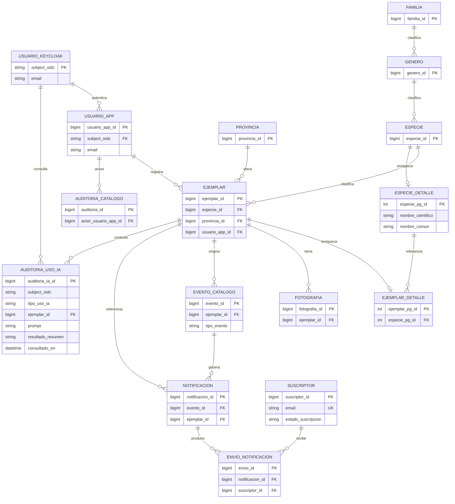
```mermaid
erDiagram
    USUARIO_KEYCLOAK {
        string subject_oidc PK
        string email
    }
    USUARIO_APP {
        bigint usuario_app_id PK
        string subject_oidc FK
        string email
    }
    FAMILIA {
        bigint familia_id PK
    }
    GENERO {
        bigint genero_id PK
    }
    ESPECIE {
        bigint especie_id PK
    }
    PROVINCIA {
        bigint provincia_id PK
    }
    EJEMPLAR {
        bigint ejemplar_id PK
        bigint especie_id FK
        bigint provincia_id FK
        bigint usuario_app_id FK
    }
    ESPECIE_DETALLE {
        int especie_pg_id PK
        string nombre_cientifico
        string nombre_comun
    }
    EJEMPLAR_DETALLE {
        int ejemplar_pg_id PK
        int especie_pg_id FK
    }
    FOTOGRAFIA {
        bigint fotografia_id PK
        bigint ejemplar_id FK
    }
    EVENTO_CATALOGO {
        bigint evento_id PK
        bigint ejemplar_id FK
        string tipo_evento
    }
    NOTIFICACION {
        bigint notificacion_id PK
        bigint evento_id FK
        bigint ejemplar_id FK
    }
    SUSCRIPTOR {
        bigint suscriptor_id PK
        string email UK
        string estado_suscripcion
    }
    ENVIO_NOTIFICACION {
        bigint envio_id PK
        bigint notificacion_id FK
        bigint suscriptor_id FK
    }
    AUDITORIA_CATALOGO {
        bigint auditoria_id PK
        bigint  actor_usuario_app_id FK
    }
    AUDITORIA_USO_IA {
        bigint auditoria_ia_id PK
        string subject_oidc
        string tipo_uso_ia
        bigint ejemplar_id FK
        string prompt
        string resultado_resumen
        datetime consultado_en
    }
    FAMILIA ||--o{ GENERO : clasifica
    GENERO ||--o{ ESPECIE : clasifica
    ESPECIE ||--o{ EJEMPLAR : clasifica
    PROVINCIA ||--o{ EJEMPLAR : ubica
    USUARIO_KEYCLOAK ||--o{ USUARIO_APP : autentica
    USUARIO_KEYCLOAK ||--o{ AUDITORIA_USO_IA : consulta
    USUARIO_APP ||--o{ EJEMPLAR : registra
    USUARIO_APP ||--o{ AUDITORIA_CATALOGO : actua
    ESPECIE ||--o| ESPECIE_DETALLE : enriquece
    ESPECIE_DETALLE ||--o{ EJEMPLAR_DETALLE : referencia
    EJEMPLAR ||--o| EJEMPLAR_DETALLE : enriquece
    EJEMPLAR ||--o{ FOTOGRAFIA : tiene
    EJEMPLAR ||--o{ EVENTO_CATALOGO : origina
    EJEMPLAR ||--o{ NOTIFICACION : referencia
    EVENTO_CATALOGO ||--o{ NOTIFICACION : genera
    NOTIFICACION ||--o{ ENVIO_NOTIFICACION : produce
    SUSCRIPTOR ||--o{ ENVIO_NOTIFICACION : recibe
    EJEMPLAR ||--o{ AUDITORIA_USO_IA : contexto
```

### **4.2. Diagrama de entidad-relación (implementación física)**

**Leyenda:** 
- `PK` = clave primaria; `FK` = clave foránea de negocio; `UK` = unicidad. 
- `creado_por` / `modificado_por` = campos usados para auditoría (sin sufijo `FK`). 
- Tipos PostgreSQL (`bigint`, `varchar`, `text`, `timestamptz`, `numeric`, `integer`, …).

Desglose de §4.1 por almacén: un **PostgreSQL** con esquemas `catalog`, `media`, `notification` y `ai`, más **MongoDB** de enriquecimiento. Reglas de negocio: [data-model.md](docs/data-model/data-model.md).

En esta subsección:

- [4.2.1 PostgreSQL: catalog_service](#421-postgresql-catalog_service)
- [4.2.2 MongoDB (catalog-service; modelo en mongo.md)](#422-mongodb-catalog-service-modelo-en-mongomd)
- [4.2.3 PostgreSQL media_service](#423-postgresql-media_service)
- [4.2.4 PostgreSQL notification_service](#424-postgresql-notification_service)
- [4.2.5 PostgreSQL ai_assistant_service (esquema ai)](#425-postgresql-ai_assistant_service-esquema-ai)

#### **4.2.1 PostgreSQL: catalog_service:**

Esquema con los datos generales de cada árbol y auditoria del usuario que los registró.

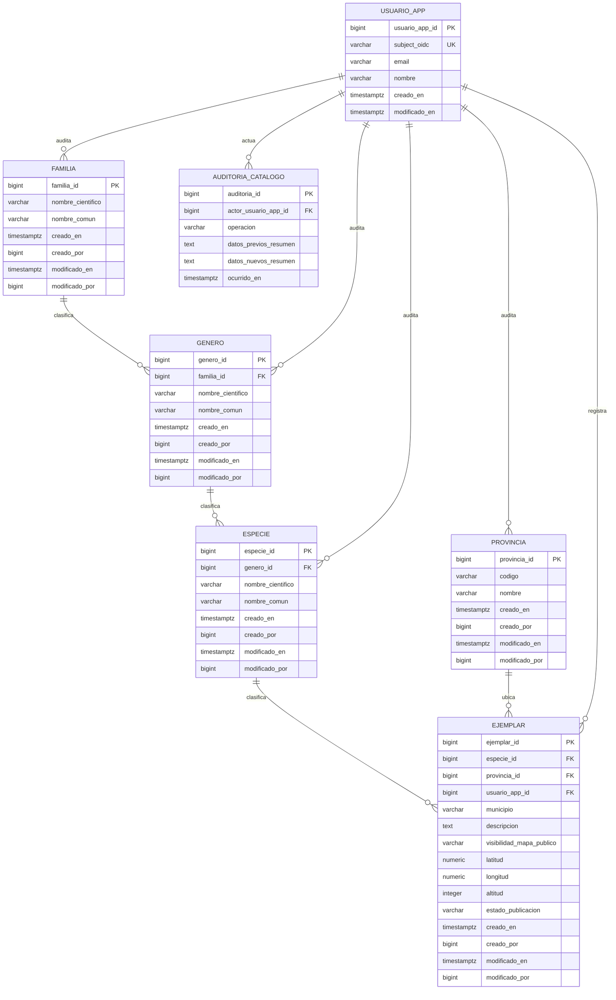
```mermaid
erDiagram
    USUARIO_APP {
        bigint usuario_app_id PK
        varchar subject_oidc UK
        varchar email
        varchar nombre
        timestamptz creado_en
        timestamptz modificado_en
    }
    FAMILIA {
        bigint familia_id PK
        varchar nombre_cientifico
        varchar nombre_comun
        timestamptz creado_en
        bigint creado_por
        timestamptz modificado_en
        bigint modificado_por
    }
    GENERO {
        bigint genero_id PK
        bigint familia_id FK
        varchar nombre_cientifico
        varchar nombre_comun
        timestamptz creado_en
        bigint creado_por
        timestamptz modificado_en
        bigint modificado_por
    }
    ESPECIE {
        bigint especie_id PK
        bigint genero_id FK
        varchar nombre_cientifico
        varchar nombre_comun
        timestamptz creado_en
        bigint creado_por
        timestamptz modificado_en
        bigint modificado_por
    }
    PROVINCIA {
        bigint provincia_id PK
        varchar codigo
        varchar nombre
        timestamptz creado_en
        bigint creado_por
        timestamptz modificado_en
        bigint modificado_por
    }
    EJEMPLAR {
        bigint ejemplar_id PK
        bigint especie_id FK
        bigint provincia_id FK
        bigint usuario_app_id FK
        varchar municipio
        text descripcion
        varchar visibilidad_mapa_publico
        numeric latitud
        numeric longitud
        integer altitud
        varchar estado_publicacion
        timestamptz creado_en
        bigint creado_por
        timestamptz modificado_en
        bigint modificado_por
    }
    AUDITORIA_CATALOGO {
        bigint auditoria_id PK
        bigint actor_usuario_app_id FK
        varchar operacion
        text datos_previos_resumen
        text datos_nuevos_resumen
        timestamptz ocurrido_en
    }
    FAMILIA ||--o{ GENERO : clasifica
    GENERO ||--o{ ESPECIE : clasifica
    ESPECIE ||--o{ EJEMPLAR : clasifica
    PROVINCIA ||--o{ EJEMPLAR : ubica
    USUARIO_APP ||--o{ EJEMPLAR : registra
    USUARIO_APP ||--o{ FAMILIA : audita
    USUARIO_APP ||--o{ GENERO : audita
    USUARIO_APP ||--o{ ESPECIE : audita
    USUARIO_APP ||--o{ PROVINCIA : audita
    USUARIO_APP ||--o{ AUDITORIA_CATALOGO : actua
```

Para el alta de ejemplar, los valores admitidos son:

- `estado_publicacion`: `BORRADOR` o `PUBLICADO`.
- `visibilidad_mapa_publico`: `PRIVADO` o `PUBLICO`.

#### **4.2.2 MongoDB (catalog-service; modelo en mongo.md)**

Almacén de **enriquecimiento** (*system of enrichment*): no sustituye a PostgreSQL. Dos colecciones principales — `especie_detalle` (datos ampliados de especie; persistencia en **HU-015**, con origen orientativo posible vía consulta IA en **HU-016**) y `ejemplar_detalle` (medidas, etiquetas y observaciones del ejemplar; `ejemplar_pg_id` = `catalog.ejemplar.ejemplar_id`). Desnormalización controlada de nombres de especie para búsqueda sin join obligatorio con SQL. Diseño, índices y validación: [mongo.md](docs/data-model/mongo.md). Implementado en **catalog-service** y consumido desde el **frontend** (**HU-015**, **Cerrada**).

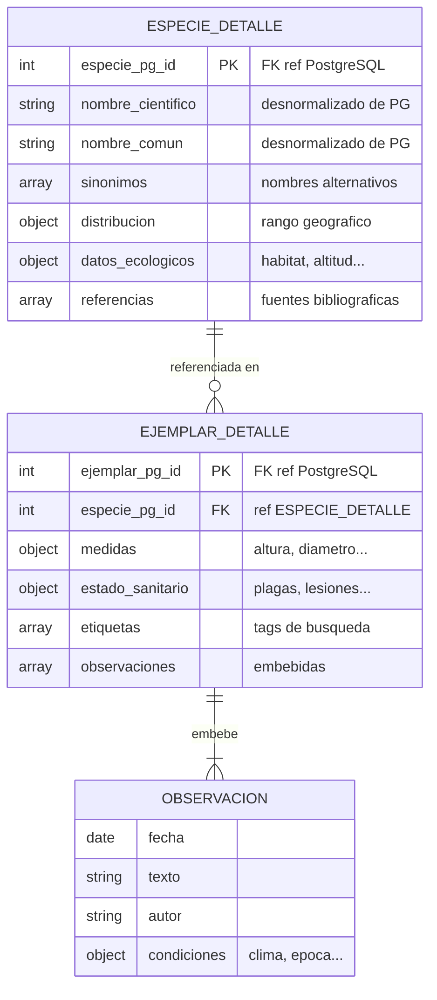
```mermaid
erDiagram

  ESPECIE_DETALLE ||--o{ EJEMPLAR_DETALLE : "referenciada en"

  ESPECIE_DETALLE {
    int    especie_pg_id       PK "FK ref PostgreSQL"
    string nombre_cientifico      "desnormalizado de PG"
    string nombre_comun           "desnormalizado de PG"
    array  sinonimos              "nombres alternativos"
    object distribucion           "rango geografico"
    object datos_ecologicos       "habitat, altitud..."
    array  referencias            "fuentes bibliograficas"
  }

  EJEMPLAR_DETALLE {
    int    ejemplar_pg_id      PK "FK ref PostgreSQL"
    int    especie_pg_id       FK "ref ESPECIE_DETALLE"
    object medidas                "altura, diametro..."
    object estado_sanitario       "plagas, lesiones..."
    array  etiquetas              "tags de busqueda"
    array  observaciones          "embebidas"
  }

  OBSERVACION {
    date   fecha
    string texto
    string autor
    object condiciones            "clima, epoca..."
  }

  EJEMPLAR_DETALLE ||--|{ OBSERVACION : "embebe"
```

#### **4.2.3 PostgreSQL media_service:**

Metadatos de fotografías en esquema `media`. `ejemplar_id` referencia lógicamente a `catalog.ejemplar` (sin FK entre esquemas). **UK compuesta** `uq_fotografia_objeto` sobre `(bucket_almacenamiento, clave_objeto)`.

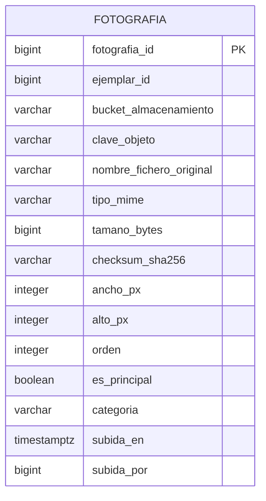
```mermaid
erDiagram
    %% UK compuesta uq_fotografia_objeto (bucket_almacenamiento, clave_objeto)
    FOTOGRAFIA {
        bigint fotografia_id PK
        bigint ejemplar_id
        varchar bucket_almacenamiento
        varchar clave_objeto
        varchar nombre_fichero_original
        varchar tipo_mime
        bigint tamano_bytes
        varchar checksum_sha256
        integer ancho_px
        integer alto_px
        integer orden
        boolean es_principal
        varchar categoria
        timestamptz subida_en
        bigint subida_por
    }
```

#### **4.2.4 PostgreSQL notification_service:**

Avisos de nuevas altas en el sistema a los suscriptores. En **`notificacion`**, `ejemplar_id` y `tipo_evento` se obtienen vía **`evento_catalogo`** (3FN; no hay columnas duplicadas en la tabla).

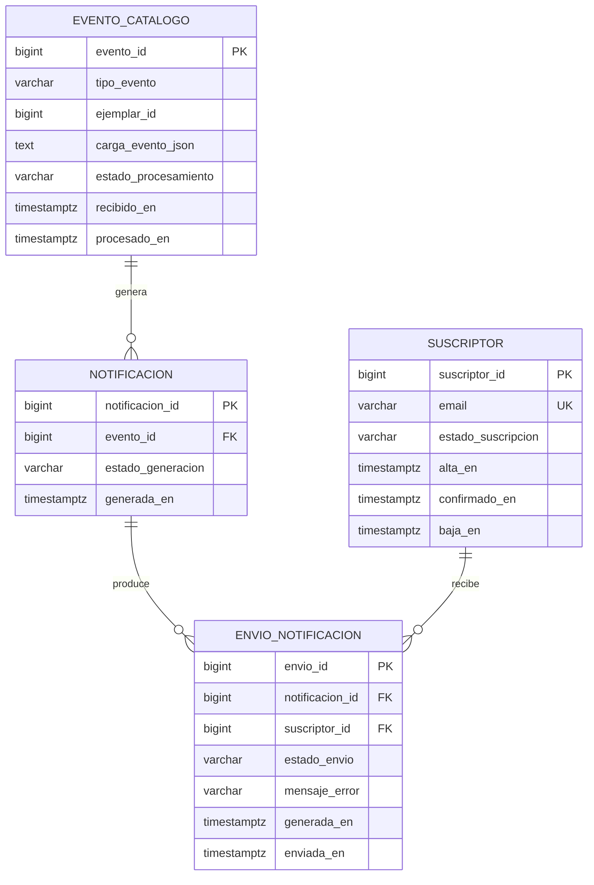
```mermaid
erDiagram
    %% UK email normalizado uq_suscriptor_email_normalizado lower(trim(email))
    SUSCRIPTOR {
        bigint suscriptor_id PK
        varchar email UK
        varchar estado_suscripcion
        timestamptz alta_en
        timestamptz confirmado_en
        timestamptz baja_en
    }
    EVENTO_CATALOGO {
        bigint evento_id PK
        varchar tipo_evento
        bigint ejemplar_id
        text carga_evento_json
        varchar estado_procesamiento
        timestamptz recibido_en
        timestamptz procesado_en
    }
    NOTIFICACION {
        bigint notificacion_id PK
        bigint evento_id FK
        varchar estado_generacion
        timestamptz generada_en
    }
    ENVIO_NOTIFICACION {
        bigint envio_id PK
        bigint notificacion_id FK
        bigint suscriptor_id FK
        varchar estado_envio
        varchar mensaje_error
        timestamptz generada_en
        timestamptz enviada_en
    }
    EVENTO_CATALOGO ||--o{ NOTIFICACION : genera
    NOTIFICACION ||--o{ ENVIO_NOTIFICACION : produce
    SUSCRIPTOR ||--o{ ENVIO_NOTIFICACION : recibe
```

#### **4.2.5 PostgreSQL ai_assistant_service (esquema `ai`):**

Tabla **AUDITORIA_USO_IA** en esquema `ai`, creada por Flyway **`V2__create_auditoria_uso_ia.sql`** (HU-016; `V1__baseline.sql` solo inicializa el esquema). Entidad JPA `AuditoriaUsoIa`; cada consulta IA exitosa inserta una fila vía `SpeciesEnrichmentSuggestionService`. **`subject_oidc`** persiste el claim `sub` del JWT (Keycloak) en el momento de la consulta; **`ejemplar_id`** referencia lógicamente a `catalog.ejemplar` (nullable en enriquecimiento de especie). Sin FK entre esquemas ni dependencia de `catalog.usuario_app`: la trazabilidad del actor se toma directamente del token. Coherente con §4.1 y R3.

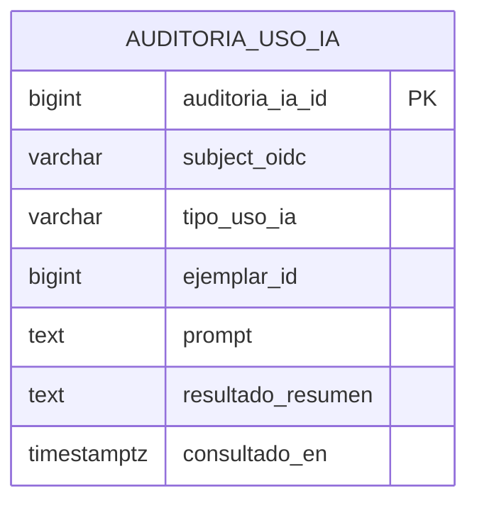
```mermaid
erDiagram
    AUDITORIA_USO_IA {
        bigint auditoria_ia_id PK
        varchar subject_oidc
        varchar tipo_uso_ia
        bigint ejemplar_id
        text prompt
        text resultado_resumen
        timestamptz consultado_en
    }
```

---

## 5. 🔌 Especificación de la API

El contrato HTTP del proyecto está en [docs/api/openapi.yaml](docs/api/openapi.yaml) (OpenAPI 3). Desde el cliente se accede a los microservicios a través del API Gateway, con rutas agrupadas en `/api/catalog`, `/api/media`, `/api/notifications` y `/api/ai`. Donde hace falta autenticación, la API exige un JWT válido. Los listados son paginados (`page`, `size`) y las respuestas de error siguen el formato **RFC 9457** (`application/problem+json`).

Para que todas las APIs sigan el mismo criterio, el proyecto define reglas de desarrollo en Cursor. [api-contract.mdc](.cursor/rules/api-contract.mdc) fija el contrato HTTP y su alineación con OpenAPI. [api-design.mdc](.cursor/rules/api-design.mdc) recoge convenciones de rutas, DTOs y respuestas. [api-security.mdc](.cursor/rules/api-security.mdc) describe autenticación JWT y control de acceso.

En base de datos, API, código y documentación no se usan los mismos nombres en todas las capas: la guía completa está en [naming-conventions.md](docs/engineering/naming-conventions.md). La API HTTP se expone en inglés y la persistencia se modela en español; la justificación está en [ADR-0007](docs/adr/0007-english-http-spanish-persistence.md). Para la ficha de árbol, el término de dominio *ejemplar* y su traducción a rutas y eventos se fijan en [ADR-0006](docs/adr/0006-ejemplar-aggregate-http-kafka-naming.md).

Además de la API REST, algunos flujos usan mensajes en Kafka. Hoy el caso principal es el aviso por correo cuando un colaborador da de alta un ejemplar: **catalog-service** publica un evento y **notification-service** lo consume. El formato del topic, el payload y las reglas de publicación están en [kafka-events.md](docs/events/kafka-events.md).

---

## 6. 📖 Historias de usuario

### **Desarrollo asistido por IA (gobierno del proceso)**

El desarrollo no se apoya en prompts sueltos, sino en **artefactos repetibles** y reglas del repositorio. Flujo habitual: **reglas Cursor** ([`.cursor/rules/`](.cursor/rules/)) → refinamiento de HU con [hu-refinement-mtl](.cursor/skills/hu-refinement-mtl/SKILL.md) → desglose en tickets con [hu-breakdown-mtl](.cursor/skills/hu-breakdown-mtl/SKILL.md) (incluye **Reglas aplicables por capa** en el breakdown) → implementación por TASK con [encargo-mtl](.cursor/skills/encargo-mtl/SKILL.md) → **validación explícita** de que el cambio cumple esas reglas y [devsecops-ci.md](docs/engineering/devsecops-ci.md) → PR con trazabilidad (plantilla en [`.github/pull_request_template.md`](.github/pull_request_template.md)) → cierre en breakdown y [backlog.md](docs/backlog/backlog.md) §3. Detalle del paso de validación: [ai-development-playbook.md](docs/onboarding/ai-development-playbook.md) § «Validación contra reglas del proyecto»; contexto del monorepo: [AGENTS.md](AGENTS.md).

La **supervisión humana** se concentra en cerrar riesgos y aclaraciones en cada `docs/backlog/HU-*.md`, redactar y revisar la especificación de cada TASK antes de implementar, pedir al agente una **revisión explícita** tras cada TASK (contra las reglas citadas en el breakdown), y confirmar tests y PR antes del merge. En §6–§8 y en [prompts.md](prompts.md) hay **ejemplos históricos** de mensajes al agente (evidencia del curso); la fuente de verdad de cada historia es su fichero en `docs/backlog/` y su breakdown.

En esos ejemplos suelen mezclarse dos cosas distintas: un **comando corto** que invoca una skill (p. ej. `/hu-breakdown-mtl HU-016`, sin modificar la plantilla de la skill) y, al implementar un ticket, un **texto largo** con objetivo, alcance y definición de hecho de **ese TASK concreto**, redactado siguiendo la estructura de [encargo-mtl](.cursor/skills/encargo-mtl/SKILL.md) — no la plantilla vacía, sino el encargo ya rellenado para la tarea.

Backlog generado a partir de los casos de uso (§2.2.2) y del modelo de datos. Documentación completa (historias, criterios y tickets): [backlog.md](docs/backlog/backlog.md) · convención de desgloses: [backlog/README.md](docs/backlog/README.md) · casos de uso: [use-case-summary.md](docs/use-cases/use-case-summary.md).

| ID | Título | Estado |
|----|--------|--------|
| HU-001 | Autenticación OIDC | Cerrada |
| HU-002 | Fichas publicadas (lista y detalle) | Cerrada |
| HU-003 | Localización en mapa (detalle) | Cerrada |
| HU-004 | Suscripción por correo sin cuenta | Cerrada |
| HU-005 | Alta de ficha de árbol | Cerrada |
| HU-006 | Fotografías asociadas al árbol | Cerrada |
| HU-007 | Aviso por correo al crear ficha | Cerrada |
| HU-008 | Edición y baja de mis árboles | Cerrada |
| HU-009 | Identificación orientativa por imagen | Próxima versión |
| HU-010 | Chat asistido | Próxima versión |
| HU-011 | Maestros de catálogo | Cerrada |
| HU-012 | Gestión de suscripciones | Cerrada |
| HU-013 | Estructura de páginas, navegación y guardas por rol (MVP) | Cerrada |
| HU-014 | Consulta de fotografías del árbol | Cerrada |
| HU-015 | Proyección y enriquecimiento Mongo | Cerrada |
| HU-016 | Consulta de características de especie (ADMIN, MVP) | Cerrada |

Detalle del refinamiento y desglose de cada HU:
- 1.- Generación de la Historia de Usuario a partir del backlog con `hu-refinement-mtl`
- 2.- Análisis del documento generado
- 3.- Aclaración, definición y/o corrección de los puntos detectados en los apartados de Riesgos y Aclaraciones pendientes (refinamiento)
- 4.- Generación de los tickets de trabajo con `hu-breakdown-mtl`

Por operativa práctica, al comienzo de la historia se hacen unas comprobaciones iniciales que permiten detectar historias incompletas o mal formadas.

> El diálogo de refinamiento de HU-008 (evidencia del curso) está en el bloque **Desplegar** siguiente.

<details>
<summary><strong>Desplegar</strong> — Ejemplo histórico HU-008 (prompts de refinamiento)</summary>

> *Registro histórico:* los prompts siguientes reproducen el diálogo de refinamiento de HU-008 tal como ocurrió; pueden reflejar decisiones intermedias que no coinciden con el diseño final. Fuente de verdad: [HU-008-edicion-de-mis-arboles.md](docs/backlog/HU-008-edicion-de-mis-arboles.md) y [HU-008-ticket-breakdown.md](docs/backlog/HU-008-ticket-breakdown.md).

**Ejemplo del proceso: Historia de Usuario — HU-008 (Edición y baja de mis árboles)**

**Prompt 1:**

Vamos a desarrollar la historia HU-008@.cursor/skills/hu-refinement-mtl

**Prompt 2:**

Vamos a revisar los puntos que quedan fuera de la historia. 
- 1.- Añade en HU-006 el ticket para incluir la posibilidad de añadir y borrar fotografías desde la pantalla de edición de Mis árboles 
- 2.- Incluye en el Backlog una nueva historia para abordar Proyección o enriquecimiento Mongo 3.- Incluye en la historia que estamos abordando la posibilidad de borrar árboles

**Prompt 3:**

El borrado será físico; cuando se borre un árbol se deben eliminar sus fotografías y su ampliación en Mongo; dado que aún no tenemos implementado en Mongo se necesitará un ticket solo para implementar esta acción que por ahora quedará como pendiente. Revisa si con estas aclaraciones podemos cerrar este punto y abordar los dos siguientes que serán Riesgos y Aclaraciones pendientes

**Prompt 4:**

Respecto al riesgo de Listado sin filtros vamos a añadir en la historia el filtro por especie y por fecha de creación: desde - hasta. Para el borrado de todas las fotos de un árbol vamos a incluir un nuevo endpoint en media-service que será consumido por el microservicio de catálogo; déjalo anotado en esta historia como ticket que debe modificar los dos microservicios. Ante un fallo parcial del borrado en cascada se producirá un Rollback (no se usará un patrón sagas en el MVP). Dime si queda algo pendiente antes de abordar el desglose de la historia en ticket, no abordes este desglose hasta que yo te lo diga

**Prompt 5:**

- 1.- Path de borrado: `DELETE /api/media/trees/{treeId}/photos` 
- 2.- Si un ejemplar tiene fotografías primero se invoca al servicio de borrado de todas las fotografías; si el servicio da error se para el proceso; si se han borrado todas las fotografías se elimina el ejemplar en PostgreSQL 3.- Fechas en formato date a ser posible en UTC 4.- Para ADMIN se añade un filtro más para poder seleccionar los ejemplares dados de alta por un usuario determinado

</details>

> El diálogo de refinamiento de HU-016 (evidencia del curso) está en el bloque **Desplegar** siguiente.

<details>
<summary><strong>Desplegar</strong> — Ejemplo histórico HU-016 (prompts de refinamiento)</summary>

> *Registro histórico:* los prompts siguientes reproducen el diálogo de refinamiento de HU-016 tal como ocurrió; pueden reflejar decisiones intermedias que no coinciden con el diseño final. Fuente de verdad: [HU-016-consulta-admin-caracteristicas-especie-ia.md](docs/backlog/HU-016-consulta-admin-caracteristicas-especie-ia.md) y [HU-016-ticket-breakdown.md](docs/backlog/HU-016-ticket-breakdown.md).

**Ejemplo del proceso: Historia de Usuario — HU-016 (Consulta de características de especie, ADMIN, MVP)**

**Prompt 1:**
/hu-refinement-mtl HU-016

**Prompt 2:**
respecto a las incoherencias detectadas: 
- 1.- usuario administrador y ADMIN son terminos equivalentes 
- 2.- las historias HU-009 y HU-010 están planificaas para versiones futudas, ver backlog, revisar texto de readme para comprobar que es coherente con lo indicado 
- 3.- la historia no aplica a la persistencia de Mongo, solo a la consulta de datos a la IA. El funcionamiento será permitir desde la pantalla de alta actual una consulta a la IA que cargará los campos de dicha pantalla. Queda fuera ded esta historia la persistencia con Mongo 
- 4.- El API a incluir es exclusivamente la consulta a la IA de datos de una especie: como entrada se pasará el nombre comun y cientifico de la especie, como respuesta se espera un json que se pueda precargar en la pantalla ya existente de edición de estos datos. Por tanto es importante fijar el formato de lo que debe devolver el LLM: datos que se puedan cargar en la pantalla de edición de caracteristicas de la especie. La historia por tanto solo invoca al servicio ai-assistant-service para obtener el JSON de enrequecimiento de especie y carga los datos en la pantalla ya existente. La funcionalidad solo estará activa si aún no hay datos de enriquecimiento en Mongo. Dime si tienes alguna duda más

**Prompt 3:**

el contrado exacto JSON se cerrará al implementar los ticker, por ahora simplemente ten en cuenta que se deba añadir un ticket al respecto al hacer el breakdown de la historia. Dime si está todo claro para pasar al breakdown en ticket de trabajo

</details>


---

## 7. 🎫 Tickets de trabajo

Como se ha comentado en el punto anterior, para mantener formato homogéneo se usa la skill [hu-breakdown-mtl](.cursor/skills/hu-breakdown-mtl/SKILL.md) (desglose en tickets). Lo habitual es invocarla con un mensaje breve; la skill genera el fichero `HU-*-ticket-breakdown.md` en `docs/backlog/`. Al implementar cada TASK, el mensaje al agente suele ser más detallado (estructura [encargo-mtl](.cursor/skills/encargo-mtl/SKILL.md) rellena para ese ticket).

En la generación de tickets de trabajo se incluye explícitamente una sección con las reglas de Cursor que debe aplicar el agente de IA al implementarlos.

> El desglose en tickets de HU-008 (evidencia del curso) está en el bloque **Desplegar** siguiente.

<details>
<summary><strong>Desplegar</strong> — Ejemplo histórico HU-008 (prompts de desglose en tickets)</summary>

> *Registro histórico:* los prompts siguientes documentan el desglose de HU-008 en su momento; el contenido puede no reflejar el breakdown final ([HU-008-ticket-breakdown.md](docs/backlog/HU-008-ticket-breakdown.md)).

**Ejemplo del proceso: Ticket 1 — HU-008**

**Prompt 1:**

Vamos a generar los tickets de la historia; a partir de aquí incluye mis prompts, utiliza la información que tienes en el contexto y a partir de la sección **Ejemplo del proceso: Ticket 1 — HU-008** (§7) solo incluye mi parte, no tu respuesta al prompt. Usa la información que hemos definido y /hu-breakdown-mtl HU-008

**Prompt 2:**

Vamos con TASK-HU-008-01, Cierre OpenAPI catálogo y media (HU-008). Además de las operaciones que propone el ticket vamos a incluir además del endpoint de borrado de todas las fotografías el endpoint del borrado de una fotografía (va también dentro de /api/media)

**Prompt 3** (TASK-HU-008-02 — Listado colaborador con filtros)

así está bien, implementa el endpoint del Listado de TASK-HU-008-02, si tienes alguna duda preguntame antes; recuerda las reglas que se deben seguir ya indicadas en @docs/backlog/HU-008-ticket-breakdown.md para la parte back

</details>

<details>
<summary><strong>Desplegar</strong> — Ejemplo histórico HU-016 (prompts de desglose en tickets)</summary>

> *Registro histórico:* los prompts siguientes documentan el desglose de HU-016 en su momento; el contenido puede no reflejar el breakdown final ([HU-016-ticket-breakdown.md](docs/backlog/HU-016-ticket-breakdown.md)).

**Ejemplo del proceso: desglose e implementación — HU-016**

**Prompt 1** (invocación de skill; no modifica la plantilla):

/hu-breakdown-mtl HU-016.

**Prompt 2** (arranque de implementación):

ok empieza con TASK-HU-016-01, si tienes alguna duda preguntame

**Encargo TASK-HU-016-02** (especificación enviada al agente para implementar ese ticket; estructura `encargo-mtl`, rellena para esta tarea):

## Objetivo
Integrar **OpenAI Responses API** en `ai-assistant-service` para HU-016 (enriquecimiento orientativo de especie por ADMIN), sustituyendo el adaptador HTTP genérico actual, manteniendo el modo `stub` para local/tests y dejando una base reutilizable para HU-009 (visión) y HU-010 (chat).
## Alcance
- **Incluye:**
  - Módulo Maven: `services/ai-assistant-service/` únicamente.
  - Cliente OpenAI con **RestClient** (no WebClient, no RestTemplate) contra la **API oficial** (`POST /v1/responses`).
  - `@ConfigurationProperties` para OpenAI (`mtl.ai.openai.*`): `apiKey`, `baseUrl` (default `https://api.openai.com`), `model` (enriquecimiento), `connectTimeout`, `readTimeout`, parámetros de retry acotados.
  - API key **nunca hardcodeada**: `${MTL_OPENAI_API_KEY}` en `application.properties` / `application-prod.properties` (sin valor por defecto en prod).
  - Implementación `OpenAiSpeciesEnrichmentAiProvider` (`@ConditionalOnProperty` `mtl.ai.provider.mode=openai`) que implemente el puerto existente `SpeciesEnrichmentAiProvider`.
  - Clase compartida `OpenAiResponsesClient` (+ DTOs wire + parser de `output` → texto/JSON) en `com.mtl.ai.infrastructure.client.openai`.
  - Timeouts HTTP configurables.
  - Retry con backoff exponencial **solo** para errores transitorios (429, 502, 503, timeout/conexión); **no** reintentar 400, 401, 403, 404 ni otros 4xx de cliente.
  - Mapeo diferenciado de errores OpenAI → `AiAssistantException` / HTTP: 502 proveedor no disponible, 404 sin resultado utilizable, 422 respuesta inválida (delegando validación estructural a `SpeciesEnrichmentValidationService` como ahora).
  - Logging estructurado (SLF4J, ya hay logstash): loguear modelo, duración, correlationId; **no** loguear API key, Authorization ni prompt completo con datos sensibles.
  - Mantener `AiPromptFactory` (ajustar solo si hace falta para Responses API / JSON mode); el prompt debe seguir exigiendo JSON raíz con claves `synonyms`, `distribution`, `ecologicalData`, `references`; enums `growthRate` y `leafType` en **inglés** (`slow|moderate|fast`, `deciduous|evergreen|marcescent`).
  - Flujo sin cambios en controller/DTO público: `SpeciesEnrichmentSuggestionService` → provider → `SpeciesEnrichmentValidationService` → `AiSpeciesEnrichmentSuggestionResponse` + auditoría `AUDITORIA_USO_IA`.
  - Tests: unitarios del parser/cliente (mock RestClient o WireMock), mantener/ajustar tests existentes; no romper `StubSpeciesEnrichmentAiProvider` ni `mode=stub` en `application-test.properties`.
- **Excluye / no tocar:**
  - `docs/` salvo que el cambio de variables de entorno lo exija explícitamente en `services/README.md` (máximo una línea en tabla de puertos/env si aplica).
  - OpenAPI (el contrato HTTP expuesto no cambia).
  - `api-gateway`, frontend, `catalog-service`, Mongo.
  - Endpoints de chat o identificación por imagen (solo preparar cliente OpenAI reutilizable).
  - WebClient / streaming.
## Documentación de referencia (fuente de verdad)
- Reglas backend: `.cursor/rules/backend-generation-standard.mdc`, `spring-boot-4-backend.mdc`, `api-security.mdc`, `logging.mdc`, `quality-and-testing.mdc`
- Tests: `docs/engineering/testing-java.md` §2
- Contrato HTTP: `docs/api/openapi.yaml` (`POST /api/ai/species/enrichment-suggestions`, schemas `AiSpeciesEnrichmentSuggestion*`)
- Validación estructural: `docs/data-model/mongo.md` §6.3 (referencia; la implementación vive en `SpeciesEnrichmentValidationService`)
- HU: `docs/backlog/HU-016-consulta-admin-caracteristicas-especie-ia.md`
- Producto IA orientativa: `.cursor/rules/product-context.mdc`
- Código existente a respetar/evolucionar:
  - `AiPromptFactory`, `SpeciesEnrichmentSuggestionService`, `SpeciesEnrichmentValidationService`
  - `StubSpeciesEnrichmentAiProvider`, `HttpSpeciesEnrichmentAiProvider` (sustituir/deprecar)
  - `AiAssistantExceptionHandler`, `AiProviderConfig`
## Diseño obligatorio
1. **Separación de capas**
   - `application`: orquestación, prompt, validación, auditoría (sin HTTP).
   - `infrastructure.client.openai`: RestClient, request/response OpenAI, retry, parser.
   - No devolver al frontend el JSON completo de OpenAI; solo DTO validado.
2. **Configuración**
   - `mtl.ai.provider.mode=stub|openai` (default `stub` en local).
   - `mtl.ai.openai.api-key=${MTL_OPENAI_API_KEY:}`.
   - Validar en arranque (prod): si `mode=openai` y falta API key → fallo claro al boot o al primer uso (preferible `@PostConstruct` / `ApplicationRunner` con mensaje operativo, sin exponer la clave).
3. **OpenAI Responses API**
   - Usar endpoint oficial `/v1/responses`.
   - Instrucciones de sistema + input de usuario desde `AiPromptFactory`.
   - Preferir salida JSON estructurada si la API lo permite (`text.format` / JSON mode); si no, parsear texto del `output`.
   - Extraer solo el contenido utilizable antes de pasar a `SpeciesEnrichmentValidationService`.
4. **Manejo de errores**
   - Reutilizar `@RestControllerAdvice` existente.
   - Mensajes al cliente genéricos en 500; detalle técnico solo en logs WARN/ERROR sin PII ni secretos.
5. **Convenciones del monorepo**
   - Paquetes lista blanca bajo `com.mtl.ai.*`.
   - Nombres de test: `*Test` (Surefire), `*IT` (Failsafe).
   - Jackson Boot 4: `JsonMapper` / `ObjectMapper` según patrón ya usado en el módulo.
## Definición de hecho
- `mvn -pl ai-assistant-service test` en verde.
- `mvn -pl ai-assistant-service verify` en verde (incluye IT existentes).
- Con `MTL_AI_PROVIDER_MODE=stub`, el flujo actual sigue funcionando sin clave OpenAI.
- Con `MTL_AI_PROVIDER_MODE=openai` y `MTL_OPENAI_API_KEY` configurada, el provider llama a OpenAI (tests del cliente mockeados; no test de integración real contra OpenAI en CI).
- Sin API key en código, logs ni respuestas Problem.
- Sin `System.out.println`.
## Modo
**Implementar** (código + tests mínimos por capa según testing-java.md §2).
## Nota de producto
La respuesta es **orientativa**, no veredicto científico; el prompt no debe presentar la salida como determinación oficial de especie.


</details>

---

## 8. 🔀 Pull requests

Para el trabajo con GitHub se ha definido una estrategia sencilla de ramas — detalle en [docs/onboarding/github-branching.md](docs/onboarding/github-branching.md).

Las pull requests usan la plantilla [`.github/pull_request_template.md`](.github/pull_request_template.md) (GitHub la inserta al crear el PR).

En cada PR, **GitHub Actions** ejecuta en paralelo tests Java (`mvn test`), calidad frontend (`lint`, `typecheck`, Vitest) y escaneo de secretos (Gitleaks) — workflow [`.github/workflows/ci.yml`](.github/workflows/ci.yml).

Adicionalmente, en cada PR, se lanza una revisión adicional desde **Codex**.


Hay definidos dos **GitHub Actions** adicionales que se lanzan de forma manual: E2E Playwright y auditoría de dependencias ([docs/engineering/devsecops-ci.md](docs/engineering/devsecops-ci.md)).  

> *Registro histórico:* los ejemplos de pull request siguientes muestran cómo se documentó el trabajo en su momento (resumen, plan de pruebas, notas técnicas). Pueden no coincidir con el diseño final ni con la plantilla o CI actuales; norma vigente en [github-branching.md](docs/onboarding/github-branching.md) y [devsecops-ci.md](docs/engineering/devsecops-ci.md). **Clic en Desplegar** para ver cada PR de ejemplo.

<details>
<summary><strong>Desplegar</strong> — Pull Request 1 (histórico — HU-004)</summary>

### Resumen

Implementa la **HU-004**: alta de suscripción por correo sin cuenta de colaborador, con API en **notification-service**, exposición vía **gateway**, contrato en **OpenAPI**, pantalla y flujo en **frontend** (formulario, validación, i18n, tests), y documentación de backlog / modelo de datos / onboarding Git.

### Cambios principales

- **Backend (`notification-service`)**: registro de suscriptores, tabla `suscriptor` en Flyway `V1__baseline.sql`, seguridad Keycloak, controlador REST de altas públicas, manejo de errores tipo Problem Details, tests (servicio + WebMvc).
- **Gateway**: filtro global ante errores de conexión a downstream y utilidades asociadas (con tests).
- **Frontend**: vista `SubscribeByEmailView`, composable `usePublicSubscriptionForm`, servicio `publicSubscription`, ampliación de `apiClient` (p. ej. cuerpo sin JSON / conflictos), iconos y tiles del home, hero visitante con ilustración `tree_map_illustration_clean.svg`, estilos e i18n (`es.ts`), rutas y tests (Vitest).
- **Contrato y configuración**: `docs/api/openapi.yaml`, `frontend/.env.example` y README donde aplique.
- **Documentación**: HU-004 en backlog (historia + desglose de tickets), actualización de `backlog.md`, `data-model.md`, guía de ramas GitHub, revisión de enlaces a reglas (`frontend-vue3.mdc`, etc.).

### Cómo probar (orientativo)

1. **Backend**: arrancar stack local según `services/README.md`; verificar migración y endpoint de alta de suscripción público según OpenAPI.
2. **Frontend**: `npm run build` / tests en `frontend/`; flujo manual en `/subscriptions/new` con correo válido y casos de error (409/conflicto si aplica).
3. **Gateway**: comprobar que las peticiones al notification-service y respuestas de error se propagan de forma coherente.

### Referencias

- Historia / desglose: `docs/backlog/HU-004-suscripcion-por-correo-sin-cuenta-colaborador.md`, `docs/backlog/HU-004-ticket-breakdown.md`

### Notas

- Renombrado de regla Cursor `fronted-vue3.mdc` → `frontend-vue3.mdc` y actualización de enlaces en docs y `AGENTS.md`.
- Commit: `a0ba685` — *Implementación HU-004 Alta suscripción*.

</details>

<details>
<summary><strong>Desplegar</strong> — Pull Request 2 (histórico — HU-008)</summary>

### Resumen

Cierra **HU-008** (UC-04): el colaborador puede **listar y filtrar** sus fichas, **editarlas** (`PUT`) y **eliminarlas** (`DELETE`) con cascada en media; **ADMIN** opera sobre cualquier ficha. Incluye galería en edición (**HU-006-14**) y cierre documental de la historia.

- Vertical completo: **catalog-service** + **media-service** + **frontend** (`/mis-ejemplares`, `/ejemplares/:id/edit`). Rutas y API actualizadas según [ADR-0006](docs/adr/0006-ejemplar-aggregate-http-kafka-naming.md).
- Sin notificación ni Kafka en edición/baja (**R7**).

### Alcance

- [x] Frontend
- [x] Backend
- [ ] Infraestructura
- [x] Documentación

### Cambios realizados

**Backend — catalog-service**
- `GET /api/catalog/trees` (filtros, paginación, scope COLABORADOR/ADMIN).
- `GET` / `PUT` / `DELETE` `/api/catalog/trees/{treeId}`.
- Orquestación de baja: media → SQL → hook Mongo (`MongoEjemplarEnrichmentDeletionPort` con **HU-015**; no-op si Mongo desactivado).
- Cliente `RestMediaEjemplarPhotosClient` (`mtl.media.base-url`).
- Auditoría R3, `JwtRealmRoles`, materialización `usuario_app`.

**Backend — media-service**
- `DELETE /api/media/trees/{treeId}/photos` (borrado masivo).
- `DELETE /api/media/photos/{photoId}` (galería en edición).

**Frontend**
- `MyTreesListView` (`/mis-ejemplares`) con filtros y peticiones cancelables.
- `EditTreeView` + `useEditTreeForm` (`/ejemplares/:id/edit`): PUT, DELETE con confirmación, galería añadir/borrar foto.
- Servicios `collaboratorTreesService`, validación de archivos, `SpeciesAutocompleteInput`.

**Contrato y docs**
- [docs/api/openapi.yaml](docs/api/openapi.yaml) actualizado.
- HU-008 **cerrada** en backlog, historia, tickets, UC-04, [readme.md](readme.md), [services/README.md](services/README.md), checklist E2E en [frontend/README.md](frontend/README.md).
- **TASK-HU-008-11** (IT catalog↔media): **rechazado**; cobertura con tests unitarios/WebMvc + manual.

### Evidencias (opcional)

- _(Añadir capturas de Mis árboles, edición y diálogo de baja si el revisor lo pide.)_

### Plan de pruebas

- [ ] `frontend`: `npm run build`
- [ ] `frontend`: `npm run test`
- [ ] `services`: `mvn -f services/pom.xml -pl catalog-service,media-service test`
- [ ] Prueba manual en local ([frontend/README.md](frontend/README.md) § HU-008): listado/filtros, PUT, galería, DELETE con/sin fotos, media caído → árbol no borrado

### Checklist único de calidad (front/back)

- [x] No se rompe lógica de negocio ni navegación existente
- [x] Se mantienen nombres claros y responsabilidad única
- [x] No se introduce duplicación innecesaria (roles JWT centralizados en `JwtRealmRoles`)
- [x] Manejo básico de errores revisado (ProblemDetail, 403/404/502)
- [x] Tests añadidos/actualizados según impacto del cambio
- [x] Contratos y compatibilidad revisados (OpenAPI alineado)
- [x] Seguridad revisada (JWT, propiedad de ficha, relay a media)
- [x] **Frontend:** textos en `i18n`, flujos con confirmación en baja/borrado de foto
- [x] **Backend:** validaciones R1/R2, auditoría, tests por capa

### Riesgos / impacto

- **Riesgo:** borrado distribuido sin **rollback compensatorio** si falla SQL tras borrar fotos en media.
- **Mitigación:** documentado en HU-008 y `services/README.md`; aborto si falla media **antes** del SQL; mejora futura sin saga.

- **Riesgo:** borrado Mongo omitido si `mtl.catalog.mongo.enabled=false` (perfil test o Mongo caído tras SQL).
- **Mitigación:** activar Mongo en `dev`/`prod`; ver **HU-015** y `services/README.md` § HU-015.

- **Riesgo:** requiere **catalog** (8081) y **media** (8082) en `dev` para DELETE con fotos.
- **Mitigación:** `mtl.media.base-url` en `application-dev.properties`; checklist E2E documentada.

### Notas para review

- Revisar orden de cascada en `TreeDeletionService` (media → `commitPhysicalDelete`).
- Confirmar que **PUT**/**DELETE** no publican en Kafka (solo alta).
- **TASK-HU-008-11** rechazado a propósito; no esperar IT Failsafe catalog↔media en este PR.
- Rama: `feature/actualizacion` → `main`.

</details>

